# Python 中的自动图像质量评估

> 原文：<https://towardsdatascience.com/automatic-image-quality-assessment-in-python-391a6be52c11?source=collection_archive---------0----------------------->

图像质量是一个高度依赖于观察者的概念。一般来说，
它与观看它的条件相联系；所以是一个主观性很强的话题。图像质量评估旨在定量地表示人类对质量的感知。这些指标通常用于分析计算机视觉不同领域中算法的性能，如图像压缩、图像传输和图像处理[1]。

图像质量评价(IQA)主要分为两个研究领域(1)基于参考的评价和(2)无参考的评价。主要区别在于，基于参考的方法依赖于高质量的图像作为源来评估图像之间的差异。基于参考的评估的一个例子是结构相似性指数(SSIM) [2]。

# 无参考图像质量评估

无参考图像质量评估不需要基础图像来评估图像质量，该算法接收的唯一信息是其质量正在被评估的失真图像。

盲法主要由两个步骤组成。第一步是计算描述图像结构的特征，第二步是根据人类的意见在特征中寻找模式。TID2008 是一个著名的数据库，遵循一种描述如何从参考图像中测量人类意见得分的方法[3]。它被广泛用于比较 IQA 算法的性能。

对于使用 TensorFlow 2.0 的深度学习方法的实现，请检查:

 [## 使用 TensorFlow 2.0 进行深度图像质量评估

### 使用 TensorFlow 2.0 实现基于深度 CNN 的盲图像质量预测器(DIQA)的分步指南

medium.com](https://medium.com/@ocampor/deep-image-quality-assessment-with-tensorflow-2-0-69ed8c32f195) 

# 盲/无参考图像空间质量评估器(BRISQUE)

在这一节中，我们将一步一步地编写 python 中的 BRISQUE 方法。你可以在这里找到完整的笔记本[。](https://github.com/ocampor/notebooks/blob/master/notebooks/image/quality/brisque.ipynb)

BRISQUE [4]是一种仅使用图像像素来计算特征的模型(其他方法是基于图像到其他空间的变换，如小波或 DCT)。由于它不需要任何变换来计算其特征，因此被证明是高效的。

BRISQUE 依赖于空间域中局部归一化亮度系数的空间自然场景统计(NSS)模型，以及这些系数的成对乘积的模型。

## 空间域中的自然场景统计

给定一幅图像，我们需要通过局部均值减法计算局部归一化的发光，并将其除以局部偏差。添加一个常数是为了避免零除法。

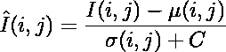

**Hint: If I(i, j) domain is [0, 255] then C=1 if the domain is [0, 1] then C=1/255.*

为了计算局部归一化发光，也称为均值减去对比度归一化(MSCN)系数，我们必须计算局部均值。这里， *w* 是大小为(K，L)的高斯核。

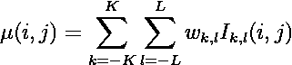

作者显示局部平均值的方式可能有点混乱，但它是通过对图像应用高斯滤波器计算出来的。

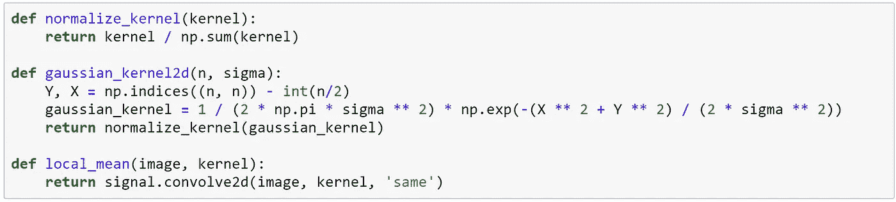

然后，我们计算局部偏差

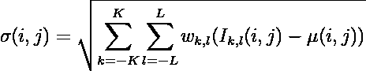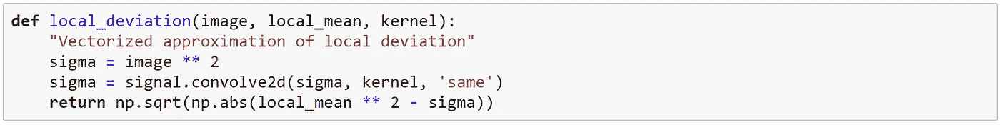

最后，我们计算 MSCN 系数

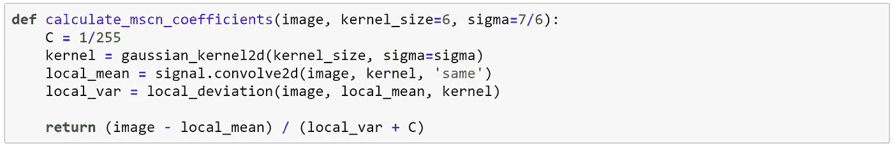

作者发现，对于失真图像的更宽频谱，MSCN 系数分布为广义高斯分布(GGD)。GGD 密度函数为

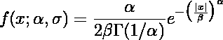

在哪里

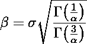

г是伽玛函数。参数α控制形状，σ控制方差。

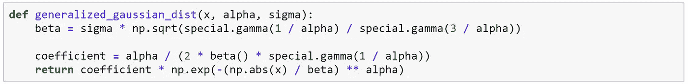

## 相邻 MSCN 系数的成对乘积

相邻系数的符号也呈现出规则的结构，在失真的情况下会受到干扰。作者提出了沿四个方向(1)水平方向 *H* 、(2)垂直方向 *V* 、(3)主对角线方向 *D1* 、(4)次对角线方向 *D2* 的相邻 MSCN 系数的成对乘积模型。

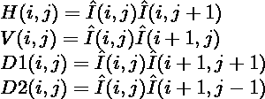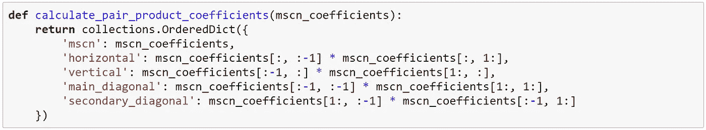

此外，他还提到 GGD 并不能很好地拟合系数乘积的经验直方图。因此，他们建议拟合非对称广义高斯分布(AGGD)模型，而不是将这些系数拟合到 GGD[5]。AGGD 密度函数为

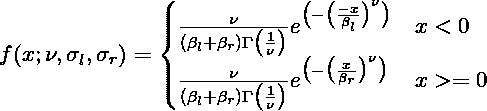

在哪里

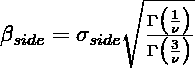

并且*侧*可以是 *r* 或 *l* 。前一个公式中没有反映的另一个参数是平均值

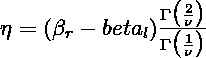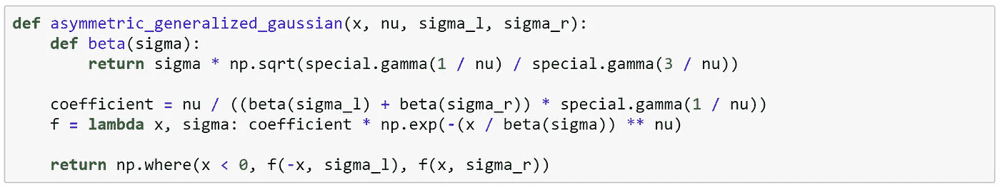

## 拟合非对称广义高斯分布

[5]中描述了拟合非对称广义高斯分布的方法。总之，算法步骤是:

1.  计算γ，其中 Nₗ是阴性样本的数量，Nᵣ是阳性样本的数量。

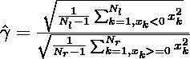

2.计算 *r 帽子*。

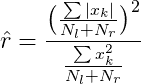

3.使用γ和 *r hat* 估算值计算 *R hat* 。

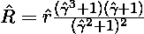

4.使用逆广义高斯比的近似值估计α。

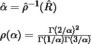

5.估计左右比例参数。

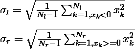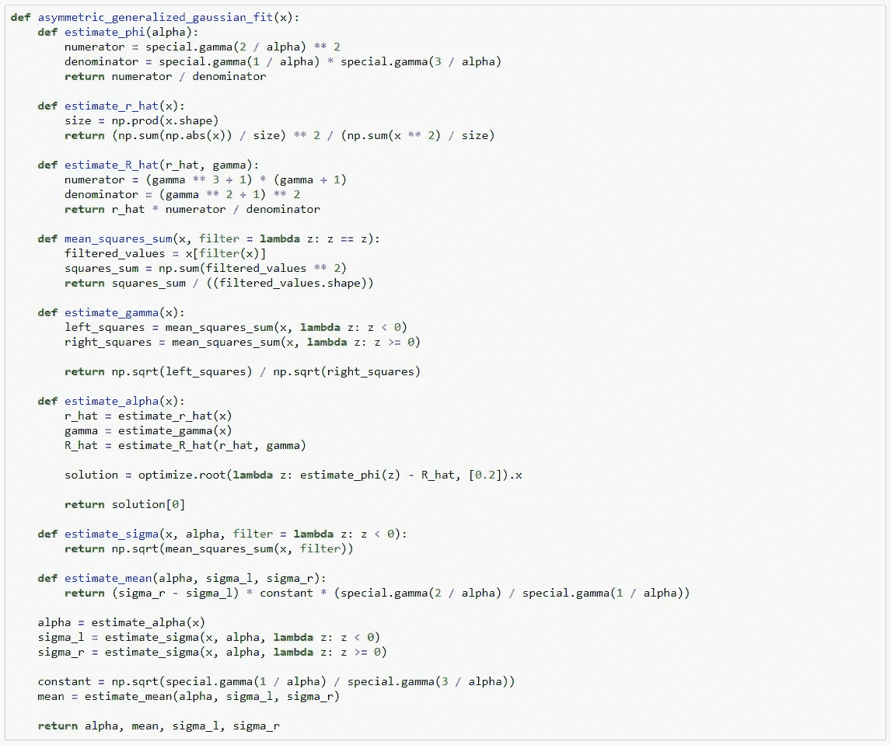

## 计算 BRISQUE 特征

计算图像质量所需的特征是将 MSCN 系数和移位乘积拟合到广义高斯分布的结果。首先，我们需要将 MSCN 系数拟合到 GDD，然后将成对乘积拟合到 AGGD。这些功能的摘要如下:

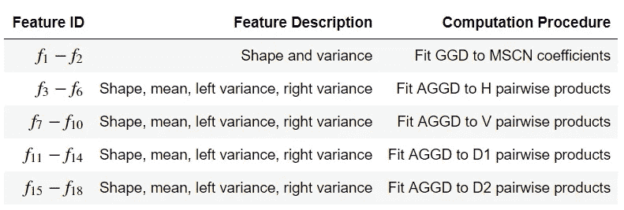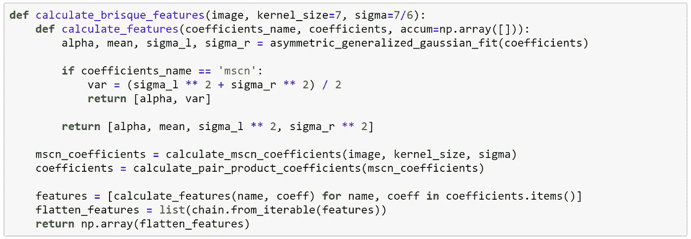

# 亲自动手

在创建了计算 BRISQUE 特征所需的所有函数之后，我们可以估计给定图像的图像质量。在[4]中，他们使用了来自柯达数据集[6]的图像，所以我们在这里也将使用它。

## 辅助功能

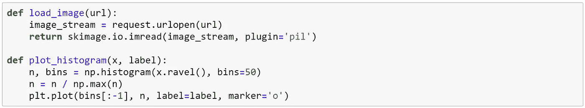

## 1.加载图像

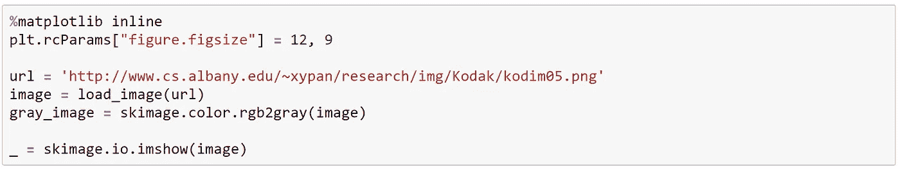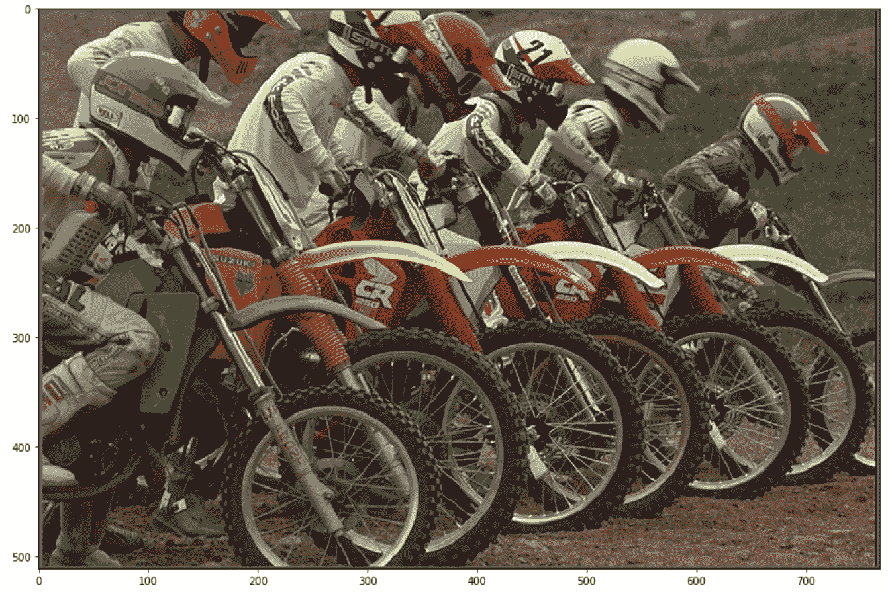

## 2.计算系数

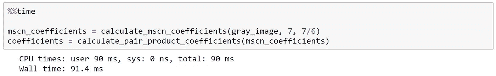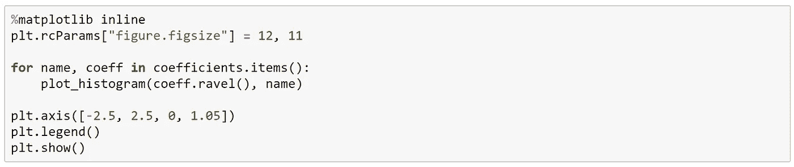

在计算了 MSCN 系数和成对乘积之后，我们可以验证分布实际上是不同的。

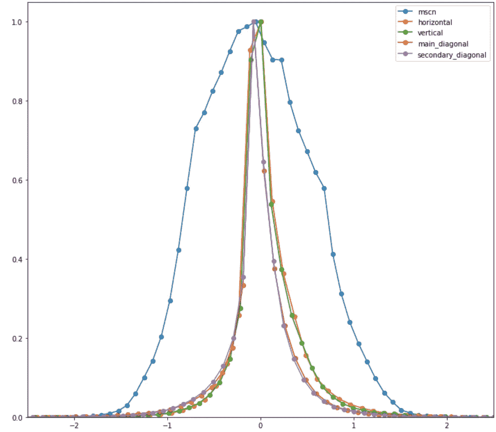

## 3.用系数拟合广义高斯分布

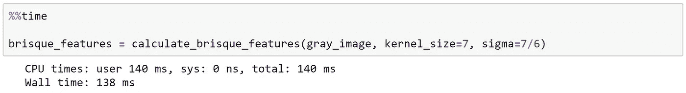

## 4.调整图像大小并计算 BRISQUE 特征

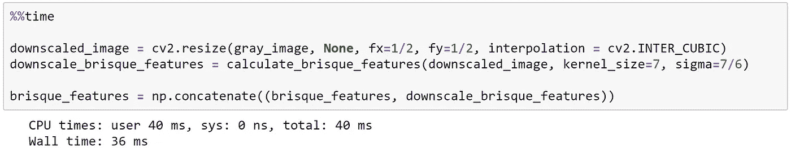

## 5.缩放特征并馈送给 SVR

作者提供了一个预先训练的 SVR 模型来计算质量评估。然而，为了得到好的结果，我们需要将特征缩放到[-1，1]。对于后者，我们需要与作者用来缩放特征向量的参数相同的参数。

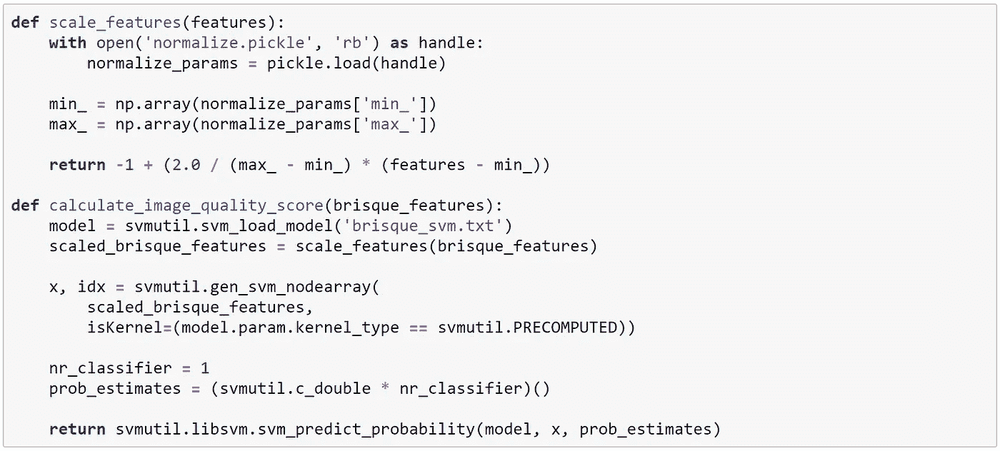

用于表示图像质量的标度从 0 到 100。图像质量为 100 意味着图像质量非常差。在被分析的图像的情况下，我们得到它是一个好质量的图像。

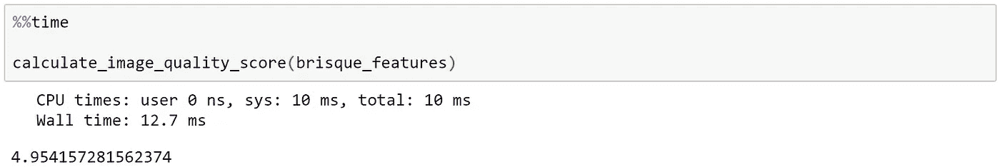

# 结论

该方法在 TID2008 数据库中进行了测试，效果良好；即使与参考的 IQA 方法相比。我想检查其他机器学习算法的性能，如 XGBoost，LightGBM，用于模式识别步骤。

# **Python 笔记本**

**更新 2019–12–02:**包含对 Windows 10 的支持

 [## o 导入/笔记本

### 此时您不能执行该操作。您已使用另一个标签页或窗口登录。您已在另一个选项卡中注销，或者…

bit.ly](http://bit.ly/github-brisque) 

# 参考

[1]matre，H. (2017)。从光子到像素:数码相机手册。约翰·威利父子公司。

[2]王，z .，博维克，A. C .，谢赫，H. R .，，西蒙切利，E. P. (2004 年)。图像质量评估:从误差可见性到结构相似性。IEEE 图像处理汇刊，13(4)，600–612。

[3]波诺马伦科，n .，卢金，v .，泽连斯基，a .，埃吉亚扎里安，k .，卡利，m .，&巴蒂斯蒂，F. (2009 年)。tid 2008-评估全参考视觉质量评估指标的数据库。现代无线电电子学进展，10(4)，30–45。

[4]米塔尔、穆尔西和博维克(2012 年)。空间域中的无参考图像质量评估。IEEE 图像处理汇刊，21(12)，4695–4708。

[5]n . e . las mar，y . Stitou 和 Berthoumieu，Y. (2009 年)。用于纹理分析的多尺度偏斜重尾模型。国际图像处理会议论文集，ICIP，(1)，2281–2284。