# 使用 Youtube V3 API、Mask-RCNN 和 Google Vision API 自动收集语音识别数据

> 原文：<https://towardsdatascience.com/automatic-speech-recognition-data-collection-with-youtube-v3-api-mask-rcnn-and-google-vision-api-2370d6776109?source=collection_archive---------3----------------------->

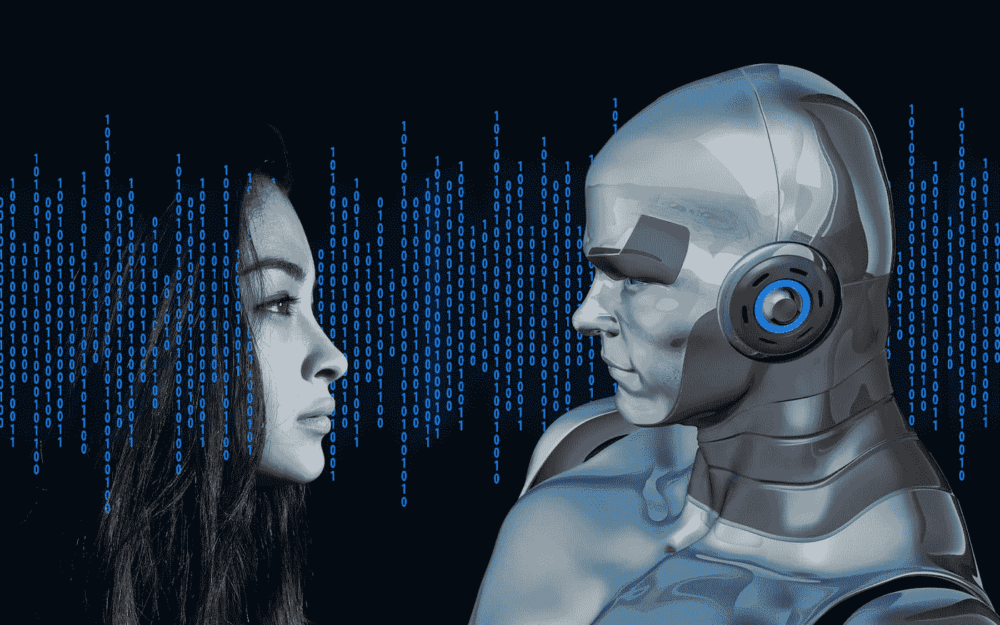

Image source: Pixabay

# 背景

随着机器学习特别是深度学习的快速发展，语音识别得到了显著的提高。这种技术依赖于大量高质量的数据。然而，为非流行语言建立的模型比那些流行语言(如英语)的模型表现差。这是因为只有几个可用的训练数据集，并且很难有效地收集高质量的数据。这篇博文将向你展示如何高效地****收集任何语言的语音识别数据**。**

**虽然 Mozilla 去年推出了一个名为 [Common Voice](https://mzl.la/voice) 的开源项目，鼓励人们贡献自己的声音，但大多数人要么不知道这个项目，要么不愿意参与其中。下图显示了来自 Common Voice 的不同语言的小数据收集进度。**

**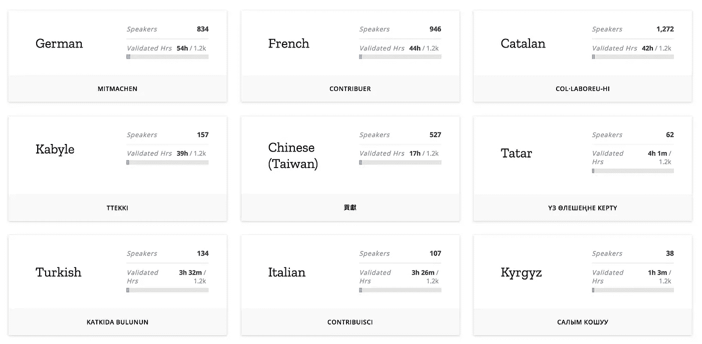**

**Little collection progress of Common Voice ([https://voice.mozilla.org/en/languages](https://voice.mozilla.org/en/languages))**

**由于 Youtube 上有大量的电视节目和电视剧，几乎没有人的参与，就可以高效地收集语音识别数据。**

**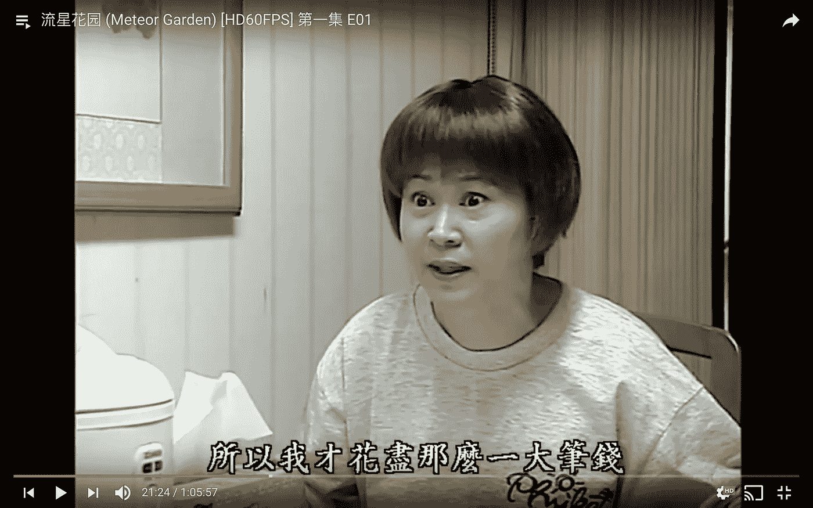**

**Ｍeteor Garden ([https://www.youtube.com/watch?v=DsuN185H58I](https://www.youtube.com/watch?v=DsuN185H58I&list=PLpSFccUgAbkHgWFjKDUMPX70gLsNoe90T&ab_channel=BingLawSir))**

**如上图所示，这些剧或者节目中，有的嵌入了字幕，可以通过 OCR 提取出来。提取的文本和剪辑的音频可以形成语音识别数据的样本。**

# **概观**

**下图概述了包含几个模块的整个数据收集管道。我们首先使用 Youtube V3 API 来搜索下载与我们指定的电视节目名称相关联的视频。FFMPEG 被用来将视频分割成帧，每个帧都由一个自训练的 Mask-RCNN(稍后将详细介绍)进行处理，以仅保留图像的字幕区域。然后，处理后的图像被发送到 Google Vision API，以获得预测的文本和置信度。通过 Pandas 库，我们按照时间戳对结果进行排序，然后将它们聚合起来，为每个视频生成一个 SRT 文件。下面将向您展示如何实现这些模块。**

**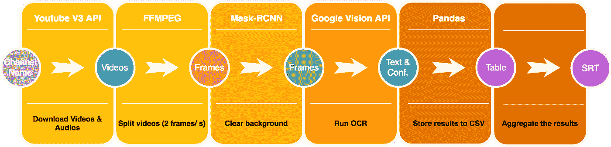**

# **先决条件**

*   **Python==3.6**
*   **FFMPEG**
*   **joblib==0.12.0**
*   **numpy==1.13.3**
*   **熊猫==0.23.3**
*   **张量流-gpu==1.4.0**
*   **keras==2.1.3**
*   **谷歌云视觉==0.32.0**
*   **pafy==0.5.4**
*   **youtube-dl==2017.12.2**
*   **tqdm==4.23.4**
*   **编辑距离==0.4**

# **履行**

**该部分由数据收集管道中的模块划分，每个子部分对应一个模块。**

## **下载视频和提取音频**

**去 Youtube 搜一部你感兴趣的电视剧。确保您可以找到该节目播放列表，因为播放列表中的视频质量趋于一致。检查第一个视频是否包含嵌入的字幕，我们可以假设整个播放列表都是嵌入字幕的。**

****

**Youtube videos in a playlist**

**上面的代码向你展示了如何搜索 Youtube 播放列表。您需要申请一个 API 密钥才能使用 Youtube V3 API 客户端。在第 27 行，**

```
youtube.search().list(q=name, type="playlist",part="id",maxResults=1).execute()
```

**使用 query 作为戏剧名称执行 Youtube 搜索，并返回第一个结果的播放列表 id。**

**有了播放列表 ID，我们就可以得到这个播放列表中所有视频的视频 ID。**

**类似地，在第 15 行，**

```
youtube.playlistItems().list(part='contentDetails',maxResults=50, playlistId=playlist_id).execute()
```

**给定播放列表 ID，搜索多达 50 个视频的 ID(受 API 限制)。**

**然后，我们可以开始下载视频。**

**Pafy Python 包用于下载可用的最高分辨率的视频。下载完视频后，我们利用 FFMPEG 从每个视频中提取音频。**

**由于 FFMPEG 不支持 python SDK，我们需要在 shell 中调用它。通过触发 subprocess.call()函数，我们可以执行参数中指定的 shell 命令。现在，您已经成功下载了您指定的电视节目的视频和音频。**

# **分割视频**

**然后，我们将下载的视频分割成帧，并运行 OCR。**

**只有视频的中间 60%部分被分割成帧，因为第一和最后 20%部分可能包含开始或结束歌曲，这不能用于语音识别。**

**同样，在 shell 中用子进程调用 FFMPEG。分割视频的参数描述如下:**

*   **ss:以秒为单位的开始时间**
*   **t:分割视频的时间跨度，单位为秒**
*   **r:采样速率**

**采样率越高，预测的字幕时间跨度就越精确。然而，在时间和准确性之间有一个权衡。在这里，我把它设置为 2。**

# **训练和评估 Mask-RCNN**

**现在，你已经有了每个视频的画面。如果你在 [Google Vision API 官网试用几张图片进行 OCR](https://cloud.google.com/vision/docs/ocr) (文档文本检测，由于字幕是打字字符)。你会发现结果并不令人满意，因为这些图像的背景非常复杂。**

**这就是 Mask-RCNN 发挥作用的时候。Mask-RCNN 是 2017 年发布的用于对象检测和实例分割的 RCNN 家族的一部分。它能够在像素级别进行分类。**

**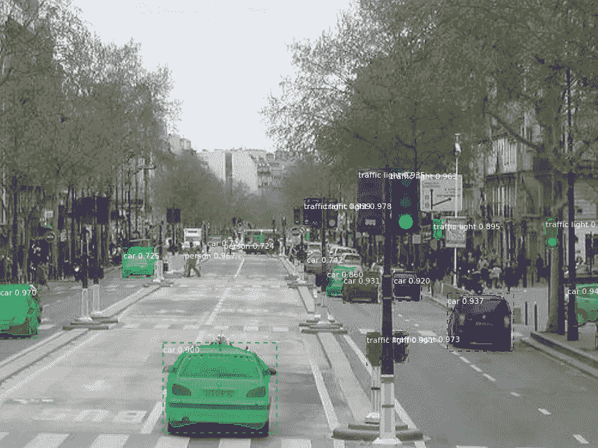**

**Mask-RCNN demo ([https://github.com/matterport/Mask_RCNN](https://github.com/matterport/Mask_RCNN))**

**我们的目标是训练 Mask-RCNN 来帮助我们识别哪些像素是字幕。**

## **培养**

**为了确保训练好的模型足够通用，适合各种视频，我从十几部电视剧和动画中下载了视频。应用不同的字体大小、字体类型和字体垂直位置来丰富训练数据集。底部 40%的图像被裁剪，以确保手动添加到训练数据上的字幕不会与原始字幕重叠。这也确保了非字幕部分来自高度相似的色彩空间分布。**

**The above code leverages Python PIL package to add texts onto images. Since Mask-RCNN treats each connected component as an instance, in some languages, a character can be composed of different instances. For example, the character “把” comprises the left and right two components. To find the connected component, we can use the label() function in the skimage package as shown in the following code.**

**生成的训练数据显示在下图中。左侧显示输入图像，而右侧显示地面实况。正如您从右侧一些字符的颜色差异中所看到的，一个字符可以由几个实例组成。**

**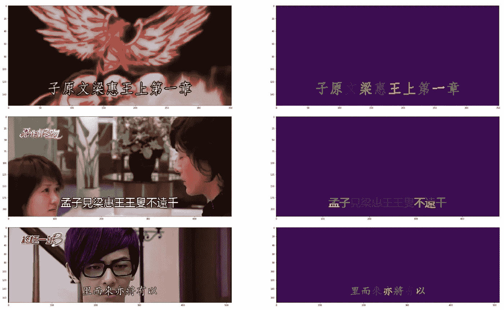**

**Generated Mask-RCNN Training Data**

**为了训练 Mask-RCNN，我在这个 [Github Repo](https://github.com/matterport/Mask_RCNN) 中使用了一个使用 Keras 和 Tensorflow 的优秀实现。我们需要做的是指定我们的训练模型的配置，如下所示。**

**你只需要设置 NUM_CLASSES = 1+1(字幕+背景)，指定 IMAGE_MIN_DIM 以及 IMAGE_MAX_DIM，这取决于你训练数据的分辨率。MEAN_PIXEL 需要手动计算，以便在预处理阶段标准化。然后，就可以开始加载数据和训练了。**

## **估价**

**在训练了 100 个纪元之后，让我们开始在一些图像上运行训练好的模型。**

**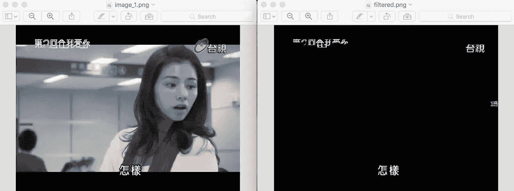****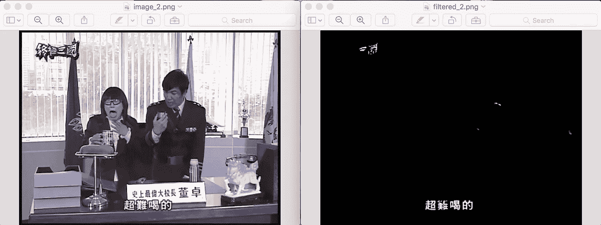**

**Evaluation Results on Different TV Shows**

**The left shows the input images, whereas the right show the output one. You can see that the subtitle has been clearly identified. Although there are some noise above they have no effect on the prediction of the subtitle below when running OCR. The main issue is that sometimes Mask-RCNN is too strict that it removes some parts of the text. In the second example above, the second character “難” was partially erased, which might decrease the performance of OCR. In order to recover this error, I decided to use Ensemble.**

**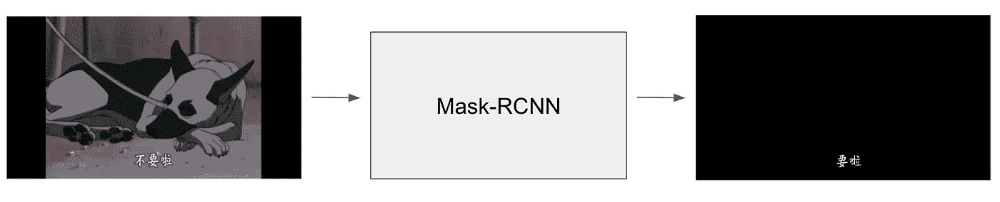**

**Single model prediction**

**集成是指使用多个模型进行预测。我没有使用上图所示的单一模型进行预测，而是训练了另一个具有不同配置的模型。输入图像被输入到这两个模型中，最终结果将是这两个模型预测的联合。**

**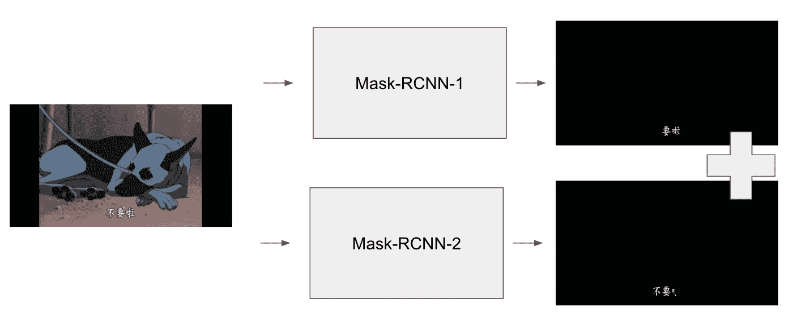**

**Ensemble prediction**

**由 Mask-RCNN 处理的结果帧如下所示。左下方是原始输入图像，右下方是只有一个模型的预测，左上方是集成结果。(右上方是测试时间增强结果，该结果已被当前管道中的系综所取代)**

**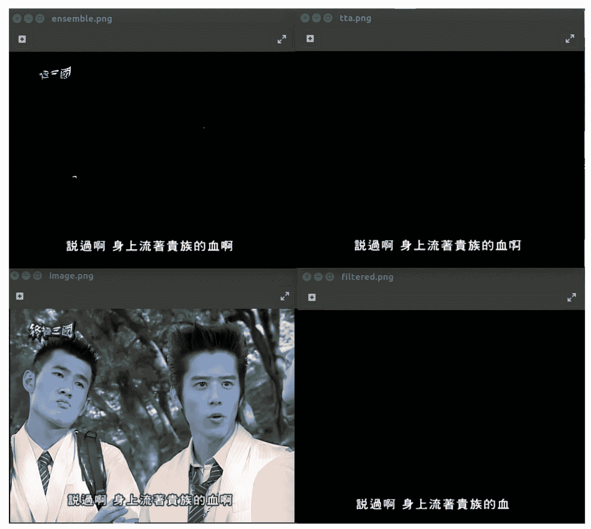**

**Mask-RCNN processed images. bottom-left: original. bottom-right: single model. top-left: ensemble. top-right: test-time-augmented (not discussed).**

# **运行 OCR**

**用 Mask-RCNN 模块处理完图像后，我们就可以对这些图像运行 OCR 了。与 Youtube API Key 不同的是，你需要在 Google 云平台上申请一个 Vision API 凭据，并存储在本地磁盘中。**

**上面的代码编码你的图像文件，发送到 OCR API，并接收响应。响应包含预测字符、每个字符的边界框坐标以及每个字符的置信度。您可以决定自己的阈值来过滤掉低置信度的结果。最终结果被写入 CSV 文件，每行代表一帧。**

# **生成 SRT 最终结果**

**最后，流水线的最后一个模块来了！通常一段字幕持续 2-3 秒，这意味着大约有 4-6 个连续的帧包含相同的字幕。剩下的问题是我们如何将不同帧的结果合并成一个，决定演讲的开始时间、结束时间和字幕。我们只需要检查当前字幕是否与上一个匹配。一个主要挑战是，有时两个帧具有相同的字幕，但 OCR 预测了不同的结果。你判断两个字幕是否相同的算法应该可以处理这些情况。**

**上面的代码是基于启发式的。如果当前帧和最后一帧的这两个字符串中的字符有 70%相同，而不考虑每个字符的顺序，则返回 True。**

# **结论**

**如果您正确地遵循了上面的说明，那么您已经成功地构建了一个自动语音识别数据集收集管道。您可以很容易地根据 FFMPEG 指定的时间分割音频，但我将把这留给您。一个小问题是，由于字幕出现的时间和相应语音的时间可能有些不同，所以语音和文本之间可能会有一点不对齐。这可以通过语言模型来解决，以根据语音稍微调整每个字幕的时间。更多信息和详细实现，请参考本 [Github Repo](https://github.com/khuangaf/ITRI-speech-recognition-dataset-generation) 。如果您有任何问题，请随时通过电子邮件联系我:【huangkh19951228@gmail.com。**