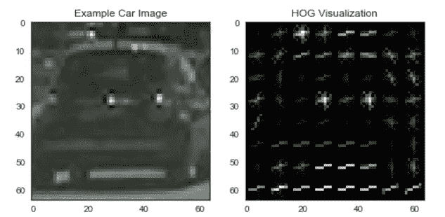
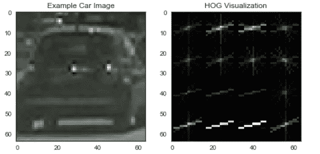
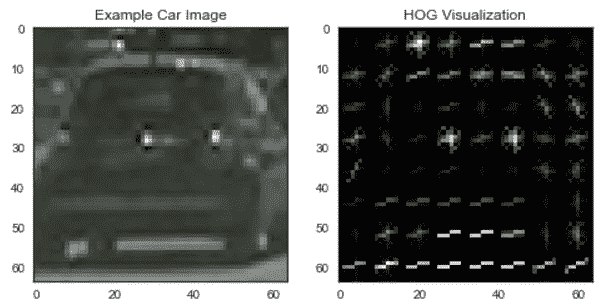
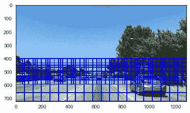
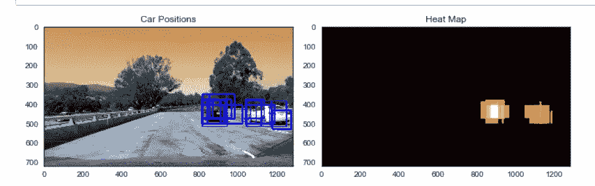
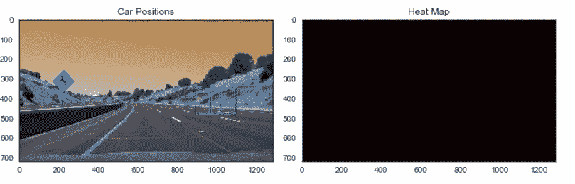

# 自动驾驶汽车的自动车辆检测

> 原文：<https://towardsdatascience.com/automatic-vehicle-detection-for-self-driving-cars-8d98c086b161?source=collection_archive---------3----------------------->

> 第 2 章:用数据做酷事！

我们如何教会自动驾驶汽车“看到”路上的其他汽车，并在它们移动时跟踪它们？仅仅用一个比雷达和激光雷达便宜得多的相机就能做到吗？

是啊！请看下面的视频。

这是通过使用计算机视觉技术和支持向量机(SVM)分类器来完成的。使用深度学习也可以做到这一点，但是我更喜欢计算机视觉，因为它比深度学习更直接，深度学习可能是一个黑盒。

链接到我的 [**GitHub**](https://github.com/priya-dwivedi/CarND/blob/master/CarND-Vehicle-Detection-P5/P5_vehicle_detection_final.ipynb) 用 Python 写的完整代码。

我们是这样做的:

1.  HOG 特征提取寻找图像的特征

[HOG(梯度下降直方图)](http://www.learnopencv.com/histogram-of-oriented-gradients/)是一种强大的计算机视觉技术，利用沿边缘的梯度方向来识别对象的形状。我们可以使用 *skimage.hog()* 函数来实现。关键参数是“方向”、“每个单元的像素”和“每个单元的块”。方向是渐变方向的数量。pixels_per_cell 参数指定计算每个梯度直方图的像元大小。cells_per_block 参数指定给定像元的直方图计数将被归一化的局部区域。为了感受 pixels_per_cell 和 cells_per_block 的影响，我查看了每单元像素和每块单元的不同设置的 hog 图像。

HOG — 8 pixels per cell and 1 cell per block

HOG — 16 pixels per cell and 1 cell per block

HOG — 8 pixels per cell and 2 cell per block

每次调用的低像素数和每块的高单元数(上图的最后一张)具有最大的 HOG 特征，使得检测汽车相当容易。然而，这也意味着缓慢的计算

2.训练支持向量机(SVM)分类器

一旦我们从汽车中提取了猪的特征，我们就可以训练 SVM 分类器来学习汽车和非汽车图像。在这个练习中，Udacity 提供了 2826 辆汽车和 8968 张非汽车图片的数据集。非汽车图像是由非汽车的前置摄像头可视化的任何图像。

为了给 SVM 选择最佳的 HOG 参数，我尝试了各种参数组合并观察了视频中的性能。最佳选择是:

*   color_space = 'YCrCb' — YCrCb 的性能远远优于 RGB、HSV 和 HLS
*   orient = 9 # HOG orientations——我试过 6、9 和 12。模型性能变化不大
*   pix_per_cell = 16 —我尝试了 8 和 16，最终选择了 16，因为它显著减少了计算时间
*   cell_per_block = 1 —我尝试了 1 和 2。性能差异不大，但每个块 1 个单元的特征数量明显减少，并加快了训练和流水线的速度
*   hog_channel = 'ALL' —所有这些都比任何其他单个通道产生了更好的性能

使用 *sklearn.svm.LinearSVC()训练线性 SVM。*

3.实现滑动窗口以检测图像中汽车的存在

为了检测图像中的汽车，我们定义了不同大小的窗口，并在图像中滑动它们。在每一点上，我们提取 HOG 特征并通过我们的分类器来预测窗口中汽车的存在。如果检测到汽车，我们保存窗口位置。下面是一个用不同大小的窗口进行搜索的例子。

下面是在一些测试图像上运行上述步骤的一些例子。如您所见，存在多重检测和误报。为了平滑多次检测并消除假阳性，我们可以创建所有检测的热图，并对其进行阈值处理以消除假阳性。

4.组合重叠的框并移除假阳性检测

快到了！正如你所看到的，上面的技术容易产生误报和多重包围盒。为了解决这个问题，我们可以结合多个窗口帧的检测(~20)和热图阈值(~22 检测)，以消除出现在几个帧中但不一致的假阳性“噪声”。

结果是对道路上的其他车辆的相当鲁棒的检测。这种技术也可以扩展到检测道路上的行人。

车道线的检测由我在另一篇[博客](https://medium.com/@priya.dwivedi/https-medium-com-priya-dwivedi-automatic-lane-detection-for-self-driving-cars-4f8b3dc0fb65#.wcweiwa5k)上发表。

然而，这种技术有一些缺点。首先，我不确定这个模型在有多辆车的交通拥挤的情况下是否表现良好。你需要有近乎完美的准确性，以避免撞到其他车辆，或确保在交叉路口没有碰撞。更重要的是，该模型运行缓慢。处理 1 分钟的视频需要 6–7 分钟。我不确定这个模型在现实生活中有汽车和行人的情况下是否有效。

参考资料:

[Udacity](https://www.udacity.com/) 无人驾驶汽车 Nano Degree——我感谢 Udacity 给我机会成为他们新的无人驾驶汽车项目的一部分。这是一次非常有趣的旅程。我使用的大部分代码都是在课堂讲课中建议的。

Python [OpenCV](http://docs.opencv.org/3.0-beta/doc/py_tutorials/py_tutorials.html) 库让应用计算机视觉技术变得如此简单