# 自动视觉目标跟踪

> 原文：<https://towardsdatascience.com/automatic-vision-object-tracking-347af1cc8a3b?source=collection_archive---------4----------------------->

一种平移/倾斜伺服设备，帮助摄像机使用视觉自动跟踪彩色对象。

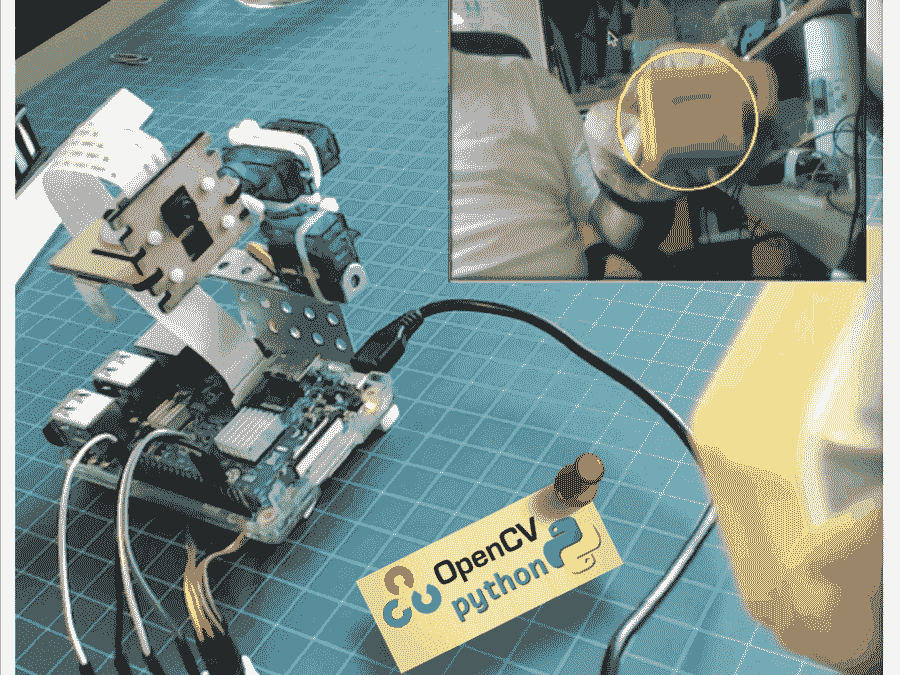

# 1.介绍

在之前的教程中，我们探讨了如何[控制平移/倾斜伺服设备](https://www.hackster.io/mjrobot/pan-tilt-multi-servo-control-b67791)来定位 PiCam。现在我们将使用我们的设备来帮助相机自动跟踪彩色物体，如下图所示:

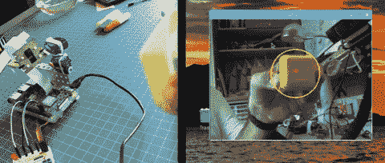

这是我第一次使用 OpenCV，我必须承认，我爱上了这个神奇的“开源计算机视觉库”。

[OpenCV](https://opencv.org/) 对于学术和商业用途都是免费的。它有 C++，C，Python 和 Java 接口，支持 Windows，Linux，Mac OS，iOS 和，Android。在我的 OpenCV 系列教程中，我们将重点关注 Raspberry Pi(所以，Raspbian 是 OS)和 Python。OpenCV 是为计算效率而设计的，非常注重实时应用。所以，它非常适合物理计算项目！

# 2.安装 OpenCV 3 包

我用的是 Raspberry Pi V3，更新到了 Raspbian (Stretch)的最新版本，所以安装 OpenCV 的最好方法是遵循 Adrian Rosebrock 开发的优秀教程: [Raspbian Stretch:在你的 Raspberry Pi 上安装 OpenCV 3+Python](https://www.pyimagesearch.com/2017/09/04/raspbian-stretch-install-opencv-3-python-on-your-raspberry-pi/)。

我尝试了几种不同的指南在我的 Pi 上安装 OpenCV。阿德里安的教程是最好的。我建议你也这样做，一步一步地遵循他的指导方针。

一旦您完成了 Adrian 的教程，您就应该有一个 OpenCV 虚拟环境，可以在您的 Pi 上运行我们的实验。

让我们进入虚拟环境，确认 OpenCV 3 安装正确。

Adrian 建议每次打开新终端时运行命令“source ”,以确保系统变量设置正确。

```
source ~/.profile
```

接下来，让我们进入虚拟环境:

```
workon cv
```

如果您在提示前看到文本(cv ),则您处于 *cv 虚拟*环境中:

```
(cv) pi@raspberry:~$
```

Adrian 提醒注意， ***cv Python 虚拟环境*** 完全独立于 Raspbian Stretch 下载中包含的默认 Python 版本。因此，全局站点包目录中的任何 Python 包对于 cv 虚拟环境都是不可用的。类似地，任何安装在 cv 的 site-packages 中的 Python 包对于 Python 的全局安装都是不可用的。

现在，在 Python 解释器中输入:

```
python
```

并确认您运行的是 3.5(或更高)版本

在解释器内部(会出现" > > > ")，导入 OpenCV 库:

```
import cv2
```

如果没有出现错误消息，则 OpenCV 已正确安装在您的 PYTHON 虚拟环境中。

您也可以检查安装的 OpenCV 版本:

```
cv2.__version__
```

3.3.0 应该会出现(或者将来可能发布的更高版本)。上面的终端打印屏幕显示了前面的步骤。

# 3.测试您的相机


一旦你在 RPi 中安装了 OpenCV，让我们测试一下你的相机是否工作正常。

我假设你已经在你的 Raspberry Pi 上安装了 PiCam。

在您的 IDE 上输入以下 Python 代码:

```
import numpy as np
import cv2
cap = cv2.VideoCapture(0)while(True):
    ret, frame = cap.read()
    frame = cv2.flip(frame, -1) # Flip camera vertically
    gray = cv2.cvtColor(frame, cv2.COLOR_BGR2GRAY)

    cv2.imshow('frame', frame)
    cv2.imshow('gray', gray)
    if cv2.waitKey(1) & 0xFF == ord('q'):
        breakcap.release()
cv2.destroyAllWindows()
```

上述代码将捕获 PiCam 生成的视频流，并以 BGR 彩色和灰色模式显示。

请注意，由于组装的方式，我垂直旋转了我的相机。如果不是你的情况，评论或删除“翻转”命令行。

你也可以从我的 GitHub 下载代码: [simpleCamTest.py](https://github.com/Mjrovai/OpenCV-Object-Face-Tracking/blob/master/simpleCamTest.py)

要执行，请输入命令:

```
python simpleCamTest.py
```

要完成该程序，您必须按键盘上的[q]或[Ctrl] + [C]键

图为结果。


了解 OpenCV 的更多内容，可以关注教程:[加载-视频-python-OpenCV-教程](https://pythonprogramming.net/loading-video-python-opencv-tutorial/)

# 4.用 OpenCV 实现 Python 中的颜色检测

我们将尝试完成的一件事是检测和跟踪某种颜色的物体。为此，我们必须对 OpenCV 如何解释颜色有更多的了解。

Henri Dang 用 OpenCV 用 Python 写了一个很棒的关于[颜色检测的教程。](https://henrydangprg.com/2016/06/26/color-detection-in-python-with-opencv/)

通常，我们的相机将以 RGB 颜色模式工作，这可以理解为可以由红、绿、蓝三种颜色的光组成的所有可能的颜色。我们将在这里用 BGR(蓝色、绿色、红色)代替。

如上所述，对于 BGR，像素由 3 个参数表示，蓝色、绿色和红色。每个参数通常有一个从 0 到 255 的值(或十六进制的 0 到 FF)。例如，计算机屏幕上的纯蓝色像素的 B 值为 255，G 值为 0，R 值为 0。

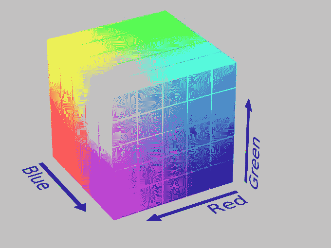

OpenCV 使用 HSV(色调、饱和度、值)颜色模型，它是 RGB 颜色模型的替代表示，由计算机图形研究人员在 20 世纪 70 年代设计，以更接近人类视觉感知颜色生成属性的方式:


太好了。因此，如果您想使用 OpenCV 跟踪某种颜色，您必须使用 HSV 模型来定义它。

## 例子

比方说，我必须跟踪一个黄色物体，如上图所示的塑料盒。容易的部分是找到它的 BGR 元素。你可以用任何设计程序去找(我用的是 PowerPoint)。


在我的案例中，我发现:

*   蓝色:71
*   绿色:234
*   红色:213

接下来，我们必须将 BGR (71，234，213)模型转换为 HSV 模型，这将由范围的上限和下限来定义。为此，让我们运行下面的代码:

```
import sys
import numpy as np
import cv2blue = sys.argv[1]
green = sys.argv[2]
red = sys.argv[3] color = np.uint8([[[blue, green, red]]])
hsv_color = cv2.cvtColor(color, cv2.COLOR_BGR2HSV)
hue = hsv_color[0][0][0]print("Lower bound is :"),
print("[" + str(hue-10) + ", 100, 100]\n")
print("Upper bound is :"),
print("[" + str(hue + 10) + ", 255, 255]")
```

你也可以从我的 GitHub 下载代码: [bgr_hsv_converter.py](https://github.com/Mjrovai/OpenCV-Object-Face-Tracking/blob/master/bgr_hsv_converter.py)

要执行该命令，请输入以下命令，并将之前找到的 BGR 值作为参数:

```
python bgr_hsv_converter.py 71 234 213
```

该程序将打印我们的对象颜色的上下边界。

在这种情况下:

```
lower bound: [24, 100, 100]
```

和

```
upper bound: [44, 255, 255]
```

终端打印屏幕显示结果。

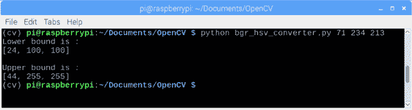

最后，同样重要的是，让我们看看一旦我们确定了对象的颜色，OpenCV 如何“屏蔽”它:

```
import cv2
import numpy as np# Read the picure - The 1 means we want the image in BGR
img = cv2.imread('yellow_object.JPG', 1) # resize imag to 20% in each axis
img = cv2.resize(img, (0,0), fx=0.2, fy=0.2)# convert BGR image to a HSV image
hsv = cv2.cvtColor(img, cv2.COLOR_BGR2HSV) # NumPy to create arrays to hold lower and upper range 
# The “dtype = np.uint8” means that data type is an 8 bit integer
lower_range = np.array([24, 100, 100], dtype=np.uint8) 
upper_range = np.array([44, 255, 255], dtype=np.uint8)# create a mask for image
mask = cv2.inRange(hsv, lower_range, upper_range)# display both the mask and the image side-by-side
cv2.imshow('mask',mask)
cv2.imshow('image', img)# wait to user to press [ ESC ]
while(1):
  k = cv2.waitKey(0)
  if(k == 27):
    breakcv2.destroyAllWindows()
```

你也可以从我的 GitHub 下载代码: [colorDetection.py](https://github.com/Mjrovai/OpenCV-Object-Face-Tracking/blob/master/colorDetection.py)

要执行，输入下面的命令，在你的目录中有一张你的目标对象的照片(在我的例子中:yellow_object。JPG):

```
python colorDetection.py
```

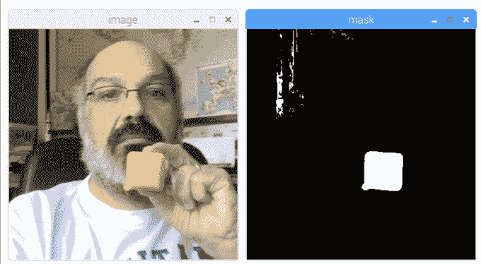

上面的图片将显示原始图像(“图像”)以及应用蒙版后对象的外观(“蒙版”)。

# 5.物体运动跟踪

现在我们知道如何使用蒙版“选择”我们的对象，让我们使用相机实时跟踪它的运动。为此，我用 OpenCV tutoria l 基于 [Adrian Rosebrock 的球跟踪编写了我的代码](https://www.pyimagesearch.com/2015/09/14/ball-tracking-with-opencv/)

我强烈建议你详细阅读阿德里安的教程。

首先，确认你是否安装了 *imutils 库*。它是 Adrian 收集的 OpenCV 便利函数，使一些基本任务(如调整大小或翻转屏幕)变得更加容易。如果没有，请输入以下命令，在您的虚拟 Python 环境中安装库:

```
pip install imutils
```

接下来，从我的 GitHub 下载代码 [ball_tracking.py](https://github.com/Mjrovai/OpenCV-Object-Face-Tracking/blob/master/ball_tracking.py) ，并使用以下命令执行它:

```
python ball_traking.py
```

因此，您将看到类似于下面的 gif:


基本上，它和 Adrian 的代码是一样的，除非是“视频垂直翻转”,这是我用下面一行代码得到的:

```
frame = imutils.rotate(frame, angle=180)
```

另外，请注意，所使用的遮罩边界是我们在上一步中获得的。

# 6.测试 GPIOs

现在我们已经玩了 OpenCV 的基础，让我们安装一个 LED 到我们的 RPi，并开始与我们的 GPIOs 交互。

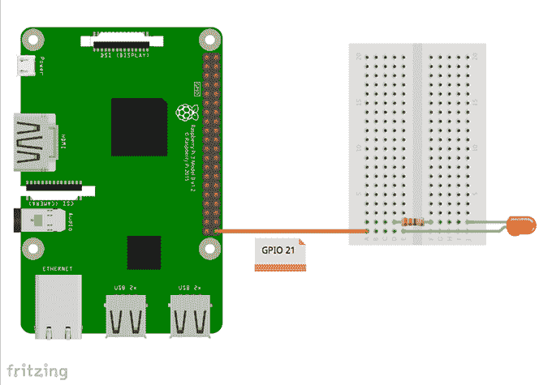

遵循上面的电路图:LED 的阴极将通过 220 欧姆的电阻器连接到 GPIO 21，其阳极连接到 GND。

让我们在虚拟 Python 环境中测试我们的 LED。

请记住，RPi 有可能。您的 Python 虚拟环境中没有安装 GPIO！要解决这个问题，一旦您到达那里(记得确认(cv)在您的终端中)，您需要使用 pip 将其安装到您的虚拟环境中:

```
pip install RPi.GPIO
```

让我们使用 python 脚本来执行一个简单的测试:

```
import sys
import time
import RPi.GPIO as GPIO# initialize GPIO and variables
redLed = int(sys.argv[1])
freq = int(sys.argv[2])
GPIO.setmode(GPIO.BCM)
GPIO.setup(redLed, GPIO.OUT)
GPIO.setwarnings(False)print("\n [INFO] Blinking LED (5 times) connected at GPIO {0} \
at every {1} second(s)".format(redLed, freq))
for i in range(5):
    GPIO.output(redLed, GPIO.LOW)
    time.sleep(freq)
    GPIO.output(redLed, GPIO.HIGH)
    time.sleep(freq)# do a bit of cleanup
print("\n [INFO] Exiting Program and cleanup stuff \n")
GPIO.cleanup()
```

该代码将接收一个 GPIO 号和 LED 闪烁的频率(秒)作为参数。LED 将闪烁 5 次，程序将被终止。请注意，在终止之前，我们将释放 GPIOs。

所以，要执行这个脚本，你必须输入参数， *LED GPIO* 和*频率*。

例如:

```
python LED_simple_test.py 21 1
```

上述命令将使连接到“GPIO 21”的红色 LED 每“1”秒闪烁 5 次。

文件 [GPIO_LED_test.py](https://github.com/Mjrovai/OpenCV-Object-Face-Tracking/blob/master/GPIO_LED_test.py) 可以从我的 GitHub 下载

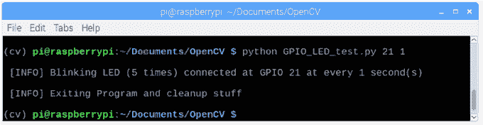

上面的终端打印屏幕显示了结果(当然，您应该确认 LED 在闪烁。

现在，让我们使用 OpenCV 和一些基本的 GPIO 东西。

# 7.识别颜色和 GPIO 交互

让我们开始将 OpenCV 代码与 GPIO 交互集成。我们将从最后一个 OpenCV 代码开始，我们将在其上集成 GPIO-RPI 库，因此我们将在相机发现我们的彩色对象时打开红色 LED。这一步使用的代码基于 Adrian 的优秀教程 [OpenCV，RPi。GPIO，和树莓 Pi 上的 GPIO 零点](https://www.pyimagesearch.com/2016/05/09/opencv-rpi-gpio-and-gpio-zero-on-the-raspberry-pi/):

首先要做的是“创建”我们的 LED，将其连接到特定的 GPIO:

```
import RPi.GPIO as GPIO
redLed = 21
GPIO.setmode(GPIO.BCM)
GPIO.setwarnings(False)
GPIO.setup(redLed, GPIO.OUT)
```

其次，我们必须初始化我们的 LED(关闭):

```
GPIO.output(redLed, GPIO.LOW)
ledOn = False
```

现在，在循环中，当找到对象时会创建“圆圈”,我们将打开 LED:

```
GPIO.output(redLed, GPIO.HIGH)
ledOn = True
```

让我们从我的 GitHub 下载完整的代码: [object_detection_LED.py](https://github.com/Mjrovai/OpenCV-Object-Face-Tracking/blob/master/object_detection_LED.py)

使用以下命令运行代码:

```
python object_detection_LED.py
```

这是结果。注意:每次检测到物体时，LED(左下角)都会亮起:

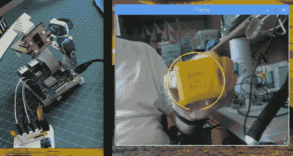

尝试不同的对象(颜色和格式)。你会看到，一旦遮罩边界内的颜色匹配，LED 就会打开。

下面的视频展示了一些经验。请注意，只有处于颜色范围内的黄色物体才会被检测到，从而打开 LED。具有不同颜色的对象被忽略。

我们在这里仅使用上一步中解释的 LED。我做视频的时候已经把云台组装好了，所以忽略它。我们将在下一步处理平移/倾斜机制。

# 8.平移倾斜机构

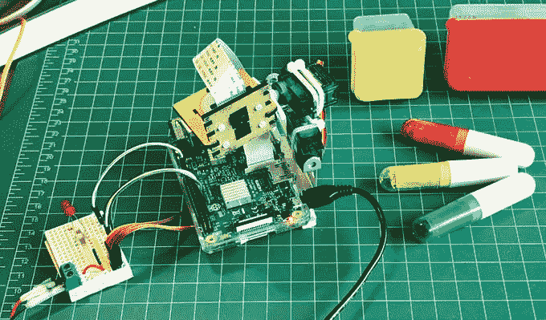

既然我们已经玩了 OpenCV 和 GPIO 的基础，让我们安装我们的平移/倾斜机制。

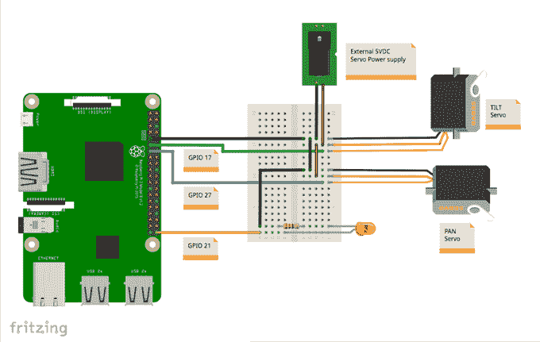

> *详情请访问我的教程:* [*云台多伺服控制*](https://www.instructables.com/id/Pan-Tilt-Multi-Servo-Control/)

伺服系统应连接到外部 5V 电源，其数据引脚(在我的例子中，它们的黄色接线)连接到 Raspberry Pi GPIO，如下所示:

*   GPIO 17 == >倾斜伺服
*   GPIO 27 == >平移伺服

不要忘记将 gnd 连接在一起==> Raspberry Pi —伺服—外部电源)

您可以选择在 Raspberry Pi GPIO 和服务器数据输入引脚之间串联一个 1K 欧姆的电阻。这将保护你的 RPi 以防伺服问题。

让我们也利用这个机会，在我们的虚拟 Python 环境中测试我们的伺服系统。

让我们使用 Python 脚本对我们的驱动程序执行一些测试:

```
from time import sleep
import RPi.GPIO as GPIOGPIO.setmode(GPIO.BCM)
GPIO.setwarnings(False)def setServoAngle(servo, angle):
	pwm = GPIO.PWM(servo, 50)
	pwm.start(8)
	dutyCycle = angle / 18\. + 3.
	pwm.ChangeDutyCycle(dutyCycle)
	sleep(0.3)
	pwm.stop()if __name__ == '__main__':
	import sys
	servo = int(sys.argv[1])
	GPIO.setup(servo, GPIO.OUT)
	setServoAngle(servo, int(sys.argv[2]))
	GPIO.cleanup()
```

上面代码的核心是函数 setServoAngle(伺服，角度)。这个函数接收一个伺服 GPIO 号和一个伺服必须定位的角度值作为参数。一旦这个函数的输入是“角度”，我们必须将其转换为等效占空比。

要执行该脚本，必须输入*伺服 GPIO* 和*角度*作为参数。

例如:

```
python angleServoCtrl.py 17 45
```

上述命令将连接在 GPIO 17(“倾斜”)上的伺服定位为“仰角”45 度。

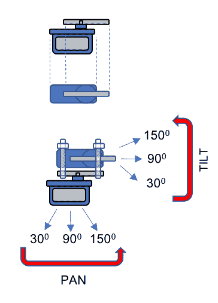

文件[angleservocctrl . py](https://github.com/Mjrovai/OpenCV-Object-Face-Tracking/blob/master/angleServoCtrl.py)可以从我的 GitHub 下载

# 9.寻找物体的实时位置

这里的想法是使用平移/倾斜机制将对象定位在屏幕的中间。坏消息是，首先我们必须知道物体的实时位置。但好消息是，一旦我们已经有了物体中心的坐标，这是非常容易的。

首先，让我们把之前使用的“object_detect_LED”代码修改为打印被发现对象的 x，y 坐标。

从我的 GitHub 下载代码: [objectDetectCoord.py](https://github.com/Mjrovai/OpenCV-Object-Face-Tracking/blob/master/Object_Tracking/objectDetectCoord.py)

代码的“核心”是我们找到对象并在它的中心画一个红点的圆的部分。

```
# only proceed if the radius meets a minimum size
if radius > 10:
	# draw the circle and centroid on the frame,
	# then update the list of tracked points
	cv2.circle(frame, (int(x), int(y)), int(radius),
		(0, 255, 255), 2)
	cv2.circle(frame, center, 5, (0, 0, 255), -1)

	# print center of circle coordinates
	mapObjectPosition(int(x), int(y))

	# if the led is not already on, turn the LED on
	if not ledOn:
		GPIO.output(redLed, GPIO.HIGH)
		ledOn = True
```

让我们将中心坐标“导出”到 *mapObjectPosition(int(x)，int(y))* 函数，以便打印其坐标。功能下方:

```
def mapObjectPosition (x, y):
    print ("[INFO] Object Center coordinates at \
    X0 = {0} and Y0 =  {1}".format(x, y))
```

运行该程序，我们将在终端上看到(x，y)位置坐标，如上所示。移动物体，观察坐标。我们会意识到 x 从 0 到 500(从左到右)，y 从 o 到 350(从上到下)。见上图。

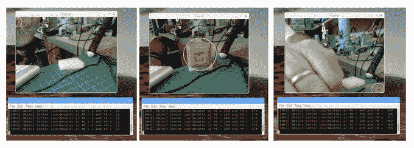

太好了！现在，我们必须使用这些坐标作为平移/倾斜跟踪系统的起点

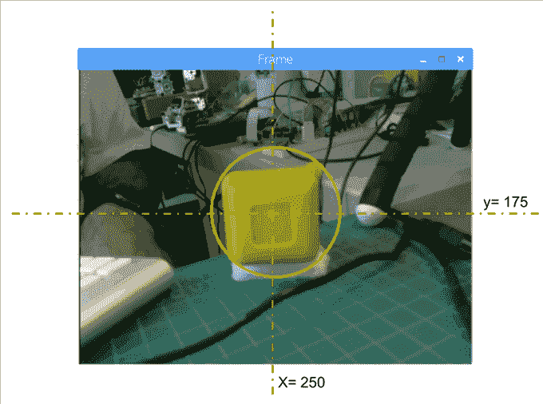

# 10.物体位置跟踪系统

我们希望我们的对象总是在屏幕上居中。因此，让我们定义，例如，我们将认为我们的对象“居中”，如果:

*   220 < x < 280
*   160 < y < 210

在这些界限之外，我们必须移动我们的平移/倾斜机构来补偿偏差。基于此，我们可以构建函数*mapservosition(x，y)* 如下。请注意，此功能中用作参数的“x”和“y”与我们之前用于打印中心位置的参数相同:

```
# position servos to present object at center of the frame
def mapServoPosition (x, y):
    global panAngle
    global tiltAngle
    if (x < 220):
        panAngle += 10
        if panAngle > 140:
            panAngle = 140
        positionServo (panServo, panAngle)
    if (x > 280):
        panAngle -= 10
        if panAngle < 40:
            panAngle = 40
        positionServo (panServo, panAngle)
    if (y < 160):
        tiltAngle += 10
        if tiltAngle > 140:
            tiltAngle = 140
        positionServo (tiltServo, tiltAngle)
    if (y > 210):
        tiltAngle -= 10
        if tiltAngle < 40:
            tiltAngle = 40
        positionServo (tiltServo, tiltAngle)
```

基于(x，y)坐标，使用功能*位置伺服(伺服，角度)生成伺服位置命令。*例如，假设 y 位置是“50”，这意味着我们的对象几乎在屏幕的顶部，这可以解释为我们的“摄像机视线”是“低的”(比如说 120 度的倾斜角)，所以我们必须“减小”倾斜角(比如说 100 度)，所以摄像机视线将是“向上的”，对象将在屏幕上“向下”(y 将增加到比如说 190 度)。

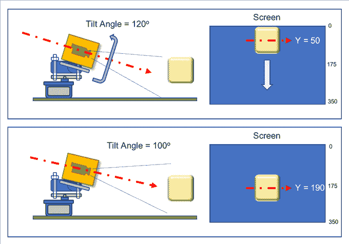

上图显示了几何方面的示例。

想想全景摄像机将如何操作。请注意，屏幕不是镜像的，这意味着如果你将对象移动到“你的左边”，一旦你与相机相对，它将在屏幕上移动到“你的右边”。

函数 positionServo(伺服，角度)可以写成:

```
def positionServo (servo, angle):
    os.system("python angleServoCtrl.py " + str(servo) + " " + 
              str(angle))
    print("[INFO] Positioning servo at GPIO {0} to {1} \
    degrees\n".format(servo, angle))
```

我们将调用之前显示的脚本进行伺服定位。

请注意，angleServoCtrl.py 必须与 objectDetectTrac.py 位于同一目录中

完整的代码可以从我的 GitHub 下载: [objectDetectTrack.py](https://github.com/Mjrovai/OpenCV-Object-Face-Tracking/blob/master/Object_Tracking/objectDetectTrack.py)

下面的 gif 展示了我们的项目工作的一个例子:

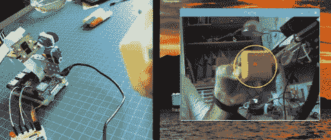

# 11.结论

一如既往，我希望这个项目可以帮助其他人找到进入令人兴奋的电子世界的方法！

详情和最终代码，请访问我的 GitHub 仓库:[OpenCV-Object-Face-Tracking](https://github.com/Mjrovai/OpenCV-Object-Face-Tracking)

更多项目，请访问我的博客:[MJRoBot.org](https://mjrobot.org/)

下面是我的下一个教程，我们将探索“人脸跟踪和检测”:

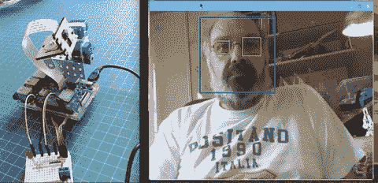

来自世界南部的 Saludos！

我的下一篇文章再见！

谢谢你，

马塞洛