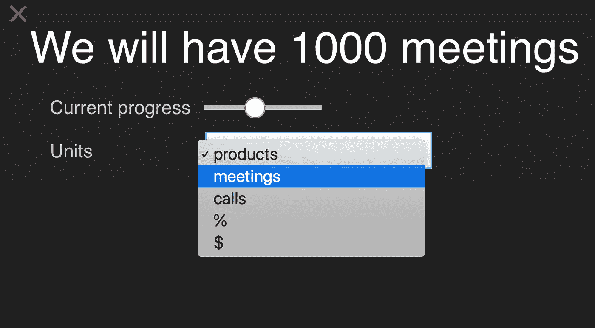
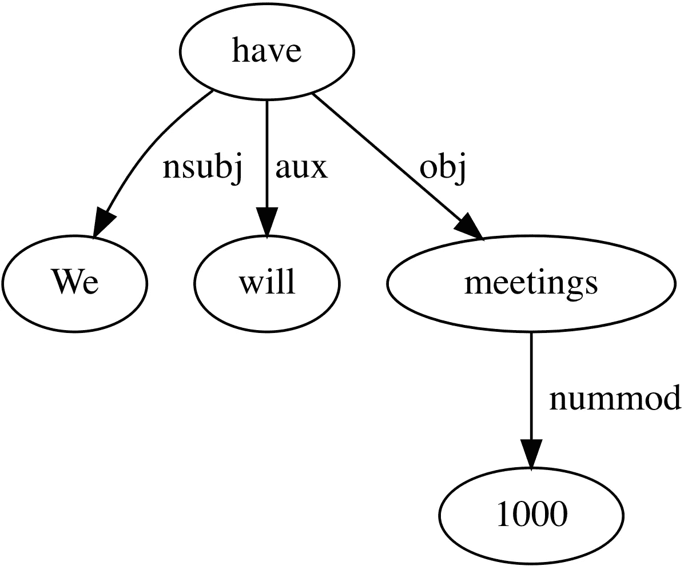
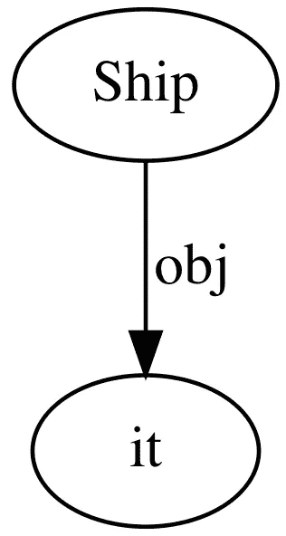
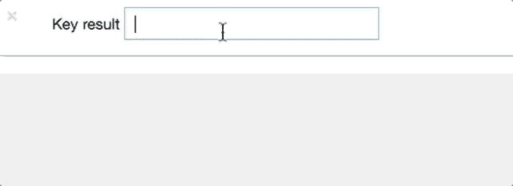

# 使用依赖解析从自然语言目标语句自动生成目标-进度界面

> 原文：<https://towardsdatascience.com/automatically-generating-goal-progress-interfaces-from-natural-language-goal-statements-using-2b601289a2b9?source=collection_archive---------9----------------------->

# okr 是一种可衡量的目标

okr 是公司和团队设定可衡量目标的一种流行方式，这种方式自然会带来进步。基本的想法是，你要努力实现一些(经过深思熟虑的)可衡量的关键结果(KRs)。通过实现这些目标，你更有可能实现你更广泛的目标(O ),而不是仅仅陈述目标并试图忙碌起来。

有很多 OKR 工具可以提供帮助。当整个公司在其许多不同的团队中使用 OKRs 时，这些特别有用。在一个层级中，团队的 okr 共同实现公司的 okr。

我的公司 [Saberr](http://www.saberr.com) 正在开发 [CoachBot](http://saberr.com/coachbot) ，这是一款帮助团队实现目标和集体目标以及其他一切让团队更好合作的应用。通过 [CoachBot](https://saberr.com/coachbot/) ，我们试图让一个团队非常容易地设定一些 OKR 式的目标——即使他们以前从未实现过这些目标，即使他们的公司也没有(还没有)？)更广泛地使用它们。

# 有时候，目标进度工具可能是一种痛苦

我们一直在寻找方法使**设置**和**审查** OKRs 的过程快速而直接。团队目标应该是有用的，而不是负担。

但这通常是一个团队在关键结果上输入进度的方式:

Who wants to fiddle with dropdowns?

关键结果通常是可以衡量的——但不总是这样，尤其是当人们对他们来说是陌生人的时候。通常人们最终会写出任务，或者布尔型的结果(“创建新网站”、“启动网站”)。

# 我们可以使用机器学习来消除一些痛苦

为了节省时间，让我们试着自动计算出我们要处理的关键结果，如果是数字，单位是什么。

这对于依存解析来说是一个很好的任务:一种自然语言处理，预测句子中所有单词的**角色**和**关系**。

我们可以用预先训练好的模型很快完成这个任务。
加载[教程](https://github.com/tensorflow/models/blob/master/research/syntaxnet/examples/dragnn/interactive_text_analyzer.ipynb)，键入我们的关键结果，我们会看到一个解析树，如下所示:

Dependency parse tree for a key result: “We will have 1000 meetings”

“会议”是一个被“1000”引用的 [*对象*](http://universaldependencies.org/u/dep/obj.html) ，而“1000”是它的 [*nummod*](http://universaldependencies.org/docs/en/dep/nummod.html) 或数字修饰符。所以看起来我们的工作会很容易！我们只需要寻找带有数字的对象。

显然有一些边缘情况和陷阱。需要几行代码来处理像“一千次会议”这样的 kr，对于复杂的句子，我们必须跟踪句子最可能的实际宾语——通过查看哪个更接近地引用句子的*根*(“have”)。

方便的是，当 KR 被写成布尔结果或任务时，句子的词根通常是动词。

举例来说，如果你很匆忙，并作出了“装运它”的 KR，我们会解析为:

Dependency parse tree for key result: “Ship it”

这很方便，因为完成这个关键结果的动作是句子的词根(“ship”)。

这意味着我们通常可以依靠句根作为非数字目标的行动:

Automatically detecting numeric goals, their units and range, or boolean goals

这是一个很好的例子，说明预先训练好的模型可以很快地用于解决小问题。