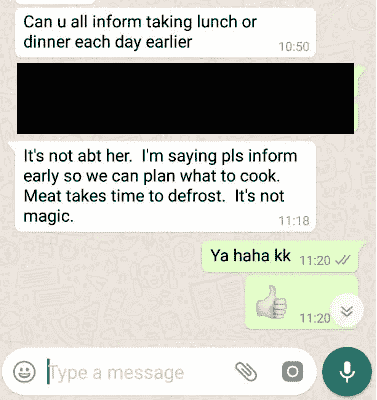
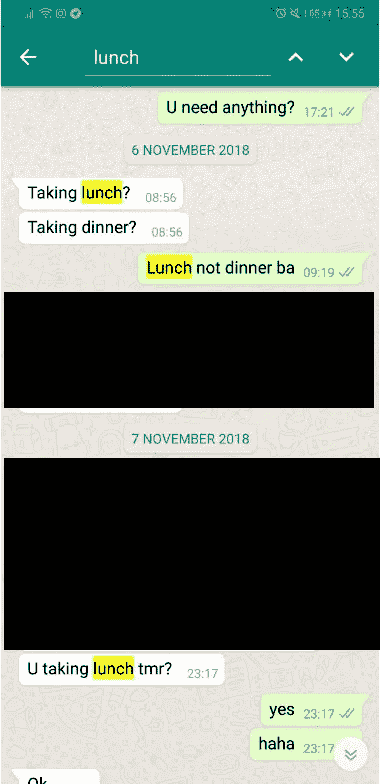
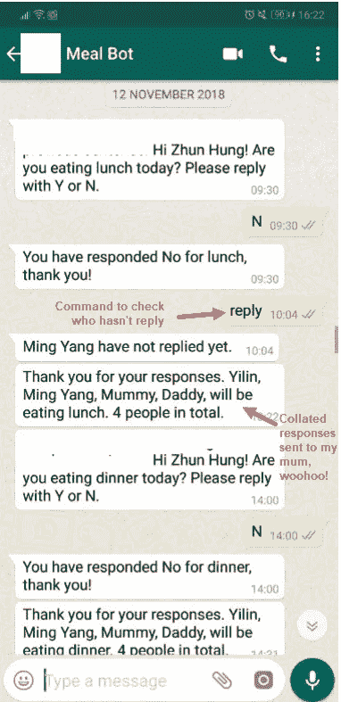
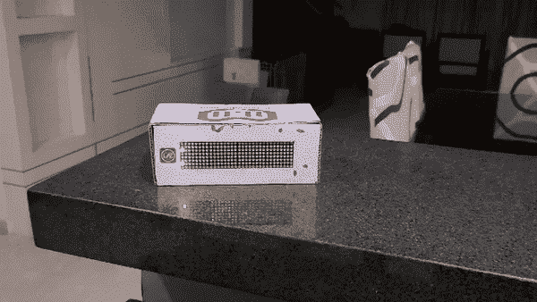

# 自动化日常生活中的点点滴滴

> 原文：<https://towardsdatascience.com/automating-bits-and-pieces-of-your-daily-life-1a18e45590b9?source=collection_archive---------14----------------------->

作为一个狂热的技术人员和问题解决者，我的头脑总是在寻找机会应用我所学的东西。除了实习期间，我还没有好好利用我的学费。直到有一天，一个通知出现在我的手机上:

My mum’s daily routine of collating meal attendance from everyone

我没有多想，只是像往常一样回答“是”。我妈妈通常要问每个家庭成员我们是否会在家里吃饭，这样她就可以相应地分配。(希望这是所有家庭的共性😇).我一点也不知道，我是在享受:

BAM. Clearly this a problem right now. Cue awkward “haha”.

毫无疑问，我立刻感到内疚和懊悔，我应该更主动地减轻她的工作量。回顾我们的信息历史，我知道是时候做点什么了……***终于***

This went on for years without me consciously noticing, *sorry mum*

# 快进到解决方案

基于这个问题的性质，我觉得聊天机器人将是最合适的。考虑到我妈妈对技术的基本了解，我决定开发一个在 WhatsApp 上运行的 **MumBot** 。花了 3 天的时间修修补补， **MumBot v0.1 上线了！**

下面是它的工作原理(没有技术细节):

The bot messages you privately at pre-defined timings and send collated responses to everyone. #SmartNation

*Taaadaaaa* ！*妈妈快乐，生活幸福*！在向她推销了这个机器人和现场演示后，这是她的回应:

> 你再也没有借口不回复了啊！*假笑*

哦，天哪，她满意了！虽然我不太确定我是不是给自己制造了更多的麻烦。尽管如此，我还是完成了我设定的目标，并赢得了 4 个快乐的顾客(我的家人)。希望这能激励你们中的一些人在家里想出一些有趣的方法！

# 奖金

在采用该机器人 2 周后，每个人的生活都变得轻松多了。然而，我注意到我的妈妈仍然不得不把吃午餐/晚餐的人数告诉我的助手。因此，我想看看这能带来多大的好处:

DIY box on the bar counter to notify my helper. Am I opening a store?

由于我的助手**没有**的 WhatsApp(或者她有……)，我拼凑了一个显示盒，MumBot 可以与之通信。女士们先生们，这就是我如何取代我妈妈的。(开玩笑，她是不可替代的❤️)