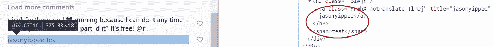
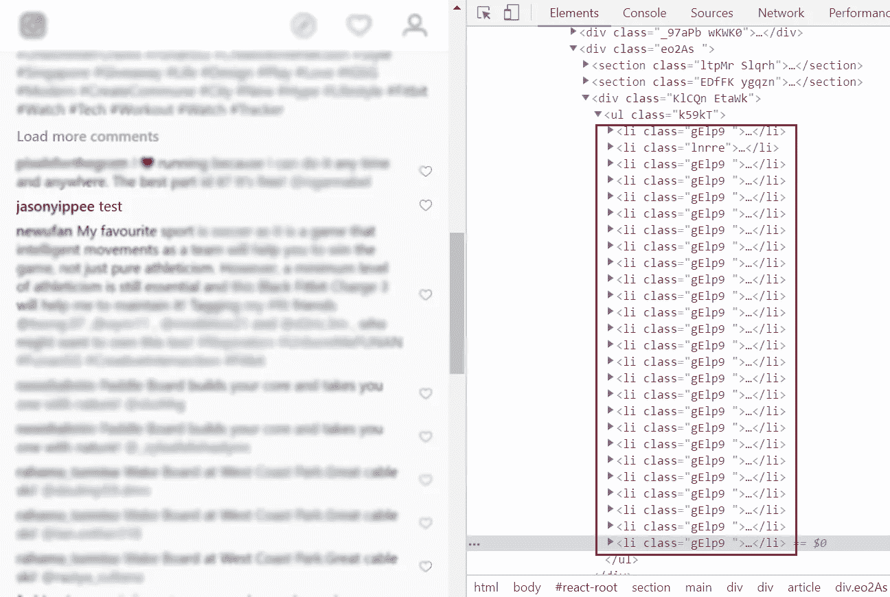
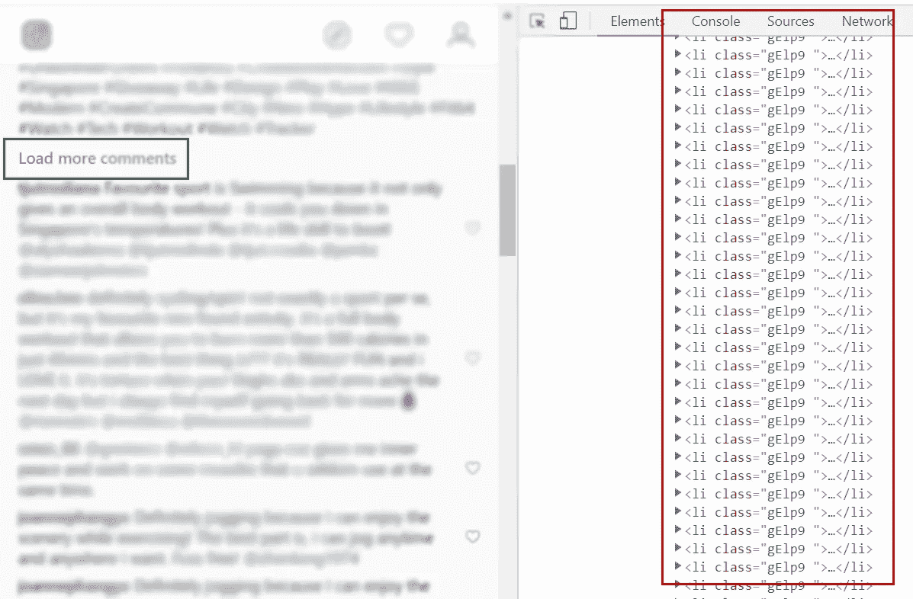
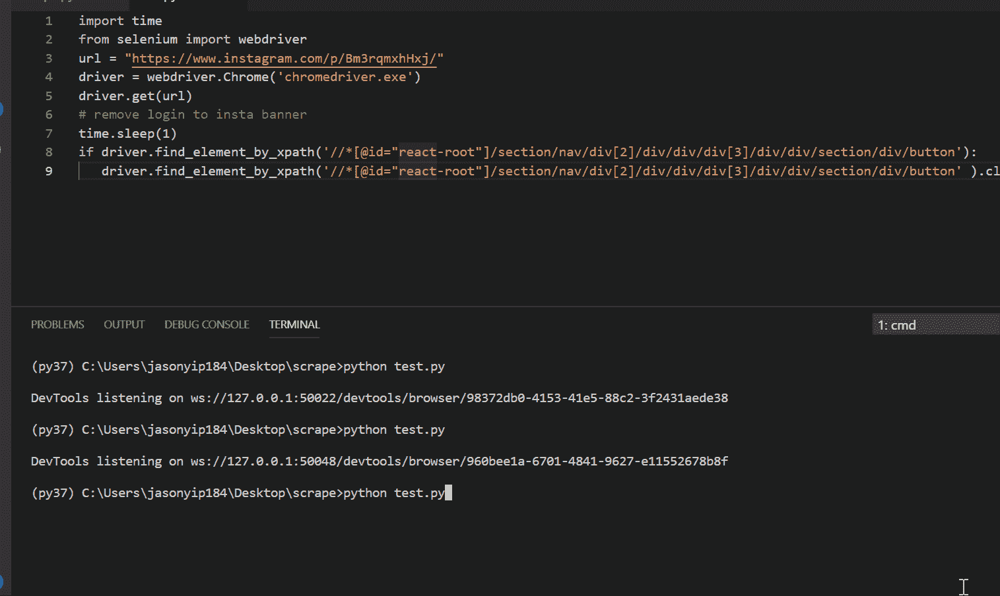
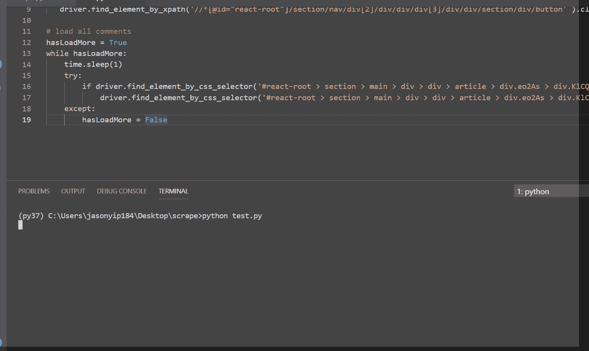
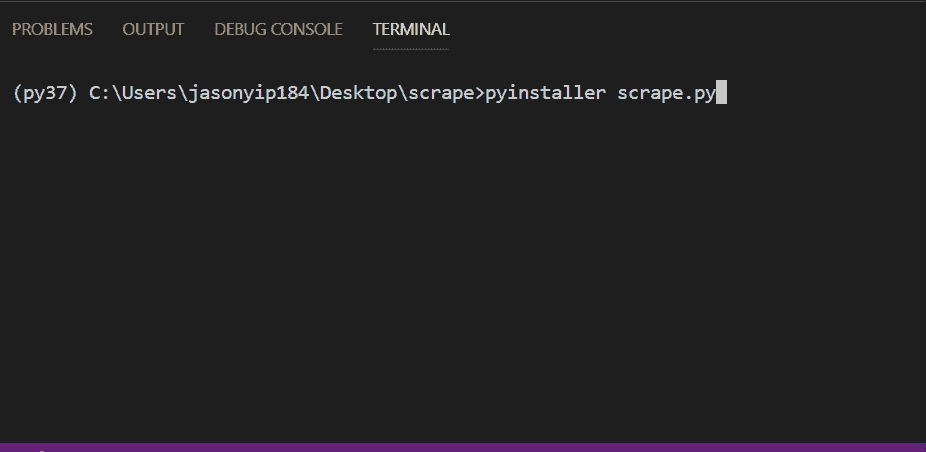
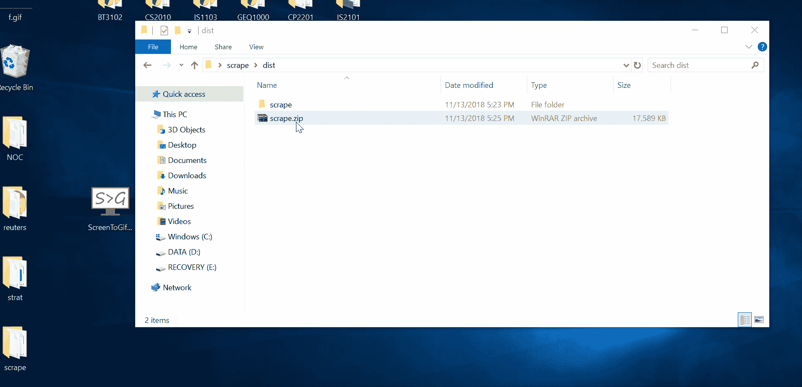

# 通过网络抓取实现社交媒体竞赛的自动化

> 原文：<https://towardsdatascience.com/automating-social-media-contests-with-web-scraping-41c55ff6022a?source=collection_archive---------15----------------------->

随着我的第三学期即将结束，我也结束了在汤森路透实验室的兼职实习，并完成了我在学校的项目和作业。醒来时盘子里什么都没有(我吃了早餐)，这是非常不舒服的，我决定学习一些似乎总是可以做到，但从来没有机会动手做的事情。


# 灵感

我这么做是因为我的朋友在一家数字机构工作，她的部分工作需要管理社交媒体竞赛。基本上这个想法是做赠品来换取客户更多的宣传。


Random example found on the web doing an Instagram giveaway

甚至在您的“提交”被考虑参加竞赛之前，也有一些特定的要求需要满足，并且每个竞赛在性质上可能非常不同。比如 FB 而不是 Instagram，需要赞而不是关注和标签。浏览每个评论并访问每个标记用户的个人资料以确保他们是合法的，这是一项极其乏味的工作。她还必须手动捕捉每条评论和标记的用户，以便进行社交媒体分析。我的意思是手动将每个评论转换成 Excel 表格。这太疯狂了，很多时间都浪费在处理这些每周都频繁发生的比赛上。

如果你有一个标准化的简单任务，并且要重复无数次，它绝对应该自动化，让你做更有意义的工作。

在我开始之前，我对网络抓取的唯一了解是大量使用 HTML/CSS 知识操作页面的结构/模板，以及使用名为 BeautifulSoup 的 Python 包。


are you real?

主要任务之一是检查被标记的用户是否合法。我们通常凭直觉做出决定，但为了设定一个标准定义，我将其定义为至少拥有 100 个关注者、50 个关注者和 10 篇帖子的用户。

# 代码演练

## 检查用户是否合法

我在 Windows 上，用的是 Python 3.7，但是大部分代码和思路完全一样。允许您获取页面源代码，我们会将其加载到 init BeautifulSoup。在这个例子中，我将检查我的 Instagram 是否处理了`is_legit`。

输出被打印成一大块代码，实际上是我的 [Instagram 句柄](https://www.instagram.com/jasonyippee/)页面的 html。我在打印输出中搜索“Followers ”,找到了下面一行。

`<meta content=”978 Followers, 652 Following, 677 Posts — See Instagram photos and videos from Jason Yip ([@jasonyippee](http://twitter.com/jasonyippee))” property=”og:description”/>`

执行这个将帮助我提取数字。

```
string = soup.find("meta",  property="og:description")['content']
print(string)- 978 Followers, 652 Following, 677 Posts - See Instagram photos and videos from Jason Yip ([@jasonyippee](http://twitter.com/jasonyippee))
```

现在我只需要操作字符串来得到我想要的计数。

```
- 978 652 677
```

最后，我可以查看它是否满足阈值，并返回用户是否有效。我们还考虑了 Instagram 显示 243.8k 和 1，000 而不是 2438，000 和 1000 粉丝的情况。

## 自动化“加载更多评论”

现在，同样的想法，我们可以看看我们的比赛后，并检查评论，以检查有效的条目。你可以在页面上做 **Ctrl+Shift+C 或者 Command + Option + I (Mac)** ，将鼠标悬停在每个评论上来检查各自的元素。类似地，我们可以获得用户的类、标签和评论中的文本，我们可以使用 soup.find_all()使用 BeautifulSoup 进行搜索



然而，我遇到了一个关于**加载更多评论**按钮的问题。大多数页面只有在你进一步滚动或者点击按钮时才会加载内容。这使得我们无法获得每一条评论。



点击按钮后，页面源将只包含新的评论。这意味着我们不能简单地使用`urllib`来获取 url 的 html，因为它没有考虑这种动态性。



我搜索了一下，发现了一个叫做 WebDriver 的东西，它有助于在 Web 上自动执行操作。基本上你可以写一个脚本来自动访问一个 URL，点击按钮，甚至为你滚动，同时为每个单独的动作计时。

Python 有对 Selenium WebDriver 的绑定 API，我们现在将把它与轻量级包 BeautifulSoup 结合起来。Selenium 还能够通过类、标签、CSS 选择器和 XPath 来查找元素。策略是对动态部分使用 Selenium 并保持简单，对静态部分使用 BeautifulSoup】。


Selenium + BeautifulSoup. A great combination but they definitely cannot be served together.

下载 [ChromeDriver](https://chromedriver.storage.googleapis.com/index.html?path=2.43/) 以便 Selenium 自动运行您的 Chrome 浏览器，并将单个文件 chromedriver.exe 保存在您的目录中。通过运行下面的代码，你可以看到它会自动打开你的 chrome 浏览器来访问这个例子链接。



There is a **X** button for that annoying grey panel which pops up when we are not logged in to Instagram. The script will find the specified element to that button and click on it.

下一个块将继续点击**加载更多评论**，直到所有评论都已加载完毕。



Notice how upon running the code, the browser loads the page, removes the popup, and loads all comments on its own before I scrolled up to check that there is no more **Load more comments** button.

## 在每个评论中搜索标记的用户

现在所有的评论都被加载了，我们可以像之前一样使用`driver.find_elements_by_class_name()`和 BeautifulSoup 来获取每个评论的用户和文本。我们还可以拆分文本，查找以“@”开头的标记，以识别标记的用户。

```
User  glampalmusa
Text  a great pic... lets follow each other so that we can be connected with various hairstyles! . .
User  yorke173
Text  yes please 🍁😍😍 [@avril](http://twitter.com/avril).yorke
[@avril](http://twitter.com/avril).yorke
```

既然我们能够从每个评论中提取标记的 Instagram 句柄，我们就可以遍历评论中的所有句柄，并将它们提供给`is_legit()`。如果评论具有足够数量的有效用户，并且该数量满足阈值，则评论是有效的。最后，我们只需将结果写入 csv 文件。我还为每个标记的用户添加了一个额外的行。这将提供功能，让用户谁标记更多的站在一个更高的机会获胜。

## 导出应用程序

核心功能已经完成。现在我只需要使它可用，我不能指望我的朋友安装 Python 及其所有的依赖。我试图用 Heroku 上的 Flask 创建一个 chrome 扩展和一个 web 应用程序，但在一天结束时，这对我来说太难了。我怀疑这主要是由于与 chromedriver.exe 的兼容性问题。

我用了 2-3 个小时写了上面的脚本，但是所有这些部署的东西花了我大约 4-5 个小时，我不能让它工作。我寻找替代方案，并意识到我可以将它打包成可执行文件。exe 文件，人们无需安装任何东西就可以运行它。用 [PyInstaller](https://www.pyinstaller.org/) 可以很容易地做到这一点。

在此之前，我意识到我不能期望用户在命令行中输入竞赛页面的 URL 和所有阈值。我搜索并找到了 [TkInter](https://wiki.python.org/moin/TkInter) ，它实际上是一个标准的 Python 包，允许我们非常容易地创建一个简单的 GUI。有了这段代码，我就能够完成我的简单应用程序。

在 Python 控制台中运行这个简单的命令来创建。可执行程序的扩展名

```
pyinstaller scrape.py
```



Creating the scrape.exe file which can be transferred around and allows us to run our program without installing anything.

我们还必须将 chromedriver.exe 复制到 scrape.exe 文件所在的文件夹中。剩下的就是把文件夹“刮”起来，发给任何人。



Process of running the app

就在那里。最终生成的 csv 文件以前需要花很多时间来手动编译。

[链接到项目的回购](https://github.com/jasonyip184/InstaScraper)

我相信网络抓取对整个数据科学领域都很重要。有更多的数据总是好的，不是吗？这肯定可以在许多领域进行探索，如销售线索挖掘、在 LinkedIn 等专业社交网站上寻找新员工等。我们可以抓取网址、照片、视频，为自己创造如此多的免费数据，这些数据就在网上。

希望你喜欢读这篇文章。向普通观众传达这一点很有趣。分享你的想法，如果有反馈请留下:)

***注意:*** *我与我的示例中使用的任何用户和帐户都没有关系。它们都是从网上随机找到的，我只是搜集公开的内容。*

在 LinkedIn 或通过 jasonyip184@gmail.com 与我进一步讨论！