# 自动车辆专用扩充库

> 原文：<https://towardsdatascience.com/automold-specialized-augmentation-library-for-autonomous-vehicles-1d085ed1f578?source=collection_archive---------7----------------------->

在 Udacity 的自动驾驶汽车纳米级课程开始不久，我就意识到，除了通常遵循的增强技术，自动驾驶汽车还需要专门的增强。无人驾驶汽车是人工智能最复杂的挑战之一，在许多方面也不同于其他挑战。它不仅能看到白天和夜晚的世界，还能看到各种天气变化。对于一辆汽车来说，在雪地里行驶和在常规的夏季道路上行驶是完全不同的。为了使汽车比以前更安全，并将其推广到道路的各个方面，有必要在所有可能的环境中训练它们。

我搜索了互联网的深渊，但找不到人为创造这种场景的具体方法。到目前为止，训练车辆的唯一且更可靠的方法是在实际道路上训练它们。但是，道路并不是所有想训练他们汽车的 CNN 在所有条件下优雅驾驶的天才都可以到达的。

于是我决定创建[](https://github.com/UjjwalSaxena/Automold--Road-Augmentation-Library)****。**这个库是用 python 写的，底层使用 OpenCV 和 Numpy。[自动造型](https://github.com/UjjwalSaxena/Automold--Road-Augmentation-Library)有助于增强图像，使其具有不同的季节。无论你想添加更多的阳光或雨水，雾或雪，或者一些速度，砾石和秋叶， [Automold](https://github.com/UjjwalSaxena/Automold--Road-Augmentation-Library) 都可以帮助你实现，而不会让你陷入自己编写整个代码的麻烦中。**

**下面是我将测试自动成型的一些图片。**

**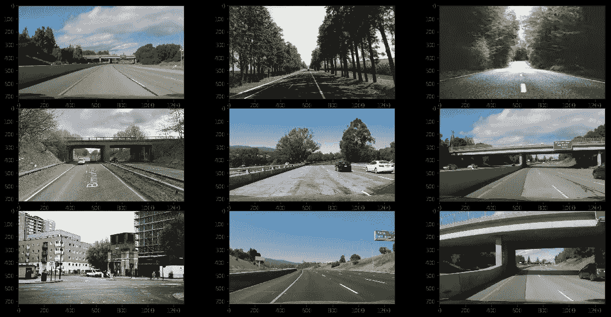**

**original images**

**将雪添加到图像中真的可以帮助自动驾驶汽车工程师让汽车理解，在雪中驾驶是怎样的。下雪和下雨的道路在驾驶时会造成很大的威胁。甚至人类也发现识别路径真的很难，因此训练 CNN 识别路线是很麻烦的。**

**下面是一些由 Automold 生成的带有*新雪*和*雨*的图像。**

**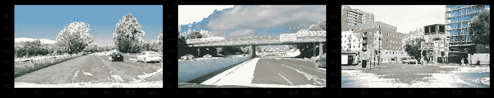**

**adding snow**

**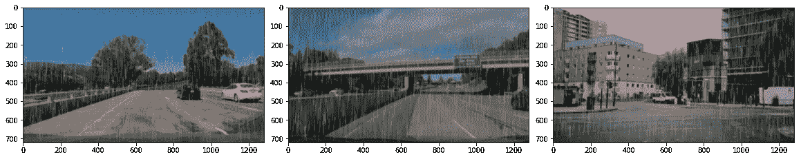**

**adding rain**

**雨雪量也是可配置的。有三种雨可供选择，分别是“毛毛雨”、“大雨”和“暴雨”。如果你不想做太多的配置，只需设置雨的类型，你就可以了。如果你想让图像或多或少有点阴影，你可以通过设置相应的系数来使图像变暗或变亮，也可以选择随机值。**

**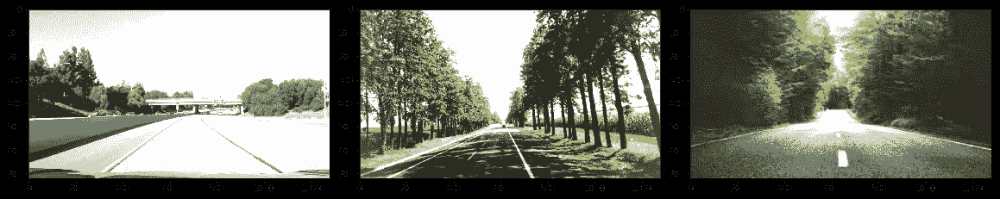**

**brightened images**

**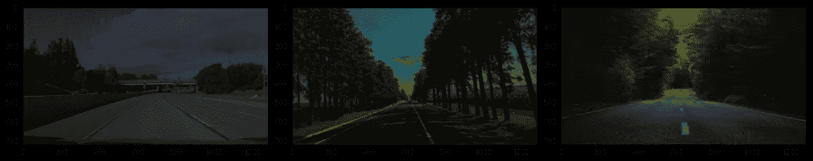**

**darkened images**

**这不需要进入 OpenCV 颜色通道和修改像素值。你也不需要遍历你的图像列表，并在每个图像上调用函数。不管是一张图片还是整个图片列表，只要把它传递给函数就行了。整件事就像:**

```
bright_images= am.brighten(images)
```

**除此之外，如果你想在道路上引入阴影或砾石，Automold 可以帮助你立即做到这一点。然而，同时允许您做各种配置。定义感兴趣区域或指定引入多少砾石块有时会非常方便。如果你不想配置，你可以使用默认值。**

**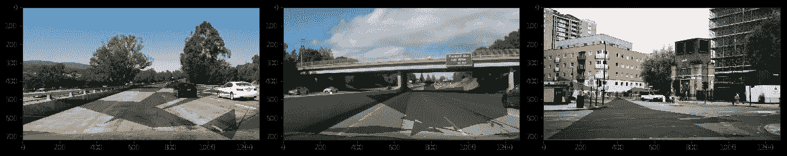**

**random shadows on road**

**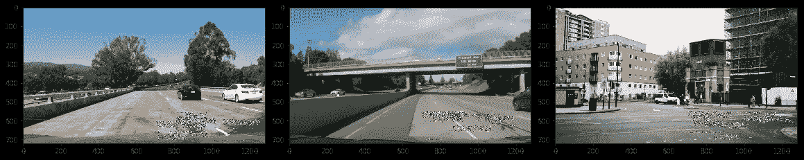**

**gravel patches on road**

**引入雾或太阳耀斑也非常容易，而且是可配置的。雾的强度，太阳耀斑的位置，耀斑的颜色，角度等。可以设置为创建所需的效果。**

**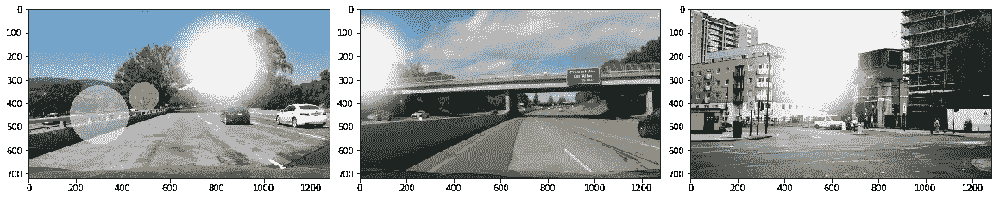**

**adding sun flare**

**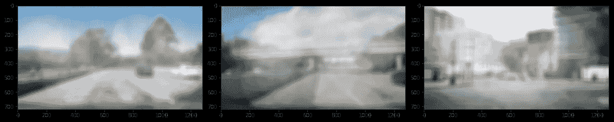**

**adding fog**

**此外，还有两个新增加的库，允许我们添加速度运动和秋天的图像。运动模糊实际上是一个东西，当你开快车时就会发生。道路上远处的位置清晰可见，但当它们靠近时就模糊了。**

**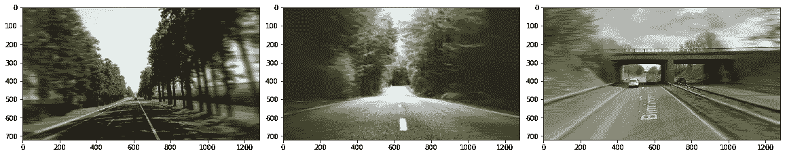**

**adding speed**

**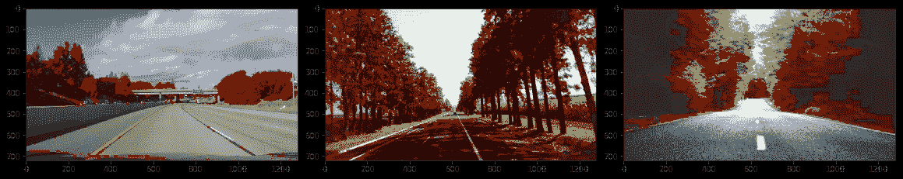**

**adding autumn**

**让树叶变成红色和橙色可能不是描述秋天的最佳方式，但仍然是人工复制这种效果的最接近的方式。尽管我仍在考虑一种更好、更健壮的方法来这样做。因此，有许多功能供您使用，可以帮助您放大专门针对道路的图像。但是，难道没有一种更好的方法来进行增强，而不是手动调用这些函数吗？嗯，是的！！您只需输入以下命令即可:**

```
aug_images= am.augment_random(images)
```

**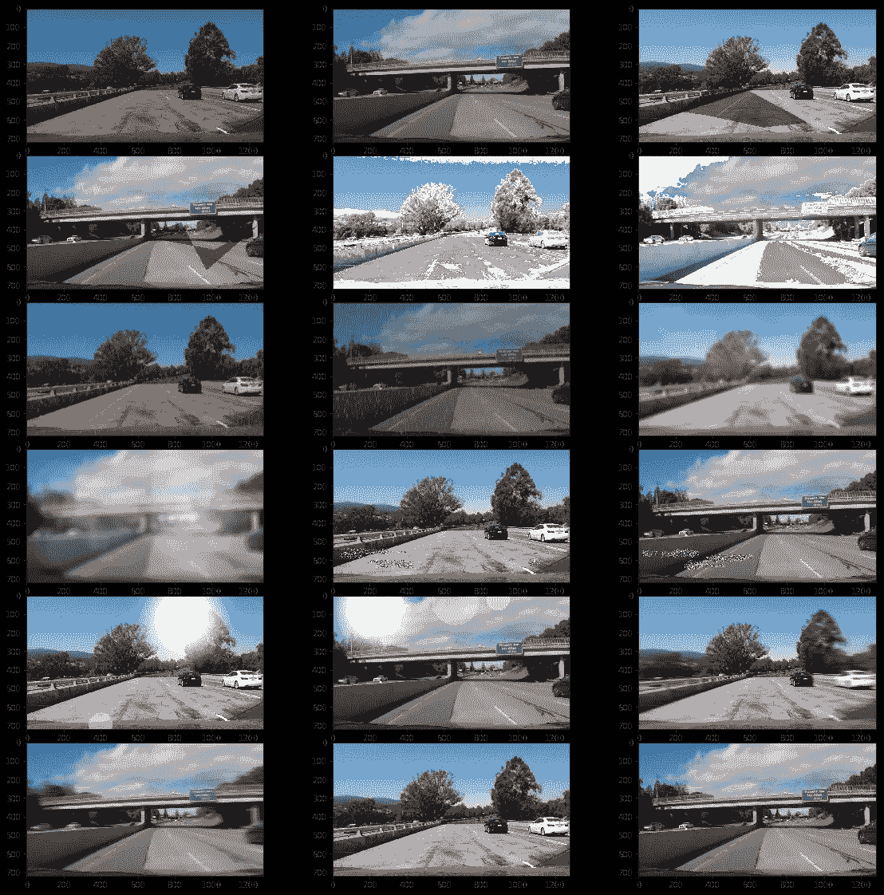**

**该函数在输入图像上应用一组增强，并将整个增强代码减少到只有一行。**

**你可以在我的 [Github 简介](https://github.com/UjjwalSaxena)上找到文档和库代码以及其他自动驾驶汽车项目，更多我的文章请访问 [Medium](https://medium.com/@er.ujjwalsaxena) 或 [Wordpress](https://erujjwalsaxena.wordpress.com/) 。**