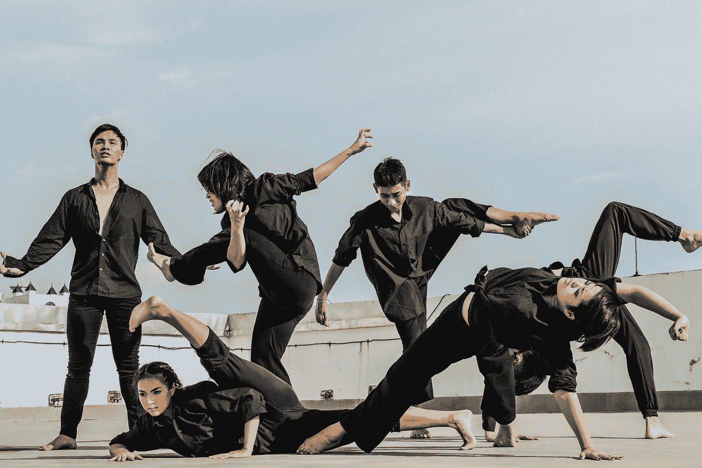
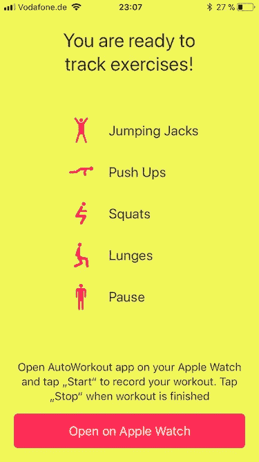
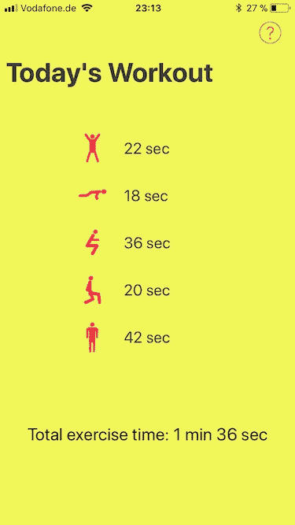
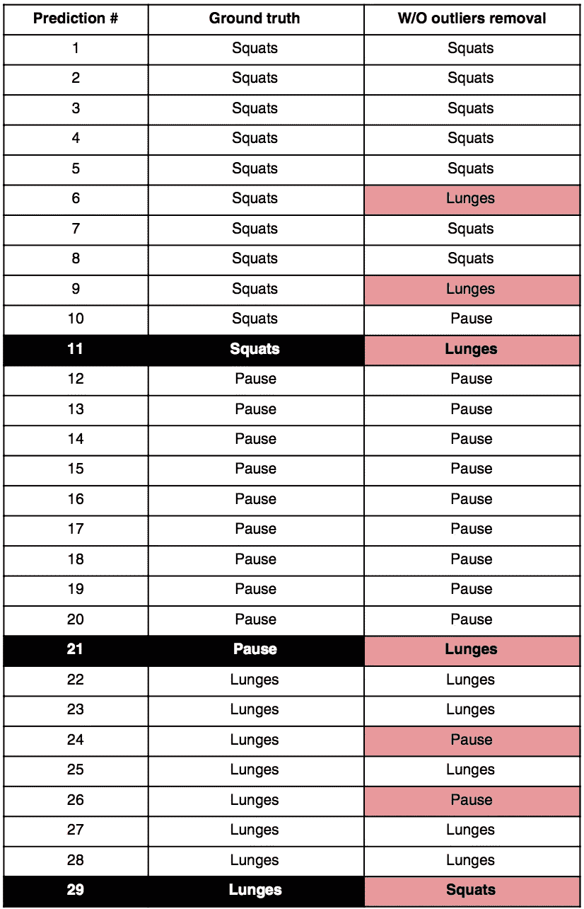
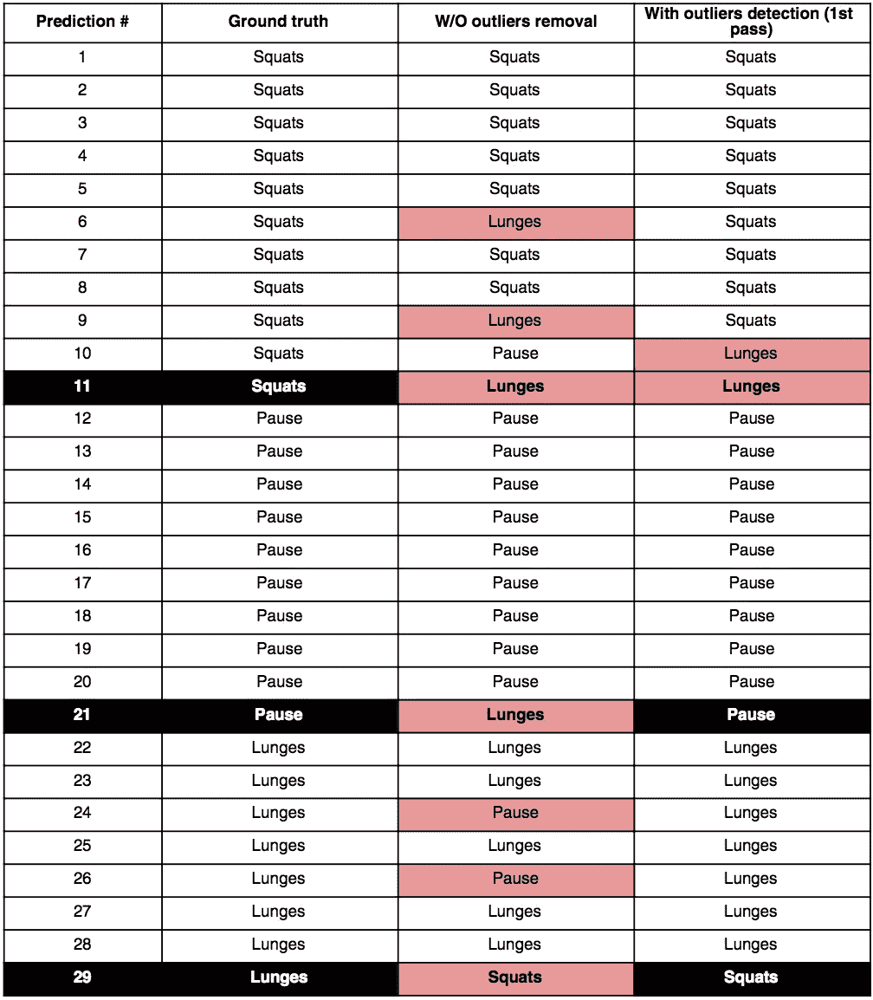
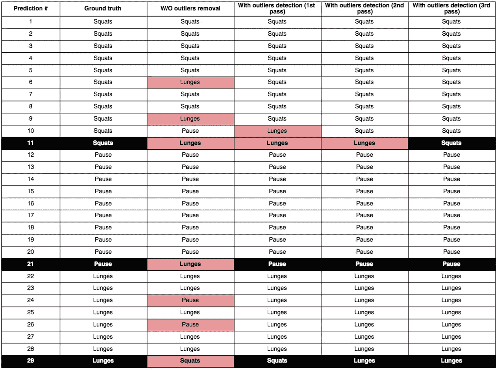

# AutoWorkout:如何改进运动活动分类器预测？

> 原文：<https://towardsdatascience.com/autoworkout-how-to-improve-motion-activity-classifier-predictions-d047feead616?source=collection_archive---------9----------------------->

最近我开始开发[自动锻炼](https://itunes.apple.com/us/app/autoworkout/id1314314336) iOS/WatchOS 应用程序。它自动识别健身运动，并提供每次运动花费的时间和重复次数(在未来的版本中)。这款应用的想法自然源于我第一次尝试[通过机器学习](/run-or-walk-detecting-user-activity-with-machine-learning-and-core-ml-part-1-9658c0dcdd90)识别运动活动类型，首先是[收集运动数据](/run-or-walk-part-2-collecting-device-motion-data-the-right-way-58a277ff2087)，[设计神经网络分类器](/run-or-walk-part-3-99-accuracy-neural-network-classifier-for-detecting-motion-activity-675e16af4a7d)，然后[在核心 ML](/run-or-walk-part-4-using-keras-neural-network-classifier-in-ios-with-core-ml-a29723ab3235) 的帮助下在 iOS 应用中利用它。

在这篇文章中，我有意跳过应用程序实现细节，专注于使运动活动分类器预测有用，因为这是最具挑战性的问题。

# 没有 UI 才是最好的 UI

在将预先训练好的模型导入 AutoWorkout 之前，我非常确定它们会在预测健身运动方面做得很好。他们确实这样做了，但各有各的方式。在这里，我将离开一点，描述我是如何识别运动活动的。

由于手腕可穿戴设备能够提供足够的传感器数据来预测人类的运动活动，而且我已经专注于 iOS/Watch OS 开发，所以我选择 Apple Watch 作为我的应用程序的目标设备。由于 WatchOS 支持 Core ML，我可以直接在 Apple Watch 上运行分类器，避免 iOS 和 Watch OS 之间昂贵且不总是可靠的通信，以传输传感器数据，从而在 iPhone 上进行预测。iOS 应用程序主要包含 UI 演示代码，以显示正在 Apple Watch 上收集和计算的锻炼统计数据。

我是拥抱*的粉丝，没有 UI 是最好的 UI* 方法，因此 WatchOS 应用程序中唯一的 UI 元素是“开始”和“停止”按钮。只需点击“开始”，开始锻炼，做你的练习，并在结束时点击“停止”。你所有的练习都会被认可，每一次花费的时间会被计算出来，重复次数会被记录下来。

Interface of the Apple Watch app

Workout statistics

# 预训练神经网络分类器

为了使这一切成为可能，我需要利用预训练的分类器，这些分类器每隔 1.7 秒根据传感器数据进行预测。注意到“量词”了吗？是的，我需要一个传感器数据来源——X、Y、Z 加速度计——总共 3 个分类器，每个分类器实时预测 5 种活动(跳跃、俯卧撑、下蹲、弓步和练习之间的暂停)。

在无数个小时调整他们的性能后，我最终获得了可接受的精确度:

*   x 轴分类器:89.09%
*   y 轴分类器:85.01%
*   z 轴分类器:81.66%

对于今天的分类问题来说，这些数字可能看起来并不令人印象深刻，但是考虑到我所受的时间和数据收集的限制，我发现它们相当不错。

# N 个分类器，N 个观点

在我将分类器集成到应用程序中后，很明显它们能够预测健身运动，我必须检查这些预测的质量。

理想情况下，应用程序应该记录，比如说一个俯卧撑练习，如果所有 3 个分类器都预测这是一个俯卧撑练习。在现实生活中，我有不到 5%的情况下，所有 3 个模型都预测同一类。在几乎 50%的情况下，3 个模型中的 2 个模型的预测是匹配的。另外 45%的病例是所有 3 个模型预测的不同类别。

当你有三个数据来源，并且它们告诉你不同的事情时，不容易做出决定，对吗？这是机器学习环境中的一个众所周知的问题，在机器学习环境中，存在不止一个分类器，并且存在利用由多个来源提供的预测的技术。

# 投票

在分类机器学习问题中*投票*可能是从多个预测中导出单个类别的最简单也是最强大的方法。在实施投票算法时，你问自己的第一个问题是，它将是*多数投票*还是*加权投票*？

在我的案例中，很明显*模型 X* 具有最高的准确性，但是根据地面事实标签进行的测试表明*模型 X* 预测 A 类(这是不正确的)和*模型 Y* 和 *Z* 都预测 B 类(并且是正确的)的情况并不少见。因此，我不能只给 *model X* 在*投票*中最大的影响力，并使用*加权投票—* 它必须是*加权*和*多数投票*的混合来涵盖这种情况。

虽然，在现实生活中的测试表明，如果至少有一个模型预测“暂停”类，用户有非常高的概率确实在那一刻暂停。

所有这些观察给了我一套简单的规则，供我在投票算法中考虑:

1.  如果一个模型预测“暂停”，记录“暂停”
2.  如果≥ 2 个模型预测“A”类，记录“A”
3.  如果所有模型预测不同的类别，使用来自*模型 X* 的预测

看，规则#2 实现了*多数投票*方法，而规则#3 利用了*加权投票*方法，通过给予*模型 X* 在不确定时期被选择的权利。

在投票算法被纳入分类管道后，我能够主观和客观地注意到预测变得正确且不那么混乱了。

# 离群值随处可见

然而，最终用户可以看到的锻炼统计数据仍然不完美:在锻炼期间没有执行的锻炼到处出现。

这一切都感觉有一些改进的空间，我开始将投票算法做出的预测与地面真相进行比较。当我知道我做了 15 秒长的*深蹲*，之后停顿 20 秒，然后是 30 秒的*弓箭步*时，在一次锻炼中，这 3 个动作中应该没有其他的训练项目。

Cells with red background contain incorrect predictions. Rows with a black background and bold text are latest exercises of each kind in a row.

在上面的例子中，你可以看到用户不太可能在一直做*深蹲*的同时做几个*深蹲*动作(第 6、9、11 行)，也不太可能在做*深蹲*时多次做*暂停*或*深蹲*(第 24、26、29 行)。第 21 行告诉我们，与地面事实相比，弓箭步检测得太早。

当然，也可能有例外，人们可以按照他们想要的任何顺序和序列进行练习，这使得检测异常(最有可能是不正确的预测)的问题几乎根本无法解决。

然而，我做了一个有根据的猜测，并决定设计一个算法，该算法将从给定锻炼时段的所有预测数组中检测并移除异常预测。

# 没有要检测的单一模式

当谈到任何人类活动时，很难挑出会在用户之间重复的模式。所有人都是独一无二的，每个人的锻炼方式都不一样。

我很难推导出这种异常预测检测算法的规则，因为异常预测*和*的可变性实在太大了。但是有了预测的基础，我可以发现最常见的模式来检测异常值，并得出以下规则:

1.  如果当前预测与下一个预测相同，则什么也不做。
2.  如果当前预测与先前预测相同，则不采取任何措施。
3.  如果前一个和下一个预测都不等于当前预测，则使用前一个预测。

查看在执行一次算法后，它如何帮助消除第 6、9、21、24、26 行中的红斑:

然而，异常值去除算法在第 10 行引入了另一个红点，也没有解决第 11 行的问题，因此我决定多次应用相同的算法:

通过对我所拥有的练习模式进行实验，我发现对由投票算法产生的“原始”预测进行 3 次算法传递就足以去除大部分异常值，并使结果预测尽可能接近真实情况。

为了获得对算法的更大信心，我进行了一项测试，同时比较了仅应用投票算法的预测与异常值检测算法 3 次通过后获得的预测的基本事实的标准偏差:

*   “原始”预测与基本事实的标准偏差:15.41
*   从异常值检测算法获得的预测值与真实值的标准偏差:8.09

预测准确率提高了近 2 倍，不错！

# 结论

当然，在一些极端情况下，离群值检测算法会对原始数据产生扭曲，使一项或另一项锻炼持续几秒钟以上，但尽管如此，在分类器不能提供足够准确性的情况下，它在使锻炼统计数据看起来足够方面做得很好。

投票算法也是分类管道的重要补充，因为没有单一的分类器可以在检测健身运动中提供接近理想的准确性。

这两种方法使 AutoWorkout 应用程序能够更准确地检测运动活动，并提供更好的用户体验。

在 [Medium](https://medium.com/@vmalyi) 和 [Twitter](https://twitter.com/victormalyy) 上关注我，看看 AutoWorkout 应用程序如何使用机器学习来计算锻炼次数。