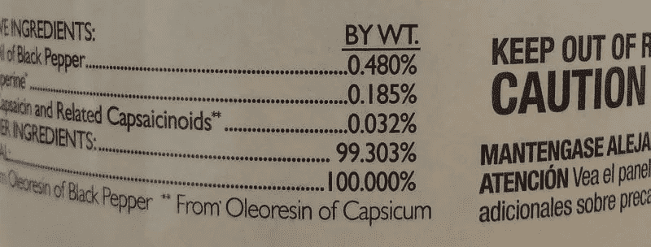

# 避免以错误的精确度呈现产品测试结果

> 原文：<https://towardsdatascience.com/avoid-presenting-product-test-results-with-false-precision-a42a71b30e57?source=collection_archive---------0----------------------->



我开始写这篇博文是因为我不断看到 A/B 类产品测试的结果被引用到小数点后两位的演示文稿，即使产生这些数据的样本量相当小。我最终重写了很多次，因为我试图吸收和反复误解这些测试背后的数学。最后，我得出了一个相当简单的结论:

# 泰勒:博士

在一个典型的测试中，测量数字产品**上某件事情发生的百分比，引用超过一位小数的结果几乎是不合适的。**要自信地引用精确到百分之一的数字，需要大量的样本。为了更好地交流结果，请计算与测量相关的置信区间，并将数字表示为一系列似是而非的值。

# 对单一数字的信心

暂时忘掉“A/B”这个方面。让我们想象一下，对一些简单的事情，比如点击网站上某个按钮的访问者数量，进行一次单独的测量。我们对 10，000 名访问者进行了抽样调查，发现其中 984 人点击了按钮。然后，你可能会天真地把它表示为 9.84%。

但是想想这个数字意味着什么。如果你说某样东西是“9.84”，那么这意味着它不是 9.83 或 9.85。如果你选择了一个不同的 10，000 个访问者的样本，你仍然会发现其中有 984 个点击了按钮。这当然不太可能。

如果您选择 10，000 个不同的样本，您预计会有多少点击量？这取决于我们有多确信我们的抽样计数或**点估计值**接近全部访问者的“真实”潜在比率。这种单点估计的**置信区间**可以计算如下[1，2]:

```
**p̂ = ∓ Z √(p̂(1-p̂)/n)**
```

其中，p̂是点估计值(即 984)，n 是样本大小，z 是与我们寻求的**置信水平**相关的数字。

“信心水平”是什么意思？这是相当微妙的。置信区间是分布在点估计值两侧的一系列值，根据这些数据，整个总体的“真实”值可能在这个区间内。置信水平设置了间隔应该有多宽。

普遍接受的实验标准是寻求 95%的置信水平。这意味着，如果我们取 20 个样本，那么 20 次中有 19 次，点估计的置信区间将覆盖真实的总体值。鉴于我们在这里是定位按钮而不是治疗疾病，90%置信度的较低标准似乎被广泛接受为 A/B 测试的默认标准，这意味着 10 次中有 9 次与估计值相关的区间将包含真实值。

对于不同的置信水平，Z 的值可以代入上面的公式:

```
**Confidence Level   Z (approx)
----------------   ----------
   99%                2.58
   95%                1.96
   90%                1.69**
```

假设在 10，000 个样本中有 984 次点击，对于 90%的置信度，我们得到:

```
**0.0984 ∓ 1.69 √(0.0984(1-0.0984)/10000) = 0.0984 ∓ 0.005**
```

因此，9.8%的测量值与+/- 0.5%的置信区间相关，我们认为真实值可能在 9.3%到 10.3%的范围内。你可以看到，以 0.5%的间隔，引用中心测量值到百分之一是愚蠢的。

我们需要多少数据来证明一个引用到百分之二小数的数字？为此，我们需要一个不超过 0.005%或 0.00005 的置信区间。重新排列公式，我们会得到 n 的值，大约是 1 亿。这就是你需要多少数据来证明一个百分比的两位小数。

## 参考文献和注释

1.  Bryan Gumm，[A/B 测试背后的度量和统计数据](http://dx.doi.org/10.1002/9781119176459.app2)。
2.  Beaulieu-Prévost，D. (2006) [《置信区间:从统计显著性测试到置信区间、范围假设和实质影响](http://dx.doi.org/10.20982/tqmp.02.1.p011)，心理学定量方法教程，2(1)，11–19。
3.  这里假设 n 大于 5，大到足以使用二项式分布的[正态近似。数字环境中的任何测试都应该通过这个数量级。](https://en.wikipedia.org/wiki/Binomial_distribution#Normal_approximation)