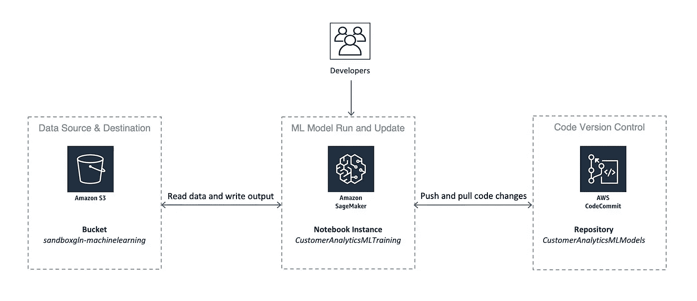
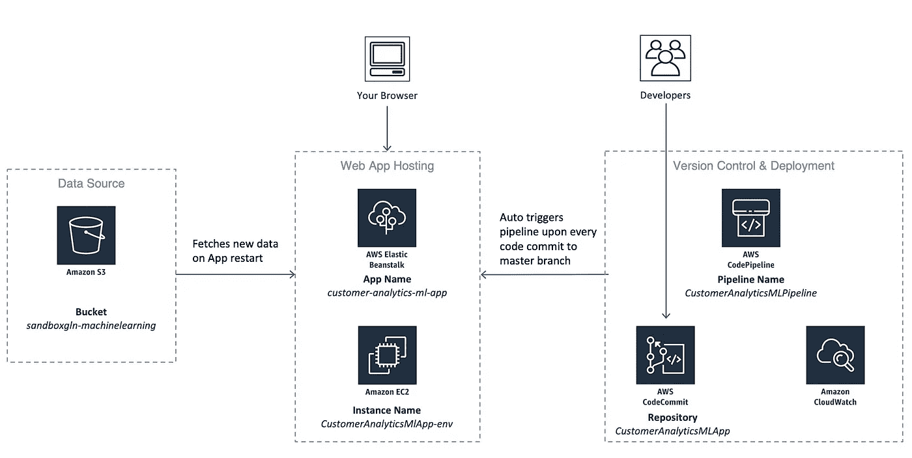

# 适用于您的机器学习解决方案的 AWS 架构

> 原文：<https://towardsdatascience.com/aws-architecture-for-your-machine-learning-solutions-a208ece806de?source=collection_archive---------6----------------------->

## 利用 AWS 支持的销售智能 ML 渠道推动数百万的收入

Photo by [Franck V.](https://unsplash.com/@franckinjapan?utm_source=medium&utm_medium=referral) on [Unsplash](https://unsplash.com?utm_source=medium&utm_medium=referral)

# 前言

在为我们的客户公司设计企业级解决方案时，我面临的一个常见挑战是缺乏关于真实世界架构用例的在线参考。

> 您会发现大量关于如何开始学习个别技术的教程，当您的关注点仅限于特定的框架或服务时，这些教程非常有用。为了评估现有的各种方法，并预先确定将这些方法捆绑在一起的含义，你要么必须找到一个以前走过这条路的人，要么自己冒险进行一次独立的实验。

这就是为什么我决定开始分享我自己在为多家财富 200 强公司和新兴创业公司设计和开发技术解决方案时收集的一些见解。希望今天的用例能够帮助您为您的机器学习解决方案规划 AWS 架构。

Photo by [Tim Gouw](https://unsplash.com/@punttim?utm_source=medium&utm_medium=referral) on [Unsplash](https://unsplash.com?utm_source=medium&utm_medium=referral)

# 这项事业

最近，我参与了为北美最大的钢铁制造商之一开发机器学习解决方案。

> 该公司希望利用 ML 的力量来深入了解客户细分、订单预测和产品数量建议。

本文围绕我们为什么以及如何利用 AWS 来部署我们的可交付成果，以便销售团队可以根据这些见解采取行动，而不需要通过复杂的技术障碍，并且让任何未来想要在公司内部增强它的数据科学家或工程师无缝地开始。

# 打嗝

从第一天开始，我们必须考虑的一个主要因素是，开发的解决方案最终会交给一个没有计算机科学背景的团队。是的，你没看错。

> 另一端最接近数据科学家的人是 IT 部门的人，他以前编程过，但没有调试完整的机器学习笔记本的能力。

因此，自动化是我们设计中的一个关键——不仅能够交付打包的解决方案，还能够交付自动化的管道，这种管道可以在非程序员之间进行自我维护，而不需要每周进行人工干预。

# 这些碎片

我不会详细讨论实现的细节*(为了防止“40 分钟读取”标签出现)*，但是我会给你一个涉及到的各种活动部分的细目分类。

*   数据源
*   机器学习和数据工程笔记本
*   使用 Python Flask 构建的 Web 应用程序
*   自动化流水线

# **服务**

以下是我们使用的 AWS 服务，根据它们服务的区域进行分类，并简要概述了它们的用法。下面的图表直观地解释了这个架构，但是我建议通读这一部分，特别是如果你不知道这些服务是做什么的话。

## 数据源和目标

*   **S3:** 大容量数据存储旨在从任何地方存储和检索任意数量的数据。这就是我们用来训练模型的数据湖所在的地方。运行模型后，一个额外的 S3 存储桶足够我们存储临时和最终的输出。
*   **Athena:** 允许您使用普通的 SQL 查询来查询 S3 对象系统中的数据文件。这有助于快速浏览数据和分析行，而不必每次都打开 Jupyter 笔记本。我们还使用 Athena APIs 在笔记本中提取数据。

## 代码版本控制

*   **CodeCommit:** 亚马逊的 git 版本，用于版本控制和协作。我们使用了两个独立的存储库——一个用于 ML 和数据工程笔记本，另一个用于 Web 应用。

## 数据工程和机器学习

*   **Amazon SageMaker:** 平台，使开发人员和数据科学家能够构建、训练和部署任何规模的机器学习模型。这是执行数据工程和机器学习的笔记本运行的地方。如果您已经在本地 Anaconda 实例中进行了开发，那么完全没问题，您可以在 SageMaker 中运行这些笔记本，不会有任何问题。我们使用了一个 m5.4xlarge (16 个 vCPUs，64 GB RAM)实例用于我们的培训目的，每小时大约花费一美元。每个数据工程周期处理大约 70 GB 的数据，它需要大约两个小时来端到端地运行并为 ML 笔记本电脑生成可用的文件。您可以以此为参考来决定是否需要放大或缩小实例。

> 完成模型训练后，关闭 SageMaker 实例是很重要的，因为费用会很快增加。这是为什么您的最终序列化模型输出应该存储在其他地方的另一个原因，比如在 S3，而不是 SageMaker 的附加 EBS 实例。不要担心，当您启动 SageMaker back up 时，它会将您的更改恢复到您在新实例中的位置。

## Web 应用程序部署

*   **Elastic Beanstalk:** 部署和扩展使用各种语言和服务器端框架构建的 web 应用程序的服务。它初始化了部署 web 应用程序所需的所有其他必要的 AWS 服务，包括下面描述的 EC2 和 CloudWatch。在我们的例子中，这是部署 Python Flask 应用程序的地方。一个没有自动缩放的 t2.large (2 个 vCPUs，8gb RAM)EC2 实例对我们来说已经足够了，因为它将在内部使用。如果你预计流量很大，你可以使用 Beanstalk 的自动缩放功能，它会根据网络流量自动添加和删除服务器实例，这太棒了！
*   **CodePipeline:** 持续交付服务，帮助您自动化发布渠道，实现快速可靠的应用和基础设施更新。我们使用它来自动将合并到 CodeCommit 存储库主分支的最新代码更改推送到 Web 应用程序的实时版本。

## 幕后的其他服务

*   **EC2:** 在云中提供安全、可调整计算能力的 Web 服务。基本上，把它们想象成云上的虚拟机。其他 AWS 服务，如 Elastic Beanstalk 和 SageMaker 利用这一服务来满足他们的计算需求。
*   **CloudWatch:** 监控和管理服务提供数据和见解来监控您的应用，并触发自动化流程。由利用它的 AWS 服务管理，在这种情况下不需要人工干预。

# 建筑

> 自动化是我们设计中的一个关键——能够交付一个打包的解决方案，它可以在非程序员中自行处理，而不需要每周人工干预。

Machine Learning and Data Engineering

上图概述了机器学习和数据工程方面的 AWS 部署架构。如您所见，SageMaker 实例是开发人员和数据科学家主要工作的地方。笔记本拉和推数据，并直接输出到 S3 桶。如果数据驻留在其他数据库系统中，您可以随时将数据源更改为其他数据库系统。代码(即笔记本)本身实际上位于 CodeCommit 存储库中。您可以在 SageMaker 实例中克隆这个存储库，以便定期将您的更改提交给它。如果你只是玩玩，你确实可以选择在 SageMaker 中直接创建或上传笔记本，但是强烈建议你为任何严肃的开发工作准备一个版本控制系统。

Web Application

这向您展示了 web 应用程序部署的架构。web 应用程序所依赖的数据和序列化的 ML 模型存放在 S3 桶中。部署 web 应用程序的弹性 Beanstalk 实例在应用程序重启时获取新数据，并将其存储在本地系统中。这对我们来说很好，因为文件不是很大，保存在本地节省了频繁往返 S3 的时间和成本。但是如果您正在获取大量数据，您可能需要重新考虑它。

CodeCommit 中托管的 web 应用程序存储库由 CodePipeline 持续监控(code pipeline 有一个 CloudWatch 服务在幕后运行，用于监控存储库中的更改)。在我们的例子中，任何时候，新的变更被合并到主分支中，新的版本被 CodePipeline 服务自动提取并部署到 Beanstalk 实例中。

# 问题和反馈？

我希望这能够让你明白如何利用 AWS 服务来生产你的机器学习解决方案。我计划根据我围绕应用程序开发、大数据和机器学习所开发或遇到的内容，写更多关于这一系列架构用例的文章。请让我知道你对这篇文章的想法，以及你希望我写更多的什么样的主题。

感谢你的阅读！

**是时尚科技初创公司*[***Qarece***](https://www.qarece.com/)***&***[***hack wears***](https://hackwears.com/)**以及开源电子商务框架* [的创建者之一他还为多家美国财富 500 强公司担任顾问，这些公司都是技术负责人、数据科学家和高级全栈工程师，涉及从应用开发到大数据分析和机器学习的项目。](https://veniqa.com)**

## **加入 EJ 的邮件列表，这样就能收到新故事的通知！❤**

## **如果你已经读过，并且喜欢一个媒介上的故事，请鼓掌👏！它鼓励作者多写，并让你成为读者。❤**

## **你可能会喜欢 EJ 的其他文章**

** [## 6 分钟学会 hip lot——脸书用于机器学习可视化的 Python 库

### 高维互动情节变得简单。实践教程。

medium.com](https://medium.com/@viveckh/learn-hiplot-in-6-mins-facebooks-python-library-for-machine-learning-visualizations-330129d558ac)  [## 10 分钟学会元流——网飞的数据科学 Python/R 框架

### 花更多时间建模，花更少时间管理基础架构。实践教程。

towardsdatascience.com](/learn-metaflow-in-10-mins-netflixs-python-r-framework-for-data-scientists-2ef124c716e4)  [## 在 10 分钟内建立一个量子电路。Qiskit，IBM 用于量子编程的 Python SDK

### 学习量子力学的基本概念，在真实的量子上使用 Python 构建和执行量子电路…

medium.com](https://medium.com/@viveckh/build-a-quantum-circuit-in-10-mins-ft-qiskit-ibms-sdk-for-quantum-programming-75435b99ee9e)  [## 为什么我的创业公司从未上线，尽管它已经有了可以投入生产的技术

### 技术型联合创始人的 6 个关键咒语。

medium.com](https://medium.com/swlh/why-my-startup-never-went-live-despite-a-production-ready-tech-55d344c0c057)**