# AWS SageMaker:人工智能的下一个游戏规则改变者

> 原文：<https://towardsdatascience.com/aws-sagemaker-ais-next-game-changer-480d79e252a8?source=collection_archive---------2----------------------->

今天 [AWS SageMaker](https://aws.amazon.com/sagemaker/) 发布，是**牛逼**。我在以前的文章中提到过，我们主要为客户进行 AWS 部署。[较小的模型适合数字海洋水滴](/deep-learning-with-digitalocean-redux-e6f447e64c75)，但是 CNN 和 word 嵌入模型确实需要 GPU 和大量 RAM。这将是另一篇技术文章，向您展示为什么今天的发布是一件大事。

让我们快速进入闪亮的新 SageMaker 服务，感受一下它能做什么。这是冰山一角。

## 逐步运行笔记本电脑:

首先登录您的 AWS 控制台:

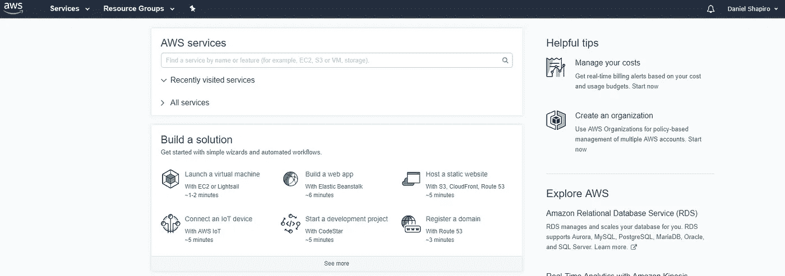

接下来，跳到 SageMaker [快速启动页面](https://console.aws.amazon.com/sagemaker)来创建一个笔记本实例:

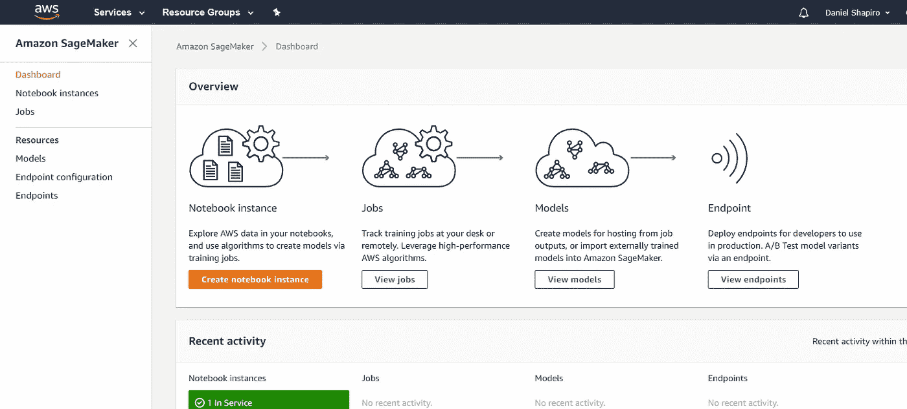

让我们在 ml.t2.medium 实例上运行笔记本本身。在 IAM 角色下，使用向导创建可以访问您的数据的角色。当然，定义一个加密密钥。

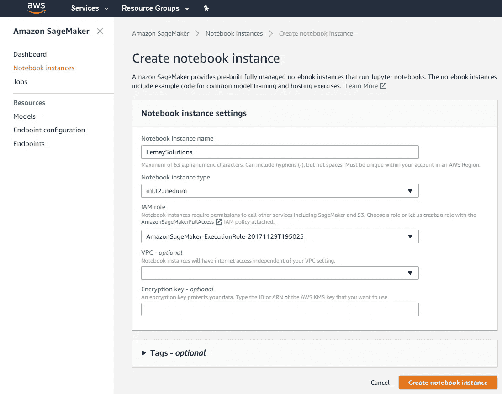

一旦你的笔记本创建完成，只需点击**打开**动作，熟悉的 jupyter 笔记本环境就出现了。

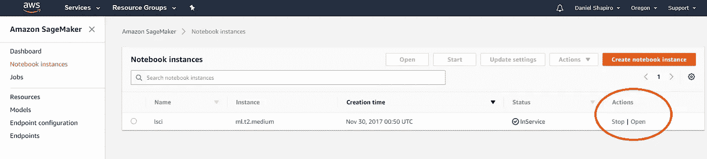

以下是您应该看到的内容:

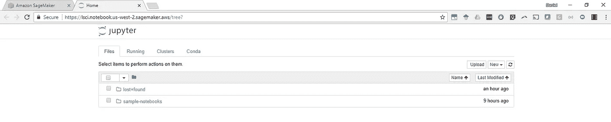

要在大脑中验证系统是否安全，只需在一个匿名窗口中尝试访问笔记本的 URL，您将会看到该会话未通过身份验证。没错。可以继续了。

在 sample-notebooks 文件夹中有很多例子。确保您有一个 S3 存储桶来连接到上面定义的 IAM 角色可以访问的这些笔记本。我们的桶名是“lemaysolutions-demo”，因此在笔记本“notebooks/sample-notebooks/sage maker-python-SDK/1P _ k means _ high level/k means _ mnist . ipynb”中将桶引用更改为您的 S3 桶的正确名称。该模型旨在从 Yann LeCun 著名的 [MNIST 数据集中识别手写数字。](http://yann.lecun.com/exdb/mnist/)

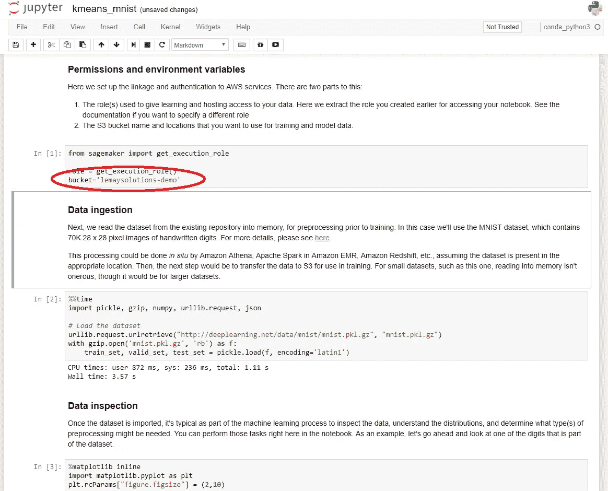

Make sure the text where the red circle is has the name of your S3 bucket.

好的。因此，运行前几个单元格，您应该会看到如下结果:

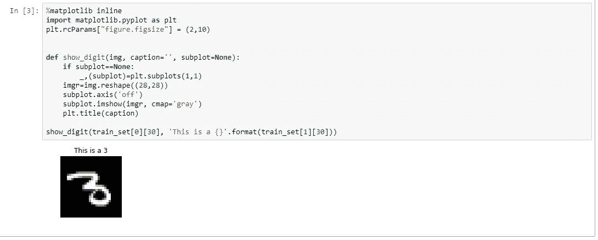

数据存储在您的 S3 存储桶中，如下所示:

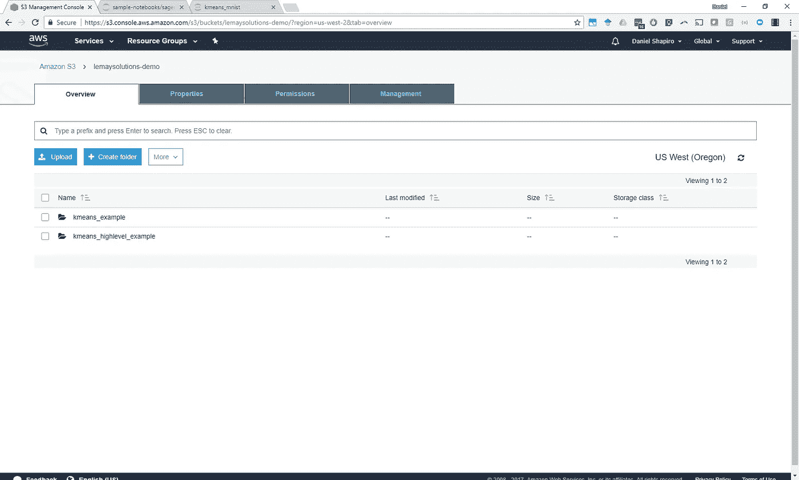

请注意，培训实例是在代码中按需提供的(疯狂！)并且是 ml.c4.8xlarge 实例。它会运行一段时间，所以请耐心等待。

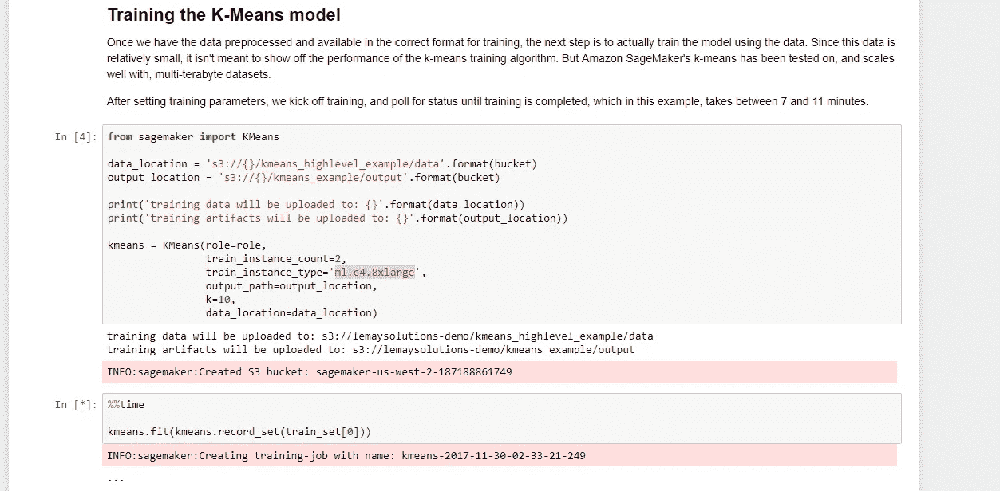

Provisioning jobs from code on demand. I think the mind blowing I just had got brain all over my keyboard.

文档显示培训工作需要“7 到 11 分钟”，而实际上手机上的计时器显示该工作需要 6 分 32 秒！

Don’t worry if you see lots of red. These are just INFO messages, not crashes.

为训练好的模型设置主机也通过编程[完成](https://en.wiktionary.org/wiki/programmatically)。文档显示还有 7 到 11 分钟的设置时间，结果更像是 12 分 39 秒。这里有个提示。如果笔记本的图标上有圆点，说明它正在运行。

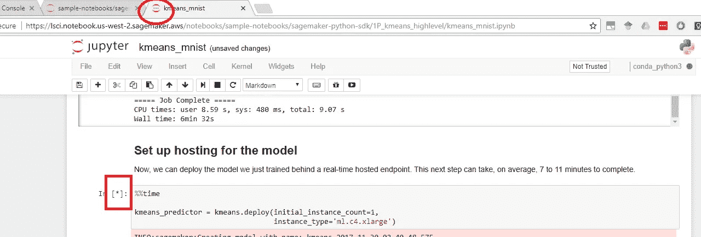

The three [grey](http://grammarist.com/spelling/gray-grey/) dots in the red circle I added to the picture indicate something is running in the notebook. The star in the red square tells you that this is the cell that’s running.

这是数据集上模型的输出。在非常基本的意义上，这 10 个聚类表示 K-means 分类器根据它们的相似性将这些数字分组为 10 堆的结果。通过观察形状，你可以直观地看出这个系统不费吹灰之力就做得不错。

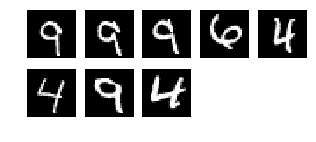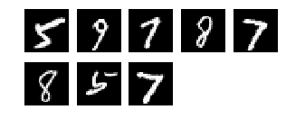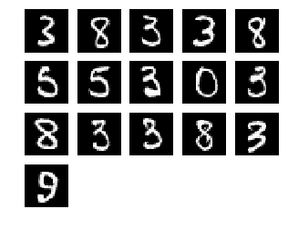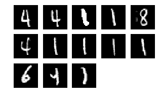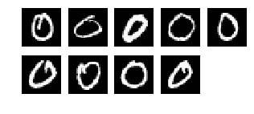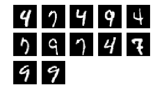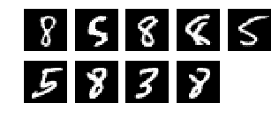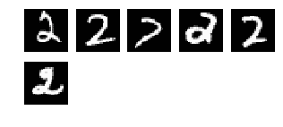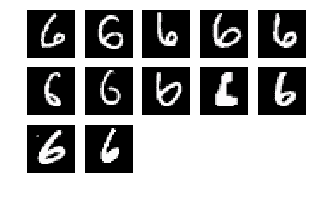

The results of the model are quite nice. We see the same digits being confounded in the [embedding demo of TensorFlow’s TensorBoard](https://www.tensorflow.org/versions/r0.12/how_tos/embedding_viz/).

在一天结束时，您应该已经创建了一个 S3 存储桶、一个笔记本实例、一个作业和一个经过训练的模型。

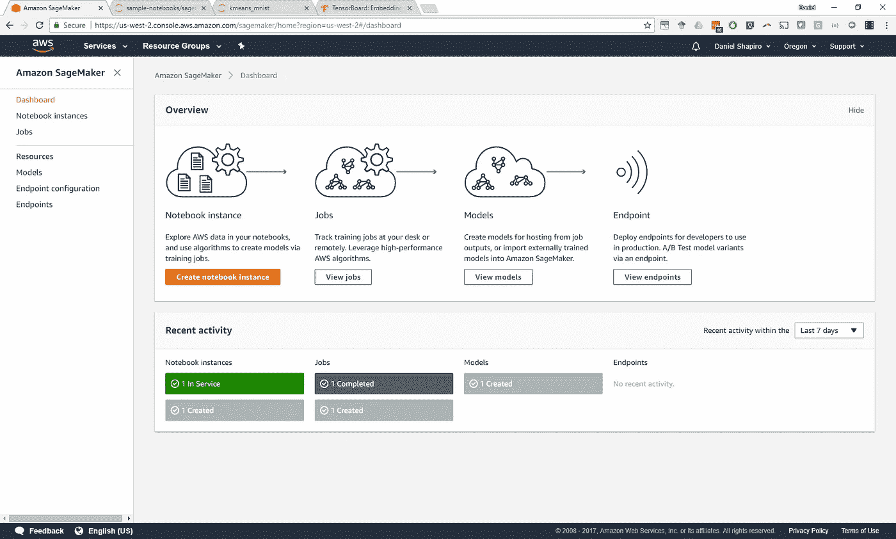

总之，AWS SageMaker 非常棒。这将彻底改变我们的咨询方式。我们都致力于快节奏的开发并尽早展现价值，SageMaker 帮助我们在第一天就做到这一点。亚马逊甚至没有付钱让我说出来😜。

如果你喜欢全新的 AWS SageMaker 上的这篇文章，可以看看我过去阅读量最大的一些文章，比如“[如何为人工智能项目定价](https://medium.com/towards-data-science/how-to-price-an-ai-project-f7270cb630a4)”和“[如何聘请人工智能顾问](https://medium.com/towards-data-science/why-hire-an-ai-consultant-50e155e17b39)”除了与商业相关的文章，我还准备了一些关于寻求采用深度机器学习的公司所面临的其他问题的文章，如“[没有云和 API 的机器学习](https://medium.com/@lemaysolutions/locked-in-a-box-machine-learning-without-cloud-or-apis-76cc54e391c8)

编码快乐！

-丹尼尔
[丹尼尔@lemay.ai](mailto:daniel@lemay.ai) ←打个招呼。
[LEMAY . AI](https://lemay.ai)
1(855)LEMAY-AI

您可能喜欢的其他文章:

*   [人工智能和不良数据](/artificial-intelligence-and-bad-data-fbf2564c541a)
*   [人工智能:超参数](/artificial-intelligence-hyperparameters-48fa29daa516)
*   [人工智能:让你的用户给你的数据贴上标签](https://medium.com/towards-data-science/artificial-intelligence-get-your-users-to-label-your-data-b5fa7c0c9e00)