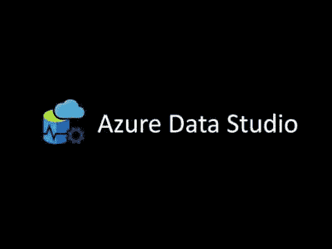
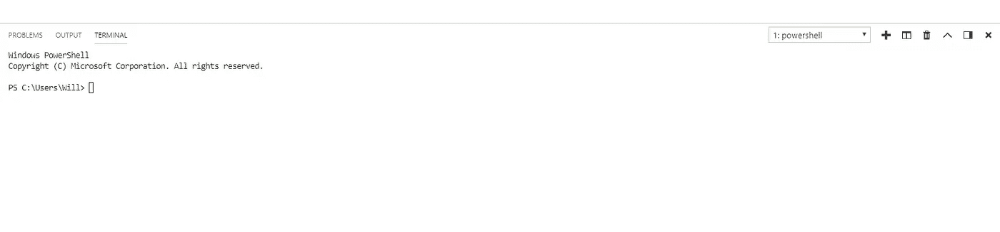
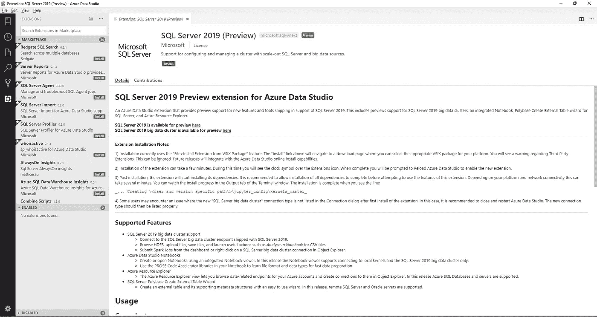
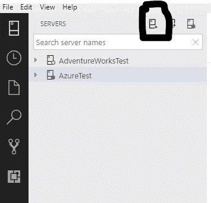
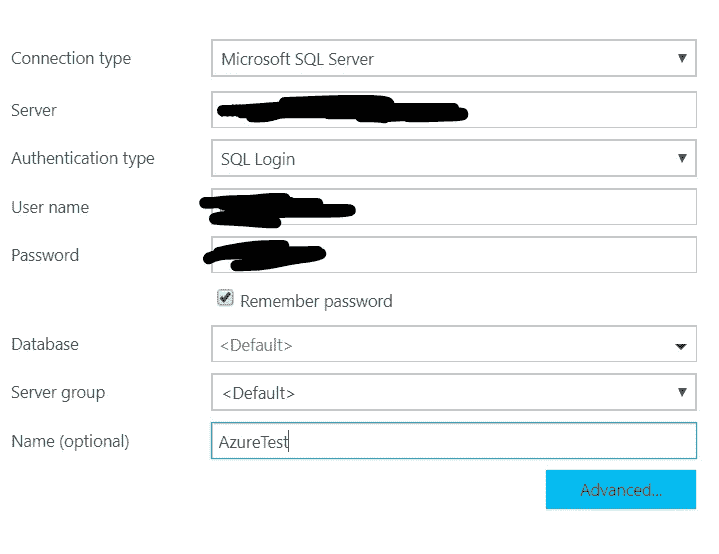
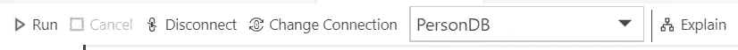
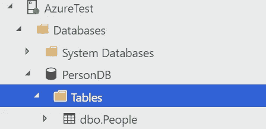
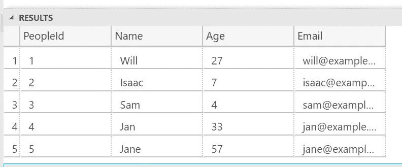
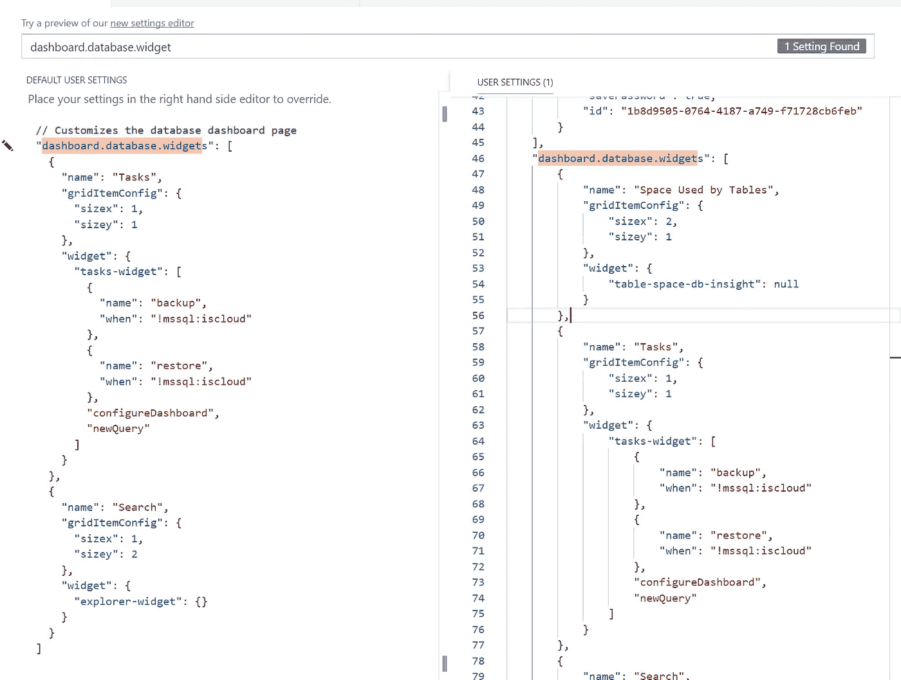
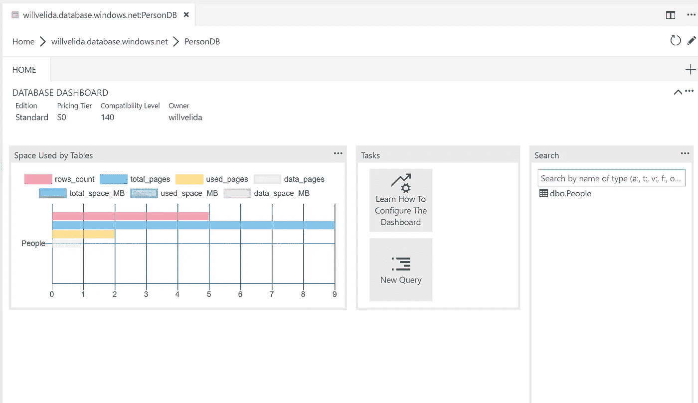

# Azure Data Studio:初步想法和演练

> 原文：<https://towardsdatascience.com/azure-data-studio-initial-thoughts-and-walk-through-905d25daf62b?source=collection_archive---------19----------------------->



在微软 Ignite 上，Azure Data Studio 已经全面上市。Azure Data Studio 以前被称为 SQL Operations Studio，是一个跨平台的数据库工具，可以用来管理本地和云数据源。

当我第一次[安装](https://docs.microsoft.com/en-gb/sql/azure-data-studio/download?view=sql-server-2017)并运行 Azure Data Studio 时，我对它的最初印象是它几乎是一个 Visual Studio 数据代码。它带有智能感知、代码片段、源代码控制集成和一个集成终端。

Azure Data Studio 中支持 Git，但是您需要安装 2.0.0 版或更高版本才能使用它。

与 Visual Studio 代码非常相似，您可以同时运行多个集成的终端，而不是在每次想要执行一些命令行工作时切换出编辑器:



All the terminals!

Windows 10 中的终端默认使用 Powershell，而 Linux 和 macOS 使用$SHELL。点击可以了解更多关于终端[的配置。](https://docs.microsoft.com/en-gb/sql/azure-data-studio/integrated-terminal?view=sql-server-2017)

还支持扩展。Azure Data Studio 中的扩展允许我们向基础安装添加更多功能，就像 Visual Studio 代码一样。你也可以[开发自己的扩展](https://docs.microsoft.com/en-gb/sql/azure-data-studio/extension-authoring?view=sql-server-2017)，这非常棒！



让我们通过一个简单的教程来连接和查询 Azure SQL 数据库。我将假设您知道如何在 Azure 中创建数据库。如果没有，可以按照[这个教程](https://docs.microsoft.com/en-gb/sql/azure-data-studio/download?view=sql-server-2017)来入门。

打开 Azure Studio 开始使用。如果这是你第一次运行 Azure Data Studio，你会自动看到一个连接页面打开。如果没有，您可以通过单击服务器侧边栏中的图标来添加新连接(见下文):



Azure Data Studio 支持 SQL 登录和 Windows 身份验证。我使用过 SQL 登录，所以我需要提供我的服务器名、用户名和密码。



(*注意:确保您在 Azure 中为您的服务器启用了* [*防火墙规则*](https://docs.microsoft.com/en-gb/azure/sql-database/sql-database-firewall-configure) *。如果你不这样做，你可以在 Azure Data Studio 中通过一个简单的 UI 向导来完成。相当酷！)*

登录后，让我们创建一个数据库和一个要使用的表。右键单击您的服务器并选择**新查询**。在查询编辑器中，运行以下 SQL 代码:

```
IF NOT EXISTS (
    SELECT name
    FROM sys.databases
    WHERE name = N'PersonDB'
)CREATE DATABASE [PersonDB]
GOALTER DATABASE [PersonDB] SET QUERY_STORE=ON
GO
```

一旦我们的数据库被创建，我们想改变我们的数据库到 PersonBD。我们可以使用下拉菜单来完成此操作:



然后，我们可以通过运行以下代码来创建人员表:

```
IF OBJECT_ID('dbo.People', 'U') IS NOT NULL
DROP TABLE dbo.People
GOCREATE TABLE dbo.People
(
   PeopleId INT NOT NULL PRIMARY KEY,
   Name [NVARCHAR](50) NOT NULL,
   Age INT NOT NULL,
   Email [NVARCHAR](50) NOT NULL
);
GO
```

我们可以在服务器侧栏中看到我们的新表:



现在让我们在新表中插入一些行:

```
INSERT INTO dbo.People
 ([PeopleID], [Name], [Age], [Email])
VALUES
  (1, N'Will', 27, N'will@example.com'),
  (2, N'Isaac', 7, N'isaac@example.com'),
  (3, N'Sam', 4, N'sam@example.com'),
  (4, N'Jan', 33, N'jan@example.com'),
  (5, N'Jane', 57, N'jane@example.com')
GO
```

最后，我们可以查询它以查看其内容:

```
SELECT * FROM dbo.People;
```

我们应该会看到以下结果:



既然我们已经创建了表并在其中插入了一些数据，现在让我们通过创建一个 insight 小部件来管理我们的数据库，它为我们提供了表在数据库中使用了多少空间的视图。

与 Visual Studio 代码非常相似，我们可以使用命令面板快速查找内容。要打开它，按下 **Ctrl+Shift+P.** 打开后，输入*设置*，选择**首选项:打开用户设置。**

我们将看到一个 JSON 文件和一个搜索输入框一起打开。在这里，键入 *dashboard* 并找到*dashboard . database . widgets*设置:



在默认用户设置中找到该设置后，您需要点击铅笔图标并选择**复制到设置**。如果设置中显示替换，请**不要点击它！**

当您将设置复制到您的**用户设置**文件中时，您想要添加以下 JSON:

```
{          
   "name": "Space Used by Tables",
   "gridItemConfig": {
           "sizex": 2,
           "sizey": 1          
    },          
    "widget": {              
        "table-space-db-insight": null          
    }      
},
```

右键单击您的 **PeopleDB** 并单击**管理**，保存您的设置并打开您的数据库仪表板。您应该会在控制面板中看到以下小部件:



现在，您可以通过使用过滤等方式，使用该洞察力图表来获得不同的洞察力。

一旦你使用完你的资源，你可以自由地回到 Azure 并清理掉你不再需要的资源。

正如你所看到的，Azure Data Studio 是一个非常棒的工具，可以让数据工程师管理本地和云数据源。就我个人而言，我迫不及待地想看到这个产品如何随着社区的投入而发展。

如果你想查看源代码，这里有 [GitHub repo。](https://github.com/Microsoft/azuredatastudio)同样，你也可以在这里看到[发布说明](https://docs.microsoft.com/en-gb/sql/azure-data-studio/release-notes?view=sql-server-2017)。