# 深度学习背景去除

> 原文：<https://towardsdatascience.com/background-removal-with-deep-learning-c4f2104b3157?source=collection_archive---------0----------------------->

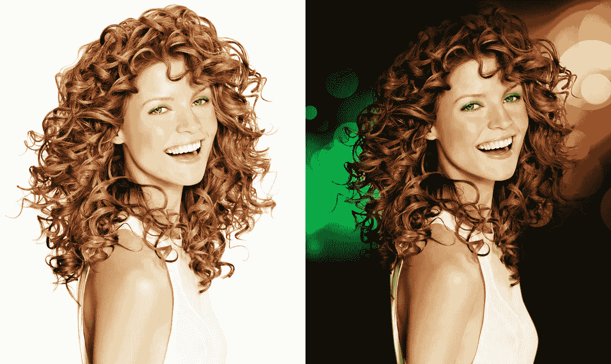

> 这篇文章描述了我们在绿色屏幕上的工作和研究。AI 。我们很乐意听到想法和评论——在[推特](https://twitter.com/shgidi)、 [Linkedin](https://www.linkedin.com/in/gidi-shperber-9623a916/) 上

> 也可以看看我们的网站—[www.shibumi-ai.com](https://www.shibumi-ai.com/)

## 介绍

在过去几年的机器学习中，我一直想打造真正的机器学习产品。
几个月前，服用了伟大的 [Fast 之后。AI](http://www.fast.ai/) 深度学习课程，看起来就像星星排成一行，我有机会:深度学习技术的进步允许做许多以前不可能的事情，新的工具被开发出来，使部署过程比以往任何时候都更容易。
在前面提到的课程中，我遇到了 [Alon Burg](https://medium.com/@burgalon/35648f9dc5fb) ，他是一位经验丰富的 web 开发人员，我们合作追求这个目标。我们共同为自己设定了以下目标:

1.  提高我们的深度学习技能
2.  提高我们的人工智能产品部署技能
3.  根据市场需求制造有用的产品
4.  (为我们和我们的用户)享受乐趣
5.  分享我们的经验

考虑到上述情况，我们正在探索以下想法:

1.  尚未完成(或未正确完成)
2.  计划和实施不会太难——我们的计划是 2-3 个月的工作，每周一个工作日。
3.  将有一个简单而吸引人的用户界面——我们想做一个人们会使用的产品，而不仅仅是为了演示的目的。
4.  将随时可以获得训练数据——正如任何机器学习从业者都知道的那样，有时数据比算法更昂贵。
5.  将使用尖端的深度学习技术(谷歌、亚马逊和朋友们在其云平台上尚未商品化)，但不会太尖端(因此我们将能够在网上找到一些例子)
6.  将有可能达到“生产就绪”的结果。

我们早期的想法是从事一些医学项目，因为这个领域非常贴近我们的内心，我们觉得(现在仍然觉得)在医学领域有大量容易实现的深度学习成果。然而，我们意识到我们将会遇到数据收集的问题，也许还有合法性和监管的问题，这与我们保持简单的意愿相矛盾。我们的第二个选择是**背景去除**产品。

如果你使用某种“标记”和边缘检测，手动或半手动(Photoshop，甚至 Power Point 都有这样的工具)去除背景是一项非常容易的任务，见[这里](https://clippingmagic.com/)一个例子。然而，全自动背景去除是一项相当具有挑战性的任务，据我们所知，仍然没有产品能取得令人满意的结果，尽管有些人做了[尝试](http://www.logitech.com/en-us/product/c922-pro-stream-webcam)。

我们将移除什么背景？这被证明是一个重要的问题，因为一个模型在物体、角度等方面越具体。分离的质量就越高。在开始我们的工作时，我们想的很大:一个通用的背景去除器，它将自动识别每种类型的图像中的前景和背景。但是在训练了我们的第一个模型之后，我们明白了将我们的努力集中在一组特定的图像上会更好。因此，我们决定以自拍和人像为主。

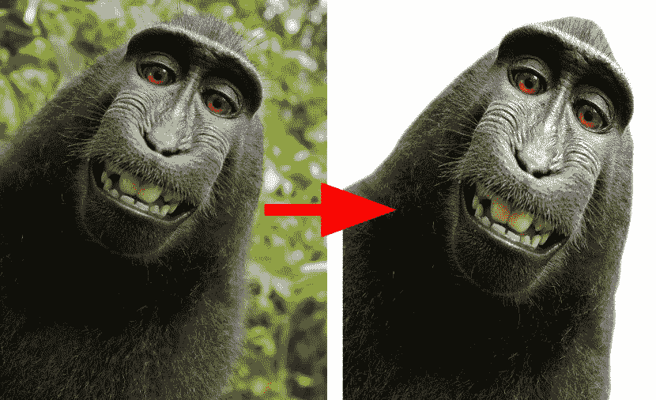

Background removal of (almost) human portrait

自拍是一种具有突出和聚焦前景的图像(一个或多个“*人*”)，保证我们在物体(面部+上半身)和背景之间有良好的分离，以及相当恒定的角度，并且总是同一物体(*人*)。

考虑到这些假设，我们开始了研究、实施和数小时培训的旅程，以创建一个易于使用的一键式背景移除服务。

我们工作的主要部分是训练模型，但是我们不能低估正确部署的重要性。好的细分模型仍然不如分类模型紧凑(例如[**【SqueezeNet】**](https://arxiv.org/abs/1602.07360)),我们积极研究了服务器和浏览器部署选项。

如果你想了解更多关于我们产品部署过程的细节，欢迎你查看我们在[服务器端](https://medium.com/@burgalon/35648f9dc5fb)和[客户端](https://medium.com/@burgalon/2e5a29589ad8)的帖子。

如果你想了解这个模型和它的训练过程，继续下去。

# 语义分割

当检查与我们相似的深度学习和计算机视觉任务时，很容易看出我们的最佳选择是*语义分割*任务。

其他策略，如[深度检测分离](https://arxiv.org/pdf/1507.06821.pdf)也存在，但对我们的目的来说似乎还不够成熟。

**语义分割**是一项众所周知的计算机视觉任务，与分类和对象检测并列为三大任务之一。从将每个像素分类到一个类别的意义上来说，分割实际上是一个分类任务。与图像分类或检测不同，分割模型真正显示了对图像的一些“理解”，不仅说“在这个图像中有一只猫”，而且在像素级别上指出猫在哪里以及是什么。

那么分段是如何工作的呢？为了更好地理解，我们将不得不考察这一领域的一些早期作品。

最早的想法是采用一些早期的分类网络，如 **VGG** 和 **Alexnet** 。 **VGG** 是 2014 年图像分类的最新模型，由于其简单明了的架构，现在非常有用。当检查 VGG 早期层时，可能会注意到在要分类的项目周围有高激活。更深的层具有更强的活性，然而由于重复的汇集作用，它们本质上是粗糙的。记住这些理解，假设分类训练也可以通过一些调整用于发现/分割对象。

语义分割的早期结果与分类算法一起出现。在这篇[文章](http://warmspringwinds.github.io/tensorflow/tf-slim/2016/11/22/upsampling-and-image-segmentation-with-tensorflow-and-tf-slim/)中，你可以看到一些使用 **VGG** 得到的粗略分割结果:

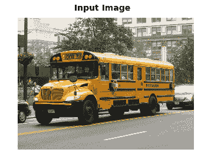

后期图层结果:

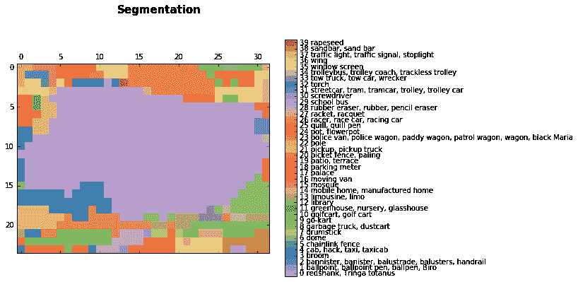

Segmentation of the buss image, light purple (29) is school bus class

双线性上采样后:

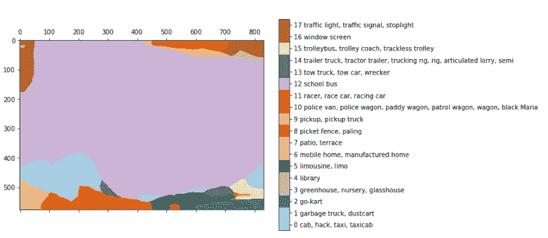

这些结果来自于仅仅将完全连接的层转换(或保持)成它的原始形状，保持它的空间特征，得到一个完全卷积的网络。在上面的例子中，我们将一个 768*1024 的图像放入 VGG，得到一个 24*32*1000 的图层。24*32 是图像的合并版本(乘 32 ), 1000 是图像网络类计数，从中我们可以导出上面的分割。

为了平滑预测，研究人员使用了一个简单的双线性上采样层。

在 FCN 的论文中，研究人员改进了上面的想法。他们沿途连接了一些层，以允许更丰富的解释，根据上采样率，这些层被命名为 FCN-32、FCN-16 和 FCN-8:

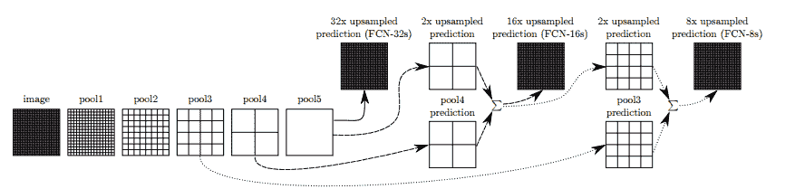

在层之间添加一些跳跃连接允许预测从原始图像中编码更精细的细节。进一步的训练进一步提高了成绩。

这种技术表明自己并不像想象的那么糟糕，并证明了深度学习在语义分割方面确实有潜力。

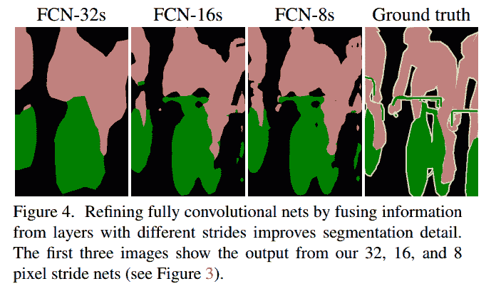

FCN results from the paper

FCN 解开了分段的概念，研究人员为此尝试了不同的架构。主要思想保持相似:使用已知的架构、上采样和使用跳过连接在较新的模型中仍然很突出。

你可以在一些好的帖子中读到这方面的进展:这里，[这里](https://blog.athelas.com/a-brief-history-of-cnns-in-image-segmentation-from-r-cnn-to-mask-r-cnn-34ea83205de4)和[这里](https://meetshah1995.github.io/semantic-segmentation/deep-learning/pytorch/visdom/2017/06/01/semantic-segmentation-over-the-years.html)。您还可以看到，大多数架构都保留了编码器-解码器架构。

# 回到我们的项目

在做了一些研究后，我们选定了三种模型:FCN、 [Unet](https://arxiv.org/pdf/1505.04597.pdf) 和[提拉米苏](https://arxiv.org/abs/1611.09326) —非常深入的编码器-解码器架构。我们也有一些关于 mask-RCNN 的想法，但是实现它似乎超出了我们的项目范围。

**FCN** 似乎并不相关，因为它的结果并不像我们希望的那样好(即使作为一个起点)，但是我们提到的另外两个模型显示了不错的结果:在 [**CamVid**](http://mi.eng.cam.ac.uk/research/projects/VideoRec/CamVid/) 数据集上的提拉米苏，以及 [Unet](https://arxiv.org/abs/1505.04597) 的主要优势是它的紧凑性和速度。就实现而言，Unet 的实现非常简单(我们使用了 keras ),而**提拉米苏**也是可实现的。为了让我们开始，我们在杰瑞米·霍华德*的*伟大的深度学习[课程](https://www.usfca.edu/data-institute/certificates/deep-learning-part-two)的最后一课中使用了提拉米苏的一个很好的[实现](http://files.fast.ai/part2/lesson14/)。

有了这两个模型，我们开始在一些数据集上进行训练。我必须说，在我们第一次尝试提拉米苏后，我们看到它的结果对我们来说有更大的潜力，因为它有能力捕捉图像的清晰边缘。另一方面，unet 似乎不够好，结果似乎有点不太好。


Unet blobbiness

# 数据

在用模型设定了我们的大方向后，我们开始寻找合适的数据集。细分数据不像分类甚至检测那样常见。此外，手动标记实际上是不可能的。最常见的分割数据集是 [COCO](http://mscoco.org/) 数据集，它包括大约 80K 张 90 个类别的图像， [VOC pascal](http://host.robots.ox.ac.uk/pascal/VOC/) 数据集，有 11K 张图像和 20 个类别，以及更新的 [ADE20K](http://groups.csail.mit.edu/vision/datasets/ADE20K/) 数据集。

我们选择使用 COCO 数据集，因为它包含了更多的" *person* "类的图像，这是我们感兴趣的类。

考虑到我们的任务，我们考虑是只使用与我们高度相关的图像，还是使用更通用的数据集。一方面，使用具有更多图像和类别的更通用的数据集将允许模型处理更多的场景和挑战。另一方面，一个通宵的培训课程让我们浏览了大约 15 万张图片。如果我们引入带有整个 COCO 数据集的模型，我们将以模型看到每张图像两次(平均)结束，因此稍微修剪一下将是有益的。此外，它将为我们的目的产生一个更集中的模型。

还有一点值得一提的是——提拉米苏**模型最初是在 [CamVid](http://mi.eng.cam.ac.uk/research/projects/VideoRec/CamVid/) 数据集上训练的，该数据集有一些缺陷，但最重要的是它的图像非常单调:所有图像都是汽车的道路照片。正如你很容易理解的，从这样的数据集中学习(即使它包含人)对我们的任务没有好处，所以在短暂的尝试后，我们继续前进。**

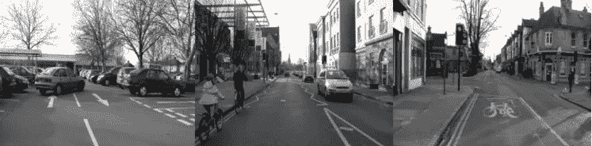

Images from CamVid dataset

COCO 数据集附带了非常简单明了的 API，它允许我们确切地知道每个图像中有什么对象(根据 90 个预定义的类)

经过一些实验后，我们决定稀释数据集:首先，我们只过滤有一个人的图像，给我们留下 40K 的图像。然后，我们丢弃了所有有很多人的图片，只留下一两张，因为这是我们的产品应该找到的。最后，我们只留下了 20%-70%的图像被标记为人物的图像，删除了背景中有一个非常小的人或某种怪异的怪物(不幸的是不是所有人)的图像。我们最终的数据集由 11K 的图像组成，我们觉得在这个阶段已经足够了。

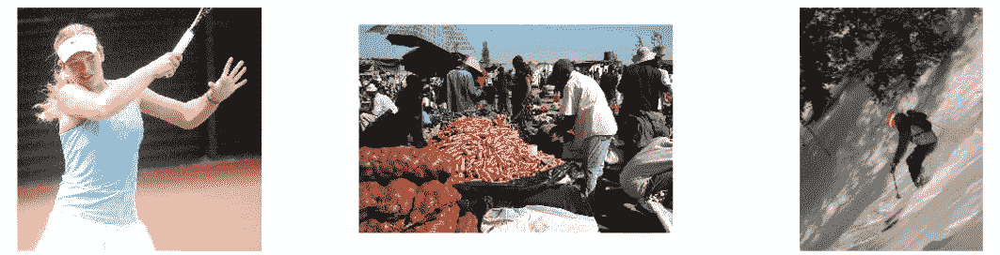

Left: good image ___ Center: too many characters ___ Right: Objective is too small

# 提拉米苏模型

如前所述，我们在杰瑞米·霍华德的课程中被介绍了[](https://arxiv.org/abs/1611.09326)**提拉米苏模型。虽然它的全名“100 层提拉米苏”意味着一个巨大的模型，但它实际上很经济，只有 9M 参数。相比之下，VGG16 的参数超过 130M。**

****提拉米苏**模型基于 **DensNet，**一种最新的图像分类模型，其中所有层都是相互连接的。此外，提拉米苏为上采样层添加了跳过连接，如 Unet。**

**如果你还记得的话，这个体系结构与 FCN 提出的想法是一致的:使用分类体系结构、上采样和添加跳过连接来进行细化。**

**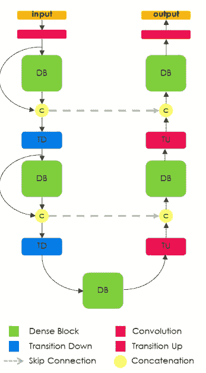**

**Tiramisu Architecture in general**

**[**DenseNet**](https://arxiv.org/pdf/1608.06993.pdf) 模型可以看作是 **Resnet** 模型的自然演变，但是 **DenseNet** 不会“记住”每一层直到下一层，而是记住整个模型中的所有层。这些连接被称为高速公路连接。它导致过滤器数量的膨胀，这被定义为“增长率”。提拉米苏的增长率为 16，因此每一层我们添加 16 个新的过滤器，直到我们达到 1072 层过滤器。你可能期望 1600 层，因为它是 100 层提拉米苏，然而，上采样层丢弃了一些过滤器。**

**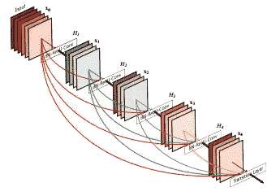**

**Densenet model sketch — early filters are stacked throughout the model**

# **培养**

**我们用原始论文中描述的时间表训练我们的模型:标准交叉熵损失，具有 1e-3 学习率和小衰减的 RMSProp 优化器。我们将 11K 图像分成 70%的训练、20%的验证和 10%的测试。以下所有图片均取自我们的测试集。**

**为了使我们的训练时间表与原始论文保持一致，我们在 500 幅图像上设置了纪元大小。这也允许我们定期保存结果中的每个改进的模型，因为我们在更多的数据上训练它(本文中使用的 CamVid 数据集包含不到 1K 的图像)**

**此外，我们只在两个类上训练它:背景和*人*，而报纸有 12 个类。我们首先尝试在 coco 的一些课上进行训练，但是我们发现这对我们的训练没有太大的帮助。**

## **数据问题**

**一些数据集缺陷阻碍了我们的得分:**

*   ****动物** —我们的模型有时会分割动物。这当然导致欠条低。把动物加到我们的任务中，在同一个主要类中或作为另一个类，可能会删除我们的结果**
*   ****身体部位**——因为我们用程序过滤了我们的数据集，我们没有办法判断 person 类实际上是一个人还是像手或脚这样的身体部位。这些图像不在我们的观察范围内，但仍然到处出现。**

**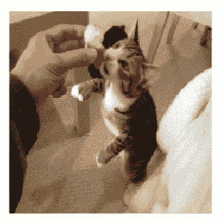**

**Animal, Body part, hand held object**

*   ****手持物体-** 数据集中的许多图像都与运动相关。棒球棒、网球拍和滑雪板随处可见。我们的模型不知何故弄不清应该如何分割它们。在动物的例子中，在我们看来，将它们作为主类的一部分或作为单独的类添加将有助于模型的性能。**

**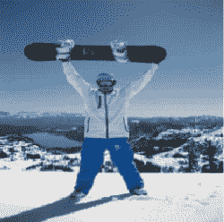**

**Sporting image with an object**

*   ****粗糙地面真相**—coco 数据集没有逐个像素地进行注释，而是用多边形进行注释。有时这已经足够好了，但是其他时候地面实况非常粗糙，这可能会妨碍模型学习细微之处**

**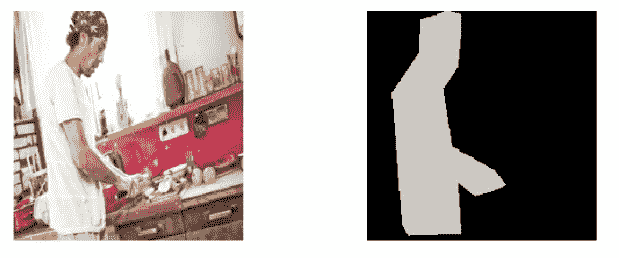**

**Image and (very) Coarse ground truth**

## **结果**

**我们的结果令人满意，尽管并不完美:在我们的测试集上，我们已经达到了 84.6 的 IoU，而当前的技术水平是 85。这个数字很棘手:它在不同的数据集和类中波动。有些类别本身更容易分割，例如房屋、道路，其中大多数模型很容易达到 90 IoU 的结果。其他更具挑战性的类别是树和人，在这些类别上，大多数模型达到大约 60 IoU 的结果。为了衡量这一困难，我们帮助我们的网络集中于单一类别和有限类型的照片。**

**我们仍然不认为我们的工作是“生产就绪”，因为我们希望它是，但我们认为这是一个很好的时间停下来讨论我们的结果，因为大约 50%的照片会给出好的结果。**

**下面是一些很好的例子，让你感受一下应用程序的功能:**

**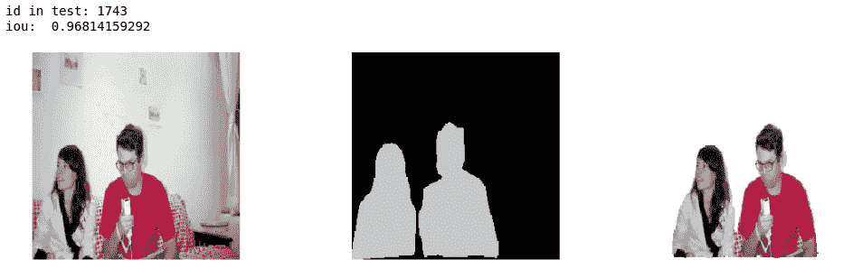****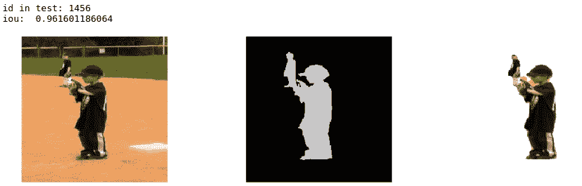****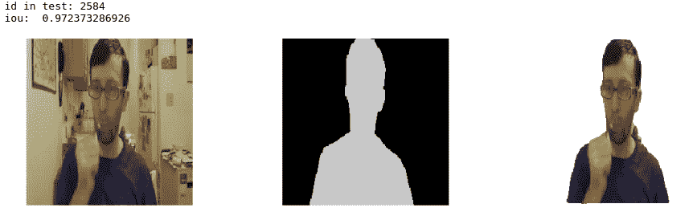**

**Image, Ground truth, our result (from our test set)**

## **调试和日志记录**

**训练神经网络的一个非常重要的部分是调试。在开始我们的工作时，很容易就进入正题，获取数据和网络，开始培训，看看会有什么结果。然而，我们发现跟踪每一步非常重要，为我们自己制造工具，以便能够检查每一步的结果。**

**以下是常见的挑战，以及我们所采取的应对措施:**

1.  ****早期问题** —模型可能没有训练。这可能是因为一些固有的问题，或者是因为某种预处理错误，比如忘记对一些数据块进行规范化。无论如何，简单的可视化结果可能会很有帮助。这里有一个关于这个主题的好帖子。**
2.  ****调试网络本身** —确保没有关键问题后，训练开始，使用预定义的损耗和指标。在分段中，主要的度量是[IoU](http://www.pyimagesearch.com/2016/11/07/intersection-over-union-iou-for-object-detection/)——交集超过并集。我们花了几节课才开始使用 IoU 作为我们模型的主要衡量标准(而不是交叉熵损失)。另一个有用的实践是显示我们的模型在每个时期的一些预测。这里有一个关于调试机器学习模型的好[帖子](https://hackernoon.com/how-to-debug-neural-networks-manual-dc2a200f10f2)。请注意，IoU 不是 keras 中的标准度量/损失，但您可以在网上轻松找到它，例如这里的。我们也使用这个[要点](https://gist.github.com/shgidi/7c3fcf69b1eb3eaf4bac1112d10967ca)来绘制每个时期的损失和一些预测。**
3.  ****机器学习版本控制** —在训练一个模型的时候，有很多参数，有些很难遵循。我必须说，我们仍然没有找到完美的方法，除了热情地写下我们的配置(和用 keras 回调自动保存最佳模型，见下文)。**
4.  ****调试工具**——完成上述所有工作后，我们可以在每一步检查我们的工作，但不是无缝的。因此，最重要的步骤是将上述步骤结合在一起，创建一个 Jupyter 笔记本，使我们能够无缝加载每个模型和每个图像，并快速检查其结果。这样，我们可以很容易地看到模型之间的差异，陷阱和其他问题。**

**下面是通过调整参数和额外训练改进我们模型的一个例子:**

**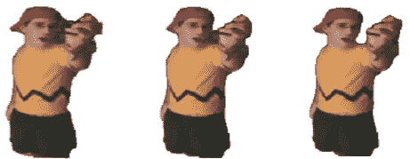**

**对于保存到目前为止具有最佳验证 IoU 的模型:(Keras 提供了一个非常好的[回调](https://keras.io/callbacks/)来使这些事情变得更容易)**

```
callbacks = [keras.callbacks.ModelCheckpoint(hist_model, verbose=1,save_best_only =True, monitor= ’val_IOU_calc_loss’), plot_losses]
```

**除了对可能的代码错误进行正常调试之外，我们还注意到模型错误是“可预测的”，例如“切割”看起来不在通用身体计数器中的身体部分，“咬”大段，不必要的继续延伸身体部分，光线差，质量差，以及许多细节。在添加来自不同数据集的特定影像时，处理了其中的一些警告，但其他警告仍是需要应对的挑战。为了改善下一个版本的结果，我们将在模型的“硬”图像上使用增强。**

**我们已经在上面提到过这个问题，关于数据集的问题。现在让我们看看我们的模型的一些困难:**

1.  **衣服——深色或浅色的衣服有时会被理解为背景**
2.  **“咬”——其他的好结果，有一些咬在里面**

**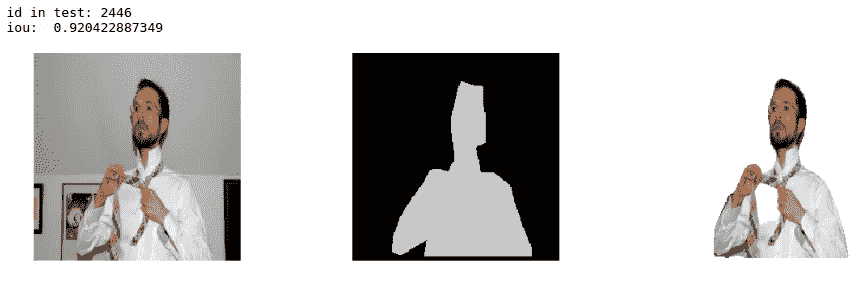**

**Clothing and bite**

**3.光照不足的闪电和昏暗在图像中很常见，但在 COCO 数据集中却没有。因此，除了模型处理这些事情的标准难度之外，我们甚至还没有为更难的图像做好准备。这可以通过获取更多的数据以及数据扩充来改善。同时，最好不要在晚上尝试我们的应用程序:)**

**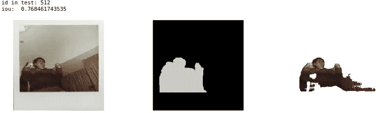**

**poor lighting example**

# **进一步的进展选项**

## ****继续培训****

**我们的生产结果是在对我们的训练数据进行大约 300 个时期的训练后得出的。过了这个时期，模型开始过度拟合。我们在离发布很近的时候得到了这些结果，因此我们还没有机会应用数据扩充的基本实践。**

**在将图像大小调整为 224X224 后，我们对模型进行了训练。使用更多数据和更大图像(COCO 图像的原始大小约为 600X1000)的进一步训练也有望改善结果。**

## **通用报告格式和其他改进**

**在某些阶段，我们看到我们的结果在边缘有点嘈杂。一个可能使这一点更加精确的模型是通用报告格式。在这篇[博文](http://warmspringwinds.github.io/tensorflow/tf-slim/2016/12/18/image-segmentation-with-tensorflow-using-cnns-and-conditional-random-fields/)中，作者展示了一个使用 CRF 的略显幼稚的例子。**

**然而，它对我们的工作不是很有用，也许因为它通常在结果粗糙时有所帮助。**

## ****铺垫****

**即使我们目前的结果，分割是不完美的。头发、精致的衣服、树枝等精细物体永远不会被完美分割，甚至因为地面真实分割不包含这些细微之处。分离这种精细分割的任务被称为抠图，并定义了一个不同的挑战。这里有一个艺术抠图的例子，[在今年早些时候的 NVIDIA 会议上发表了](https://news.developer.nvidia.com/ai-software-automatically-removes-the-background-from-images/)。**

**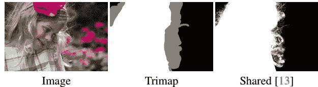**

**Matting example — the input includes the trimap as well**

**抠图任务不同于其他与图像相关的任务，因为它的输入不仅包括图像，还包括**三分图—** 图像边缘的轮廓，这使得它成为一个“半监督”问题。**

**我们尝试了一点抠图，使用我们的分割作为三分图，但是我们没有达到显著的结果。**

**另一个问题是缺乏适当的数据集进行训练。**

# **摘要**

**正如开始所说，我们的目标是建立一个重要的深度学习产品。正如你在 [Alon](https://medium.com/@burgalon) 的帖子中看到的，部署变得越来越容易，越来越快。另一方面，训练一个模型是很棘手的——训练，尤其是在夜间进行的训练，需要仔细的计划、调试和记录结果。**

**在研究和尝试新事物，以及平凡的训练和提高之间取得平衡也不容易。自从我们使用深度学习以来，我们总是有一种感觉，即最佳模型，或我们需要的确切模型，就在眼前，另一个谷歌搜索或文章将带领我们找到它。但是在实践中，我们的实际改进来自于简单地从我们的原始模型中“挤压”越来越多的东西。如上所述，我们仍然觉得有更多的挤压出来。**

**总之，我们在做这项工作时获得了很多乐趣，几个月前，这在我们看来就像科幻小说。我们将很高兴讨论和回答任何问题，并期待在我们的网站上看到你:)**

> **E 喜欢这篇文章吗？想要了解更多信息？参观[www.shibumi-ai.com](https://www.shibumi-ai.com/)**