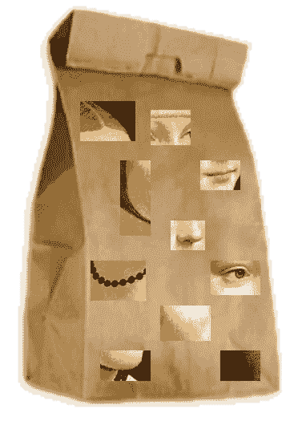
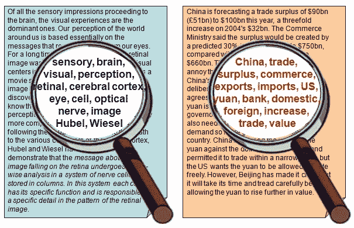
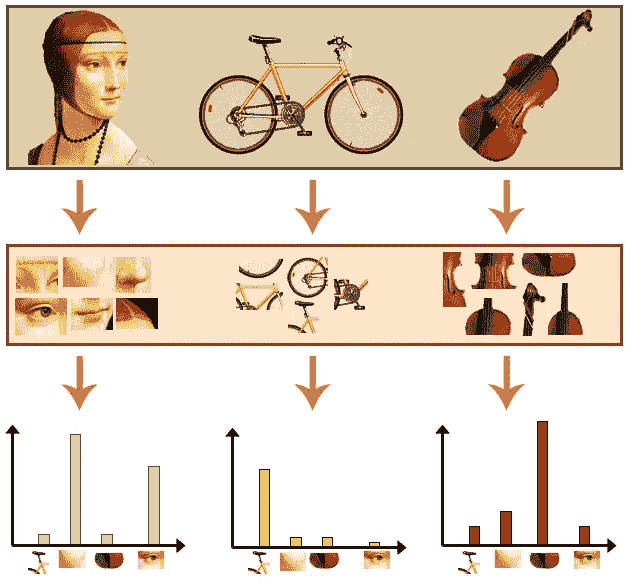
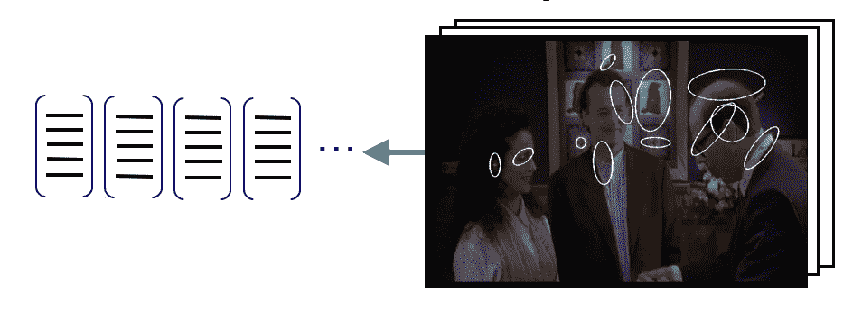
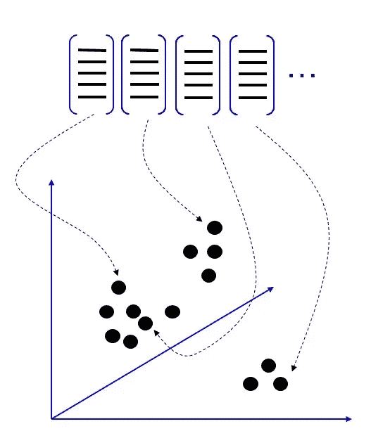
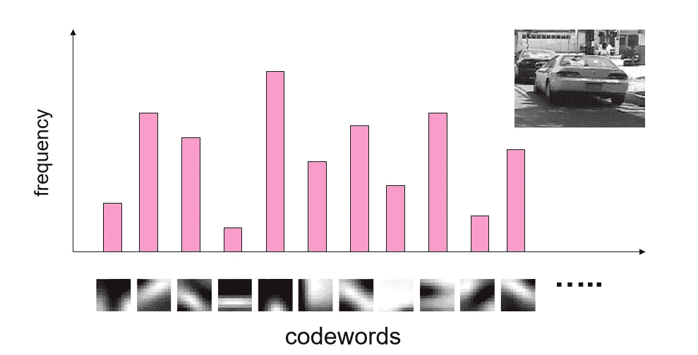

# 一言以蔽之，视觉词汇包

> 原文：<https://towardsdatascience.com/bag-of-visual-words-in-a-nutshell-9ceea97ce0fb?source=collection_archive---------2----------------------->

## 选择重要特征的艺术

Bag-of-visual-words (BOVW)

视觉单词包是图像分类中常用的方法。它的概念改编自信息检索和 NLP 的单词袋(BOW)。在 bag of words (BOW)中，我们统计每个词在一个文档中出现的次数，用每个词出现的频率来知道文档的关键词，并从中做出一个频率直方图。我们将文档视为一个单词包(BOW)。我们在视觉单词包(BOVW)中有相同的概念，但是我们用图像特征代替单词作为“单词”。图像特征是我们可以在图像中找到的独特模式。

Keywords in documents

# 什么是视觉单词包(BOVW)？

视觉单词包(BOVW)的基本思想是将图像表示为一组特征。特征由关键点和描述符组成。关键点是图像中“突出”的点，因此无论图像被旋转、缩小或扩展，其关键点将始终相同。描述符是对关键点的描述。我们使用关键点和描述符来构建词汇，并将每个图像表示为图像中特征的频率直方图。从频率直方图中，以后，我们可以找到另一个相似的图像或预测该图像的类别。

Histogram of visual words

# 如何建立一个视觉单词包(BOVW)？

我们检测特征，从数据集中的每个图像中提取描述符，并建立视觉字典。在图像中检测特征和提取描述符可以通过使用特征提取算法(例如，SIFT、KAZE 等)来完成。

Detecting features and extracting descriptor

接下来，我们根据描述符进行聚类(我们可以使用 K-Means、DBSCAN 或其他聚类算法)。每个聚类的中心将被用作视觉词典的词汇表。

Descriptors clustering

最后，对于每幅图像，我们从词汇和词汇在图像中的频率制作频率直方图。那些直方图是我们的视觉单词包(BOVW)。

# 我有一个图像，我想从数据集中找到另外 20 个类似的图像。我该怎么做呢？

给定另一幅图像(无论是否来自数据集)，如前所述，我们检测图像中的特征，从图像中提取描述符，对描述符进行聚类，并构建与先前直方图长度相同的直方图。通过使用来自我们数据集的视觉单词包表示，我们可以计算该图像的最近邻。我们可以通过使用最近邻算法或其他算法来实现。

Image’s histogram

# 参考:

 [## 识别和学习对象类别

### 荣获 2005 年 ICCV 最佳短期课程奖李菲菲(史丹福)，Rob…

people.csail.mit.edu](http://people.csail.mit.edu/torralba/shortCourseRLOC/)