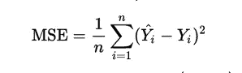
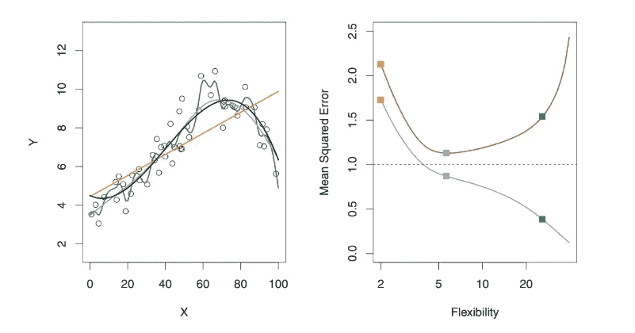
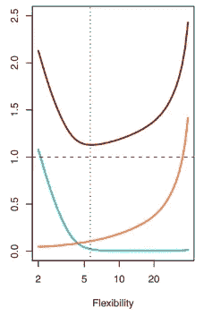

# 平衡偏差和方差以控制机器学习中的错误

> 原文：<https://towardsdatascience.com/balancing-bias-and-variance-to-control-errors-in-machine-learning-16ced95724db?source=collection_archive---------1----------------------->

***在机器学习的世界里，准确性就是一切。*** 你努力通过调谐和调整参数使你的模型更加精确，**但永远无法使它 100%精确。这是关于你的预测/分类 ***模型的硬道理，它们永远不可能没有错误。在本文中，我将讨论为什么会发生这种情况，以及其他可以减少的错误形式。*****

假设我们正在观察一个*响应变量 Y* (定性或定量)和*输入变量 X* 具有 p 个特征或列(X1，X2…..Xp)并且我们假设它们之间有关系。这种关系可以表示为

> **Y = f(X) + e**

这里，f 是 X1、…、Xp 的某个固定但未知的函数，而 *e 是一个随机误差项，它独立于 X，均值为零。*在这个公式中，f 表示 X 提供的关于 y 的系统信息。**这个关系或 f(X)的估计被称为统计学习。**

一般来说，我们无法对 f(X)做出完美的估计，这就产生了一个误差项，称为**可约误差**。可以通过对 f(X)进行更精确的估计来提高模型的精确度，从而减小可约误差。 ***但是，即使我们对 f(X)做出 100%准确的估计，我们的模型也不会是无误差的，这就是所谓的不可约误差*** (上式中的 e)。

换句话说，不可约误差可以看做是 X 无法提供的关于 Y 的信息 ***量 e 可能包含对预测 Y 有用的不可测量变量*** :由于我们不测量它们，所以 f 无法用它们进行预测。 ***量 e 也可能包含不可测的变化。*** 例如，根据药物本身的生产差异或患者当天的总体健康状况，特定患者在特定日期出现不良反应的风险可能有所不同。

每个问题中都存在这样的最终情况，并且它们引入的误差是不可减少的，因为它们通常不存在于训练数据中。我们对此无能为力。我们能做的是减少其他形式的误差，以得到 f(X)的一个接近完美的估计。但是首先让我们来看看机器学习中的其他重要概念，为了更进一步，你需要理解这些概念。

## 模型复杂性

输入和响应变量之间关系 f(X)的复杂性是从数据集学习时要考虑的一个重要因素。简单的关系很容易解释。例如，线性模型应该是这样的

> **Y ≈ β0 + β1X1 + β2X2 + …+ βpXp**

从这种关系中很容易推断出信息，而且它清楚地说明了特定特征如何影响响应变量。这种模型属于**限制模型**的范畴，因为它们只能采取特定的形式，在这种情况下是线性的。但是，关系可能比这更复杂，例如它可能是二次的、圆形的等等。这些模型**更加灵活**，因为它们更紧密地拟合数据点，可以采取不同的形式。通常这种方法会导致更高的精度。但是这种灵活性是以可解释性为代价的，因为复杂的关系更难解释。

选择灵活的模型并不总是保证高精度。发生这种情况是因为我们灵活的统计学习程序过于努力地寻找训练数据中的模式，而 ***可能拾取了一些只是由随机机会而不是由未知函数 f 的真实属性*** 引起的模式。这改变了我们对 f(X)的估计，导致模型不太准确。这种现象也被称为**过拟合**。

*当推理是目标时，使用简单且相对灵活的统计学习方法有明显的优势。然而，在某些情况下，我们只对预测感兴趣，而对预测模型的可解释性根本不感兴趣。这是我们使用更灵活的方法的时候。*

## 拟合质量

为了量化给定观察的预测响应值接近该观察的真实响应值的程度，回归设置中最常用的度量是均方误差(MSE)，

Taken from Wikipedia

顾名思义，*它是所有输入的预测值和观测值的误差或差异的均方值。*用训练数据计算的称为**训练 MSE** ，用测试数据计算的称为**测试 MSE** 。

对于给定值 x0，预期测试 MSE 总是可以分解为三个基本量之和:f(x0)的方差、f(x0)的平方偏差和误差项 e 的方差，其中，e 是不可约误差，我们之前讨论过。所以，让我们看看更多关于偏差和方差的内容。

## 偏见

偏差是指用一个简单得多的模型来逼近一个可能极其复杂的现实问题所引入的误差。所以，如果真实的关系是复杂的，并且你试图使用线性回归，那么它无疑会导致对 f(X)的一些偏差。当真实的关系非常复杂时，无论你有多少观察值，如果你使用一个限制性的/简单的算法，都不可能产生一个准确的预测。

## **差异**

方差是指如果我们使用 different 训练数据集来估计 f(X ),您对 f(x)的估计会改变的量。由于训练数据用于检验统计学习方法，different 训练数据集将产生 different 估计。但是理想情况下，对 f(X)的估计在训练集之间不应该变化太大。然而，如果一种方法具有高方差，那么训练数据中的小变化会导致 f(X)中的大变化。

## 一般规则

当使用试图过于紧密匹配数据点的统计方法时，数据集中的任何变化都将提供不同的估计，这是非常准确的。一般规律是， ***当统计方法试图更紧密地匹配数据点或者使用更灵活的方法时，偏倚减少，但方差增加。***

Credit : An Introduction to Statistical Learning by Gareth James, Daniela Witten, Trevor Hastie, Robert Tibshirani

在上图中，左侧显示了回归设置中 3 种不同统计方法的图表。黄色的是线性的，而蓝色的是稍微非线性的，绿色的是高度非线性的/灵活的，因为它与数据点太接近了。在右侧，您可以看到这三种方法的 MSE 与灵活性的关系图。红色代表测试 MSE，灰色代表训练 MSE。不确定具有最低训练 MSE 的方法也将具有最低测试 MSE。 这是因为一些方法专门估算 coefficients，以最小化训练 MSE，但它们可能没有低测试 MSE。这个问题可以归结为过度拟合的问题。 如图所示，绿色曲线(最灵活)具有最低的训练 MSE，但不是最低的测试 MSE。让我们更深入地研究一下这个问题。

Credit : ISLR by Gareth James, Daniela Witten, Trevor Hastie, Robert Tibshirani

这是一个图表，显示了特定数据集所选方法灵活性的测试 MSE(红色曲线)、偏差(绿色曲线)和方差(黄色曲线)。最小均方误差点是误差形式偏差和方差的一个有趣的点。它表明随着*灵活性的增加，偏差减少的速度比方差增加的速度更快。在某个点之后，偏差不再减少，但是由于过度拟合，方差开始快速增加。*

## 偏差-方差权衡

Credit : An Introduction to Statistical Learning by Gareth James, Daniela Witten, Trevor Hastie, Robert Tibshirani

在上图中，假设目标的中心是一个完美预测正确值的模型。随着我们远离靶心，我们的预测变得越来越糟糕。想象一下，我们可以重复整个模型构建过程，以获得对目标的多次单独命中，这样每个蓝点就代表了基于同一问题的不同数据集的模型的不同实现。*它显示代表高低偏差和方差组合的四种不同情况。高偏差是指所有的点都远离靶心，高方差是指所有的点都分散。结合前面的解释，这个例子清楚地说明了偏差和方差之间的区别。*

如前所述，**为了最小化预期测试误差，我们需要选择一种统计学习方法，同时实现低方差和低偏差。**这些值之间总有一个 trade-off，因为很容易获得一个偏差极低但方差很大的方法(例如，通过绘制一条经过每个训练观察的曲线)或一个方差极低但偏差很大的方法(通过在数据上画一条水平线)。挑战在于找到一种方差和方差均较低的方法。

> 掌握偏差和方差之间的权衡是成为机器学习冠军的必要条件。

在解决机器学习问题时，应该记住这个概念，因为它有助于提高模型的准确性。此外，掌握这些知识有助于你快速决定不同情况下的最佳统计模型。

如果你喜欢这篇文章，一定要点击下面的❤来推荐它，如果你有任何问题，**留下评论**，我会尽力回答。

为了更加了解机器学习的世界，**跟我来**。这是最好的办法，等我多写点这样的文章就知道了。

也可以在 **Twitter 关注我在**[**@ pra shant _ 1722**](https://twitter.com/Prashant_1722)， [**直接发邮件给我**](mailto:pr.span24@gmail.com) 或者 [**在 linkedin**](https://www.linkedin.com/in/prashantgupta17/) 上找我。我很乐意收到你的来信。

乡亲们，祝你们有美好的一天:)