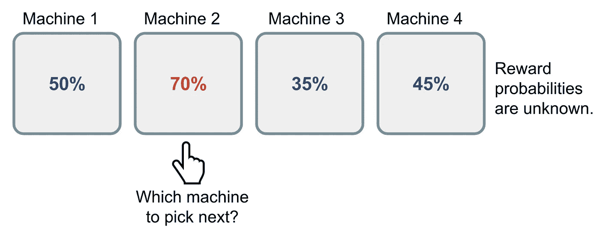
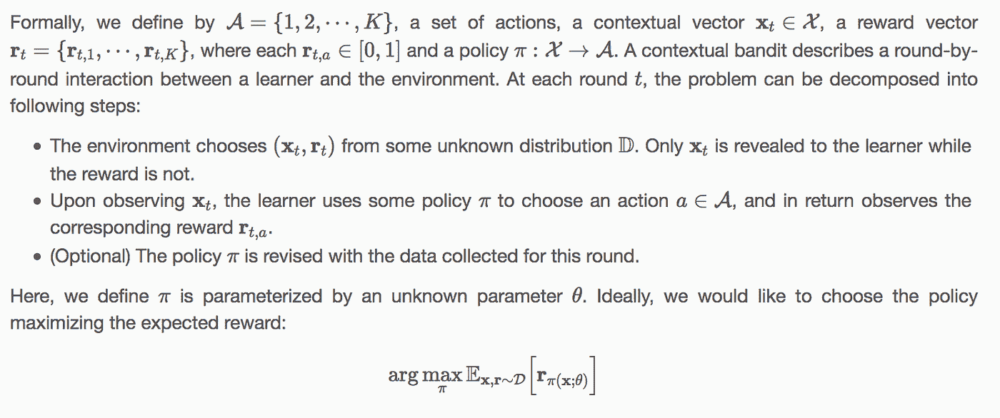
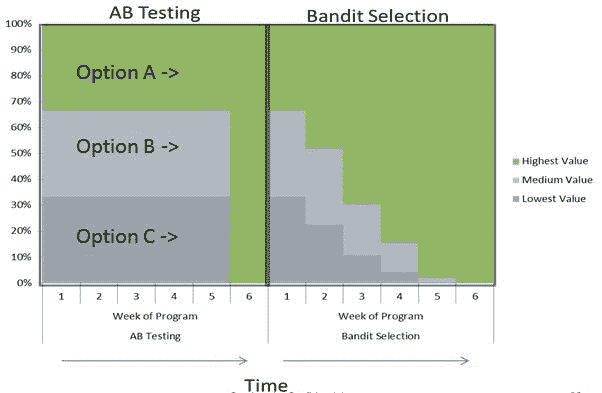

# 推荐系统优化的拦路虎

> 原文：<https://towardsdatascience.com/bandits-for-recommender-system-optimization-1d702662346e?source=collection_archive---------0----------------------->

任何在亚马逊上购物、在 Spotify 上听音乐、或者在网飞上浏览值得狂欢的电视连续剧的人都体验过个性化推荐。公司使用推荐系统来增加客户参与度和收入。这些算法将用户、产品和上下文元数据作为输入，并通过[协作](https://en.wikipedia.org/wiki/Collaborative_filtering)或[基于内容的](https://en.wikipedia.org/wiki/Recommender_system#Content-based_filtering)过滤方法产生个性化的动态内容作为输出。

推荐系统的质量通常通过 A/B 测试实验来衡量。然而，A/B 测试传统上用于测量静态 UI 变体中的转换率(例如，蓝色链接对绿色链接)。这就是为什么我在推荐系统的范围内探索多臂强盗作为 A/B 测试的替代。

我们将从经典的多臂土匪思想实验的概述开始。接下来将通过正式定义和示例对上下文多臂土匪进行讨论。最后，我们将传统的 A/B 测试实验与多臂 bandit 进行比较。

# **多兵种土匪问题**

Source: [https://lilianweng.github.io/lil-log/2018/01/23/the-multi-armed-bandit-problem-and-its-solutions.html](https://lilianweng.github.io/lil-log/2018/01/23/the-multi-armed-bandit-problem-and-its-solutions.html)

多臂土匪问题是从经典[贝叶斯概率](https://en.wikipedia.org/wiki/Bayesian_probability)衍生出来的强化学习的一个例子。这是一个假设的实验，一个赌徒被给了一个有多个分支的老虎机，每个分支都有自己未知的概率分布。目标是在收集信息的同时按顺序一个接一个地拉动武器，以便在长期内最大化总支出。

更正式的描述假设奖励来自概率分布 a(y|θ),其中 *a* 表示采取的行动(或手臂运动)；*y*是观察到的奖励，而 *θ* 是一组通过实验学习的未知参数[6]。多臂土匪问题的重要性在于我们(代理人)无法获得真正的土匪概率分布——所有的学习都是通过试错法和价值估计的方式进行的[7]。这被称为探索-开发权衡，即边学边赚。

# 背景强盗问题

情境土匪问题是对多臂土匪的一种概括，它通过使行动以环境状态为条件来扩展模型[3]。与经典的多臂 bandit 不同，它解决了在最佳时间为个人用户识别最合适内容的问题[2]。上下文信息可用于通过[分类](https://en.wikipedia.org/wiki/Classification)或[聚类](https://en.wikipedia.org/wiki/Cluster_analysis)技术根据共享特征对用户进行分组，假设属于相同聚类的用户倾向于具有相似的行为，而位于不同聚类的用户具有显著不同的行为【1】。

以下是上下文多武装匪徒的正式定义:

Source: [http://www.hongliangjie.com/2014/04/14/unbiased-offline-evaluation/](http://www.hongliangjie.com/2014/04/14/unbiased-offline-evaluation/)

一个常见的真实世界上下文强盗的例子是新闻推荐系统。给定一组呈现的新闻文章，奖励由用户的点击行为决定。如果她点击了这篇文章，就会产生 1 英镑的支出，否则为 0 英镑[2]。点击率(CRT)用于确定新闻推荐应用程序中广告的选择和放置。

现在假设奖励由 CTR 结合关于用户的元数据(例如，年龄和性别)来确定，因此推荐可以进一步个性化。以一名 65 岁的女性和一名 18 岁的男性为例，两人都从他们的移动设备上阅读新闻文章。对这两个用户的推荐应该反映他们的对比概况。向 18 岁的男性展示退休计划或成熟女性服装店(例如 [Talbots](https://www.talbots.com/online/) )的广告是没有意义的。

上下文信息还可以包括地理位置、时间、星期几和季节。假设地理位置元数据可通过 18 岁男性的移动设备获得。他离德克萨斯大学奥斯汀分校很近，并通过点击行为表达了对滑板和冲浪商店的兴趣。有了这个关于用户的上下文信息，应用程序应该显示他当前地理位置内的滑板和冲浪商店的广告(例如， [Tyler 的](http://www.tylerstx.com/tylers-on-the-drag/))。如果是学期开始，比如说在九月或一月，应该为这个用户生成大学教科书商店[(例如，大学合作](http://www.universitycoop.com/))的广告，因为他很可能是购买教科书的大学生。

# A/B 测试诉多武装匪徒

对于大多数现代互联网公司来说，只要有可以衡量的指标(例如，在一个页面上花费的时间、点击率、销售转化率)，几乎总是在幕后进行随机试验，目的是确定一个替代网站设计，提供对默认设计的改进[8]。这个过程和方法通常被称为 *A/B 测试。* A/B 检验是统计假设检验的一种形式，使用两个给定的样本 A 和 B，前者为对照，后者为变异体。给定一个默认配置和几个备选方案(例如，网站的配色方案)，标准做法是将少量科学家流量转移到这些备选方案的随机试验中，并记录每个备选方案的期望指标[8]。

多臂 bandit 是 A/B 测试的替代方案。当存在差异时，多臂 bandit 方法在寻找最佳臂方面比传统的统计实验更有效，并且其优势随着臂数的增加而增加[6]。直觉上，我们需要给新内容分配更多的流量，以便更快地了解其价值，并减少用户跟踪现有内容的时间变化[2]。以下是 Google Analytics 的高级经济分析师 Steven L. Scott 对多臂土匪实验的好处的讨论:

> 基于多支武装匪徒的实验通常比基于统计假设检验的“经典”A-B 实验有效得多。它们在统计学上同样有效，而且在许多情况下，它们能更快地给出答案。它们更有效率，因为它们让流量逐渐走向成功的变化，而不是强迫你在实验结束时等待“最终答案”。它们速度更快，因为本来会出现明显较差变异的样本可以分配给潜在的赢家。在高性能变体上收集的额外数据可以帮助更快地将“好”臂与“最好”臂分开。
> 
> 基本上，土匪让实验更有效率，你可以多尝试。你也可以分配更多的流量给你的实验，因为流量会自动导向性能更好的页面。

现在，让我们来并排比较一下这些竞争测试方法:

**Source:** [**https://conductrics.com/balancing-earning-with-learning-bandits-and-adaptive-optimization/**](https://conductrics.com/balancing-earning-with-learning-bandits-and-adaptive-optimization/)

正如您从上面的图中看到的，A/B 测试并不适应整个实验阶段，因为勘探和开发阶段是静态和不同的，而多臂土匪通过同时勘探和开发进行调整。此外，对于多兵种土匪，分配给次等兵种/片的时间和资源更少。相反，在整个实验过程中，流量会逐渐分配给更优化的切片。土匪测试的一大好处是土匪减轻了“遗憾”，这基本上是你在测试中探索潜在的更坏的变化时所经历的转换损失[5]。

# 有关多武装匪徒的更多信息，请参见以下链接:

## 一种有效的实时多元优化 bandit 算法

亚马逊如何采用汤普森抽样的多臂强盗方法，在一周内增加 21%的购买量。

[https://blog . acolyer . org/2017/09/27/an-efficient-bandit-algorithm-for-real-time-variable-optimization/](https://blog.acolyer.org/2017/09/27/an-efficient-bandit-algorithm-for-real-time-multivariate-optimization/)

## 商业实用人工智能:强盗算法

Max Pagels 关于 bandit 算法及其实际商业应用的精彩演示。他通过清晰简洁的解释呈现了多种武器的强盗，这些解释比学术白皮书中复杂的论点更容易理解。

[https://www . slide share . net/SC5/practical-ai-for-business-bandit-algorithms](https://www.slideshare.net/SC5/practical-ai-for-business-bandit-algorithms)

## 使用依赖臂的多臂 Bandit 的在线交互式协同过滤

通过考虑项目间的依赖关系来讨论在线交互式协同过滤问题。

【https://arxiv.org/pdf/1708.03058.pdf 

## 时变背景的多武装匪徒

报酬映射函数随时间变化的时变上下文多臂强盗问题的研究。

[https://users.cs.fiu.edu/~taoli/pub/p2025-zeng.pdf](https://users.cs.fiu.edu/~taoli/pub/p2025-zeng.pdf)

## 参考

[1]李，卡拉佐格鲁，和詹蒂莱。协同过滤土匪。[https://arxiv.org/pdf/1502.03473.pdf](https://arxiv.org/pdf/1502.03473.pdf)

[2]李、朗福姆和沙皮雷。个性化新闻文章推荐的上下文相关方法。[https://www.cs.princeton.edu/~schapire/papers/www10.pdf](https://www.cs.princeton.edu/~schapire/papers/www10.pdf)

[3]保罗·苏尔梅诺克。情境强盗和强化学习——走向数据科学。[https://towards data science . com/contextual-bottoms-and-reinforcement-learning-6bdfeaece 72 a](/contextual-bandits-and-reinforcement-learning-6bdfeaece72a)

[4]史蒂文·斯科特。多臂强盗实验。【https://support.google.com/analytics/answer/2844870?hl=en 号

[5]亚历克斯·伯基特。A/B 测试精通:从初学者到专家。【https://conversionxl.com/blog/ab-testing-guide/ 

[6]史蒂文·斯科特。在线服务经济中的多股武装匪徒。[https://static . Google user content . com/media/research . Google . com/en//pubs/archive/42550 . pdf](https://static.googleusercontent.com/media/research.google.com/en//pubs/archive/42550.pdf)

[7]王，安森。解决多臂强盗问题。[https://towards data science . com/solutioning-the-multi-armed-bandit-problem-b 72 de 40 db 97 c](/solving-the-multi-armed-bandit-problem-b72de40db97c)

[8]杨、拉姆达斯、贾米森和温赖特。具有在线 FDR 控制的多 A(rmed)/B(andit)测试框架。[https://arxiv.org/pdf/1706.05378.pdf](https://arxiv.org/pdf/1706.05378.pdf)