# [基础数据清理/工程会议] Twitter 情绪数据

> 原文：<https://towardsdatascience.com/basic-data-cleaning-engineering-session-twitter-sentiment-data-95e5bd2869ec?source=collection_archive---------3----------------------->

Gif from this [website](https://giphy.com/gifs/adweek-magic-mike-mr-clean-26gscNQHswYio5RBu)

所以这篇文章只是让我练习一些基本的数据清理/工程操作，我希望这篇文章能够帮助其他人。

> **请注意，这篇文章是为了我将来回顾数据清理/工程** **方法，而不是重新研究。**

**推特 Kaggle 数据集**

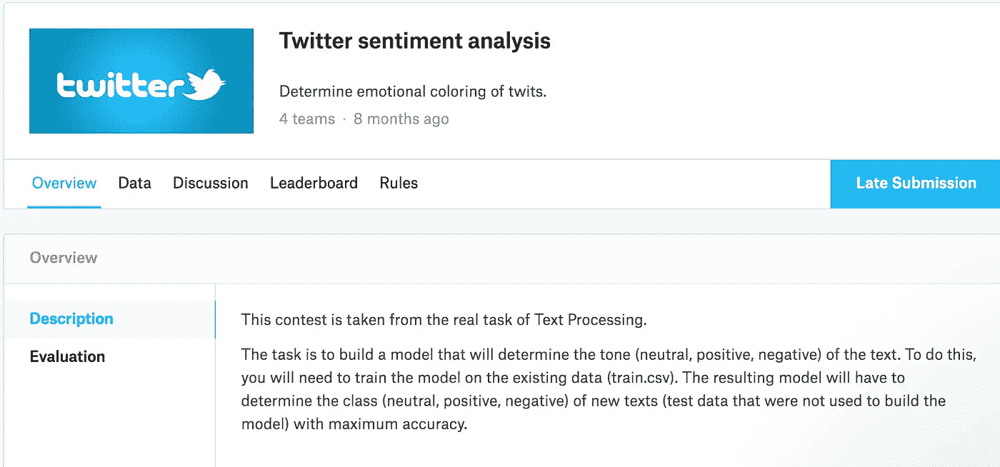

Image from this [website](https://www.kaggle.com/c/twitter-sentiment-analysis2)

我将使用 Kaggle 的 Twitter 情绪[分析数据。](https://www.kaggle.com/c/twitter-sentiment-analysis2)该数据包含 8.7 MB 的(训练)文本数据，这些数据是从 Twitter 中提取的，没有经过预处理。

**原始文本数据的第一视图**

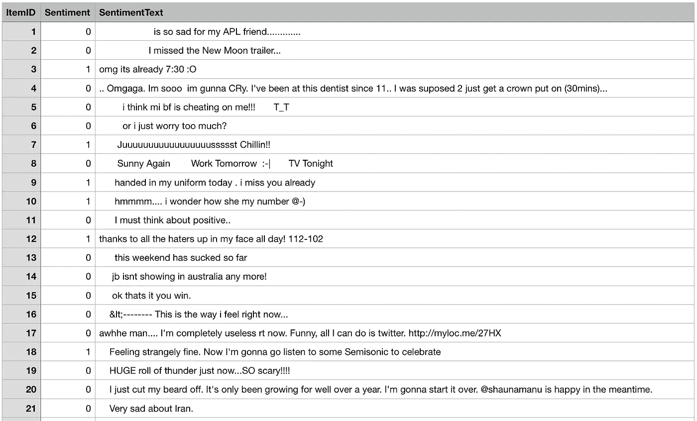

如上所述，我们可以直接注意到数据中包含了大量的停用词和一些俚语(如 bf → Boy Friend ),需要替换或完全删除。

**步骤 0)将数据读入 Panda 数据帧和基本审查**

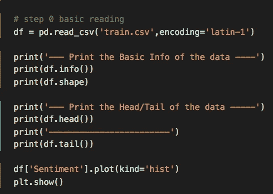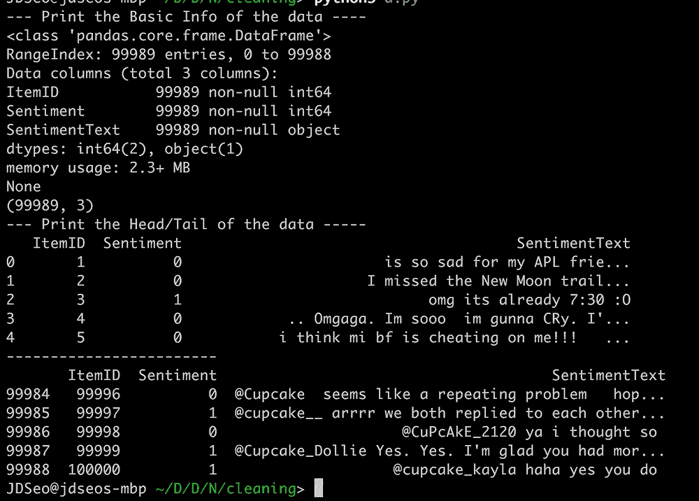

如上所示，当我们打印一些关于数据的基本信息时。我们可以马上注意到每行是如何用 int64 或 Object(对于 TextData)表示的。最后，当我们绘制情感数据的直方图时，我们可以知道正面例子比负面例子多。(1 表示积极情绪，而 0 表示消极情绪。)

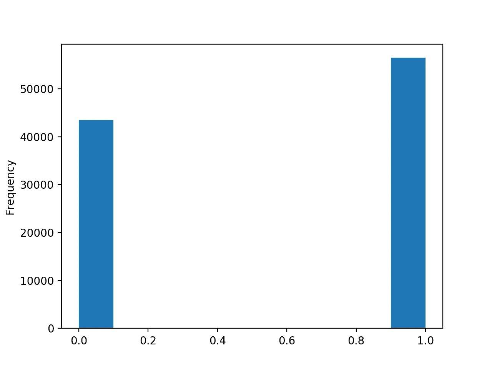

**步骤 1)清除停止字【清洗】**

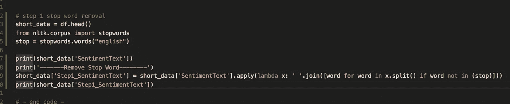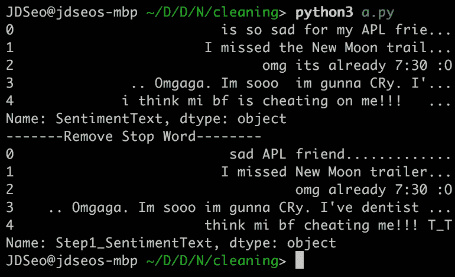

为了更快地执行，我将只使用前 5 行来清理示例数据，如上所示，当我们删除所有的停用词(如 is、so 等)时。)句子变得更干净了。

一个例子是**“我的天已经 7:30 了”→“我的天已经 7:30 了”**

**步骤 2)替换缩写和一些拼写更正【清理】**

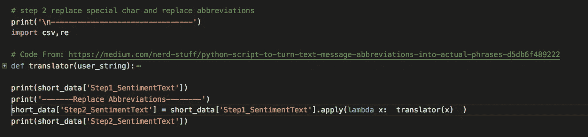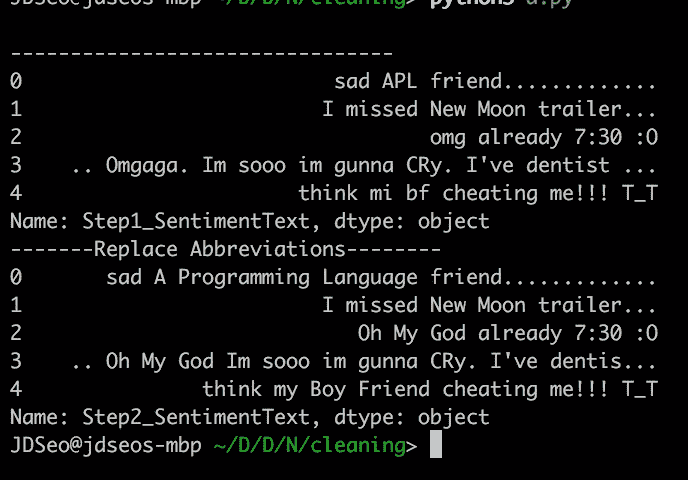

借用这篇[博客文章](https://medium.com/nerd-stuff/python-script-to-turn-text-message-abbreviations-into-actual-phrases-d5db6f489222)中的代码，我们将把一些俚语替换成更合适的单词，并做一些拼写纠正。我们可以注意到，一些社交媒体俚语已经变成了完整的词，如“哦，我的上帝”或“男朋友”。

一个例子是**“OMG 已经 7:30 了”→“天哪已经 7:30 了”**

**步骤 3)词干化【新功能】**

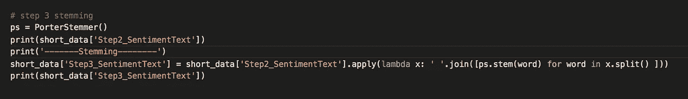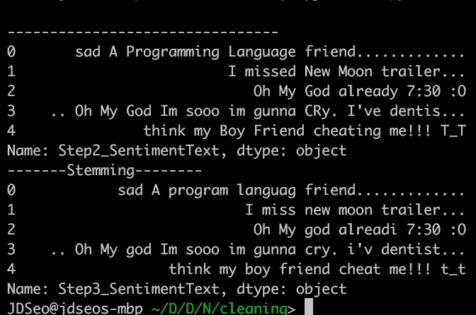

[词干化是将屈折词(或有时是派生词)简化为词干、词根或词根形式](https://en.wikipedia.org/wiki/Stemming)的过程。如上所述，这个词已经变成了“已经”,以及“欺骗”。如果你想了解更多关于这些话题的信息，请点击这里[阅读我对 30 个数据科学家问题的看法。](https://medium.com/@SeoJaeDuk/my-take-on-30-questions-to-test-a-data-scientist-on-natural-language-processing-with-interactive-5b3454a196ef)

**步骤 4)词汇化【新功能】**

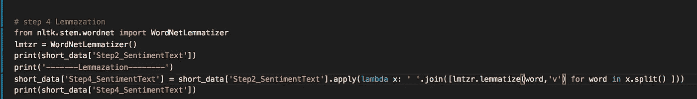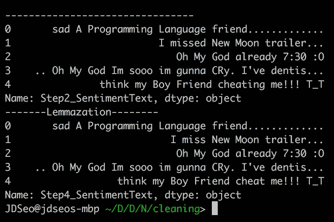

[词汇化是将一个单词的词尾变化形式组合在一起的过程，因此它们可以作为一个单独的项目进行分析，通过单词的词汇或词典形式进行识别。这个过程与词干提取非常相似，但是我们可以注意到的一个区别是，单词没有变成 already。如果您希望了解有关这些主题的更多信息，请单击此处](https://en.wikipedia.org/wiki/Lemmatisation)[阅读我对 30 个数据科学家问题的看法。](https://medium.com/@SeoJaeDuk/my-take-on-30-questions-to-test-a-data-scientist-on-natural-language-processing-with-interactive-5b3454a196ef)

**步骤 5)词性标注(POS)【新功能】**

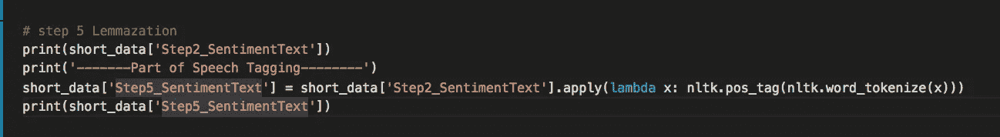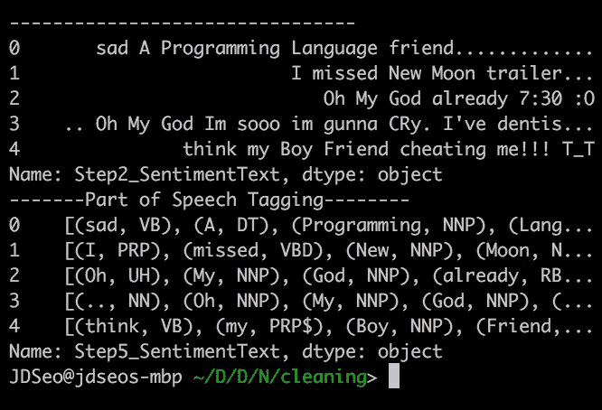

[词性标注是**语法标注**或**词类消歧**，是根据定义和上下文将文本(语料库)中的单词标记为对应于特定词性的过程。如上所述，我们已经将句子中的每个单词标记为动词、名词或代词等。](https://en.wikipedia.org/wiki/Part-of-speech_tagging)

**步骤 6)大写**

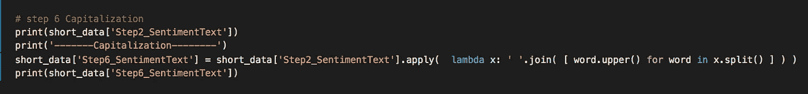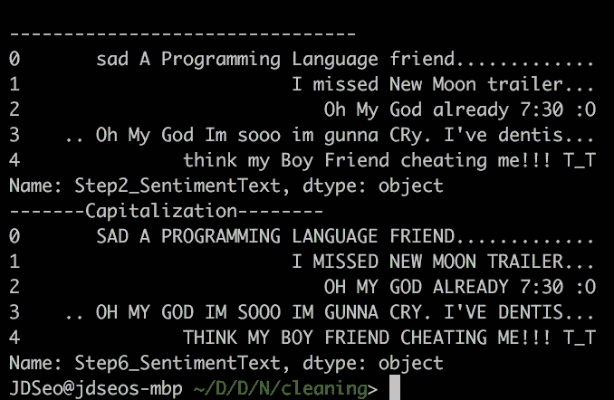

最后，我只是想尝试一下，因为大写被认为是 NLP 中的降维技术，因为它减少了表示原始文本所需的字符。(将所有字符转换成小写具有相同的效果。)

**互动码**

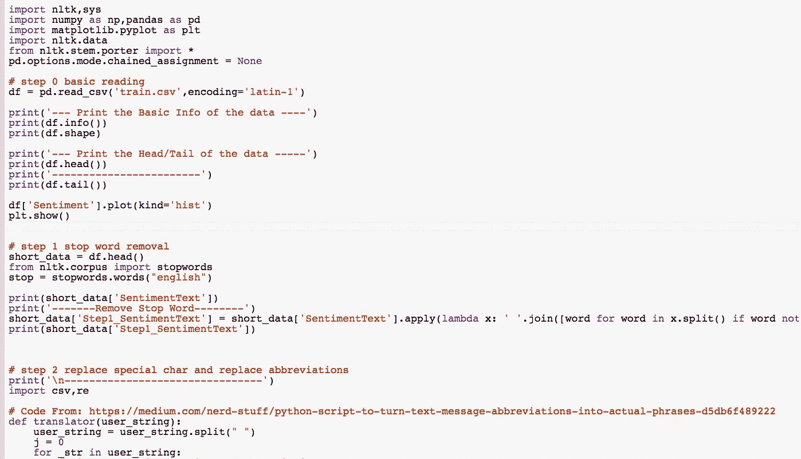

对于 Google Colab，你需要一个 Google 帐户来查看代码，而且你不能在 Google Colab 中运行只读脚本，所以在你的操场上复制一份。最后，我永远不会请求允许访问你在 Google Drive 上的文件，仅供参考。编码快乐！

要访问这篇[文章中使用的代码，请点击这里。](https://colab.research.google.com/drive/1e1lRkOAqwmlPDsUaJ5uxzE-wU_Dty0fw)

**最后的话**

我目前正在学习更多关于 NLP 环境下的数据清理和工程的知识，这是练习我的技能的好方法。但下一次我希望创造更复杂的功能。

如果发现任何错误，请发电子邮件到 jae.duk.seo@gmail.com 给我，如果你想看我所有写作的列表，请点击这里查看我的网站。

同时，在我的推特[这里](https://twitter.com/JaeDukSeo)关注我，访问[我的网站](https://jaedukseo.me/)，或者我的 [Youtube 频道](https://www.youtube.com/c/JaeDukSeo)了解更多内容。我还实现了[广残网，请点击这里查看博文 pos](https://medium.com/@SeoJaeDuk/wide-residual-networks-with-interactive-code-5e190f8f25ec) t。

**参考**

1.  推特情绪分析| Kaggle。(2018).Kaggle.com。检索于 2018 年 5 月 27 日，来自[https://www . ka ggle . com/c/Twitter-情操-分析 2 #评价](https://www.kaggle.com/c/twitter-sentiment-analysis2#evaluation)
2.  UnicodeDecodeError，i. (2018)。UnicodeDecodeError，无效的延续字节。堆栈溢出。检索于 2018 年 5 月 27 日，来自[https://stack overflow . com/questions/5552555/unicode decodedeerror-invalid-continuation-byte](https://stackoverflow.com/questions/5552555/unicodedecodeerror-invalid-continuation-byte)
3.  dataframe，P. (2018 年)。Python 删除了熊猫数据帧中的停用词。堆栈溢出。检索于 2018 年 5 月 27 日，来自[https://stack overflow . com/questions/29523254/python-remove-stop-words-from-pandas-data frame](https://stackoverflow.com/questions/29523254/python-remove-stop-words-from-pandas-dataframe)
4.  python，H. (2018)。如何使用 nltk 或 python 删除停用词？堆栈溢出。检索于 2018 年 5 月 27 日，来自[https://stack overflow . com/questions/5486337/how-to-remove-stop-words-using-nltk-or-python](https://stackoverflow.com/questions/5486337/how-to-remove-stop-words-using-nltk-or-python)
5.  熊猫？，H. (2018)。如何应对熊猫中设置 SettingWithCopyWarning？。堆栈溢出。检索于 2018 年 5 月 27 日，来自[https://stack overflow . com/questions/20625582/how-to-deal-withcopywarning-in-pandas](https://stackoverflow.com/questions/20625582/how-to-deal-with-settingwithcopywarning-in-pandas)
6.  城市词典:APL。(2018).都市词典。检索于 2018 年 5 月 28 日，来自[https://www.urbandictionary.com/define.php?term=APL](https://www.urbandictionary.com/define.php?term=APL)
7.  dataframe，P. (2018 年)。Python 删除了熊猫数据帧中的停用词。堆栈溢出。检索于 2018 年 5 月 28 日，来自[https://stack overflow . com/questions/29523254/python-remove-stop-words-from-pandas-data frame](https://stackoverflow.com/questions/29523254/python-remove-stop-words-from-pandas-dataframe)
8.  Python 脚本将文本/消息缩写转化为实际短语。(2017).中等。检索于 2018 年 5 月 28 日，来自[https://medium . com/nerd-stuff/python-script-to-turn-text-message-abstracts-into-actual-phrases-d5db 6 f 489222](https://medium.com/nerd-stuff/python-script-to-turn-text-message-abbreviations-into-actual-phrases-d5db6f489222)
9.  '数据'，N. (2018)。NLTK-attribute 错误:模块“NLTK”没有属性“data”。堆栈溢出。检索于 2018 年 5 月 28 日，来自[https://stack overflow . com/questions/45786059/nltk-attribute error-module-nltk-has-no-attribute-data](https://stackoverflow.com/questions/45786059/nltk-attributeerror-module-nltk-has-no-attribute-data)
10.  Python？，W. (2018)。Python 中最好的词干法是什么？。堆栈溢出。检索于 2018 年 5 月 28 日，来自[https://stack overflow . com/questions/24647400/what-is-the-best-stemming-method-in-python](https://stackoverflow.com/questions/24647400/what-is-the-best-stemming-method-in-python)
11.  Stemmers。(2018).Nltk.org。检索于 2018 年 5 月 28 日，来自[http://www.nltk.org/howto/stem.html](http://www.nltk.org/howto/stem.html)
12.  自然语言机器学习中的预处理。(2017).走向数据科学。检索于 2018 年 5 月 28 日，来自[https://towardsdatascience . com/pre-processing-in-natural language-machine-learning-898 a 84 b 8 BD 47](/pre-processing-in-natural-language-machine-learning-898a84b8bd47)
13.  引理化？，H. (2018)。我如何做词干或词汇化？。堆栈溢出。检索于 2018 年 5 月 28 日，来自[https://stack overflow . com/questions/771918/how-do-I-do-word-stemming-or-lemmatization](https://stackoverflow.com/questions/771918/how-do-i-do-word-stemming-or-lemmatization)
14.  大写，H. (2018)。如何将一个字符串变成大写？堆栈溢出。检索于 2018 年 5 月 28 日，来自[https://stack overflow . com/questions/9257094/how-to-change-a-string-to-upper case](https://stackoverflow.com/questions/9257094/how-to-change-a-string-into-uppercase)
15.  TypeError:序列项 0:应为字符串 i. (2018)。TypeError:序列项 0:预期的字符串，找到的是 int。堆栈溢出。检索于 2018 年 5 月 28 日，来自[https://stack overflow . com/questions/10880813/type error-sequence-item-0-expected-string-int-found](https://stackoverflow.com/questions/10880813/typeerror-sequence-item-0-expected-string-int-found)
16.  下载？，W. (2018)。NLTK POS tagger 让我下载的是什么？。堆栈溢出。检索于 2018 年 5 月 28 日，来自[https://stack overflow . com/questions/8590370/what-is-nltk-pos-tagger-questing-me-download](https://stackoverflow.com/questions/8590370/what-is-nltk-pos-tagger-asking-me-to-download)
17.  堵塞。(2018).En.wikipedia.org。检索于 2018 年 5 月 28 日，来自 https://en.wikipedia.org/wiki/Stemming
18.  我用 30 个问题来测试一个数据科学家在自然语言处理方面的交互能力。(2018).中等。检索于 2018 年 5 月 28 日，来自[https://medium . com/@ SeoJaeDuk/my-take-on-30-questions-to-test-a-data-scientist-on-natural-language-processing-with-interactive-5b 3454 a 196 ef](https://medium.com/@SeoJaeDuk/my-take-on-30-questions-to-test-a-data-scientist-on-natural-language-processing-with-interactive-5b3454a196ef)
19.  词性标注。(2018).En.wikipedia.org。检索于 2018 年 5 月 28 日，来自[https://en.wikipedia.org/wiki/Part-of-speech_tagging](https://en.wikipedia.org/wiki/Part-of-speech_tagging)
20.  引理满足。(2018).En.wikipedia.org。检索于 2018 年 5 月 28 日，来自[https://en.wikipedia.org/wiki/Lemmatisation](https://en.wikipedia.org/wiki/Lemmatisation)
21.  我用 30 个问题来测试一个数据科学家在自然语言处理方面的交互能力。(2018).中等。检索于 2018 年 5 月 28 日，来自[https://medium . com/@ SeoJaeDuk/my-take-on-30-questions-to-test-a-data-scientist-on-natural-language-processing-with-interactive-5b 3454 a 196 ef](https://medium.com/@SeoJaeDuk/my-take-on-30-questions-to-test-a-data-scientist-on-natural-language-processing-with-interactive-5b3454a196ef)