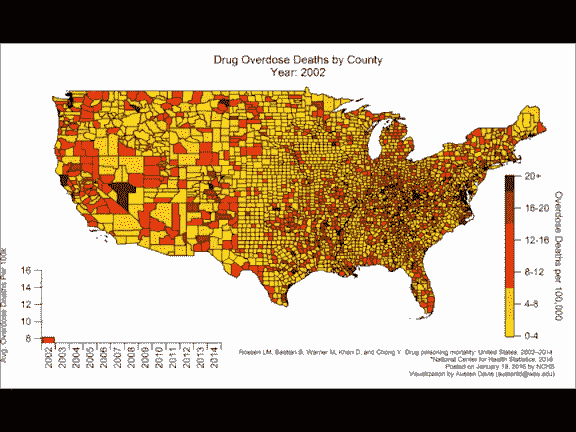
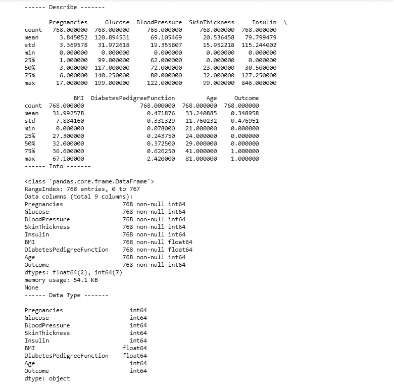
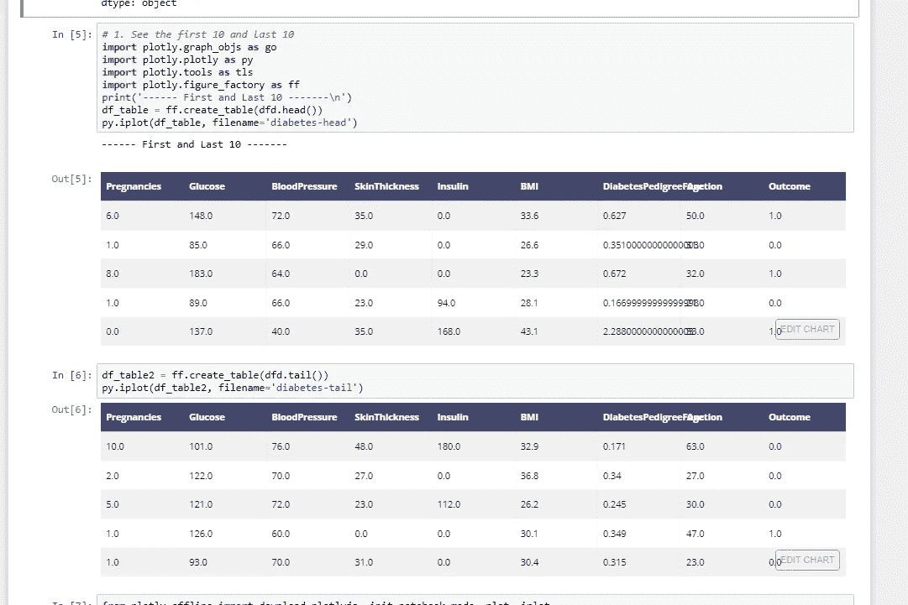
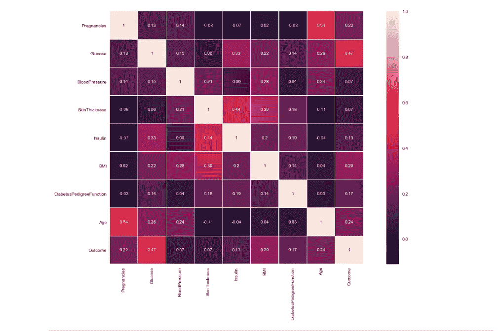
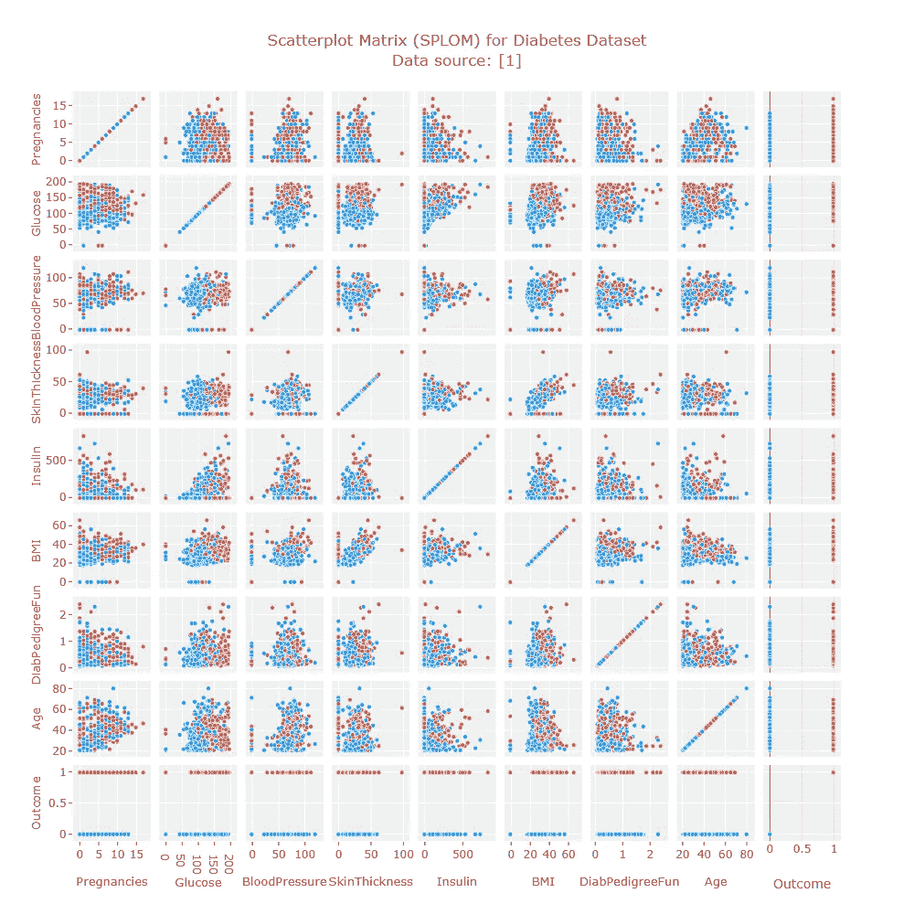
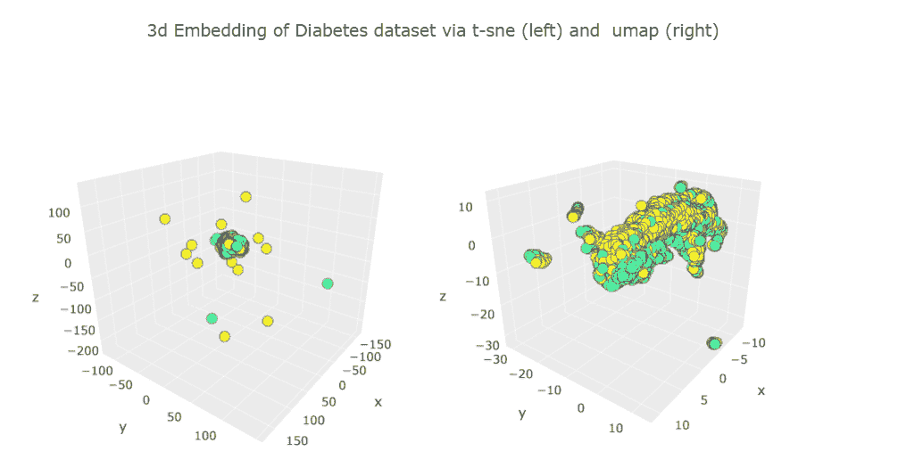
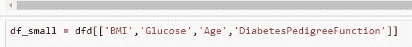
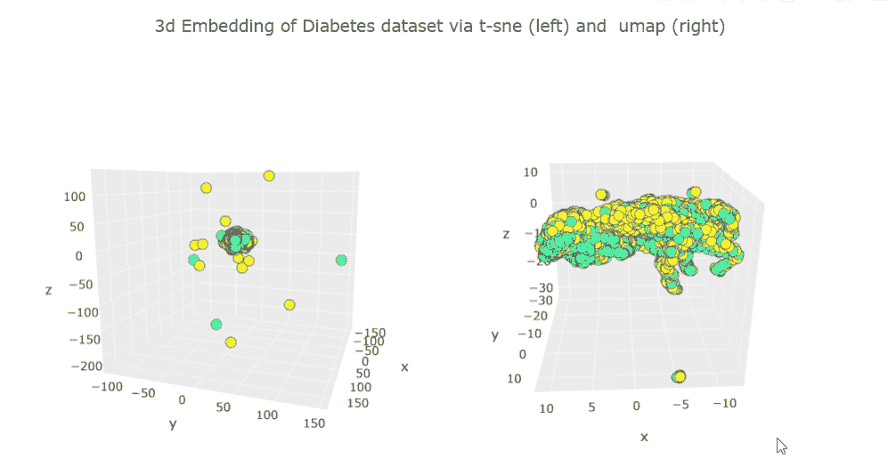
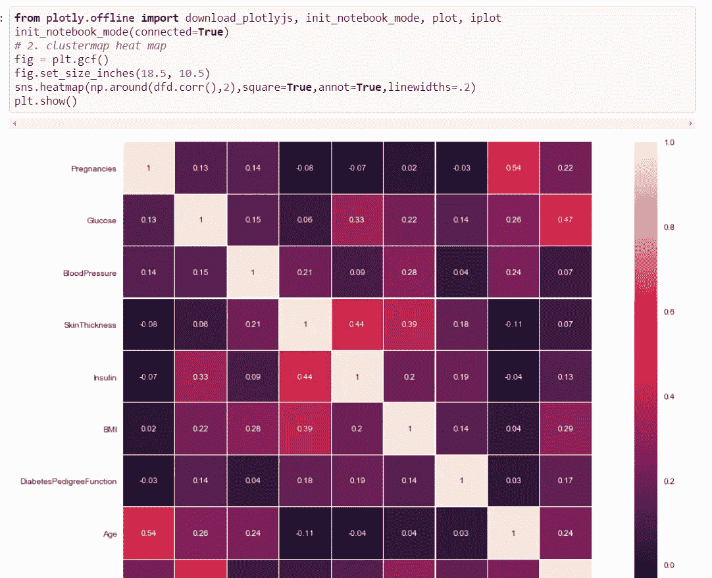

# 使用交互式代码的基础医学数据探索

> 原文：<https://towardsdatascience.com/basic-medical-data-exploration-with-interactive-code-aa26ed432265?source=collection_archive---------12----------------------->

GIF from this [website](https://giphy.com/gifs/usa-drug-visualization-CiNrf1DzPkj9m)

今天我想做一些数据探索，从简单的开始，我想使用著名的[皮马印第安人糖尿病数据库](https://www.kaggle.com/uciml/pima-indians-diabetes-database)创建一些图表。

> **请注意，这篇文章是为了我未来的自己审查这些材料。**

1.  **简单查看数据格式和数据类型**

由于我使用了 [Pandas Dataframe](https://pandas.pydata.org/pandas-docs/stable/generated/pandas.DataFrame.html) 来研究 csv 数据，我们可以轻松地查看数据类型以及数据背后的简单见解，例如平均值或标准值。

马上我们可以看到所有的数据都是由数值组成的，事实上我们有 768 列，没有空值。

**2。第一个和最后 10 个数据点**

虽然我们知道我们的数据是由数值组成的，但我喜欢浏览数据(主要是第一个和最后 10 个或 100 个)，只是为了好玩而查看它们。

**3。相关矩阵**

接下来，我想看看每一列是如何相互关联的，再次感谢 pandas Dataframe 的强大功能，制作这个图表非常容易。我们已经可以观察到结果栏与葡萄糖、身体质量指数和年龄高度相关。

**4。各列直方图**

现在让我们来看看每一列的分布，我们可以立即观察到我们的数据库中有更多的非糖尿病患者。在执行分类时，这可能是一个有用的信息。接下来，我们可以观察到年龄部分有一个异常值。(因为我们只有一个年龄在 80 到 81 岁之间的人。)

在这里我们可以观察到更多的情况，例如，我们大多数患者的胰岛素水平在 0-19μU/ml 之间

**5。散点图矩阵**

散点图矩阵图(或 SPLOM)也可以用来找出不同的相关性。使用这篇[博客文章](https://medium.com/@plotlygraphs/what-is-a-splom-chart-make-scatterplot-matrices-in-python-8dc4998921c3)中的代码，我们可以观察每个特性是如何相互关联的。从表面上看，身体质量指数和血糖水平似乎是非常重要的特征。(正如我们在关联热图中已经看到的。)

**6。一致流形逼近和投影嵌入(UMAP)
t-分布随机邻居嵌入(t-SNE)**

Inspired by this [blog post](https://plot.ly/~empet/14816/dimension-reduction-of-digits-dataset-v/#/)

最后，让我们将数据集投影到三维空间中，我们已经知道我们有 8 个特征向量(因为最后一个是患者是否患有糖尿病的二进制值，所以我们不会对其进行计数。)所以让我们把它们投射到 3D 空间。如上所述，无论是 t-SNE 还是 UMAP 都没有在非糖尿病患者和糖尿病患者的聚类方面做得很好。

如上所述，我决定只使用 4 个具有最高相关值的特征向量。

不幸的是，结果似乎并没有改变太多:(

**GitHub 代码**

要访问这篇文章的 ipython 笔记本，[请点击这里。](https://github.com/JaeDukSeo/Daily-Neural-Network-Practice-2/blob/master/Medical_EXP/Pima_Indians/a.ipynb)

**遗言**

对于数据探索来说，这是一个很好的起点，我希望将来能做得更多。

如果发现任何错误，请发电子邮件到 jae.duk.seo@gmail.com 给我，如果你想看我所有写作的列表，请[在这里查看我的网站](https://jaedukseo.me/)。

同时，在我的 twitter [这里](https://twitter.com/JaeDukSeo)关注我，并访问[我的网站](https://jaedukseo.me/)，或我的 [Youtube 频道](https://www.youtube.com/c/JaeDukSeo)了解更多内容。我也实现了[广残网，请点击这里查看博文 pos](https://medium.com/@SeoJaeDuk/wide-residual-networks-with-interactive-code-5e190f8f25ec) t。

**参考**

1.  绘制对角线相关矩阵——seaborn 0 . 8 . 1 文档。(2018).Seaborn.pydata.org。检索于 2018 年 6 月 24 日，来自[https://seaborn . pydata . org/examples/many _ pairwise _ correlations . html](https://seaborn.pydata.org/examples/many_pairwise_correlations.html)
2.  带注释的热图— seaborn 0.8.1 文档。(2018).Seaborn.pydata.org。检索于 2018 年 6 月 24 日，来自[https://seaborn.pydata.org/examples/heatmap_annotation.html](https://seaborn.pydata.org/examples/heatmap_annotation.html)
3.  colormap，P. (2018)。用取自色彩图的颜色绘制直方图。堆栈溢出。检索于 2018 年 6 月 24 日，来自[https://stack overflow . com/questions/23061657/plot-histogram-with-colors-take-from-colormap](https://stackoverflow.com/questions/23061657/plot-histogram-with-colors-taken-from-colormap)
4.  matplotlib？，H. (2018)。如何改变用 matplotlib 绘制的图形的大小？。堆栈溢出。检索于 2018 年 6 月 24 日，来自[https://stack overflow . com/questions/332289/how-do-you-change-the-size-of-figures-drawn-with-matplotlib](https://stackoverflow.com/questions/332289/how-do-you-change-the-size-of-figures-drawn-with-matplotlib)
5.  什么是 SPLOM 图表？用 Python 制作散点图矩阵。(2018).中等。检索于 2018 年 6 月 24 日，来自[https://medium . com/@ plotlygraphs/what-is-a-splom-chart-make-scatter plot-matrices-in-python-8dc 4998921 C3](https://medium.com/@plotlygraphs/what-is-a-splom-chart-make-scatterplot-matrices-in-python-8dc4998921c3)
6.  Plot.ly. (2018)。*秘密地进口。_ _ version _ _ | Dreamshot | Plotly*。【在线】可在:[https://plot . ly/~ dream shot/9242/import-plotly-plotly-version-/#/](https://plot.ly/~Dreamshot/9242/import-plotly-plotly-version-/#/)【2018 年 6 月 24 日访问】。
7.  直方图。(2018).Plot.ly .检索于 2018 年 6 月 24 日，来自[https://plot.ly/pandas/histograms/](https://plot.ly/pandas/histograms/)
8.  属性错误问题#24 lmcinnes/umap。(2018).GitHub。检索于 2018 年 6 月 24 日，来自[https://github.com/lmcinnes/umap/issues/24](https://github.com/lmcinnes/umap/issues/24)
9.  dataframe，S. (2018)。在熊猫数据框架中选择列。堆栈溢出。检索于 2018 年 6 月 24 日，来自[https://stack overflow . com/questions/11285613/selecting-columns-in-a-pandas-data frame](https://stackoverflow.com/questions/11285613/selecting-columns-in-a-pandas-dataframe)
10.  如何选择所有列，e. (2018)。如何选择除熊猫中一列外的所有列？。堆栈溢出。检索于 2018 年 6 月 24 日，来自[https://stack overflow . com/questions/29763620/how-to-select-all-columns-except-one-columns-in-pandas](https://stackoverflow.com/questions/29763620/how-to-select-all-columns-except-one-column-in-pandas)
11.  数字数据集的降维。(2018).Plot.ly .检索于 2018 年 6 月 24 日，来自[https://plot . ly/~ empet/14816/dimension-reduction-of-digits-dataset-v/#/](https://plot.ly/~empet/14816/dimension-reduction-of-digits-dataset-v/#/)
12.  皮马印第安人糖尿病数据库。(2018).Kaggle.com。检索于 2018 年 6 月 24 日，来自[https://www.kaggle.com/uciml/pima-indians-diabetes-database](https://www.kaggle.com/uciml/pima-indians-diabetes-database)
13.  熊猫。数据框架-pandas 0 . 23 . 1 文件。(2018).Pandas.pydata.org。检索于 2018 年 6 月 24 日，来自[https://pandas . pydata . org/pandas-docs/stable/generated/pandas。DataFrame.html](https://pandas.pydata.org/pandas-docs/stable/generated/pandas.DataFrame.html)