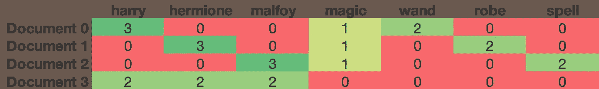
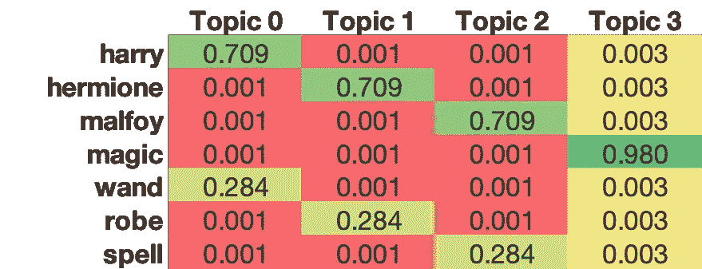
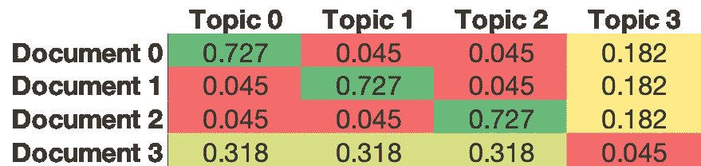
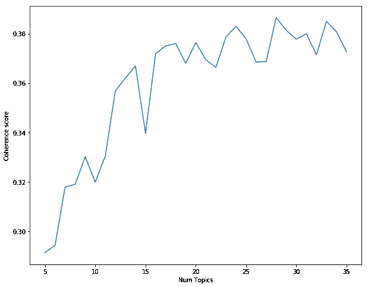
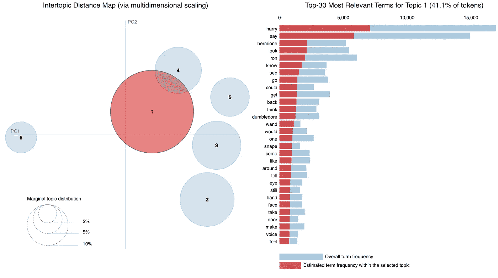

# 《哈利·波特》文本的解读

> 原文：<https://towardsdatascience.com/basic-nlp-on-the-texts-of-harry-potter-topic-modeling-with-latent-dirichlet-allocation-f3c00f77b0f5?source=collection_archive---------3----------------------->

## 基于潜在狄利克雷分配的主题建模


“Hmm,” said a small voice in his ear. “Difficult. Very difficult. Plenty of courage, I see. Not a bad mind either. There’s talent, oh my goodness, yes — and a nice thirst to prove yourself, now that’s interesting. . . . So where shall I put you?”

我是 Greg Rafferty，湾区的数据科学家。你可以在我的 [github](https://github.com/raffg/harry_potter_nlp) 上查看这个项目的代码。如有任何问题，请随时联系我！

在这篇文章中，我将通过《哈利·波特》的视角，用潜在的狄利克雷分配来描述主题建模，并比较不同的算法。即将发布的帖子将涵盖另外两个 NLP 任务:文本摘要和情感分析。

最近，我和一个团队参与了一个新项目，他们一致感到震惊和失望，因为我从未读过或看过关于一个名叫哈利·波特的虚构巫师的电影。为了融入团队，显然也为了避免我的职业生涯过早结束，我很快意识到我必须参加一个关于霍格沃茨发生的事情的速成班。带着我的电子书阅读器和七个闪亮的新 pdf 文件，我坐下来看看到底是怎么回事。与此同时，我已经开始从事一个由一堆不相关的 NLP 任务组成的兼职项目。我需要一套大小合适的文本文档，我认为所有这些闪亮的新 pdf 将是一个很好的来源。

在第三本书中间的某个地方，我突然意识到 LDA 基本上只是一个算法排序帽。

LDA，或潜在的 Dirichlet 分配，是由单词和/或短语组成的文档语料库的生成概率模型(在 NLP 术语中)。该模型由两个表组成；第一个表是从特定主题采样时在语料库中选择特定单词的概率，第二个表是从特定文档采样时选择特定主题的概率。

这里有一个例子。假设我有这三个(相当不重要的)文档:

```
document_0 = "Harry Harry wand Harry magic wand"
document_1 = "Hermione robe Hermione robe magic Hermione"
document_2 = "Malfoy spell Malfoy magic spell Malfoy"
document_3 = "Harry Harry Hermione Hermione Malfoy Malfoy"
```

以下是这些文档的术语频率矩阵:



从这一点看，很明显 0 号文件主要是关于哈利的，有一点是关于魔法的，还有一部分是关于魔杖的。文件 1 也有一点关于魔法，但主要是关于赫敏和长袍。文件 2 也是部分关于魔法，但主要是关于马尔福和咒语。文件 3 同样是关于哈利、赫敏和马尔福的。通常不太容易看出这一点，因为更实用的语料库将由成千上万的单词组成，所以让我们看看 LDA 算法选择什么主题:



Data Science with Excel!

这大概就是我们根据词频和直觉预测的结果。主题的数量是一个超参数，您需要仔细选择和调整，我将在后面详细介绍，但在这个示例中，我选择了 4 个主题来阐述我的观点。上面的表格显示单词和主题，下面的表格显示文档和主题。上表中的每一列和下表中的每一行的总和必须为 1。这些表格告诉我们，如果我们从 Topic 0 中随机抽取一个单词，有 70.9%的几率会得到“Harry”。如果我们从话题 3 中选一个词，几乎可以肯定我们会选“魔法”。如果我们对文档 3 进行采样，那么我们选择主题 0、1 或 2 的可能性是相等的。

这取决于我们这些聪明的人，他们可以从一堆单词中推断出这些主题的意思。在这些词汇非常有限的例子中，主题显然与单个单词相对应。如果我们在几千个餐馆描述上运行 LDA，我们可能会找到与菜肴类型或氛围相对应的主题。值得注意的是，与 Kmeans 等典型的聚类算法不同，LDA 允许一个文档存在于多个主题中。因此，在这些餐馆描述中，我们可能会在“意大利”、“约会之夜”和“咖啡馆”主题中找到一家餐馆。

这一切和分院帽有什么关系？霍格沃茨所有的新生在到达的第一天都要经历一个仪式来决定他们将住在哪个房子里(我可能是唯一一个直到几周前才知道这件事的人)。分院帽一旦戴在某人的头上，就能理解他们的思想、梦想和经历。这有点像 LDA 构建词频矩阵并理解每个文档中包含哪些单词和 N 元语法。

分院帽然后将学生的属性与各个学院的属性进行比较(勇敢归格兰芬多，忠诚归赫奇帕奇，智慧归拉文克劳，卑鄙、狡诈的人渣归斯莱特林(好吧，就一个简短的题外话——有谁能*向我解释一下为什么斯莱特林坚持了这所学校的千年历史吗？这就像一个兄弟会发现自己每年都陷入另一个可笑的淫秽丑闻！)).这是 LDA 创建单词-主题表并开始关联主题属性的地方。*

由于哈利集勇气、智慧、天赋和雄心于一身，他在格兰芬多和斯莱特林之间的排名明显不同，但格兰芬多只是略微领先，哈利·波特成为了整整一代年轻千禧一代的英雄，而不是反面角色。LDA 在这里创建文档主题表，并最终确定每个文档的主导主题。

好了，现在我们大致了解了 LDA 的功能，让我们来看看 Python 中的两种不同实现。查看我的 [Github repo](https://github.com/raffg/basic_nlp) 了解所有的基本细节。

首先，确定应该建模多少主题的最佳方法之一是肘图。这也是通常用于确定使用聚类算法选择多少个聚类的技术。在这种情况下，我们将根据主题数量绘制一致性分数:



你通常会选择连贯性分数开始稳定的最低数量的主题。这就是为什么它被称为肘图——你在陡峭的收益和浅的收益之间选择肘。在这种情况下(这是一个非常尖锐的情况；通常曲线比这个稍微平滑一点)，我会选择大约 20 个主题。

我使用的第一个模型是 Gensim 的 [ldamodel](https://radimrehurek.com/gensim/models/ldamodel.html) 。在 20 个主题中，Gensim 的一致性得分为 0.319。这并不伟大；事实上，我们接下来要看的 Mallet 算法几乎总是优于 Gensim 的算法。然而，Gensim 的一个真正酷的东西是 pyLDAvis，一个可以在 Jupyter 笔记本上运行的交互式图表。它用两个主成分绘制聚类图，并显示每个聚类中单词的比例:



Harry Potter and the Allocation of Dirichlet

我研究的下一个实现是 Mallet ( **马**Chine**L**earning for**L**anguag**E**T12ool kit)，这是 UMASS Amherst 推出的一个基于 Java 的包。Mallet 和 Gensim 的标准 LDA 之间的区别在于，Gensim 使用变分贝叶斯采样方法，该方法比 Mallet 的 Gibbs 采样更快，但精度较低。幸运的是，对于那些喜欢用 Python 编码的人来说，Gensim 有一个 Mallet 的包装器:[通过 Mallet 的潜在 Dirichlet 分配](https://radimrehurek.com/gensim/models/ldamallet.html)。为了使用它，你需要从这里[http://mallet.cs.umass.edu/dist/mallet-2.0.8.zip](http://mallet.cs.umass.edu/dist/mallet-2.0.8.zip)下载 Mallet Java 包并安装 Java 开发工具包。一旦一切都设置好了，实现这个模型就和 Gensim 的标准模型差不多了。使用 Mallet，20 主题模型的一致性分数增加到 0.375(记住，Gensim 的标准模型输出 0.319)。这是一个适度的增长，但通常会持续各种数据源，所以尽管 Mallet 稍慢，但我更喜欢它的回报增加。

最后，我在哈利波特系列的所有 7 本书的 192 个章节上建立了一个木槌模型。以下是每个潜在主题的模型输出的前 10 个关键词。你如何命名这些集群？