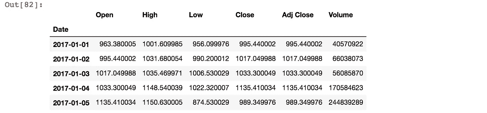
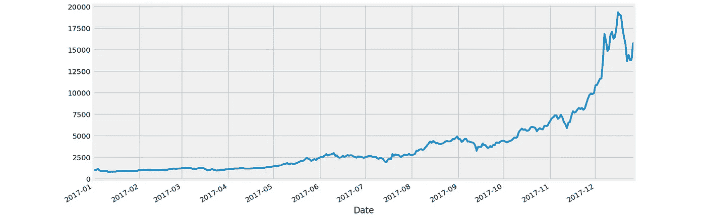
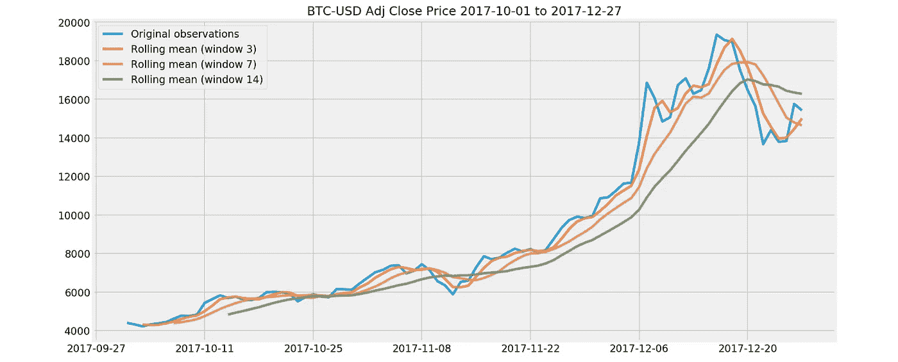
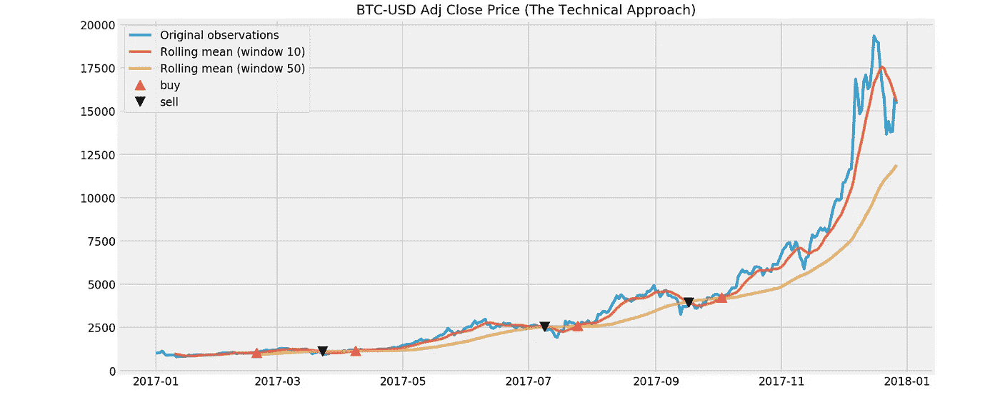
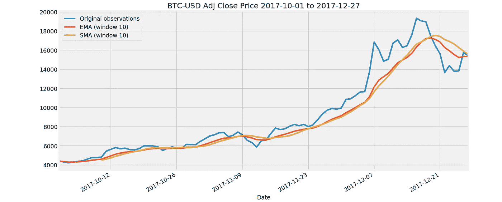

# 比特币价格数据的基本时间序列分析和交易策略

> 原文：<https://towardsdatascience.com/basic-time-series-analysis-and-trading-strategy-with-bitcoin-price-data-1a8f1a30f11?source=collection_archive---------2----------------------->


Photo by [Dmitry Demidko](https://unsplash.com/@wildbook?utm_source=medium&utm_medium=referral) on [Unsplash](https://unsplash.com?utm_source=medium&utm_medium=referral)

我必须说，时间序列分析不是一个简单的话题。至少对我来说是这样。在伦敦大会数据科学沉浸式课程的课堂上，我有机会了解这个主题，并花了一些时间来理解它。

这篇文章的目的是通过实施并试图向他人解释来巩固我所学到的东西。我不是金融专家，所以非常感谢熟悉这个领域的人的任何建议或反馈。

# 时间序列

[时间序列](https://en.wikipedia.org/wiki/Time_series)是一系列按时间顺序索引(或列出或绘制)的数据点。时间序列数据应与其他类型的数据区别对待。统计数据假设之一是其独立性。独立性意味着一个观察值不会影响其他观察值。但是在时间序列数据中，每个数据点在时间上是靠在一起的，它们并不完全独立于它们的相邻值。因此，我们需要一种不同的方法来模拟时间序列数据。

首先，从加载依赖项开始。Pandas_datareader 是一个从 web 中提取金融数据的有用库。对于这篇文章，我将从雅虎财经中提取数据。

```
import pandas as pd
import pandas_datareader.data as web
import numpy as np
import matplotlib.pyplot as plt
import seaborn as sns
import datetimeplt.style.use('fivethirtyeight')%config InlineBackend.figure_format = 'retina'
%matplotlib inline
```

好了，我们来获取 2017 年初至 2017 年 12 月 27 日 BTC-美元(比特币价值以美元计)的价格数据。

```
btc = web.get_data_yahoo('BTC-USD', start=datetime.datetime(2017, 1, 1), end=datetime.datetime(2017, 12, 27))
btc.head()
```



如您所见，该数据有六列。“开盘价”代表当天的开盘价，“高”代表当天的最高价，“低”代表当天的最低价，“收盘”代表当天的收盘价，“调整收盘”代表调整后的收盘价，“成交量”代表成交量。在股票价格中，调整后的收盘价反映了股票在任何给定交易日的收盘价，该收盘价已被修改为包括第二天开盘前任何时间发生的任何分配和公司行为。

但是 100%诚实地说，我不确定一种货币的调整后收盘价将考虑哪些因素，但是通过查看“收盘”列和“Adj Close”列的差异，它们似乎完全相同。

```
np.sum(btc['Close'] - btc['Adj Close'])
```


让我们在图表上绘制“Adj Close”价格数据。

```
btc_adj = btc['Adj Close']
btc_adj.plot(lw=2.5, figsize=(12, 5))
plt.show()
```



看起来比特币的美元价值在 2017 年上半年一直保持稳定，但从 11 月份左右开始振荡并急剧上升。

# 移动平均数

时间序列数据的基本分析技术之一是[移动平均](https://en.wikipedia.org/wiki/Moving_average)。顾名思义，移动平均值(也称为滚动平均值)不是计算整个数据集的平均值，而是计算具有特定窗口大小的子集的平均值，并向前移动。移动平均线用于平滑短期波动，突出长期趋势或周期。

让我们通过绘制 2017 年 1 月 10 日至 2017 年 12 月 27 日的价格数据来看看移动平均线在图表上的工作原理。我选择了 2017 年第四季度来绘制数据中有强烈趋势的地方，以清楚地看到移动平均线是如何工作的。

```
btc_recent = btc_adj.loc['2017-10-01':'2017-12-27']
rroll_d3 = btc_recent.rolling(window=3).mean()
rroll_d7 = btc_recent.rolling(window=7).mean()
rroll_d14 = btc_recent.rolling(window=14).mean()plt.figure(figsize=(14, 7))
plt.plot(btc_recent.index, btc_recent, lw=3, alpha=0.8,label='Original observations')
plt.plot(btc_recent.index, rroll_d3, lw=3, alpha=0.8,label='Rolling mean (window 3)')
plt.plot(btc_recent.index, rroll_d7, lw=3, alpha=0.8,label='Rolling mean (window 7)')
plt.plot(btc_recent.index, rroll_d14, lw=3, alpha=0.8,label='Rolling mean (window 14)')
plt.title('BTC-USD Adj Close Price 2017-10-01 to 2017-12-27')
plt.tick_params(labelsize=12)
plt.legend(loc='upper left', fontsize=12)
plt.show()
```



与用蓝线绘制的原始观察结果相比，我们可以看到，随着窗口尺寸变大，线条曲线变得更加平滑。

# 双重移动平均线交叉

均线的另一个使用案例是在一个叫做双重均线交叉的交易策略中。我通过[一篇中型博客文章](https://medium.com/datacamp/python-for-finance-algorithmic-trading-60fdfb9bb20d)了解到这一点，它被很好地解释了，不仅是关于动量策略，还有 Python 在交易策略建模中的一般用例。如果你是对 Python 金融建模感兴趣的初学者，我强烈推荐这篇文章。

我下面实现的只是我提到的博客文章中的教程的一个应用，但是我将短窗口改为 10 天而不是最初文章的 40 天，对于更长的时间，我使用 50 天并将其命名为 mid_window，而不是最初文章作者使用的 100 天。我想，如果把时间框架改得更短，这个策略将会更加短视。但我不是金融专家，我不确定将时间框架改得更短是否会犯根本性错误。如果阅读这篇文章的人是金融专家，请随时纠正我的逻辑错误。

双重均线交叉的概念非常简单。计算价格的两条移动平均线，一条是短期的，另一条是长期的。长期移动平均线的方差较低，与短期移动平均线的移动方向相同，但速率不同。不同的方向变化率导致两个移动平均值可能相等或彼此交叉的点。这些点被称为交叉点。在双重移动平均线交叉交易策略中，这些交叉点是决定买入或卖出货币的点。

按照原博文作者的说法，“当短期平均线穿越长期平均线并升至其上方时，产生买入信号，而当短期平均线穿越长期平均线并跌破长期平均线时，触发卖出信号”。

然而，在寻找关于这个主题的更多材料时，我也发现了对相同信号点的相反方法。作者介绍的上述方法称为技术方法，另一种方法称为价值方法。

价值方法提供了与技术方法相反的交易信号。价值方法认为，当短期平均线从长期平均线的下方穿越到上方时，投资现在被高估了，应该卖出。相反，当货币短期平均值低于长期平均值时，则货币被低估，应该买入。

看到对同一情况有两种相互矛盾的观点是非常有趣的。但是在这篇文章中，我将集中讨论技术方法。现在让我们看看如何将它应用到真实数据中。

```
short_window = 10
mid_window = 50signals = pd.DataFrame(index=btc_adj.index)
signals['signal'] = 0.0roll_d10 = btc_adj.rolling(window=short_window).mean()
roll_d50 = btc_adj.rolling(window=mid_window).mean()signals['short_mavg'] = roll_d10
signals['mid_mavg'] = roll_d50
signals['signal'][short_window:] = np.where(signals['short_mavg'][short_window:] > signals['mid_mavg'][short_window:], 1.0, 0.0)
signals['positions'] = signals['signal'].diff()
```

现在我们可以把它画出来，看看它在图表上是什么样子。

```
plt.figure(figsize=(14, 7))
plt.plot(btc_adj.index, btc_adj, lw=3, alpha=0.8,label='Original observations')
plt.plot(btc_adj.index, roll_d10, lw=3, alpha=0.8,label='Rolling mean (window 10)')
plt.plot(btc_adj.index, roll_d50, lw=3, alpha=0.8,label='Rolling mean (window 50)')plt.plot(signals.loc[signals.positions == 1.0].index, 
         signals.short_mavg[signals.positions == 1.0],
         '^', markersize=10, color='r', label='buy')

plt.plot(signals.loc[signals.positions == -1.0].index, 
         signals.short_mavg[signals.positions == -1.0],
         'v', markersize=10, color='k', label='sell')plt.title('BTC-USD Adj Close Price (The Technical Approach)')
plt.tick_params(labelsize=12)
plt.legend(loc='upper left', fontsize=12)
plt.show()
```



```
initial_investment = btc_adj.loc[list(signals[signals.positions == 1.0].index)][0]
bought = np.sum(btc_adj.loc[list(signals[signals.positions == 1.0].index)]*-1.0)
sold = np.sum(btc_adj.loc[list(signals[signals.positions == -1.0].index)])
current_btc_value = btc_adj[-1]balance = pd.DataFrame([btc_adj.loc[list(signals[signals.positions == 1.0].index)]*-1.0,
              btc_adj.loc[list(signals[signals.positions == -1.0].index)]]).transpose()
balance = balance.fillna(0)
balance['balance'] = balance.sum(axis=1)print "Initial investment amount: {0:.2f} USD".format(initial_investment)
print "Maximum invested amount: {0:.2f} USD".format(abs(min(balance.cumsum().balance)))
print "Current asset value: {0:.2f} USD".format(bought+sold+current_value)
```


按照技术方法，我会以 1，048.89 美元开始投资，在大约一年的时间内，我需要 1，551.77 美元继续投资，我的 1 比特币的最终价值现在应该是 1，3864.87 美元(2017 年 12 月 27 日)。这可能是一个天真的计算，没有考虑交易费或其他可能发生的费用。但在一个简化的计算中，这并不是一项糟糕的投资。

如果将价值方法应用于同一图表，情况可能会有所不同。金融学里有“做空”和“做多”的概念。“卖空一项资产意味着出售一项我们目前不持有的资产，并获得其现金价值。卖空与出售我们已经拥有的资产不同，后者被称为做多。”对我来说，这听起来总是有点违背直觉，出售一个人甚至不拥有的东西。如果你有兴趣了解这方面的更多信息，你可能会发现来自 Investopedia 的[这一页](https://www.investopedia.com/ask/answers/100314/whats-difference-between-long-and-short-position-market.asp)很有帮助。

从技术角度来看，最后一笔交易是“买入”，但从价值角度来看，这笔交易应该是“卖出”。正如你所看到的，价格没有下跌，而是继续上涨，在这种情况下，卖空者可能会被他的经纪人追加保证金。

# 指数移动平均线

时间序列数据的另一种平滑技术是 EMA(指数移动平均线)。EMA 是最近 n 个(窗口大小)价格的加权平均值，权重随着每个价格/周期呈指数下降。简而言之，最近的价格比过去的价格被赋予更大的权重，并且随着时间周期从当前观察进一步向过去发展，贡献的程度呈指数衰减。

时间 t 的(调整后的)指数移动平均值定义为:


这里α是衰减因子。但是有一点我不能理解。我能理解这种逻辑，但是当涉及到 Pandas 的“ewm”函数时，我弄不明白 alpha 的默认值是什么。也许有一个标准，即使没有明确说明，每个人都同意，但我花了大量的时间试图弄清楚这一点，但我仍然不确定。也许我错过了一些重要的东西。如果你对此很熟悉，任何帮助都将不胜感激。

**更新:我在上面找到了自己问题的答案。我不得不承认，我没有仔细查看文档。有时候真的很奇怪，我在文档中查看了所有的解释，但不知何故我不能理解。与熊猫的 EWM 函数，没有默认值，你必须指定衰变。有四种不同的方式可以指定它。在下面的代码中，我用“span”来指定它，在这种情况下，alpha 被定义为 2/(span+1)。因此，通过将“span”指定为 10，我将 alpha 指定为大约 0.18。也可以从 Pandas 0 . 18 . 0 版直接指定 alpha。*

但直觉上，与简单移动平均线相比，指数移动平均线对最近的价格变动反应更快，因为它赋予当前价值更多的权重。

```
exp_weighted_mean = btc_recent.resample('D').sum().ewm(span=10).mean()
sma_d10 = btc_recent.rolling(window=10).mean()
ax = btc_recent.plot(lw=3, figsize=(14, 7), label='Original observations')
exp_weighted_mean.plot(ax=ax, lw=3, label='EMA (window 10)')
sma_d10.plot(ax=ax, lw=3, label='SMA (window 10)')
plt.title('BTC-USD Adj Close Price 2017-10-01 to 2017-12-27', fontsize=16)
plt.tick_params(labelsize=12)
plt.legend(loc='upper left', fontsize=12)
plt.show()
```



从上面的图表中，你可以看到红线的均线在 12 月中旬比黄线的均线更快地抓住了向下的趋势，并且在最后，均线开始抓住向上的趋势，而均线仍然显示向下的趋势。

你可以把双重均线交叉的相同逻辑应用到原始观察和均线上。只是这次我们寻找原始观察值和均线的交叉点。让我们看看在从 2017 年 1 月 10 日到 2017 年 12 月 27 日的短时间内这将如何表现。

```
exp_weighted_mean = btc_recent.resample('D').sum().ewm(span=20).mean()signals_ema = pd.DataFrame(index=btc_recent.index)
signals_ema['signal'] = 0.0signals_ema['original'] = btc_recent
signals_ema['EMA'] = exp_weighted_meansignals_ema['signal'] = np.where(signals_ema['original'] > signals_ema['EMA'], 1.0, 0.0)signals_ema['positions'] = signals_ema['signal'].diff()
```

现在让我们在图表上看看这个。

```
plt.figure(figsize=(14, 7))ax = btc_recent.plot(lw=3, figsize=(14, 7), label='Original observations')
exp_weighted_mean.plot(ax=ax, lw=3, label='Exponentially weighted mean')plt.plot(signals_ema.loc[signals_ema.positions == 1.0].index, 
         signals_ema.EMA[signals_ema.positions == 1.0],
         '^', markersize=10, color='r', label='buy')

plt.plot(signals_ema.loc[signals_ema.positions == -1.0].index, 
         signals_ema.EMA[signals_ema.positions == -1.0],
         'v', markersize=10, color='k', label='sell')plt.title('BTC-USD Adj Close Price (EMA Trading Strategy)')
plt.tick_params(labelsize=12)
plt.legend(loc='upper left', fontsize=12)
plt.show()
```


```
initial_investment = btc_recent.loc[list(signals_ema[signals_ema.positions == 1.0].index)][0]
bought = np.sum(btc_recent.loc[list(signals_ema[signals_ema.positions == 1.0].index)]*-1.0)
sold = np.sum(btc_recent.loc[list(signals_ema[signals_ema.positions == -1.0].index)])
current_btc_value = btc_recent[-1]balance_ema = pd.DataFrame([btc_recent.loc[list(signals_ema[signals_ema.positions == 1.0].index)]*-1.0,
              btc_recent.loc[list(signals_ema[signals_ema.positions == -1.0].index)]]).transpose()
balance_ema = balance_ema.fillna(0)
balance_ema['balance'] = balance_ema.sum(axis=1)print "Initial investment amount: {0:.2f} USD".format(initial_investment)
print "Maximum invested amount: {0:.2f} USD".format(abs(min(balance_ema.cumsum().balance)))
print "Current asset value: {0:.2f} USD".format(bought+sold+current_value)
```


使用 EMA 交易策略，我会以 4，321.44 美元开始投资，在大约两个月的时间内，我需要 6，665.21 美元继续投资，我的 1 比特币的最终价值现在应该是 8，751.43 美元(27/12/2017)。

这是一个有趣的玩具项目，以实际落实我在课堂上学到的知识，我将尝试用时间序列分析和比特币数据进行进一步探索。但是我应该投资比特币吗？我还不确定，也许当我进一步探索的时候，我会找到一些答案。

感谢您的阅读，您可以从下面的链接中找到上面代码的 Jupyter 笔记本。

[https://github . com/tthustle sa/TSA _ bit coin/blob/master/BTC _ price . ipynb](https://github.com/tthustla/TSA_bitcoin/blob/master/BTC_price.ipynb)