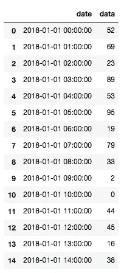
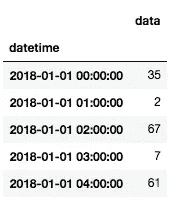
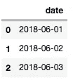
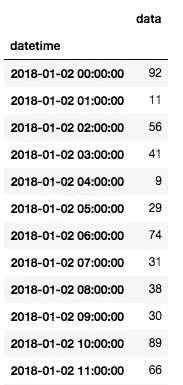
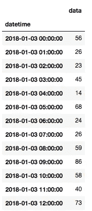
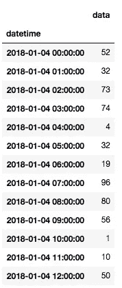
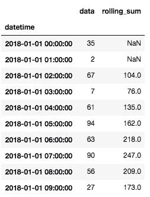
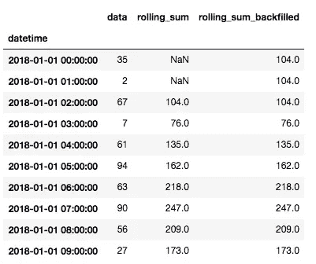

# 熊猫的基本时间序列操作

> 原文：<https://towardsdatascience.com/basic-time-series-manipulation-with-pandas-4432afee64ea?source=collection_archive---------0----------------------->


[image courtesy: [https://pixabay.com/](https://pixabay.com/)]

作为一个几乎每天都在处理时间序列数据的人，我发现 [pandas](https://pandas.pydata.org/pandas-docs/stable/) Python 包对于时间序列操作和分析非常有用。

这是关于 pandas 的时间序列数据操作的基本介绍，可以让您开始时间序列分析。具体目标是向您展示如何:

*   创建日期范围
*   使用时间戳数据
*   将字符串数据转换为时间戳
*   对数据框中的时间序列数据进行索引和切片
*   对不同时间段的聚合/汇总统计数据的时间序列进行重新采样
*   计算滚动统计，如滚动平均值
*   处理缺失的数据
*   了解 UNIX/纪元时间的基础知识
*   了解时间序列数据分析的常见陷阱

让我们开始吧。如果您想处理您拥有的真实数据，您可能想从使用 [pandas](https://pandas.pydata.org/pandas-docs/stable/generated/pandas.read_csv.html) `[read_csv](https://pandas.pydata.org/pandas-docs/stable/generated/pandas.read_csv.html)`将您的文件读入数据框开始，但是我们将从处理生成的数据开始。

首先导入我们将要使用的库，然后用它们来**创建一个日期范围**

```
import pandas as pd
from datetime import datetime
import numpy as npdate_rng = pd.date_range(start='1/1/2018', end='1/08/2018', freq='H')
```

此日期范围具有每小时一次的时间戳。如果我们调用`date_rng`，我们会看到它看起来像下面这样:

```
DatetimeIndex(['2018-01-01 00:00:00', '2018-01-01 01:00:00',
               '2018-01-01 02:00:00', '2018-01-01 03:00:00',
               '2018-01-01 04:00:00', '2018-01-01 05:00:00',
               '2018-01-01 06:00:00', '2018-01-01 07:00:00',
               '2018-01-01 08:00:00', '2018-01-01 09:00:00',
               ...
               '2018-01-07 15:00:00', '2018-01-07 16:00:00',
               '2018-01-07 17:00:00', '2018-01-07 18:00:00',
               '2018-01-07 19:00:00', '2018-01-07 20:00:00',
               '2018-01-07 21:00:00', '2018-01-07 22:00:00',
               '2018-01-07 23:00:00', '2018-01-08 00:00:00'],
              dtype='datetime64[ns]', length=169, freq='H')
```

我们可以检查第一个元素的类型:

```
type(date_rng[0])#returnspandas._libs.tslib.Timestamp
```

让我们用时间戳数据创建一个示例数据框，并查看前 15 个元素:

```
df = pd.DataFrame(date_rng, columns=['date'])df['data'] = np.random.randint(0,100,size=(len(date_rng)))df.head(15)
```



Example data frame — df

如果我们想进行时间序列操作，我们需要一个日期时间索引，这样我们的数据框就可以在时间戳上建立索引。

**将数据帧索引转换为日期时间索引**，然后显示第一个元素:

```
df['datetime'] = pd.to_datetime(df['date'])df = df.set_index('datetime')df.drop(['date'], axis=1, inplace=True)df.head()
```



df with datetime index

如果我们数据中的“时间戳”实际上是字符串类型而不是数字类型，会怎么样？让我们将我们的`date_rng`转换成一个字符串列表，然后将字符串转换成时间戳。

```
string_date_rng = [str(x) for x in date_rng]string_date_rng#returns['2018-01-01 00:00:00',
 '2018-01-01 01:00:00',
 '2018-01-01 02:00:00',
 '2018-01-01 03:00:00',
 '2018-01-01 04:00:00',
 '2018-01-01 05:00:00',
 '2018-01-01 06:00:00',
 '2018-01-01 07:00:00',
 '2018-01-01 08:00:00',
 '2018-01-01 09:00:00',...
```

我们可以**通过推断它们的格式将字符串转换成时间戳**，然后查看值:

```
timestamp_date_rng = pd.to_datetime(string_date_rng, infer_datetime_format=True)timestamp_date_rng#returnsDatetimeIndex(['2018-01-01 00:00:00', '2018-01-01 01:00:00',
               '2018-01-01 02:00:00', '2018-01-01 03:00:00',
               '2018-01-01 04:00:00', '2018-01-01 05:00:00',
               '2018-01-01 06:00:00', '2018-01-01 07:00:00',
               '2018-01-01 08:00:00', '2018-01-01 09:00:00',
               ...
               '2018-01-07 15:00:00', '2018-01-07 16:00:00',
               '2018-01-07 17:00:00', '2018-01-07 18:00:00',
               '2018-01-07 19:00:00', '2018-01-07 20:00:00',
               '2018-01-07 21:00:00', '2018-01-07 22:00:00',
               '2018-01-07 23:00:00', '2018-01-08 00:00:00'],
              dtype='datetime64[ns]', length=169, freq=None)
```

但是如果我们需要**转换一个独特的字符串格式**呢？

让我们创建一个字符串形式的任意日期列表，并将它们转换为时间戳:

```
string_date_rng_2 = ['June-01-2018', 'June-02-2018', 'June-03-2018']timestamp_date_rng_2 = [datetime.strptime(x,'%B-%d-%Y') for x in string_date_rng_2]timestamp_date_rng_2#returns[datetime.datetime(2018, 6, 1, 0, 0),
 datetime.datetime(2018, 6, 2, 0, 0),
 datetime.datetime(2018, 6, 3, 0, 0)]
```

如果我们把它放到一个数据框里会是什么样子？

```
df2 = pd.DataFrame(timestamp_date_rng_2, columns=['date'])df2
```



回到我们最初的数据帧，让我们**通过解析时间戳索引**来查看数据:

假设我们只想查看日期是本月 2 日的数据，我们可以使用如下的索引。

```
df[df.index.day == 2]
```

这个的顶部看起来像:



我们也可以通过数据框的索引直接调用我们想要查看的日期:

```
df['2018-01-03']
```



在特定日期之间选择数据**怎么样？**

```
df['2018-01-04':'2018-01-06']
```



我们填充的基本数据框以每小时的频率为我们提供数据，但是我们可以**以不同的频率**对数据进行重新采样，并指定我们希望如何计算新采样频率的汇总统计数据。我们可以取最小值、最大值、平均值、总和等。，按照下面的示例，以每天的频率而不是每小时的频率来计算数据的日平均值:

```
df.resample('D').mean()
```


那么**窗口统计呢，比如滚动平均值或滚动总和**？

让我们在原始 df 中创建一个新列，计算 3 个窗口期间的滚动总和，然后查看数据框的顶部:

```
df['rolling_sum'] = df.rolling(3).sum()
df.head(10)
```



我们可以看到，这是正确的计算，只有当有三个周期可以回顾时，它才开始有有效值。

这是一个很好的机会，看看我们如何在处理缺失数据值时进行**数据转发或回填。**

这是我们的 df，但增加了一个新列，接受滚动总和并回填数据:

```
df['rolling_sum_backfilled'] = df['rolling_sum'].fillna(method='backfill')
df.head(10)
```



用现实值(如一段时间内的平均值)填充缺失的数据通常很有用，但请始终记住，如果您正在处理一个时间序列问题并希望您的数据是现实的，您应该**而不是**对您的数据进行回填，因为这就像是展望未来并获得您在该时间段内永远不会获得的信息。您可能希望向前填充数据的频率高于回填。

处理时间序列数据时，您可能会遇到 Unix 时间中的时间值。Unix 时间，也称为纪元时间，是自协调世界时(UTC)1970 年 1 月 1 日星期四 00:00:00 以来经过的秒数。使用 Unix 时间有助于消除时间戳的歧义，这样我们就不会被时区、夏令时等弄糊涂了。

下面是一个以纪元时间表示的时间 t 的示例，并且**将 UNIX/纪元时间转换为以 UTC 表示的常规时间戳**:

```
epoch_t = 1529272655
real_t = pd.to_datetime(epoch_t, unit='s')real_t#returnsTimestamp('2018-06-17 21:57:35')
```

如果我想**将 UTC 时间转换成我自己的时区**，我可以简单地做以下事情:

```
real_t.tz_localize('UTC').tz_convert('US/Pacific')#returnsTimestamp('2018-06-17 14:57:35-0700', tz='US/Pacific')
```

有了这些基础知识，您就可以开始处理时间序列数据了。

以下是在处理时间序列数据时需要记住的一些技巧和要避免的常见陷阱:

*   **检查您的数据中是否存在差异**，这些差异可能是由特定地区的时间变化(如夏令时)引起的。
*   **小心翼翼地跟踪时区**——让阅读您代码的其他人知道您的数据处于哪个时区，并考虑转换为 UTC 或标准化值，以便保持您的数据标准化。
*   丢失数据可能经常发生——确保您**记录了您的清理规则**,并考虑不要回填您在取样时无法获得的信息。
*   请记住，当您对数据进行重新采样或填充丢失的值时，您会丢失一些关于原始数据集的信息。我建议**跟踪你所有的数据转换**，并跟踪数据问题的根源。
*   当你对数据进行重采样时，最好的方法(平均值、最小值、最大值、总和等。)将取决于你所拥有的数据种类以及数据的取样方式。**考虑好如何为你的分析重新采样数据**。