# 使用 IBM PowerAI 开源框架的机器学习中的图像分类基础(第 2 部分)

> 原文：<https://towardsdatascience.com/basics-of-image-classification-in-machine-learning-using-open-source-frameworks-in-ibm-powerai-b4291dc40d25?source=collection_archive---------2----------------------->

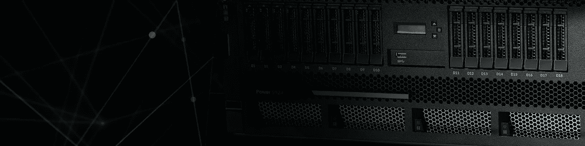

[IBM Power Systems](https://www.ibm.com/power)

# 介绍

图像分类已经成为展示机器学习的关键试点用例之一。在之前的[文章](/machine-learning-with-ibm-powerai-getting-started-with-image-classification-part-1-6219e3c6a9fa)中，我介绍了机器学习，IBM PowerAI，在 IBM Power 平台上运行图像分类程序时比较了 GPU 和 CPU 的性能。在本文中，我们来看看如何检查神经网络任何内层的输出，并通过使用 Nvidia DIGITS 来训练您自己的模型。

# 观察隐藏层参数

直到 20 世纪 80 年代，研究人员才发现给神经网络增加更多的层可以极大地提高其性能。这种具有几个隐藏层的神经网络如今在包括图像分类在内的几个用例中很常见。与名称所表明的相反，可以观察隐藏层中的相关参数。

# 卷积神经网络体系结构

现在你可能知道，卷积神经网络(CNN)是一种深度神经网络，用于图像分类时会产生相当准确的结果。

在工科学校学习数字信号处理的时候，你一定会碰到卷积这个术语。简单来说，两个信号的卷积是两个信号函数的乘积的积分，在其中一个函数被反转和移位之后。在我们的例子中，每个输入图像都是像素值的矩阵。要查看隐藏层中如何执行卷积的可视化表示，请考虑以下示例。


Source: [https://ujjwalkarn.me/2016/08/11/intuitive-explanation-convnets/](https://ujjwalkarn.me/2016/08/11/intuitive-explanation-convnets/)

在本例中，橙色矩阵(3x3)称为滤镜，用于计算原始图像(5X5 像素矩阵)的卷积输出。结果被称为激活图或功能图。应当理解，根据所应用的滤波器，可以修改和训练输出特征图，以获得期望的输出。

在现代 CNN 中，滤波器是在训练过程中自动学习的，但是我们确实根据所使用的架构指定了某些参数(如下所示)。如果你需要更详细的分析，请访问这个[博客](https://ujjwalkarn.me/2016/08/11/intuitive-explanation-convnets/)。

在我们的例子中，使用了 AlexNet 的一个版本，这是我们所依赖的标准架构。在下面的代码中，我们阅读了网络的结构。CNN 包含两个有序字典；

a) `**Net.blobs**`为输入数据；

a.它有以下参数–批量大小、通道尺寸、高度和宽度

b) `**Net.params**`是具有权重和偏差参数的斑点向量；

a.权重表示连接的强度。接近零的权重表示输入和输出之间的良好相关性。

b.偏差表示预测值与实际值之间的差距，对于预测值进入下一步非常重要。

c.它具有以下参数——权重的输出通道、输入通道、滤波器高度和滤波器宽度，以及偏差的一维输出通道。

让我们试着把这些打印出来。

```
# for each layer, show the output shapefor layer_name, blob in net.blobs.iteritems():print layer_name + ‘\t’ + str(blob.data.shape)
```

这是输出。

```
data (50, 3, 227, 227)conv1 (50, 96, 55, 55)pool1 (50, 96, 27, 27)norm1 (50, 96, 27, 27)conv2 (50, 256, 27, 27)pool2 (50, 256, 13, 13)norm2 (50, 256, 13, 13)conv3 (50, 384, 13, 13)conv4 (50, 384, 13, 13)conv5 (50, 256, 13, 13)pool5 (50, 256, 6, 6)fc6 (50, 4096)fc7 (50, 4096)fc8 (50, 1000)prob (50, 1000)
```

和；

```
for layer_name, param in net.params.iteritems():print layer_name + ‘\t’ + str(param[0].data.shape), str(param[1].data.shape)
```

这是输出。

```
conv1 (96, 3, 11, 11) (96,)conv2 (256, 48, 5, 5) (256,)conv3 (384, 256, 3, 3) (384,)conv4 (384, 192, 3, 3) (384,)conv5 (256, 192, 3, 3) (256,)fc6 (4096, 9216) (4096,)fc7 (4096, 4096) (4096,)fc8 (1000, 4096) (1000,)
```

如你所见，我们这里有四维数据。这里有一个函数来可视化这些数据；

```
def vis_square(data):
“””Take an array of shape (n, height, width) or (n, height, width, 3)
 and visualize each (height, width) thing in a grid of size approx. sqrt(n) by sqrt(n)”””

 # normalize data for display
 data = (data — data.min()) / (data.max() — data.min())

 # force the number of filters to be square
 n = int(np.ceil(np.sqrt(data.shape[0])))
 padding = (((0, n ** 2 — data.shape[0]),
 (0, 1), (0, 1)) # add some space between filters
 + ((0, 0),) * (data.ndim — 3)) # don’t pad the last dimension (if there is one)
 data = np.pad(data, padding, mode=’constant’, constant_values=1) # pad with ones (white)

 # tile the filters into an image
 data = data.reshape((n, n) + data.shape[1:]).transpose((0, 2, 1, 3) + tuple(range(4, data.ndim + 1)))
 data = data.reshape((n * data.shape[1], n * data.shape[3]) +  data.shape[4:])

 plt.imshow(data); plt.axis(‘off’)
```

在这里，您可以看到层 conv1 中的滤波器；

```
# the parameters are a list of [weights, biases]filters = net.params[‘conv1’][0].datavis_square(filters.transpose(0, 2, 3, 1))
```


Filters in a layer

这里，我们看到前 36 个滤波器的校正响应；

```
feat = net.blobs[‘conv1’].data[0, :36]vis_square(feat)
```

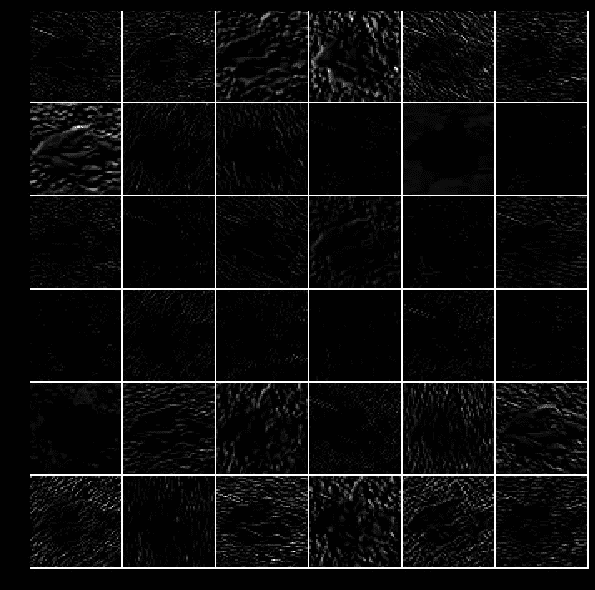

Rectified output

在这里，我们看到第五层的输出，在池化之后；

```
feat = net.blobs[‘pool5’].data[0]vis_square(feat)
```

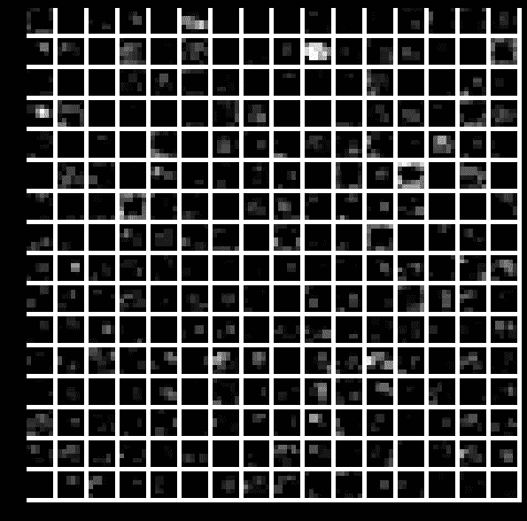

Output of the fifth layer after pooling

第一个完全连接的层是“fc6 ”,它是一个整流输出。使用此代码显示所有非负值的直方图；

```
feat = net.blobs[‘fc6’].data[0]plt.subplot(2, 1, 1)plt.plot(feat.flat)plt.subplot(2, 1, 2)_ = plt.hist(feat.flat[feat.flat > 0], bins=100)
```

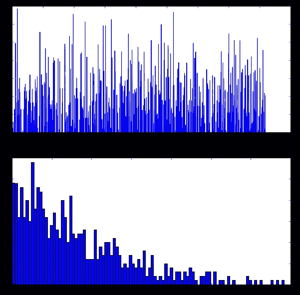

Histogram of rectified output — More explanation in this [blog](/activation-functions-neural-networks-1cbd9f8d91d6)

这里，我们看到了所有预测类的最终概率值的直方图。这里最高的峰值显示了最高的预测类别，在我们的例子中，是猩猩。还显示了其他次要的簇峰。

```
feat = net.blobs[‘prob’].data[0]plt.figure(figsize=(15, 3))plt.plot(feat.flat)[<matplotlib.lines.Line2D at 0x7f09587dfb50>]
```

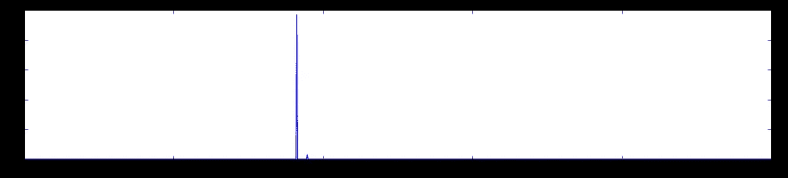

The top peak here shows the top predicted class, in our case, orangutan

# **如何训练自己的机器学习模型？**

**英伟达是什么数字？**

**Nvidia** 深度学习 GPU 训练系统( **DIGITS** )是一个应用程序，用于对图像进行分类，执行分割和对象检测任务。这是一个基于 GUI 的应用程序，与 Caffe 接口。下载和安装程序可以在他们的网站上找到。Github 上也有稳定版和其他测试版。DIGITS 服务器安装在我在这个演示中使用的容器中。安装后，可以从端口 5000 访问 GUI。

下一步是从网上下载一个样本数据集到我在虚拟机中创建的目录(/DIGITS)中。这个数据集被称为 CIFAR-100。它包含 100 个图像类别，每个类别包含 600 个图像。每个类有 500 个训练图像和 100 个测试图像。CIFAR-100 中的 100 个类被分成 20 个超级类。每个图像都有一个“精细”标签(它所属的类)和一个“粗糙”标签(它所属的超类)。

下面是它包含的内容的简要说明；

1) Labels.txt:该文件包含训练数据集中的类的列表。

2) Train:该目录包含用于训练的图像。

3) Train.txt:该文件包含训练文件到类之间的映射列表。标签是按位置排列的，即 labels.txt 文件中的第一个标签用数字 0 表示，第二个用数字 1 表示，依此类推。

4)测试:该目录包含用于测试训练质量的图像。

5) Test.txt:这个文件包含测试文件和类之间的映射列表。标签是按位置排列的，即 labels.txt 文件中的第一个标签用数字 0 表示，第二个用数字 1 表示，依此类推。

```
root@JARVICENAE-0A0A1841:~/DIGITS# python -m digits.download_data cifar100 .
```

输出；

```
Downloading url=http://www.cs.toronto.edu/~kriz/cifar-100-python.tar.gz …Uncompressing file=cifar-100-python.tar.gz …Extracting images file=./cifar-100-python/train …Extracting images file=./cifar-100-python/test …Dataset directory is created successfully at ‘.’Done after 65.3251469135 seconds.
```

让我们来看看下载的数据集。虽然我没有显示上面列出的其他目录，但假设它们已经下载并存在。

```
root@JARVICENAE-0A0A1841:~/DIGITS# ls fine/train | headappleaquarium_fishbabybearbeaverbedbeebeetlebicyclebottle
```

让我们用下载的预训练数据集(CIFAR-100)创建一个新的分类数据集。

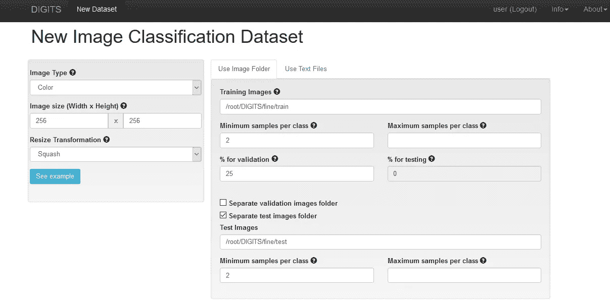

New Image Classification Dataset on DIGITS

这里,/root/DIGITS/fine/train 路径是我们数据集的路径。还要注意“单独的测试图像文件夹”选项，并指定/root/DIGITS/fine/test 目录。您还可以为此数据集指定一个名称，例如“Cifar100”(未在上面的屏幕截图中显示)。

当您单击 Create 时，将启动一个创建培训数据库的新作业，如下所示。

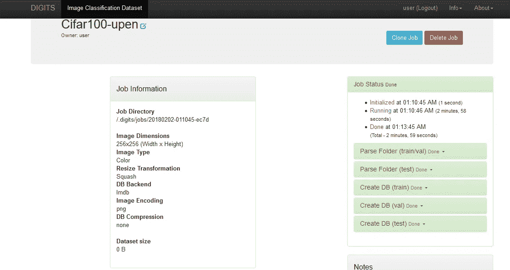

Job status

上图中右侧窗格显示了相关作业的状态。完成后，您的 DIGITS 主屏幕现在应该显示该数据集可供使用。

# **创建新的图像分类模型**

让我们用我们创建的 CIFAR-100 数据集创建一个名为“分类图像”的新图像分类模型。我们将为该模型使用预构建的 AlexNet 神经网络架构。

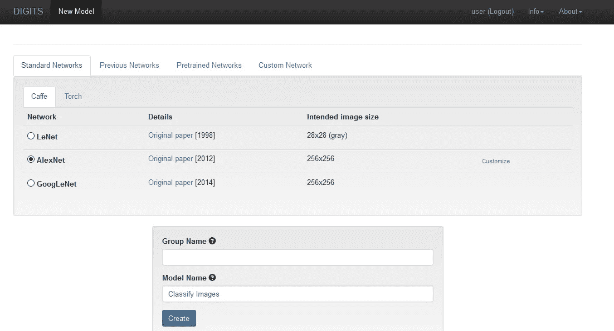

New image classification model

单击“Create ”(创建)后，一个新的作业会像以前一样启动。下面的屏幕截图显示了名为“Train Caffe Model”的作业的状态。

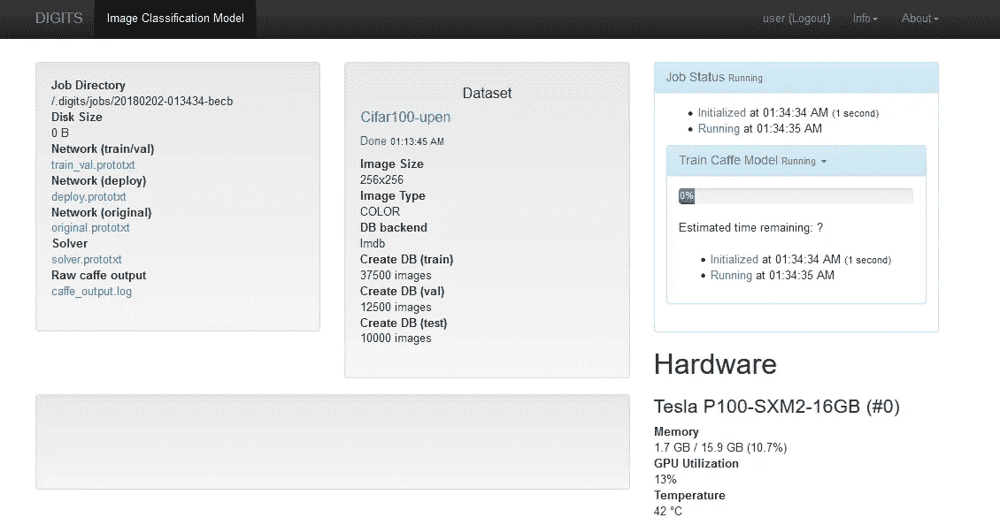

Job status of new image classification model

随着培训的进行，工作状态将在下图中更新。随着时间的推移，我能够看到准确性的提高。

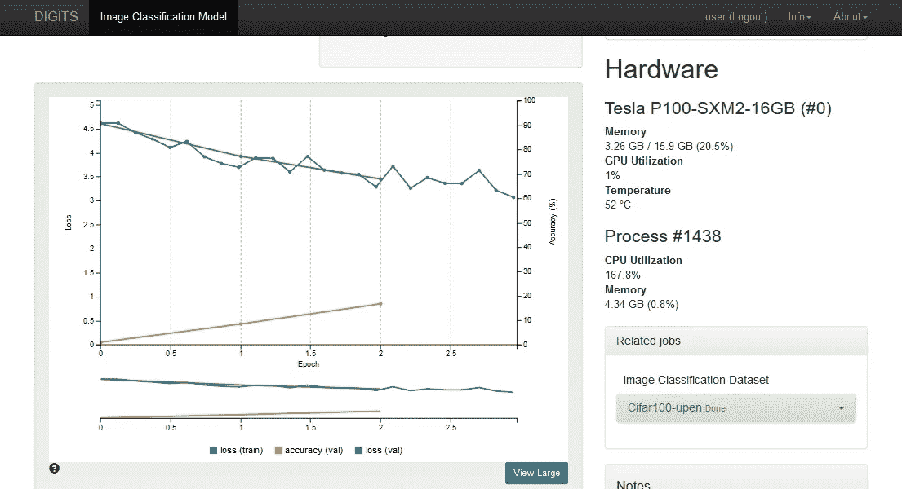

Training your model

一段时间后，当作业完成时，您将能够上传测试图像并根据您的模型对其进行分类。一个示例图像(一个青苹果)正在上传，结果立即可见。

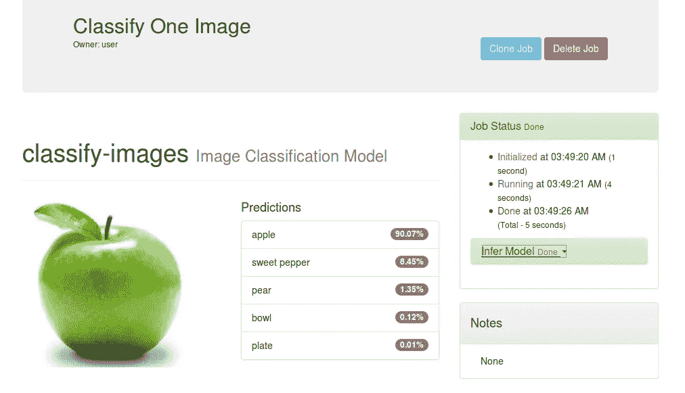

Sample image classification

对于像 CIFAR-100 这样的小数据集来说，这是相当好的精度，当使用较大的数据集时，可以预期更好的精度值。

我想写一个更短的第三部分来展示火炬的好处。时间会证明一切。

*如果你喜欢这首曲子，请鼓掌👏🏻(可以不止一次鼓掌)！你也可以在网上的某个地方分享，这样其他人也可以阅读。*

本网站上的帖子是我自己的，不一定代表 IBM 的立场、策略或观点。

作者:[乌彭德拉·拉詹](https://www.linkedin.com/in/upendra-rajan-b208602a/)