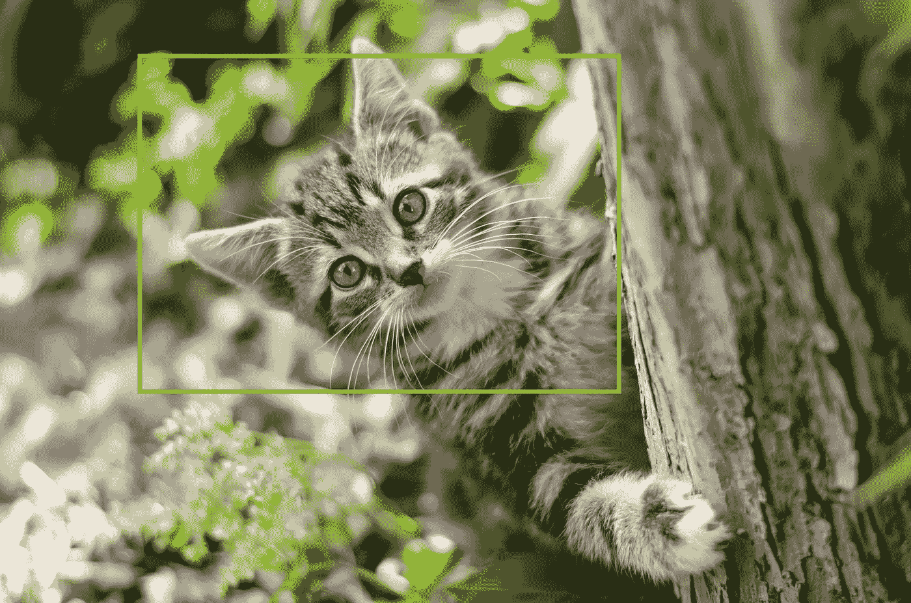
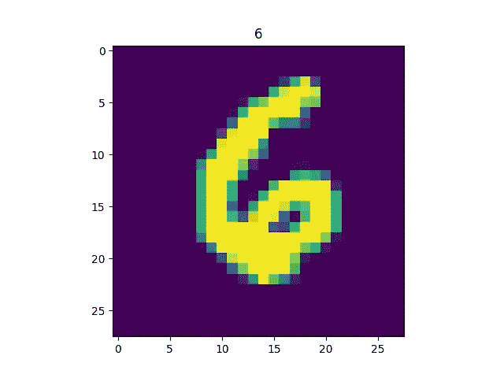
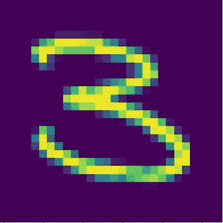

# Keras 图像分类基础

> 原文：<https://towardsdatascience.com/basics-of-image-classification-with-keras-43779a299c8b?source=collection_archive---------1----------------------->



在我之前的帖子中，我深入研究了人工神经网络的一些理论概念。在这篇文章中，我将解释一些你在 keras 中经常需要的常见操作。首先，如何保存模型并在以后使用它们进行预测，显示来自数据集的图像，从我们的系统加载图像并预测它们的类别。

如果您还没有启动 IDE，请继续阅读。

保存模型

训练模型是一个非常缓慢的过程，没有人希望每次都这样做，幸运的是，我们只需要训练我们的模型一次，保存它，然后我们可以随时加载它，并用它来预测新的图像。

Keras 以. h5 格式保存模型，所以如果您在我发布的第一篇教程中跳过了安装 h5py，请运行

```
pip3 install h5py
```

我们还需要 matplotlib 来可视化我们的图像，因此，运行

```
pip3 install matplotlib
```

这是第一个教程的代码

```
import keras
from keras.datasets import mnist
from keras.layers import Dense
from keras.models import Sequential
from keras.optimizers import SGD (train_x, train_y) , (test_x, test_y) = mnist.load_data()
#train_x = train_x.astype('float32') / 255
#test_x = test_x.astype('float32') / 255print(train_x.shape)
print(train_y.shape)
print(test_x.shape)
print(test_y.shape)train_x = train_x.reshape(60000,784)
test_x = test_x.reshape(10000,784)train_y = keras.utils.to_categorical(train_y,10)
test_y = keras.utils.to_categorical(test_y,10)model = Sequential()
model.add(Dense(units=128,activation="relu",input_shape=(784,)))
model.add(Dense(units=128,activation="relu"))
model.add(Dense(units=128,activation="relu"))
model.add(Dense(units=10,activation="softmax"))model.compile(optimizer=SGD(0.001),loss="categorical_crossentropy",metrics=["accuracy"])
model.fit(train_x,train_y,batch_size=32,epochs=10,verbose=1)accuracy = model.evaluate(x=test_x,y=test_y,batch_size=32)print("Accuracy: ",accuracy[1])
```

要保存模型，只需在 model.fit()后添加以下内容

```
model.save("mnist-model.h5")
```

推理

推理是指使用我们的模型预测新图像的过程。

在代码中，注释掉

```
model.fit
```

取而代之的是

```
model.load_weights("mnistmodel.h5")
```

我们的代码现在看起来像这样

```
import keras
from keras.datasets import mnist
from keras.layers import Dense
from keras.models import Sequential
from keras.optimizers import SGD(train_x, train_y) , (test_x, test_y) = mnist.load_data()
#train_x = train_x.astype('float32') / 255
#test_x = test_x.astype('float32') / 255print(train_x.shape)
print(train_y.shape)
print(test_x.shape)
print(test_y.shape)train_x = train_x.reshape(60000,784)
test_x = test_x.reshape(10000,784)train_y = keras.utils.to_categorical(train_y,10)
test_y = keras.utils.to_categorical(test_y,10)model = Sequential()
model.add(Dense(units=128,activation="relu",input_shape=(784,)))
model.add(Dense(units=128,activation="relu"))
model.add(Dense(units=128,activation="relu"))
model.add(Dense(units=10,activation="softmax"))model.compile(optimizer=SGD(0.001),loss="categorical_crossentropy",metrics=["accuracy"])
model.load_weights("mnist-model.h5")
#model.fit(train_x,train_y,batch_size=32,epochs=10,verbose=1)#model.save("mnistmodel.h5")accuracy = model.evaluate(x=test_x,y=test_y,batch_size=32)print("Accuracy: ",accuracy[1])
```

我们在这里做的是从保存的模型文件中加载模型的参数，evaluate 函数在测试数据集上运行预测，并返回我们预测的准确性。

到目前为止，我已经演示了如何保存模型并在以后使用它们进行预测，然而，这都是些无聊的东西，真正的问题是能够加载特定的图像并确定它属于哪个类。

第一步是添加下面的代码，从测试中获得特定图像的预测

```
img = test_x[130]
test_img = img.reshape((1,784))img_class = model.predict_classes(test_img)
prediction = img_class[0]classname = img_class[0]print("Class: ",classname)
```

在这里，我们只是从测试集中选取一个随机图像，在这个例子中，在索引 130 处，我们创建一个展平的副本，它被整形为

```
(1,784)
```

我们把这个拷贝输入到我们的模型中，然后我们得到预测并打印出来。

注释掉代码中的 model.evaluate，添加上面的代码并运行它。

您的输出应该是这样的:

```
Class: 6
```

现在我们有了预测，我们使用 matplotlib 来显示图像及其预测的类

```
img = img.reshape((28,28))
plt.imshow(img)
plt.title(classname)
plt.show()
```

这里的整形操作对于 matplotlib 显示图像是必要的

您更新的代码应该都是这样的

```
import keras
from keras.datasets import mnist
from keras.layers import Dense
from keras.models import Sequential
from keras.optimizers import SGD
import matplotlib.pyplot as plt (train_x, train_y) , (test_x, test_y) = mnist.load_data()train_x = train_x.reshape(60000,784)
test_x = test_x.reshape(10000,784)train_y = keras.utils.to_categorical(train_y,10)
test_y = keras.utils.to_categorical(test_y,10)model = Sequential()
model.add(Dense(units=128,activation="relu",input_shape=(784,)))
model.add(Dense(units=128,activation="relu"))
model.add(Dense(units=128,activation="relu"))
model.add(Dense(units=10,activation="softmax"))model.compile(optimizer=SGD(0.001),loss="categorical_crossentropy",metrics=["accuracy"])
model.load_weights("mnistmodel.h5")img = test_x[130]
test_img = img.reshape((1,784))img_class = model.predict_classes(test_img)
prediction = img_class[0]classname = img_class[0]print("Class: ",classname)img = img.reshape((28,28))
plt.imshow(img)
plt.title(classname)
plt.show()
```

运行这个，你的输出应该是这样的

就是这样！非常简单，我们已经建立了一个基本的数字识别系统。

我鼓励您尝试测试图像的不同索引，亲自看看结果会是什么。



但是，如果我们想要引入一个不包含在测试集中的图像，对于这个测试，请将下面的图像保存到您的系统中，并将其复制到 python 文件所在的目录中。



运行下面的代码

```
import keras
from keras.datasets import mnist
from keras.layers import Dense
from keras.models import Sequential
from keras.optimizers import SGD
import matplotlib.pyplot as plt
from keras.preprocessing import image (train_x, train_y) , (test_x, test_y) = mnist.load_data()train_x = train_x.reshape(60000,784)
test_x = test_x.reshape(10000,784)train_y = keras.utils.to_categorical(train_y,10)
test_y = keras.utils.to_categorical(test_y,10)model = Sequential()
model.add(Dense(units=128,activation="relu",input_shape=(784,)))
model.add(Dense(units=128,activation="relu"))
model.add(Dense(units=128,activation="relu"))
model.add(Dense(units=10,activation="softmax"))model.compile(optimizer=SGD(0.001),loss="categorical_crossentropy",metrics=["accuracy"])
model.load_weights("mnistmodel.h5")img = image.load_img(path="testimage.png",grayscale=True,target_size=(28,28,1))
img = image.img_to_array(img)
test_img = img.reshape((1,784))img_class = model.predict_classes(test_img)
prediction = img_class[0]classname = img_class[0]print("Class: ",classname)
img = img.reshape((28,28))
plt.imshow(img)
plt.title(classname)
plt.show()
```

你可能会注意到一些新的东西，首先我们从 keras.preprocessing 导入图像

接下来我们添加了

```
img = image.load_img(path="testimage.png",grayscale=True,target_size=(28,28,1))
img = image.img_to_array(img)
```

在第一行中，我们从磁盘加载图像，并指定它的大小应该调整为 28 x 28 x 1，记住这是原始 mnist 图像的大小，所以我们保持不变是有好处的。

接下来，我们将图像转换成像素数组，就这样。

运行它并亲自检查结果，看预测值是否为 3。

任何问题或评论请在下面的评论框中留下，你也可以通过 twitter 联系我，电话: [@johnolafenwa](https://twitter.com/johnolafenwa)

如果你喜欢这个教程，给一些掌声。

下一篇文章将是关于使用卷积神经网络，这将把我们的准确率提高到 99%以上！！！保持联系就好。