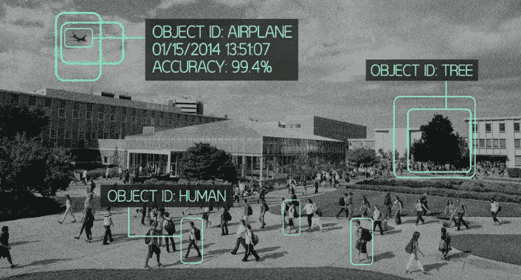

# 使用 Python 的 Scikit-Learn 实现进行图像识别的基础知识

> 原文：<https://towardsdatascience.com/basics-of-image-recognition-using-pythons-scikit-learn-implementation-5efcff465b64?source=collection_archive---------2----------------------->

随着机器学习和大数据分析的名气越来越大，非结构化数据分析的一个更受研究的领域是图像处理和识别。如果我们在网上看看，我们的安全部门正在努力改善图像识别，我们的智能手机使用面部识别改善图像捕捉，并使用谷歌的 [TensorFlow](http://www.tensorflow.org/) 进行各种图像分类。

如果你一直在关注我的博客，你现在应该意识到我是 Python 的超级粉丝。虽然 Python 不是神经网络应用的最佳语言，但它仍然为快速软件开发和理解机器学习概念提供了简单的语法。Python 在许多机器学习应用程序中非常受欢迎，这仅仅是因为它的简单性及其 Scikit-Learn 机器学习库的广泛社区。

因此，我使用 MNIST 数据集为完全不熟悉图像识别的人开发了一个简单的介绍教程: