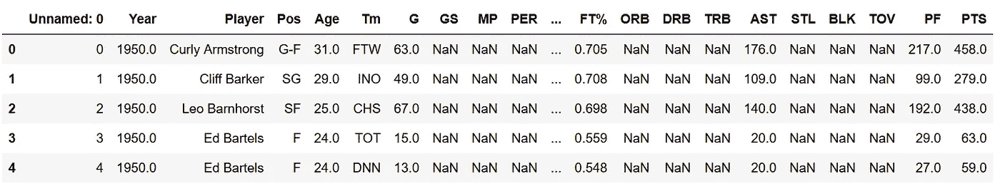
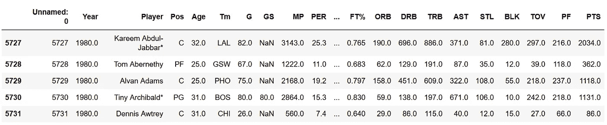
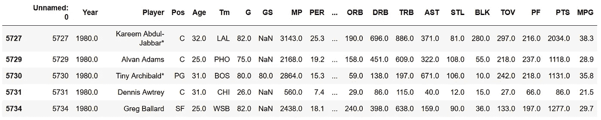
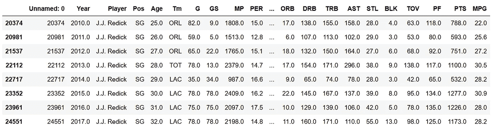
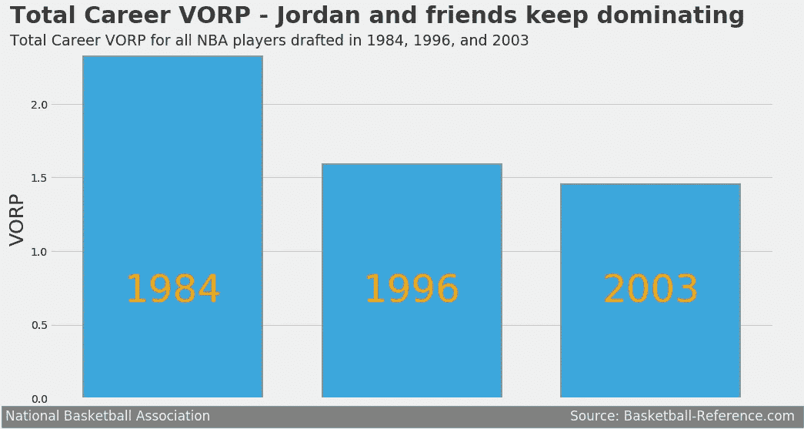
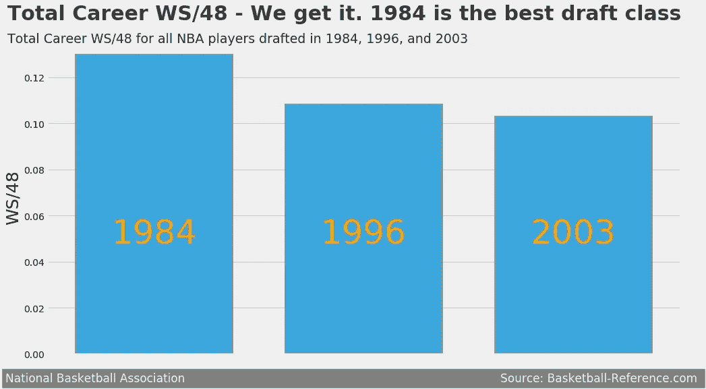

# 篮球分析:最好的选秀课程

> 原文：<https://towardsdatascience.com/basketball-analytics-the-best-draft-class-13a6eac0cdb5?source=collection_archive---------9----------------------->

## 使用 Python 创建数据可视化


Photo by [Tim Mossholder](https://unsplash.com/@timmossholder?utm_source=medium&utm_medium=referral) on [Unsplash](https://unsplash.com?utm_source=medium&utm_medium=referral)

## 介绍

NBA 内幕是电视上最好的节目。嗯，如果你热爱篮球，这是最好的节目。艾美奖获奖节目遵循了 NBA 年度最大的一些比赛的赛前和赛后分析。由厄尼·约翰逊主持，该节目涵盖了各种 NBA 话题，包括对其他工作室分析师的批判性分析:前 NBA 冠军奥尼尔和史密斯。哦，还有一个叫查尔斯·恰克·巴克利的家伙。让这个节目如此吸引篮球迷的是分析师之间的化学反应。这个节目包括 70%的篮球话题，25%的无意义话题(大部分是垃圾话题)，还有 5%是厄尼试图让每个人都抓住主题。前一秒，工作人员还在谈论西部决赛的第二场比赛，然后转而谈论你应该多久给你的[油箱](https://www.youtube.com/watch?v=ItU3_AQa4g4)加一次油。说真的，他们花了超过 2 分钟来谈论这个！

NBA 内部人员不断提出的一个持续的话题是老学校与新学校的辩论。沙克、肯尼和查克将会持续几天谈论他们那个时代的 NBA 球员是如何变得更好、更强，以及更有竞争力。现在，我将通过一些数据可视化来测试这一争论。还有什么更好的方法来解决与一些 Python 的争论呢！好吧，这听起来可能没什么意思，但我会努力让这个分析物有所值。

为了进行这种分析，我将只着眼于 3 个最好的 NBA 选秀(无可争议):1984 年，1996 年和 2003 年。为什么？嗯，他们每个人都有一些有史以来最伟大的球员。1984 年有哈基姆·阿卜杜尔·奥拉朱旺、查尔斯·巴克利，当然还有“山羊”迈克尔·乔丹(有争议？可能)。1996 年有阿伦艾弗森，史蒂夫纳什和科比布莱恩特。2003 年有德韦恩·韦德、克里斯·波什和勒布朗·詹姆斯(是的，我是湖人球迷)。除了是有史以来最好的选秀班，这些选秀班都代表了 NBA 不同的时代。

分析数据来自[篮球参考](https://www.basketball-reference.com)。篮球参考从他们的网站为球迷和分析家提供统计数据，这意味着所有的统计数据都是官方的。还包括金州勇士队在 [2016 NBA 总决赛](https://www.youtube.com/watch?v=wgVOgGLtPtc)3-1 领先克利夫兰骑士队的事实。但这个讨论是另一个时间。

注意:这篇文章使用的所有代码都可以在 GitHub 上找到，组织在这个[笔记本](https://github.com/osanchez2323/Portfolio/blob/master/NBA%20Draft%20Analysis/NBA%20Draft%20Analysis.ipynb)上。

## 数据清理

我们从组织数据开始分析。

第一个数据集包含了过去 68 年来所有 NBA 球员的数据，从 1949-50 赛季开始，到 2016-17 赛季结束。

```
import pandas as pd
import numpy as np
import matplotlib.pyplot as pltseasons = pd.read_csv('Seasons_Stats.csv')
seasons.head()
```



马上就有很多数据不会用到。分析将集中于 20 世纪 80 年代及以后的球员。因此，我将只包括那个时期的球员数据。

```
years = list(range(1980,2018))
seasons = seasons[seasons['Year'].isin(years)]
seasons.head()
```



在一个 NBA 赛季中有不同类型的球员。有所有的明星球员，角色球员，和板凳球员。后者其实并不那么重要(除非你的团队中有[罗伯特·萨克雷](https://www.youtube.com/watch?v=NxVuySQT-eY))。对于这个分析，我想把重点放在有某种影响的球员身上。因此，我将包括在 NBA 赛季中每场比赛至少打 20 分钟的球员。为此，我需要为每场比赛的分钟数(MPG)创建一个新列。

```
seasons['MPG'] = round(seasons['MP'] / seasons['G'], 1)seasons = seasons[seasons['MPG'] >= 20]
seasons.head()
```



我需要从我们的分析中排除的另一个方面是赛季总数。每当一个球员在 NBA 赛季中通过交易或买断为两个或更多的球队效力时，就会添加一个新行来显示球员的赛季总数。例如，2013 年，乔纳森·克雷则·雷迪克，也被称为 J.J .雷迪克(你可能不知道他的名字是乔纳森)，在交易截止日期前从奥兰多魔术队被交易到密尔沃基雄鹿队。因此，数据显示相同季节的多个条目(包括一个总计条目)。

```
seasons[(seasons['Player'] == 'J.J. Redick') & (seasons['Year'] >= 2013)]
```


我将删除这些行，因为我们将在后面的分析中按球员分组统计数据。此外，我将删除一个特殊的字符，这是包括在一些球员的名字。

```
seasons = seasons.drop_duplicates(['Player','Year'], keep = 'first')seasons[(seasons['Player'] == 'J.J. Redick')]
```



第二个数据集由球员信息组成，包括球员在 NBA 打球的时间段。为了分析，我将包括 1984 年，1996 年和 2003 年被选中的每一个球员。在这里，我通过包括每个球员的新秀年来选择选秀年。例如，迈克尔·乔丹在 1984 年被选中，但是数据显示他的新秀年是 1985 年。

```
players = pd.read_csv('player_data.csv')years_draft = [1985, 1997, 2004]players.columns = ['Player', 'Rookie Year', 'Final Year',  'Position', 'Height','Weight','DOB','College']players = players[players['Rookie Year'].isin(years_draft)]players['Player'] = players['Player'].str.replace('*','') ### Remove special character
```

对于数据清理过程的最后一部分，我将创建一个新的数据表，其中包含一些我们将要分析的统计数据。因为我将按选秀级别比较 NBA 球员的职业统计数据，所以我将按选秀级别分组。

```
data = seasons[['Year', 'Player','G','MP','PER', 'TS%', 'FG%', '3P%','2P%', 'eFG%','OWS', 'DWS', 'WS', 'WS/48',
                'USG%','OBPM', 'DBPM', 'BPM', 'VORP']]
data = data[data['Year'].isin(years)]
data['Year'] = data['Year'].astype(object)data_draft = players.merge(data, on = 'Player')data_draft['Rookie Year'] = data_draft['Rookie Year'] - 1 ### Set the Year to the correct draft classf = {'G': ['sum'],'MP': ['sum'],'PER': ['mean'], 'TS%': ['mean'], 'FG%': ['mean'], '3P%': ['mean'],'2P%': ['mean'], 
     'eFG%': ['mean'],'OWS': ['mean'], 'DWS': ['mean'], 'WS': ['mean'], 'WS/48': ['mean'],'USG%': ['mean'],
     'OBPM': ['mean'], 'DBPM': ['mean'], 'BPM': ['mean'], 'VORP': ['mean']}data_draft = data_draft.groupby(['Rookie Year'], as_index = False).agg(f)
```

## 分析

我们如何确定哪个草稿类是最好的？很容易简单地比较每个选秀球员的职业生涯得分、篮板和助攻总数。这真的能告诉我们某个选秀职业的球员比其他人更优秀吗？大概不会。为了分析选秀职业，我想使用考虑到游戏其他方面的数据。这是用于分析的 3 个最好的统计数据:球员效率等级(PER)，对替补球员的价值(VORP)，以及每 48 分钟的赢球份额(WS/48)。

*玩家效率等级(PER)*

*[PER](https://www.basketball-reference.com/about/per.html) 是霍林格创造的一个统计数据，它考虑了诸如投篮命中率、罚球、三分球、助攻、篮板、盖帽和抢断等成绩，以及诸如投篮不中、失误和个人犯规等负面结果。顾名思义，这个属性评估一个球员在场上的影响力。让我们来看一下，迈克尔·乔丹和勒布朗·詹姆斯是 PER 的职业领袖。所以，这是这个分析的可靠指标。*

```
*per = data_draft.sort_values([('PER','mean')], ascending = False).reset_index()
pos = list(range(len(per['PER','mean'])))plt.style.use('fivethirtyeight')
fig, ax = plt.subplots(figsize = (15,8))
plt.bar(pos, per['PER','mean'], width = 0.75, alpha = 0.75, label = per['Rookie Year'], edgecolor = 'gray', linewidth = 2)
for i in pos:
    plt.text(pos[i], 6, s = per['Rookie Year'][i],ha='center', va='bottom', color = 'orange', size = 50)
plt.text(x = -0.68, y = 19.5, s = 'Total Career PER - 1984 Draft Class lead in efficiency',fontsize = 30, weight = 'bold', alpha = .75)
plt.text(x = -0.68, y = 18.3, s = 'Total Career PER for all NBA players drafted in 1984, 1996, and 2003',fontsize = 19, alpha = .85)
plt.text(x = -0.68, y = -1.5, s = 'National Basketball Association                                                                                       Source: Basketball-Reference.com ', fontsize = 17,color = '#f0f0f0', backgroundcolor = 'grey')
plt.xticks([],[])
ax.set_ylabel('PER', size = 25)*
```

**

****价值超过替补队员(VORP)****

*[VORP](https://www.basketball-reference.com/leaders/vorp_career.html) 是一名球员在替补级别球员之上贡献的每 100 场球队财产点数的盒子分数估计，转换为平均球队并按比例分配给 82 场比赛的赛季。这相当于棒球中的战争，它表明了一个球员对他们球队的总贡献。*

```
*vorp = data_draft.sort_values([('VORP','mean')], ascending = False).reset_index()
pos1 = list(range(len(vorp['VORP','mean'])))plt.style.use('fivethirtyeight')
fig, ax = plt.subplots(figsize = (15,8))
plt.bar(pos1, vorp['VORP','mean'], width = 0.75, alpha = 0.75, label = vorp['Rookie Year'], edgecolor = 'gray', linewidth = 2)
for i in pos1:
    plt.text(pos1[i], .6, s = vorp['Rookie Year'][i],ha='center', va='bottom', color = 'orange', size = 50)
plt.text(x = -0.68, y = 2.55, s = 'Total Career VORP - Jordan and friends keep dominating',fontsize = 30, weight = 'bold', alpha = .75)
plt.text(x = -0.68, y = 2.4, s = 'Total Career VORP for all NBA players drafted in 1984, 1996, and 2003',fontsize = 19, alpha = .85)
plt.text(x = -0.7, y = -.15, s = 'National Basketball Association                                                                                       Source: Basketball-Reference.com ', fontsize = 17,color = '#f0f0f0', backgroundcolor = 'grey')
plt.xticks([],[])
ax.set_ylabel('VORP', size = 25)*
```

**

****每 48 分钟赢得股份(WS/48)****

*[WS/48](https://www.basketball-reference.com/about/ws.html) 是一个简化了玩家每 48 分钟产生的胜利份额数(相当于一场 NBA 比赛)的统计。像 VORP 一样，win shares 计算玩家对团队胜利的总体贡献。由于每个玩家的上场时间不同，WS/48 调整了统计数据来帮助玩家之间的比较。*

```
*ws = data_draft.sort_values([('WS/48','mean')], ascending = False).reset_index()
pos = list(range(len(ws['WS/48','mean'])))plt.style.use('fivethirtyeight')fig, ax = plt.subplots(figsize = (15,8))
plt.bar(pos, ws['WS/48','mean'], width = 0.75, alpha = 0.75, label = ws['Rookie Year'], edgecolor = 'gray', linewidth = 2)
for i in pos:
    plt.text(pos[i], 0.045, s = ws['Rookie Year'][i],ha='center', va='bottom', color = 'orange', size =50)plt.text(x = -0.7, y = 0.145, s = 'Total Career WS/48 - We get it. 1984 is the best draft class',fontsize = 30, weight = 'bold', alpha = .75)
plt.text(x = -0.7, y = 0.135, s = 'Total Career WS/48 for all NBA players drafted in 1984, 1996, and 2003',fontsize = 19, alpha = .85)
plt.text(x = -0.71, y = -.012, s = 'National Basketball Association                                                                                       Source: Basketball-Reference.com ', fontsize = 17,color = '#f0f0f0', backgroundcolor = 'grey')
plt.xticks([],[])
ax.set_ylabel('WS/48', size = 25)*
```

**

## *结论*

*好吧，当沙克、肯尼和查尔斯说过去的球员更好的时候，他们可能有一点道理。虽然我的分析显示 1984 年的选秀班在 PER、VORP 和 WS/48 中表现更好，但还是有一些问题。首先，现在 NBA 中的一些规则在过去并不存在。例如，在 20 世纪 90 年代早期，三分球犯规、畅通无阻犯规和防守三秒规则都不是 NBA 的一部分。这些规则中的每一条都会导致额外的罚球，这可能会增加或减少你的 PER(取决于是否罚球)。*

*我应该在做分析之前提出这些问题吗？也许吧。然而，这证明了我分析的全部观点:让我们停止比较几代人，享受这场表演吧！所有这些代人都是不同的，这是篮球最好的部分。魔法和鸟是不同的。乔丹是不同的。勒布朗不一样。斯蒂芬库里是不同的。篮球不应该太关注过去，而应该更多的关注未来。*