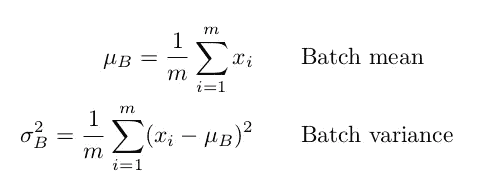
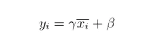
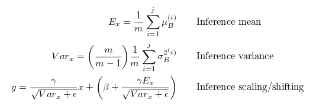

# 批量规范化:理论和如何与 Tensorflow 一起使用

> 原文：<https://towardsdatascience.com/batch-normalization-theory-and-how-to-use-it-with-tensorflow-1892ca0173ad?source=collection_archive---------2----------------------->

“time-lapse photography of highway road” by [Clément M.](https://unsplash.com/@cmreflections?utm_source=medium&utm_medium=referral) on [Unsplash](https://unsplash.com?utm_source=medium&utm_medium=referral)

不久前，深度神经网络还很难训练，在合理的时间内让复杂的模型收敛是不可能的。如今，我们有许多技巧来帮助他们收敛，实现更快的训练，并解决当我们想要训练深度学习模型时出现的任何类型的麻烦。本文将探讨其中的一个技巧:**批量规范化。**

## 为什么你应该使用它

为了理解什么是批处理规范化，首先我们需要解决它试图解决的问题。

通常，为了训练一个神经网络，我们对输入数据做一些预处理。例如，我们可以将所有数据标准化，使其类似于正态分布(也就是说，零均值和一元方差)。我们为什么要做这个预处理？原因有很多，其中一些是:防止像 sigmoid 函数这样的非线性激活函数过早饱和，确保所有输入数据都在相同的值范围内，等等。

但是问题出现在中间层，因为激活的分布在训练期间不断变化。这减慢了训练过程，因为每一层都必须在每个训练步骤中学会适应新的分布。这个问题被称为**内部协变移位**。

那么…如果我们*强制*每一层的输入在每一个训练步骤中具有近似相同的分布，会发生什么？

## 事实真相

批量标准化是一种我们可以用来标准化每一层输入的方法，以解决内部协变量偏移问题。

在训练期间，批处理规范化层执行以下操作:

1.  计算层输入的平均值和方差。

Batch statistics for step 1

2.使用之前计算的批次统计数据对图层输入进行归一化。

Normalization of the layers input in step 2

3.缩放和移动以获得层的输出。

Scaling and shifting the normalized input for step 3

请注意， *γ* 和 *β* 是在训练期间学习的**以及网络的原始参数。**

所以，如果每批有 *m* 个样品，那么 *j* 批:

Inference formulas

**编辑:**在测试(或推断)时，均值和方差是固定的。使用之前计算的每个训练批次的平均值和方差来估计它们。

## 我们如何在 Tensorflow 中使用它

幸运的是，Tensorflow API 已经在[TF . layers . batch _ normalization](https://www.tensorflow.org/api_docs/python/tf/layers/batch_normalization)层中实现了所有这些数学运算。

为了在您的模型中添加批处理规范化层，您只需使用以下代码:

获得 Tensorflow 文档中所述的更新 ops 非常重要，因为在训练时间内，必须更新层的移动方差和移动平均值。如果不这样做，批量标准化**将无法工作**，网络**将无法按预期训练**。

声明一个占位符来告诉网络它是处于训练时间还是推理时间也是有用的(我们已经讨论过训练和测试时间的区别)。

注意这一层有**很多** **更多的**参数(你可以在文档中查看它们)，但是这些是你应该使用的基本工作代码。

## 参考

如果您对批量标准化感到好奇，我建议您看看这篇论文和视频:

*   [Sergey Ioffe，Christian Szegedy，批量标准化:通过减少内部协变量转移加速深度网络训练，2015 年](https://arxiv.org/pdf/1502.03167.pdf)
*   [蒂姆·库伊曼斯，尼古拉斯·巴拉斯，塞萨尔·洛朗，阿格拉尔·居勒赫尔，亚伦·库维尔，循环批次标准化，2016 年](https://arxiv.org/abs/1603.09025)
*   [Mahdi M. Kalayeh，Mubarak Shah，通过分离批量标准化模型中的变异模式加快训练，2018 年](https://arxiv.org/abs/1806.02892)
*   [斯坦福大学工程学院 CS231n 第六讲|训练神经网络 I，2017](https://www.youtube.com/watch?v=wEoyxE0GP2M&index=6&list=PLC1qU-LWwrF64f4QKQT-Vg5Wr4qEE1Zxk)
*   [Daejin Jung，Wonkyung Jung，Byeongho Kim，Sunjung Lee，Wonjong Rhee，Jung Ho Ahn，重组批次正常化以加速 CNN 培训，2018 年](https://arxiv.org/abs/1807.01702)

请随时关注我的 Twitter 或 LinkedIn T21，让我知道你对这篇文章的看法。感谢阅读！