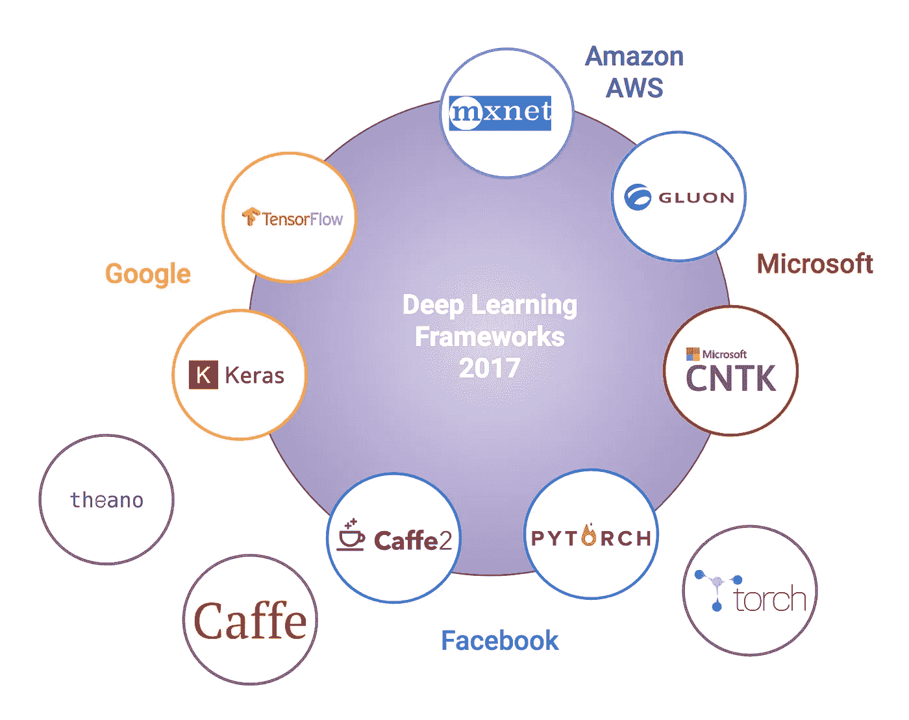
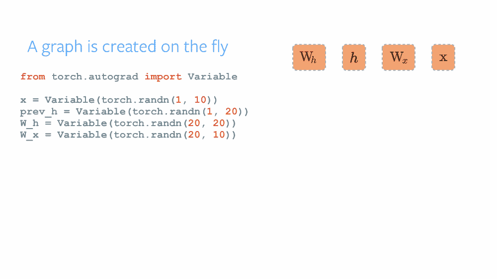
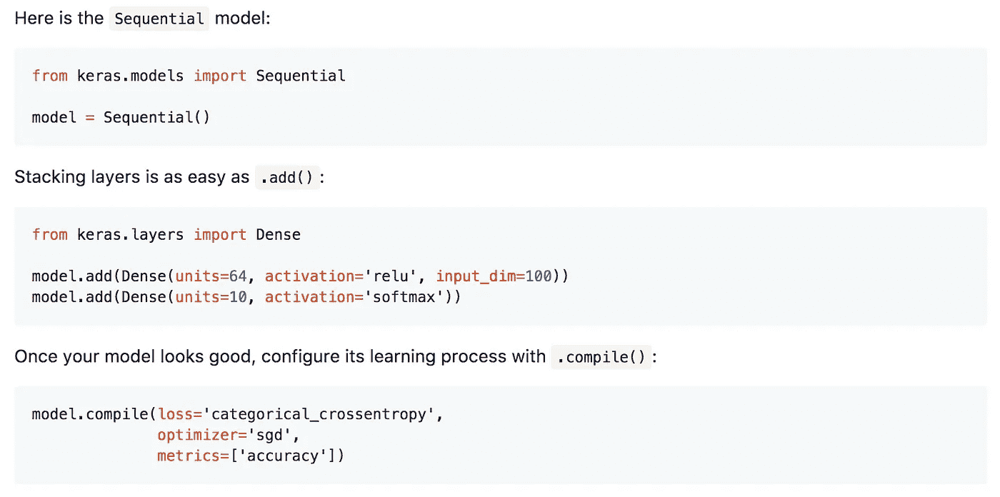
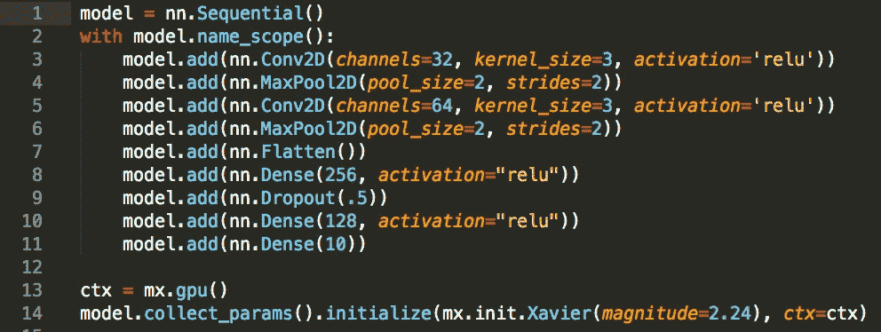
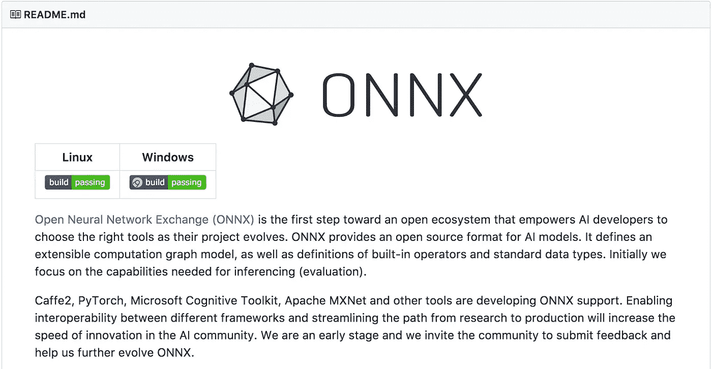

# 深度学习框架之战——第一部分:2017，更多框架和接口

> 原文：<https://towardsdatascience.com/battle-of-the-deep-learning-frameworks-part-i-cff0e3841750?source=collection_archive---------1----------------------->

深度学习的格局在不断变化。Theano 是第一个被广泛采用的深度学习框架，由深度学习的先驱之一 Yoshua Bengio 领导的 [MILA](https://mila.quebec/) 创建和维护。然而，事情发生了变化。今年 9 月，MILA 宣布在发布最新版本后，将不会在 2018 年对 Theano 进行进一步的开发工作。这个消息并不意外。在过去的几年中，不同的开源 Python 深度学习框架被引入，通常由大型科技公司之一开发或支持，其中一些获得了很多关注。

State of open source deep learning frameworks in 2017

目前，谷歌的 [TensorFlow](https://www.tensorflow.org/) 似乎是最常用的深度学习框架——基于 Github stars & forks 和堆栈溢出活动。一些人预计，随着 TensorFlow 的推出，谷歌将主导市场多年。然而，看起来其他框架也吸引了越来越多的热情用户。最值得一提的可能是 [PyTorch](http://pytorch.org/) 的引进和成长。PyTorch 由脸书等公司于 2017 年 1 月推出。它是流行的 Torch 框架(用 C 实现，用 Lua 封装)的移植，Torch 二进制文件用 GPU 加速的 Python 封装。

除了 GPU 加速和内存的有效使用，PyTorch 流行背后的主要驱动力是动态计算图的使用。这些动态计算图已经被其他鲜为人知的深度学习框架使用，如 Chainer。这些动态图的优点在于，这些图是由运行定义的(“由运行定义”)，而不是传统的“定义并运行”。特别是在输入可能变化的情况下，例如对于文本这样的非结构化数据，这是非常有用和高效的。

PyTorch dynamic computational graph — source: [http://pytorch.org/about/](http://pytorch.org/about/)

其他科技巨头也没有坐以待毙。微软开发了一个名为 CNTK 的内部深度学习框架，并在更名为[微软认知工具包](https://www.microsoft.com/en-us/cognitive-toolkit/)后于 2017 年正式推出 2.0 版本。2017 年，脸书也推出了[咖啡馆 2](https://caffe2.ai/) 。它是著名的 Caffe 框架的继承者。最初的 [Caffe](http://caffe.berkeleyvision.org/) 框架是由 Berkeley Vision and Learning Center 开发的，在它的社区、它在计算机视觉中的应用以及它的模型动物园(一组预先训练好的模型)中非常受欢迎。然而，似乎咖啡 2 还没有步咖啡的后尘。

另一个流行的深度学习框架是 [MXNet](https://mxnet.apache.org/) ，由微软和亚马逊支持。MXNet 已经存在一段时间了，但是当 MXNet 被称为深度学习框架时，我经常听到人们回应“那不是 R 的深度学习框架吗？”。是的，但不止如此。它实际上支持许多语言，从 C++到 Python、JavaScript、Go，事实上还有 MXNet 突出的地方是它的可伸缩性和性能(请继续关注第二部分，在那里我们将比较最流行的框架的速度和其他指标)。

这些只是众多框架中的一小部分。其他开源深度学习框架包括 Deeplearning4j 和 Dlib(基于 C++的)。同样在 2017 年，谷歌的 DeepMind 发布了 Sonnet(基于 TensorFlow 构建的高级面向对象库)。其他值得一提的框架还有 H20.ai 和 Spark。

Straightforward model building with Keras — source: [https://github.com/keras-team/keras](https://github.com/keras-team/keras)

除了所有这些框架，我们还有包装在一个或多个框架周围的接口。深度学习最广为人知和广泛使用的界面毫无疑问是 [Keras](https://keras.io/) 。Keras 是一个高级深度学习 API，用 Python 编写，由谷歌深度学习研究员 Franç ois Chollet 创建。谷歌在 2017 年宣布选择 Keras 作为 TensorFlow 的高层 API。这意味着 Keras 将包含在下一个 TensorFlow 版本中。除了 TensorFlow，Keras 还可以使用 Theano 或 CNTK 作为后端。

Keras 很强大，因为通过堆叠多个层来创建深度学习模型真的很简单。当使用 Keras 时，用户不需要做层背后的数学计算。这似乎是快速原型制作的理想选择，Keras 也是 Kaggle 竞赛中的流行工具。

因此，一方面，我们目前有高级别的 Keras API，可以让您轻松构建简单和高级的深度学习模型，另一方面，低级别的 TensorFlow 框架可以让您在构建模型时更加灵活。两者都有谷歌的支持。正如预期的那样，竞争并没有坐以待毙，2017 年 10 月，微软和亚马逊的 AWS 联合发布了 Gluon API。Gluon 是一个高级 Python 深度学习接口，它包装了 MXNet，很快它还将包括微软的 CNTK。胶子是 Keras 的直接竞争对手，尽管 AWS 声称他们强烈支持所有深度学习框架，但他们当然将赌注押在胶子上，以实现人工智能的民主化。

Stacking convolutional and dense layers and parameter initialization with Gluon

令人惊讶的是，如今 TensorFlow 最大的竞争对手似乎是 PyTorch。随着社区对 PyTorch 越来越感兴趣，例如，在 Kaggle 的最新比赛中，用户经常选择使用 PyTorch 作为他们解决方案的一部分，并且它也被用于最新的研究论文中，因此 [TensorFlow 于 2017 年 10 月推出了 Eager Execution](https://research.googleblog.com/2017/10/eager-execution-imperative-define-by.html) 。TensorFlow 的“运行定义”界面。通过此次发布，谷歌希望赢回爱上 PyTorch 及其动态图形的用户。

对于热门深度学习课程 fast.ai 的开发者来说，这种变化来得太晚了。9 月， [fast.ai 宣布从 Keras & TensorFlow 切换到 PyTorch](http://www.fast.ai/2017/09/08/introducing-pytorch-for-fastai/) 。fast.ai 的创始研究员、Kaggle 的前总裁兼首席科学家杰瑞米·霍华德认为 PyTorch 将能够保持领先地位。只有时间能证明一切。

有了这些深度学习框架，新来者选择一个框架可能会很有挑战性。坦率地说，即使是经验丰富的研究人员和开发人员也很难跟上最新的发展。一个积极的消息是[开放神经网络交换(ONNX)](https://onnx.ai/) 的发布。ONNX 于 2017 年 9 月宣布，并于 12 月发布了 V1，是一种表示深度学习模型的开放格式。这允许用户更容易地在不同的框架之间移动模型。例如，它允许您构建 PyTorch 模型，并使用 MXNet 运行该模型进行推理。

Open Neural Network Exchange (ONNX) Github page — source: [https://github.com/onnx/onnx](https://github.com/onnx/onnx)

ONNX 是由微软、AWS 和脸书等公司推出的。谷歌不在这个名单中并不令人惊讶。ONNX 从一开始就支持 Caffe2、Microsoft Cognitive Toolkit、MXNet 和 PyTorch，但是与其他开源项目一样，社区也已经为 TensorFlow 添加了一个转换器。

2017 年有很多令人兴奋的发展，这类似于深度学习和人工智能领域的快速发展。很难预测新的一年会发生什么。我们可能会看到一些整合，不过，大型科技公司肯定会希望使用和推广自己的技术。很高兴看到不同的框架，由不同的技术巨头支持，推动彼此更快地创新。在第二部分中，我们将根据不同的度量标准，如速度、内存使用、可移植性和可伸缩性，更详细地比较不同的框架。