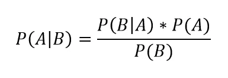
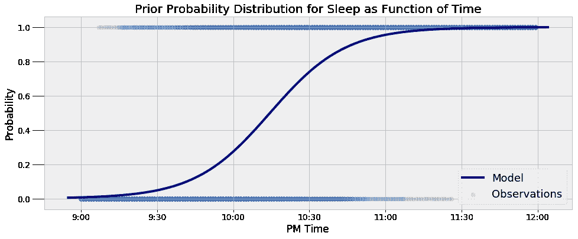
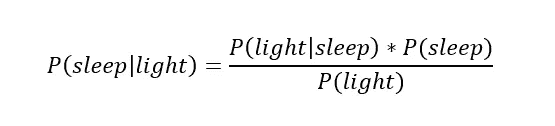
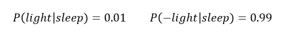
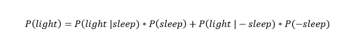
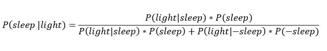
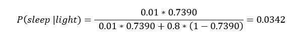
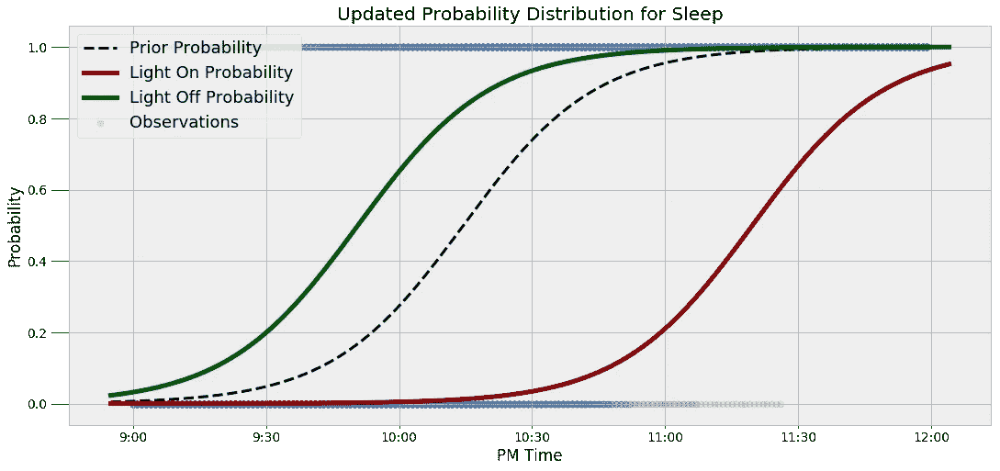
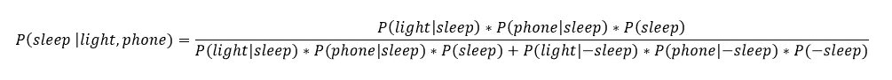
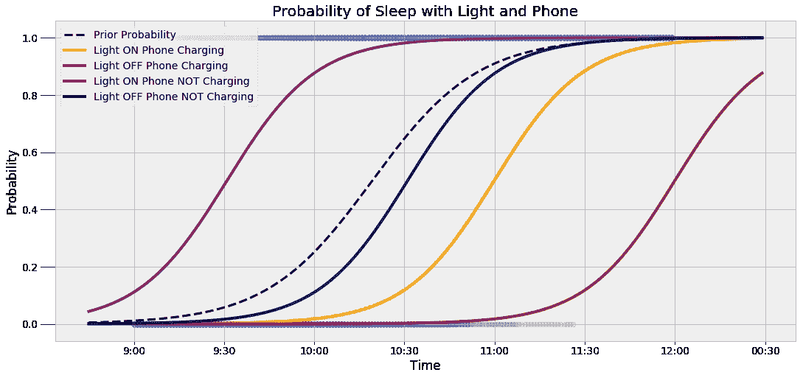

# 应用贝叶斯规则

> 原文：<https://towardsdatascience.com/bayes-rule-applied-75965e4482ff?source=collection_archive---------1----------------------->


**在现实世界问题上使用贝叶斯推理**

贝叶斯推理的基本思想是用更多的数据变得“更少的错误”。这个过程很简单:我们有一个最初的信念，称为先验，当我们获得更多信息时，我们会更新它。虽然我们不认为这是贝叶斯推理，但我们一直在使用这种技术。例如，我们最初可能认为有 50%的机会在季度末获得晋升。如果我们从经理那里得到积极的反馈，我们会向上调整我们的估计，相反，如果我们把咖啡机弄得一团糟，我们可能会降低概率。随着我们不断收集信息，我们会改进我们的估计，以更接近“真实”的答案。

我们的直觉行为被形式化为一个简单而强大的等式，称为[贝叶斯法则](http://www.eecs.qmul.ac.uk/~norman/BBNs/Bayes_rule.htm):



我们将左侧称为后验概率，作为给定事件 b 的事件 A 的条件概率。在右侧，`P(A)`是我们的先验，或事件 A 的概率的初始信念，`P(B|A)`是可能性(也是条件概率)，我们从我们的数据中得出，`P(B)`是使概率分布总和为 1 的归一化常数。贝叶斯规则在统计语言中的一般形式是后验概率等于似然性乘以先验除以归一化常数。这个简短的等式引出了贝叶斯推理的整个领域，贝叶斯推理是一种对世界进行推理的有效方法。

虽然 A 和 B 可能是很好的占位符，但它们对让我们了解如何使用这个概念没有太大帮助。为了做到这一点，我们可以将贝叶斯规则应用于现实世界数据的问题。

我在自己的生活中一直在探索的一个问题是睡眠模式。我有来自我的 Garmin Vivosmart 手表的 2 个多月的数据，显示我何时入睡和醒来。在[之前的一篇](/markov-chain-monte-carlo-in-python-44f7e609be98)文章中，我用马尔可夫链蒙特卡罗(MCMC)方法计算出了我在给定时间睡着的概率。最终模型显示*最有可能的*睡眠时间分布(MCMC 是一种近似方法)如下。



这是我睡着的概率，只考虑时间。如果我们知道时间并且有额外的证据呢？知道我卧室的灯亮着会如何改变我睡着的概率？这就是我们使用贝叶斯规则来更新我们的估计的地方。对于特定时间，如果我们知道我卧室灯的信息，我们可以使用上面分布的概率作为*先验*，然后应用贝叶斯方程:



左边是后验概率，给定我卧室灯的状态(开或关)，睡眠的条件概率。给定时间的概率将作为我们的先验，`P(sleep)`，或者在没有额外信息的情况下我们使用的估计值。比如晚上 10 点，我睡着的先验概率是 27.34%。如果我们有更多的信息，我们可以使用从观测数据中得到的可能性`P(bedroom light |sleep)`来更新这些信息。根据我的习惯，我知道假设我睡着了，我卧室的灯亮着的概率大约是 1%。那就是:



假设我睡着了，我的灯熄灭的概率是`1–0.01 = 0.99`(这里我用减号(-)表示相反的情况。)这是因为条件概率分布的总和必须为 1。如果我们知道我睡着了，我卧室的灯要么开着，要么关着！

等式的最后一部分是归一化常数`P(light)`。这代表我的灯亮着的总概率。我的灯亮着有两种情况:我睡着了或者我醒着。因此，如果我们知道睡眠的先验概率，我们可以计算归一化常数为:



我的灯亮着的总概率考虑了我睡着时灯亮着的几率和我醒着时灯亮着的几率。(`P(-sleep) = 1 — P(sleep)`是我醒着的概率。)

假设我没有睡着，我的灯亮着的概率`P(light | — sleep)`，也是通过观察确定的。在我的例子中，我知道如果我醒着，我卧室的灯有大约 80%的可能性是亮着的(这意味着如果我醒着，我的灯有 20%的可能性是不亮的)。

使用我的灯亮着的总概率，贝叶斯公式是:



假设我的灯亮着，这代表我睡着的概率。如果我的灯关了，那么我们用`P(-light|...`替换每一个`P(light|...`。

只有单词的方程已经够多了，让我们看看如何将它用于数字！

如果我们知道我的灯是亮着的，我们将在晚上 10:30 应用这个等式。首先，我们使用时间计算我睡着的先验概率，得到的答案是 73.90%。先验为我们的估计提供了一个很好的起点，但是我们可以通过加入关于我的光的信息来改进它。知道我的灯亮着，我们可以用相关的数字填充贝叶斯方程:



我的灯亮着，这一事实极大地改变了我们对我睡着的概率的估计，从超过 70%变成了 3.42%。这显示了贝叶斯法则的力量:我们能够通过加入更多的信息来更新我们对形势的最初估计。尽管我们可能已经直观地做到了这一点，但从形式方程的角度来考虑它，可以让我们以严格的方式更新我们的信念。

让我们试试另一个例子。如果现在是晚上 9:45，我的灯关了怎么办？试着从 0.1206 的先验概率开始解这道题。

我没有总是手工做这个推断，而是写了一些简单的 Python 代码来做这些计算，你可以在 [Jupyter 笔记本](https://github.com/WillKoehrsen/ai-projects/blob/master/bayesian_inference/bayes_rule_applied.ipynb)中玩这些计算。代码输出以下答案:

```
Time: 09:45:00 PM 	Light is OFF.

The prior probability of sleep:    12.06%
The updated probability of sleep:  40.44%
```

我们再次看到额外的信息改变了我们的估计。现在，如果我的妹妹想在晚上 9:45 打电话给我，她不知何故知道我的灯亮着，她可以参考这个等式来确定我是否会接电话(假设我总是在醒着的时候接电话)！谁说日常生活中不能用 stats？

看到数字结果是有帮助的，但是可视化也有助于使观点更加清晰。如果仅仅通过看方程式不能表达想法，我总是试图结合情节来表达想法。在这里，我们可以使用额外的数据来可视化睡眠的先验和条件概率分布。



当我的灯亮着的时候，曲线向右移动，表明在给定的时间我睡着的概率较低。同样，如果我的灯关闭，曲线会向左移动。从概念上理解一个统计概念可能是困难的，但是这个例子精确地说明了为什么我们使用贝叶斯法则。如果我们想减少对世界的错误，那么额外的信息应该改变我们的信念，贝叶斯推理使用系统的方法更新我们的估计。

# 使用更多的证据！

为什么停在我卧室的灯前？我们可以在模型中使用尽可能多的信息，它将继续变得更加精确(只要数据告诉我们一些关于这种情况的有用信息)。例如，如果我知道在我睡着的情况下，我的手机正在充电的可能性是 95%，我们可以将这一知识纳入模型。

这里，我们将假设我的手机正在充电的概率是给定我是否在睡觉的信息的情况下我的灯打开的概率的[有条件独立](https://en.wikipedia.org/wiki/Conditional_independence)([独立](https://brilliant.org/wiki/probability-independent-events/)是一个稍微高级一点的概念，但它允许我们简化许多问题)。使用额外信息的贝叶斯方程被表达为:



这看起来有点吓人，但是使用一点 Python 代码，我们可以创建一个函数来为我们进行计算。我们在任何时候输入，以及我的灯是否亮着和手机是否在充电的任何组合，函数返回更新的我睡着的概率。

我将跳过数学(我让我的计算机来做)并显示结果:

```
Time is 11:00:00 PM 	Light is ON 	Phone IS NOT charging.

The prior probability of sleep:    95.52%
The updated probability of sleep:  1.74%
```

在晚上 11 点，没有额外的信息，我们几乎可以肯定地猜测我睡着了。然而，一旦我们有了我的灯亮着而手机没有充电的额外信息，我们就断定我睡着的可能性微乎其微。这是另一个查询:

```
Time is 10:15:00 PM 	Light is OFF 	Phone IS charging.

The prior probability of sleep:    50.79%
The updated probability of sleep:  95.10%
```

根据具体情况，概率会变低或变高。为了证明这一点，我们可以看看光和电话证据的四种配置，以及它们如何改变概率分布:



在这个图表中有很多信息，但是关键的想法是概率曲线根据证据而变化。随着我们获得更多的数据，我们可以进一步完善我们的估计。

# 结论

当只使用字母或虚构的情况给出抽象方程时，贝叶斯规则和其他统计概念可能难以理解。我上过很多课，贝叶斯法则都是用不太有用的例子来展示的，比如掷硬币或者从瓮中抽出彩球，但是直到这个项目，我才最终理解了贝叶斯推理的适用性。如果你正在纠结一个概念，寻找一个你可以应用它的环境，或者看看别人已经这样做的案例！

当我们把概念转化为问题时，真正的学习就来了。我们不仅可以通过这种方式学习新技能，还可以做一些非常酷的项目！数据科学的成功在于不断学习，将新技术添加到您的技能组合中，并找出不同任务的最佳方法。在这里，我们展示了贝叶斯推理如何让我们更新我们的信念来解释新的证据，以便更好地模拟现实。随着我们收集更多的证据，我们需要不断调整我们的预测，贝叶斯方程为我们提供了合适的框架。

一如既往，我欢迎反馈、讨论和建设性的批评。可以通过 Twitter [@koehrsen_will](https://twitter.com/koehrsen_will) 找到我。