# 贝叶斯定理:数据科学的圣杯

> 原文：<https://towardsdatascience.com/bayes-theorem-the-holy-grail-of-data-science-55d93315defb?source=collection_archive---------1----------------------->

## 贝叶斯定理的直观推导

贝叶斯定理可能是数理统计和概率论领域中最重要的定理。由于这个原因，这个定理经常在数据科学领域得到应用。
**在本文中，我将用一个实际问题来直观地推导贝叶斯定理。**

## 如果你喜欢这篇文章，并想分享你的想法，问问题或保持联系，请随时通过 [LinkedIn](https://www.linkedin.com/in/artem-oppermann-929154199/?locale=en_US) 联系我。

# **1。简介**

以 18 世纪英国数学家托马斯·贝叶斯命名的阿耶斯定理是一个确定条件概率的数学公式。这个定理在数据科学领域有巨大的重要性。例如，贝叶斯定理的许多应用之一是贝叶斯推理，一种特殊的统计推理方法。

贝叶斯推理是一种方法，在这种方法中，随着更多的证据或信息变得可用，贝叶斯定理用于更新假设的概率。贝叶斯推理在广泛的活动中得到了应用，包括**科学**，**工程**，**哲学**，**医学**，**体育**，**和法律**。

**在金融**中，例如，贝叶斯定理可以用来对借钱给潜在借款人的风险进行评级。**在医学**中，通过考虑任何给定的人患病的可能性以及测试的总体准确性，该定理可用于确定医学测试结果的准确性。

现在让我们实际一点…

# 2.问题陈述

Con side 两个碗 ***X*** 和 ***Y*** ，里面放满橘子和蓝莓。在这种情况下，**你确切地知道两个碗里各有多少橘子和蓝莓。**

如果我问你从碗***×碗*** 中挑出一个橘子的可能性有多大，你可以准确说出这个概率。由于碗中有 11 件物品***×11 件*** 并且其中 3 件是橙子，所以挑选一个橙子的概率将是 ***p(橙子)*** =3/11。

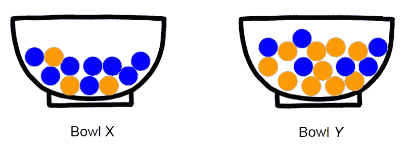

Bowl **X** and Bowl **Y** filled with oranges and blueberries.

## 颠倒的情况

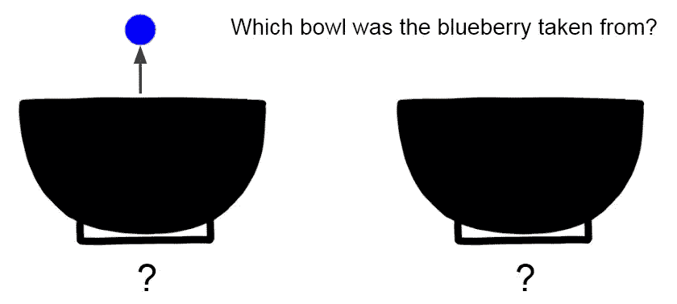

I pick blindly an item and get a blueberry.

> 但是如果我从一个随机的碗中选一样东西会怎么样呢？假设我摘了一颗蓝莓。你能说出蓝莓是从哪个碗里摘的概率吗？
> 
> 这个问题可以用贝叶斯定理来回答。

# 3.贝叶斯定理推导

为了推导贝叶斯定理，我们要模拟一个实验。在这个实验中，我们掷骰子。每次骰子显示的数字小于或等于 4 时，我们将从碗*中选择一个项目，对于数字大于或等于 5 时，我们将从碗 ***Y*** 中选择一个项目。而且我们要这样做 *N* =300 次。为了简化问题，我们引入以下缩写:*

## *蓝莓:= B，橘子:= O，碗 X := X，碗 Y := Y*

*在我们掷骰子 *N* =300 次之后，我们将获得一些关于从两个碗中挑选的物品数量的统计结果。实验的假设结果如图 1 所示。此处的 ***s*** 代表一个碗或一个物品被挑选的“来源”。 ***y*** 为可观察变量(蓝莓或橙子)。*

*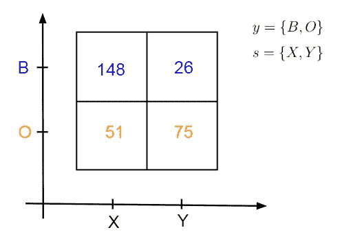*

*Fig. 1 Statistical results*

*该图告诉我们，我们已经选择了…*

*   *… 148 次碗里的一颗蓝莓 X: **n(s= *X* ，y= *B* )=148***
*   *… 26 次碗里的蓝莓 Y: **n(s= *Y* ，y= *B* )=26***
*   *…碗里一个橘子的 51 倍 X: **n(s= *X* ，y= *O* )=51***
*   *…碗里一个橘子的 75 倍 Y: **n(s= *Y* ，y= *O* )=75***

> *鉴于这些统计数字，我们现在可以问一些有趣的问题…*

## ***从碗 X 中随机选取一个物品的概率是多少？***

*为了获得我们表示为 **p(s=X)** 的概率，我们必须将仅从碗 **X** 中拾取的物品数除以总拾取数 *N* =300。这里是 **n(s= *X* ，y= *B* )=148** 从 **X** 和**中摘下的蓝莓数 n(s= *X* ，y =*O*= 51**从**X**中摘下的橙子数*

***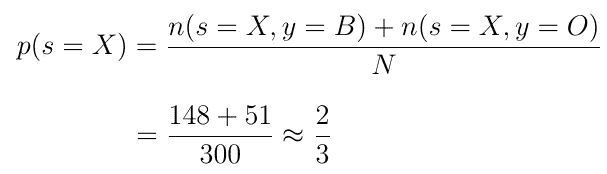***

***Eq. 1 Probability to pick an item from bowl X.***

> *****注**:这种概率称为“先验概率”。在贝叶斯统计推断中，先验概率是在收集新数据之前某一事件的概率。在这种情况下， **p(s=X)** 给出了从 **X** 中选择一个物品的概率，而不知道它到底是哪个物品。***

***因此，从 **Y** 中选择一个项目的概率 **p(s=Y)** 为:***

***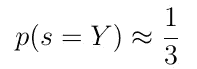***

***Eq. 2 Probability to pick an item from bowl Y.***

## *****挑选一个橙子/蓝莓的概率有多大？*****

***这一次，我们想知道在不考虑特定碗的情况下，选择橙子或蓝莓的可能性有多大。我们将这些概率表示为 **p(y=O)** 和 **p(y=B)** 。计算类似于前一种情况。我们将特定商品的提货次数除以总提货次数。由此产生的概率由等式给出。3 和情商。4:***

***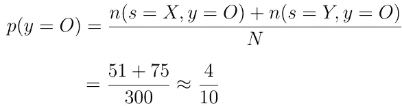***

***Eq. 3 Probability to pick an orange.***

***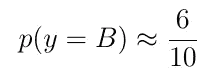***

***Eq. 4 Probability to pick a blueberry.***

## ***从 X 中挑出一颗蓝莓的概率有多大？***

***现在我们要计算联合概率 **p(s=X，y=B)** ，它告诉我们从 **X** 中采摘蓝莓的可能性。***

> *****注**:联合概率是事件 Nr.1 与事件 Nr 同时发生的概率。2 发生。在这种情况下，一个事件是从碰巧是 **X** 的碗中挑选。另一件事是我们摘了一颗蓝莓。***

***为了计算联合概率，我们需要将我们从 ***X*** 中采摘蓝莓的次数除以采摘的总次数:***

***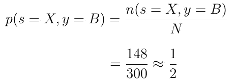***

***Eq. 5 Probably to pick a blueberry from **X**.***

***因此，从 **Y** 中采摘蓝莓的概率为:***

***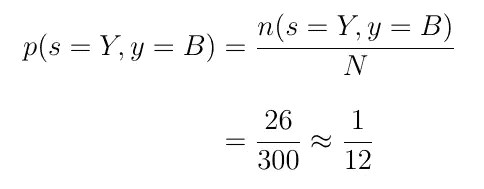***

***Eq. 6 Probably to pick a blueberry from **Y**.***

***从 **X** 中挑选一个橙子的概率是:***

***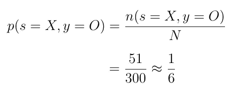***

***Eq. 7 Probably to pick an orange from **X**.***

***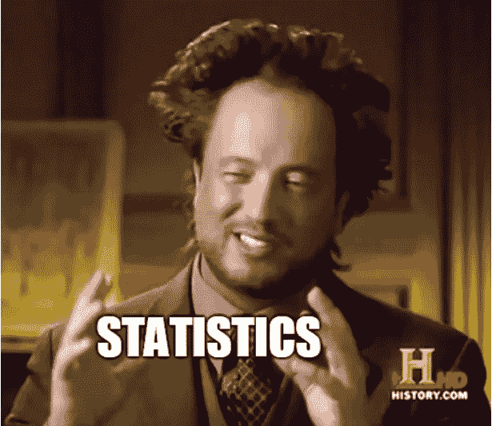***

## ***给定我们从 X 上摘的，它是蓝莓的概率是多少？***

***现在变得有趣了。我们计算第一个条件概率。在这种情况下，我们肯定知道我们从哪个碗中选择。在这种情况下，比方说，我们从 **X** 中选择。有了这些知识，我们可以计算出概率，告诉我们选择蓝莓的可能性。***

***这个条件概率表示为 **p(y=B| s=X)** ， **s=X** 是我们从 **X** 中挑选物品的条件。为了计算 **p(y=B| s=X)** 我们需要用从 ***X*** 中采摘的蓝莓的次数除以从 ***X*** 中采摘的商品总数:***

***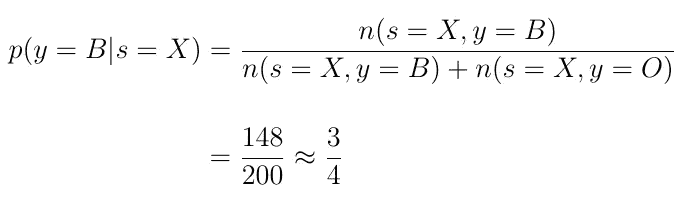***

***Eq. 8 Probably to pick a blueberry, given that we pick from **X**.***

## ***乘积规则***

***是时候制定第一条重要的统计规则了。这里，我们采用之前推导出的从 **X** **p(s=X，y=B)** 中采摘蓝莓的概率，并通过在分母和分子中乘以( **n(s=X，y=B)+n(s=X，y=O))** 来扩展该等式。我们可以这样做，因为概率 **p(s=X，y=B)** 的值不会因为这个扩展而改变。***

***现在，如果你仔细看看这个等式，你会注意到新的表达式由我们之前推导出的另外两个概率 **p(y=B|s=X)** 和 **p(s=X)** 的乘积组成。***

***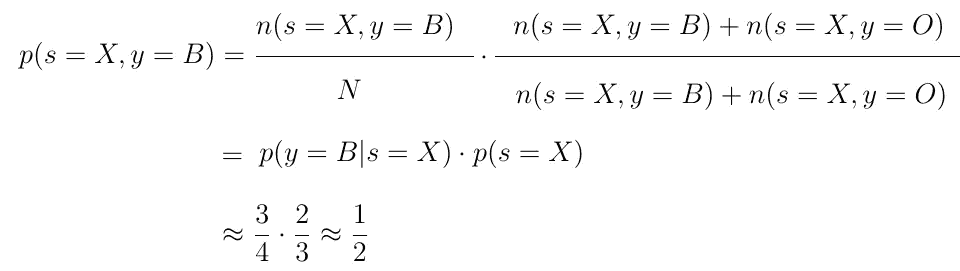***

***Eq. 9 Product rule***

***概率之间的这种关系叫做乘积法则。乘积法则允许我们利用条件概率 **p(y=B| s=X)** 和先验概率 **p(s=X)来计算联合概率 **p(s=X，y=B)** 。*****

## ***求和规则***

***现在让我们重温一下先验概率 **p(s=X )** ，它给出了我们从 **X** 中选择任何项目的可能性。如果你把方程分成两个被加数，如方程第二行所示。10 你可以观察到，这两个被加数只不过是我们先前推导出的两个联合概率。***

***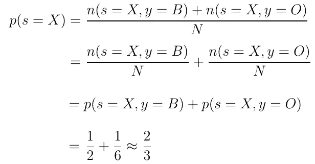***

***Eq. 10 Sum rule***

***这种关系叫做求和规则。求和规则允许通过对包含来自先前的随机变量 **s=X** 和任何其他随机变量 **y** 的联合概率求和来计算先前的 **p(X)** 概率。***

## ***贝叶斯规则***

***对于乘积规则，联合中随机变量的顺序无关紧要。因此 **p(s，y)** 和 **p(y，s)** 具有相同的值。***

***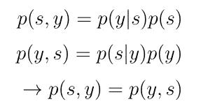***

***如果我们使值 **p(s，y)** 和 **p(y，s)** 相等，并做一些重组，我们得到一个新的数学表达式。p(s | y)的这个新表达式就是贝叶斯规则。***

***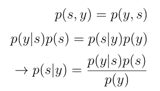***

***Eq. 12 Bayes’Theorem/Rule.***

## ***最后:蓝莓是从哪个碗里取的？***

***贝叶斯定理为我们提供了条件概率**p(s | y)**的计算公式，这就是我们最初问题的答案。***

***我们摘了一颗蓝莓的事实可以用条件 **y=B** 来表示。为了回答蓝莓是从哪个碗里摘的这个问题，我们必须为 **s=X** 和 **s=Y** 计算 **p(s|y=B)** 。 **p(s|y)** 的两个值都告诉我们蓝莓是从碗 **X** 或碗 **Y** 中采摘的可能性。***

***我们来做一下 **s=X** 的计算。幸运的是，我们需要的所有概率，我们已经在前面的章节中计算过了。如果我们将这些概率插入等式中的 **p(s=X|y=B)** 。13 我们得出以下结论:**假设我们摘了一颗蓝莓，这颗蓝莓从碗 X 中摘下的概率约为 86 %。**对于任何其他情况，可以类似地进行计算。***

***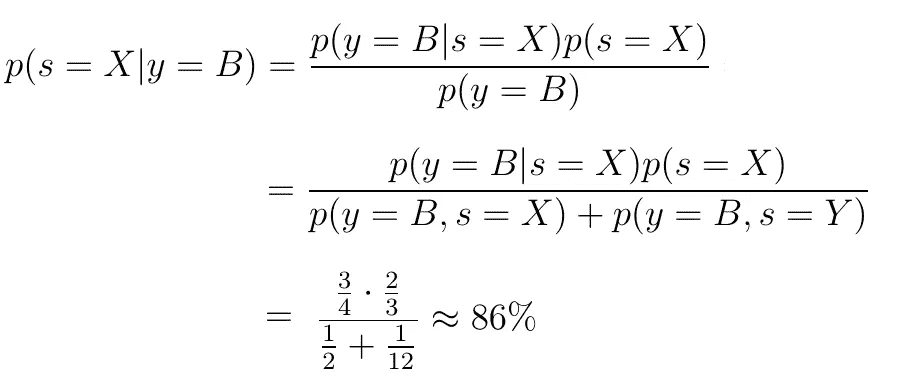***

***Eq. 13 Bayes’Theorem***

***如果没有贝叶斯定理，p(s|y) 的计算将非常困难。然而，这个定理允许我们用更容易计算的概率来计算这个概率。这就是贝叶斯定理的神奇之处:**难以计算的概率分布用非常容易计算的概率来表示。*****