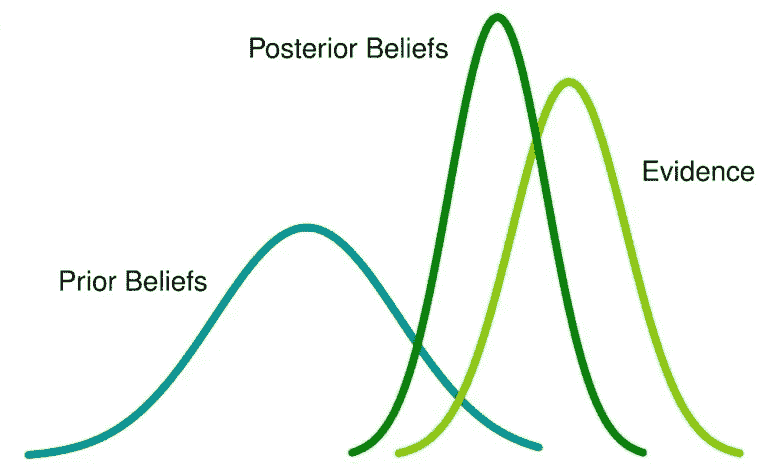
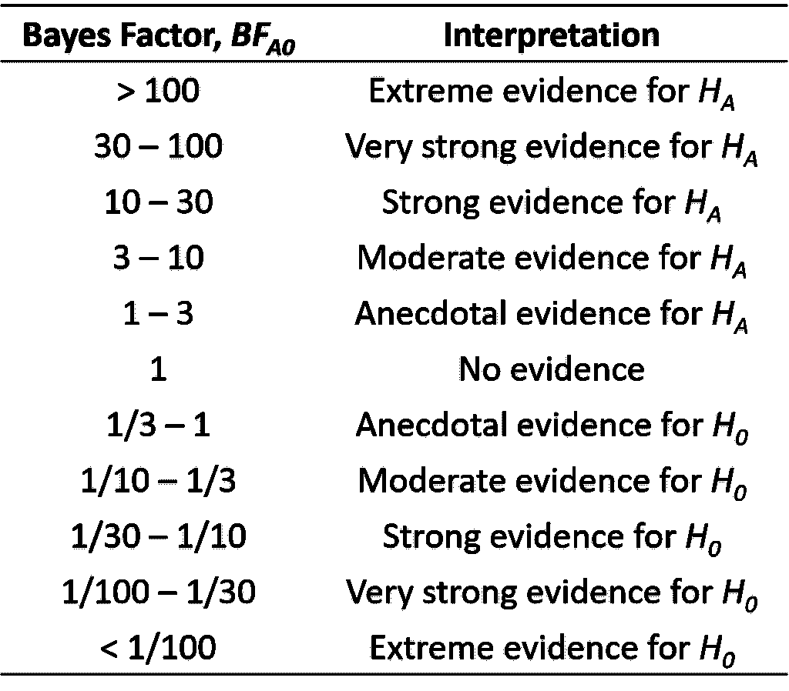
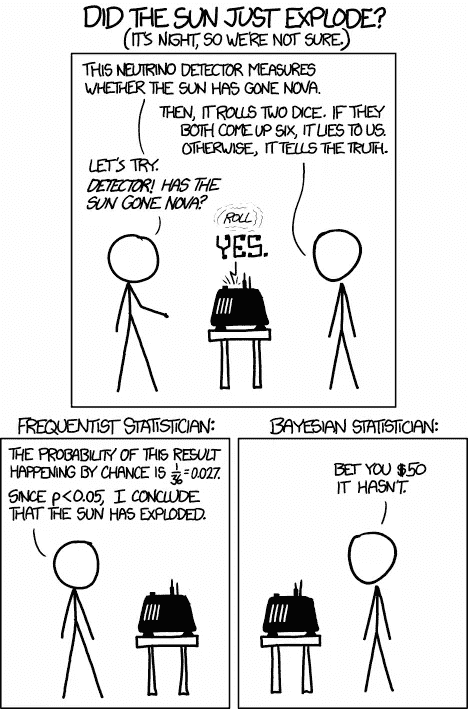

# 贝叶斯分析和复制危机:外行人的观点

> 原文：<https://towardsdatascience.com/bayesian-analysis-the-replication-crisis-a-laypersons-perspective-241f9d4f73db?source=collection_archive---------14----------------------->

免责声明:我没有使用贝叶斯分析的任何经验，但我一直在试图理解基本概念。如果在这方面有更多知识的人发现任何错误，请在评论中指出来。

近年来，在复制危机之后，借助更强大的计算能力，贝叶斯统计分析方法越来越受欢迎。虽然我们很多人听说它是大多数人熟悉的 Frequentist 方法的替代方法，但没有多少人真正理解它的作用和使用方法。这篇文章希望简化贝叶斯分析的核心概念，并简要解释为什么它被提出作为解决[复制危机](https://en.wikipedia.org/wiki/Replication_crisis)的方法。

如果你只能从试图理解贝叶斯分析中得到两样东西，下面两条原则应该是最重要的:

1.  *贝叶斯分析试图通过一个通常被称为贝叶斯更新的过程，将先前的信息与当前的证据相结合，以测试一个观察结果是否支持某个假设。*
2.  贝叶斯分析中的零假设和替代假设都被认为是可能的，但可能程度不同。贝叶斯因子表明哪种假设更有可能，但它并不能得出明确的结论。

在统计分析的 [Frequentist](https://en.wikipedia.org/wiki/Frequentist_inference) 方法中，假设检验仅使用从单一观察中收集的证据来完成。研究人员根据单个时间点测试的统计显著性来判断假设是否成立。研究人员有时会将该观察结果与以前类似观察结果进行比较，并注意最新的观察结果是否被重复，以了解观察到的效应有多大可能是真实的。

然而,[贝叶斯](https://en.wikipedia.org/wiki/Bayesian_inference)方法会立即考虑之前收集的信息，以及最近收集的证据，以决定观察到的效应有多大可能是真实的。如下图所示，先验信念的概率分布用当前证据的概率分布更新，以生成后验信念的概率分布。后验概率与先验概率的比值给了我们贝叶斯因子，它表明哪个信念更有可能发生。

Probability distributions of Prior Beliefs, Posterior Beliefs and Current Evidence. ([Image](https://www.analyticsvidhya.com/blog/2016/06/bayesian-statistics-beginners-simple-english/) by [Neeraj Singh Sarwan](https://medium.com/u/b36d81188988?source=post_page-----241f9d4f73db--------------------------------) via [Team AV](https://medium.com/u/c7c686fcd4b?source=post_page-----241f9d4f73db--------------------------------))

在 Frequentist 方法中，确定一个观察到的效应的存在几乎是一个基于接受或拒绝零假设的二元是/否决策。但是在贝叶斯方法中，无效假设和替代假设继续保持它们自己的概率。例如，可能有 5%的几率零假设为真，25%的几率替代假设为真。(事实上，将假设表示为概率只能用贝叶斯方法而不能用频率主义方法，但这种错误是频率主义者经常犯的。)这意味着替代假设的可能性是零假设的 5 倍。参照统计学家[哈罗德·杰弗里斯](https://en.wikipedia.org/wiki/Harold_Jeffreys)开发的解释[贝叶斯因子](https://en.wikipedia.org/wiki/Bayes_factor)的量表，贝叶斯因子 5 表示替代假设的适度证据。如果贝叶斯因子为 1，则意味着零假设和备择假设的概率相等；如果贝叶斯因子在 0 和 1 之间，这意味着证据支持零假设。下表解释了不同级别的贝叶斯因子:

Scale for interpretation of Bayes Factors developed by Jeffreys (1961) [1].

与当*p*-值小于 0.05 时拒绝零假设的频率主义方法不同，贝叶斯方法显然没有接受或拒绝某个假设的明确界限。它只是说，根据当前的证据如何更新先前的信息，一个假设比另一个更有可能。但是不管哪种假设更有可能，贝叶斯仍然会记住，任何一种假设都有可能是正确的。贝叶斯分析的这些核心原则是它被提议作为复制危机的解决方案的原因，这将在下一节中解释。

## 贝叶斯分析如何帮助解决复制危机

到目前为止，您可能已经看到，包含先验信息是贝叶斯分析的关键。如果我们仔细想想，这其实很有意义。当在没有考虑先验信息的情况下进行研究时，当观察效果的基本比率非常低时，犯[I 型错误](https://en.wikipedia.org/wiki/Type_I_and_type_II_errors)(检测假阳性)的风险特别高。下面的 xkcd 漫画很好的说明了这一点:

How a Frequentist and Bayesian determine whether the sun has exploded. (Image by [xkcd.com](https://www.xkcd.com/1132/))

简单来说，频率主义者根据探测器说谎的概率小于 0.05 的阈值来判定中微子探测器是对的。这种单一的观察没有考虑到这样一个事实，即根据历史记录，太阳爆炸的可能性极小。通过将该先验信息分解到分析中，贝叶斯确定检测器的输出不应该对先验信念有太大影响，如果有的话。(此处见详细解释[。)](https://www.explainxkcd.com/wiki/index.php/1132:_Frequentists_vs._Bayesians)

虽然这幅漫画可能是一个极端的例子，但它凸显了一种可能性，即常客往往会忽视这种可能性，并最终过于相信单一观察的结果。这部分解释了为什么一些研究不能被重复，因为观察到的效应仍然可能是偶然出现的假阳性。因此，贝叶斯分析可以通过尽可能简单地考虑先验信息来潜在地解决这个问题，作为对意外或反直觉发现的现实检查。

贝叶斯分析有助于解决复制危机的第二个原因是，它处理假设检验的方式与频率主义方法非常不同。如前所述，频率主义者的目标是基于一个二元的是/否决策来确定一个效应是否真的存在。在他最近发表的关于“统计仪式:复制错觉和我们如何到达那里”[2]的文章中， [Gerd Gigerenzer](https://en.wikipedia.org/wiki/Gerd_Gigerenzer) (2018)强调了研究如何演变成一种“无效仪式”，对统计数据的解释成为一种仪式化的过程，在没有更深入理解的情况下使用理论。他还认为，当研究人员认为统计显著性证明了一种效应的存在时，过度自信也是一个问题。他建议学校把重点放在教学生理解统计信息的细微差别上，而不仅仅是学习遵循惯例。他还建议，期刊不应该接受仅仅报道结果为“重要”或“不重要”的论文。

贝叶斯分析本质上不存在这些问题。这种分析从整体上检查所有信息，它对通过二元是/否决策来确定影响的存在不感兴趣。如前所述，它只是表明一个假设与另一个假设相比有多大的可能性，事实上认为所有的假设都包含一定程度的可能性。这种方法允许研究人员欣赏收集的证据的细微差别，而不是简单地根据硬阈值得出结论。通过对证据的深入理解，研究人员将对他们的研究的可复制性有一个更现实的预期，也将更好地解释为什么他们的研究不能被复制。然而， [Andrew Gelman](https://en.wikipedia.org/wiki/Andrew_Gelman) (2014)正确地警告说，如果贝叶斯因子被用来以类似于 *p* 值的方式接受或拒绝假设，分析将最终失去其细微差别，并重新陷入同样的困境[3]。

* * * * * * * * * *

我希望我已经解释了贝叶斯分析的基本原理，以及它的原理如何帮助解决复制危机。我没有深入研究如何进行各种贝叶斯测试的技术细节，因为我自己对它们并不熟悉，而且无论如何也可以在网上找到许多其他参考资料。我推荐的一篇[文章](/bayesian-statistics-for-data-science-45397ec79c94)是另一位叫做 [Ankit Rathi](https://towardsdatascience.com/@rathi.ankit) 的媒体作家写的，他成功地以非常简洁的方式解释了贝叶斯和频率主义者之间的区别。我想澄清的是，这篇文章的目的并不是提倡在未来的研究中用贝叶斯分析取代频率主义分析。这篇文章的目的是揭开贝叶斯分析背后的概念，以及帮助人们认识到研究结论可能并不总是确定的，理解科学可能是一个更加微妙的努力。

以复制危机作为结束，虽然许多学校没有训练研究人员在统计上更加严谨可能是事实，但问题的核心可能在于谦逊的问题。《危机中的心理学》一书的作者[布莱恩·休斯](https://www.psychologytoday.com/intl/experts/brian-m-hughes-phd) (2018)在英国心理学会博客上写了一篇文章[4]，“人们本能地以自我吹捧的方式解读歧义，将工作的积极方面归因于优点，将消极方面归因于机遇。心理学家也不例外。结果是一种真诚的信念，即我们的见解是深刻的，我们的疗法是杰出的，我们的研究比实际情况更强大。”不可否认，在研究中，在生活中，都存在着模糊性和随机性。但是，与其抱着一切都可以被解释以符合我们的假设的心态，不如谦虚一点，接受我们观察到的不一定符合我们的意愿。我们可能很难将自己从我们自己的研究的意义中脱离出来，但是如果忽视了这一点，所有解决复制危机的努力可能都将是徒劳的。

**关于贝叶斯分析和复制危机的更多信息，请访问以下链接:**

 [## 用 Bayes 因子代替 p 值:心理学可复制性危机的神奇疗法

### 科学应该如何工作外行人、本科生和教科书作者有一个简单的科学模型…

replicationindex.wordpress.com](https://replicationindex.wordpress.com/2015/04/30/replacing-p-values-with-bayes-factors-a-miracle-cure-for-the-replicability-crisis-in-psychological-science/) 

**参考文献:**

1.  杰弗里斯，H. (1961)。 [*概率论(第 3 版。)*](https://books.google.com.sg/books?id=vh9Act9rtzQC&printsec=frontcover&dq=isbn:0191589675&hl=en&sa=X&ved=0ahUKEwiG17rXmoXeAhWMMY8KHb8-AxMQ6AEIKDAA#v=onepage&q&f=false) 。牛津。第 432 页。
2.  Gigerenzer，G. (2018 年)。[统计仪式:复制错觉和我们如何到达那里](http://journals.sagepub.com/doi/abs/10.1177/2515245918771329)。*心理科学方法与实践进展*，2515245918771329。
3.  赫尔曼(2014 年)。[统计学和科学复制的危机](http://www.stat.columbia.edu/~gelman/research/published/psych_crisis_minipaper3.pdf)。*显著性*， *12* (3)，23–25。
4.  休斯，B. (2018，10 月)。心理学面临夸张危机吗？。检索自[https://the psychologist . bps . org . uk/volume-31/December-2018/does-psychology-face-夸张-危机](https://thepsychologist.bps.org.uk/volume-31/october-2018/does-psychology-face-exaggeration-crisis)。

*原文发布于:*[*https://learn curily . WordPress . com/2018/10/14/Bayesian-analysis*](https://learncuriously.wordpress.com/2018/10/14/bayesian-analysis/)