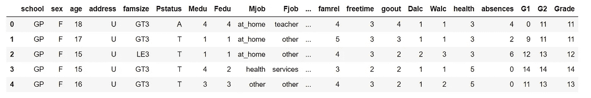
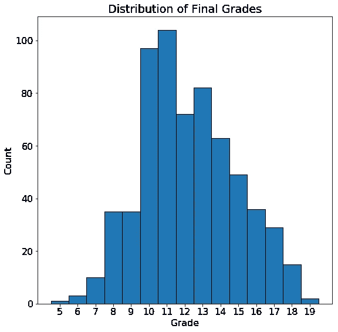
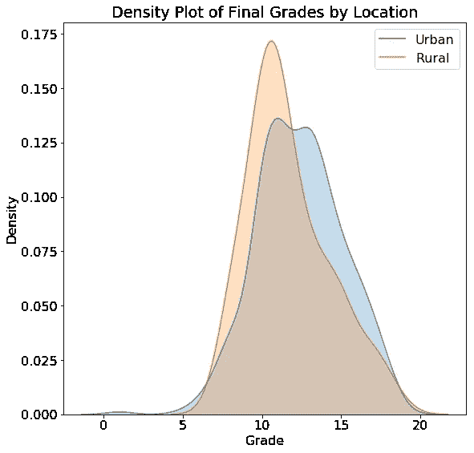
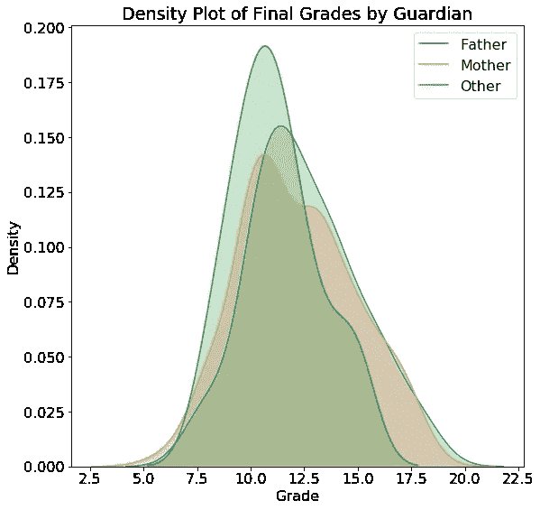
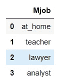
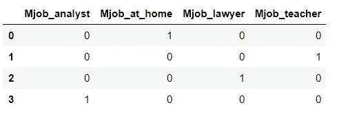
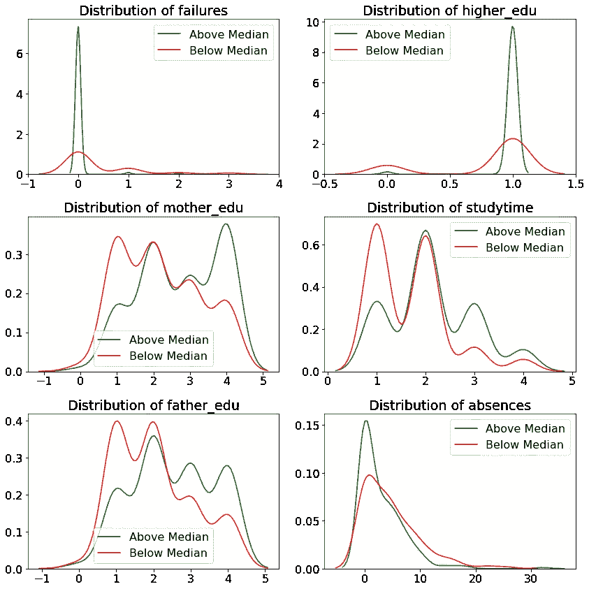
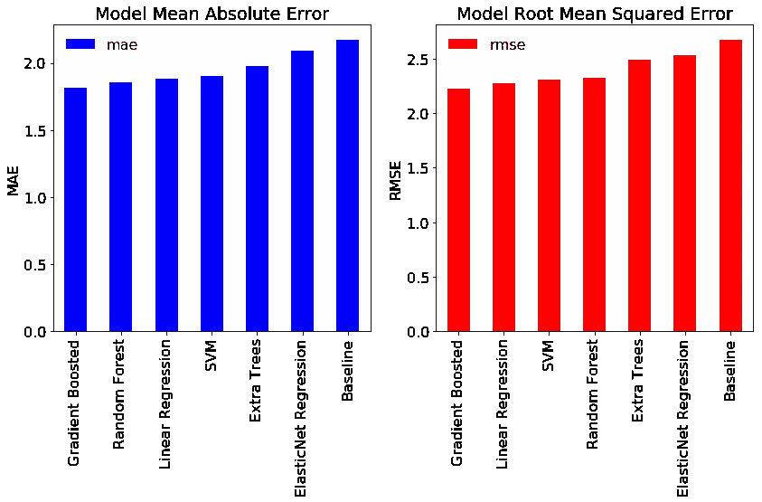
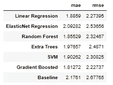

# Python 中的贝叶斯线性回归:使用机器学习预测学生成绩第 1 部分

> 原文：<https://towardsdatascience.com/bayesian-linear-regression-in-python-using-machine-learning-to-predict-student-grades-part-1-7d0ad817fca5?source=collection_archive---------1----------------------->


## 探索性数据分析、特性选择和基准测试

即使在与贝叶斯线性建模理论斗争了几个星期并写了一篇关于它的博客文章之后，我也不能说我完全理解了这个概念。因此，抱着边做边学是最有效的技术的心态，我开始做一个数据科学项目，使用贝叶斯线性回归作为我选择的机器学习模型。

这篇文章是两篇记录该项目的文章中的第一篇。我想展示一个完整的数据科学管道的例子，所以这第一篇文章将集中于定义问题、探索性数据分析和设置基准。[的第二部分](https://medium.com/@williamkoehrsen/bayesian-linear-regression-in-python-using-machine-learning-to-predict-student-grades-part-2-b72059a8ac7e)将完全专注于实现贝叶斯线性回归并解释结果，所以如果你已经有了 EDA，[前往那里](https://medium.com/@williamkoehrsen/bayesian-linear-regression-in-python-using-machine-learning-to-predict-student-grades-part-2-b72059a8ac7e)。如果没有，或者如果您只是想看一些不错的图，请留在这里，我们将介绍如何开始解决数据科学问题。

该项目的完整代码可以在 GitHub 上的 [Jupyter 笔记本](https://github.com/WillKoehrsen/Data-Analysis/blob/master/bayesian_lr/Bayesian%20Linear%20Regression%20Project.ipynb)中找到。我鼓励任何感兴趣的人来看看，并把自己的旋转这个项目。请随意使用、构建和以任何方式分发代码！

我喜欢专注于使用真实世界的数据，在这个项目中，我们将探索从葡萄牙中学收集的学生表现数据。这些数据包括学生的个人和学术特征以及期末成绩。我们的目标是创建一个可以根据学生信息预测成绩的模型。这个数据集，以及许多其他用于测试模型或尝试数据科学技术的有用数据集，可在 [UCI 机器学习库](https://archive.ics.uci.edu/ml/datasets/student+performance)上获得。

# 探索性数据分析

解决数据科学问题的第一步(一旦你清理了数据)是[探索性数据分析(EDA)](https://en.wikipedia.org/wiki/Exploratory_data_analysis) 。这是一个开放式的过程，我们在数据集中寻找异常、有趣的趋势或模式以及相关性。这些本身可能是有趣的，它们可以为我们的建模提供信息。基本上，我们使用 EDA 来找出我们的数据可以告诉我们什么！

首先，我们来看一个熊猫数据帧的数据快照:

```
import pandas as pddf = pd.read_csv(‘data/student-mat.csv’)
df.head()
```



总共有 633 个观察值和 33 个变量。每行是一个学生，每列包含一个不同的特征。等级列是我们的目标变量(也称为响应)，这使得这成为一个**监督、回归**机器学习任务。它是受监督的，因为我们有一组已知目标的训练数据，在训练过程中，我们希望我们的模型学会根据其他变量预测分数。我们将把等级视为连续的，这使得这成为一个回归问题(从技术上讲，等级只取整数值，所以它是一个[名义变量](https://stats.idre.ucla.edu/other/mult-pkg/whatstat/what-is-the-difference-between-categorical-ordinal-and-interval-variables/))。

感兴趣的主要变量是分数，所以让我们来看一下分布，以检查偏斜:

```
import matplotlib.pyplot as plt# Histogram of grades
plt.hist(df['Grade'], bins = 14)
plt.xlabel('Grade')
plt.ylabel('Count')
plt.title('Distribution of Final Grades')
```



分数接近正态分布，众数为 11(该学校的分数范围为 0-20)。虽然总体分数没有明显的倾斜，但是某些类别的学生可能会有倾斜的分数。为了观察分类变量对等级的影响，我们可以制作等级分布的[密度图](/histograms-and-density-plots-in-python-f6bda88f5ac0)，用分类变量的值来着色。为此，我们使用了 [seaborn](https://seaborn.pydata.org/) 库和`kdeplot`函数。以下是按位置(城市或农村)绘制分布图的代码:

```
import seaborn as sns# Make one plot for each different location
sns.kdeplot(df.ix[df['address'] == 'U', 'Grade'], 
            label = 'Urban', shade = True)
sns.kdeplot(df.ix[df['address'] == 'R', 'Grade'], 
            label = 'Rural', shade = True)# Add labeling
plt.xlabel('Grade')
plt.ylabel('Density')
plt.title('Density Plot of Final Grades by Location')
```

我们可以使用类似的代码来绘制 guardian 的分数分布，结果如下所示:



密度图上的实际值很难解释，但我们可以用图的形状进行比较。地理位置似乎对学生成绩没有实质性的影响，卫报也没有。诸如此类的图可以为我们的建模提供信息，因为它们告诉我们知道地点或监护人是否有助于预测最终分数。当然，我们想用一个比单一情节更严谨的衡量标准来得出这些结论，后面我们会用统计数据来佐证我们的直觉！

# 特征选择

正如我们从图中看到的，我们并不期望每个变量都与最终成绩相关，所以我们需要执行[特征选择](https://en.wikipedia.org/wiki/Feature_selection)(也称为维度缩减)来只选择“相关”变量。这取决于问题，但因为我们将在这个项目中进行线性建模，我们可以使用一个简单的测量方法，称为[相关系数](https://onlinecourses.science.psu.edu/stat501/node/256)来确定预测分数最有用的变量。这是一个介于-1 和+1 之间的值，用于衡量两个变量之间线性关系的方向和强度。

为了选择有限数量的变量，我们可以找到那些与最终成绩有最大相关性(或正或负)的变量。在熊猫身上寻找相关性非常简单:

```
# Find correlations and sort
df.corr()['Grade'].sort_values()**failures     -0.384569
absences     -0.204230
Dalc         -0.196891
Walc         -0.178839
traveltime   -0.129654
goout        -0.111228
freetime     -0.105206
health       -0.096461
age          -0.042505
famrel        0.072888
Fedu          0.204392
studytime     0.249855
Medu          0.278690**
```

至少以我的基本社会科学知识来看，这些相关性似乎是有道理的！`failures`是以前上课失败的次数，与成绩呈负相关，`absences`也是，缺课的次数。这种负相关说明随着这些变量的增加，最终成绩有下降的趋势(虽然我们只能说这是一种相关而不是一个变量导致另一个变量下降)。另一方面，每周学习的量`studytime`和母亲的教育水平`Medu`都与成绩呈正相关。

相关性只能在数字变量之间计算，因此要找到分类变量和等级之间的关系，我们必须对分类变量进行一次性编码，然后计算相关系数。 [One-hot encoding](https://hackernoon.com/what-is-one-hot-encoding-why-and-when-do-you-have-to-use-it-e3c6186d008f?gi=af9695dcf290) 是为分类变量中的每个类别创建一列的过程。以下是一次性编码前后的分类列示例:



一键编码是机器学习管道中的标准步骤，使用 pandas 库很容易做到:

```
# Select only categorical variables
category_df = df.select_dtypes('object')# One hot encode the variables
dummy_df = pd.get_dummies(category_df)# Put the grade back in the dataframe
dummy_df['Grade'] = df['Grade']# Find correlations with grade
dummy_df.corr()['Grade'].sort_values()**higher_no           -0.343742
school_MS           -0.227632
Mjob_at_home        -0.158496
reason_course       -0.138195
internet_no         -0.131408
address_R           -0.128350
address_U            0.128350
internet_yes         0.131408
Fjob_teacher         0.160938
Mjob_teacher         0.173851
reason_reputation    0.185979
school_GP            0.227632
higher_yes           0.343742**
```

我们再次看到直观上有意义的关系:`higher_no`表示学生不想继续接受高等教育，并且与分数负相关，`higher_yes` 表示学生确实想要接受高等教育，并且显示出正相关。`Mjob_at_home` 表示母亲待在家里，与成绩负相关，`Mjob_teacher`表示母亲教书，与成绩正相关。

在这个问题中，我们将使用这些结果来进行特征选择，只保留与最终成绩高度相关的 6 个变量。6 是一个任意的数字，我发现它在模型中工作得很好，这表明很多机器学习只是实验！

在特征选择后，我们最终使用的最后六个变量(详见笔记本[和](https://github.com/WillKoehrsen/Data-Analysis/blob/master/bayesian_lr/Bayesian%20Linear%20Regression%20Project.ipynb))显示在新数据帧的快照中。(我重命名了这些列，以便它们更直观):


变量的[完整描述在 UCI 机器学习库中，但这里有一个简要概述:](https://archive.ics.uci.edu/ml/datasets/student+performance#)

*   `failures`:以前的班级失败
*   `higher_edu`:二元表示学生是否会接受高等教育
*   `mother_edu`:母亲的教育水平
*   `studytime`:每周学习量
*   `father_edu`:父亲的受教育程度
*   `absences`:学期内缺课

当我们执行特性选择时，我们还使用 [Scikit-learn](http://scikit-learn.org/) 函数将数据分成训练集和测试集。这是必要的，因为我们需要有一个坚持测试集来评估我们的模型，并确保它不会过度拟合测试数据:

```
from sklearn.model_selection import train_test_split# df is features and labels are the targets 
# Split by putting 25% in the testing set
X_train, X_test, y_train, y_test = train_test_split(df, labels, 
                                                   test_size = 0.25,
                                                    random_state=42)
```

这留给我们 474 个训练观察和 159 个测试数据点。

## 检查所选要素

我最喜欢的图形之一是[对图](/visualizing-data-with-pair-plots-in-python-f228cf529166)，它非常适合显示变量的分布以及变量对之间的关系。这里我使用 seaborn `PairGrid`函数来显示所选特性的 Pairs 图:


这个情节里编码了很多信息！在上面的三角形中，我们绘制了每个变量的散点图。请注意，大多数变量都是离散整数，这意味着它们只取特定的值。在对角线上，我们有直方图显示单个变量的分布。右下角有二维密度图和变量之间的相关系数。

为了解释该图，我们可以选择一个变量，并查看行和列，以找到与所有其他变量的关系。例如，第一行显示了我们的目标`Grade`与其他变量的散点图。第一列显示了`Grade`和其他变量之间的相关系数。我们看到`failures`在绝对量级上与最终成绩的相关性最大。

作为对所选数据的另一种探索，我们可以绘制每个变量的分布图，如果分数高于 12 的中值，则用颜色标记。为了绘制这些图，我们在数据框中创建一个列，将等级与 12 进行比较，然后将所有值绘制在密度图中。

这产生了以下图:



绿色分布代表成绩处于或高于中间值的学生，红色代表低于中间值的学生。我们可以看到，有些变量与成绩更为正相关(如`studytime`)，而另一些变量则是低成绩的指标，如低`father_edu`。

EDA 让我们对数据集有了很好的了解。我们制作图表，找到变量之间的关系，并使用这些来执行特征选择，以便只保留与我们的任务最相关的变量。虽然 EDA 是建模的先驱，但它本身也很有用，许多数据科学问题可以通过我们在这里制作的图表和统计数据来解决。

## 建立基线指标

机器学习管道中最容易被忽视的一个方面是建立基线。是的，如果您的分类模型达到 99%的准确率，这可能看起来令人印象深刻，但是如果我们每次都通过猜测相同的类来获得 98%的准确率，会怎么样呢？我们真的想花时间为这个问题建立一个模型吗？一个好的基线允许我们评估我们的模型(或者任何模型)是否适用于这个任务。

对于回归，一个好的简单基线就是猜测测试数据中每个观察值的目标中值。在我们的问题中，中位数是 12，所以让我们评估一个模型的准确性，该模型天真地预测测试集上的每个学生都是 12。我们将使用 2 个指标来评估预测:

*   **平均绝对误差(MAE)** :预测值与真实值之差的绝对值的平均值。
*   **均方根误差(RMSE)** :预测值和真实值之间的平均平方差的平方根。

平均绝对误差很容易解释，因为它代表了我们平均离正确值有多远。均方根误差对较大误差的惩罚更重，通常用于回归任务。根据具体情况，这两个指标可能都合适，我们将使用这两个指标进行比较。([这里讨论一下这些指标的优点](https://medium.com/human-in-a-machine-world/mae-and-rmse-which-metric-is-better-e60ac3bde13d)。)

当我们对测试集上的每个例子预测 12 时，我们得到这些结果:

```
**Median Baseline  MAE: 2.1761
Median Baseline RMSE: 2.6777**
```

如果我们的机器学习模型无法击败这些指标，那么我们要么需要获得更多数据，尝试另一种方法，要么得出机器学习不适用于我们的问题的结论！

我们的建模重点是贝叶斯线性回归，但将我们的结果与标准技术(如线性回归、支持向量机或基于树的方法)的结果进行比较会有所帮助。我们将在数据集上评估其中的几种方法。幸运的是，这些都很容易用 Scikit-Learn 等 Python 库来实现。检查笔记本上的代码，但这里是 6 个不同模型的结果以及原始基线:



幸运的是，我们看到所有的模型最好的基线表明机器学习将为这个问题工作。总体而言，[梯度增强回归方法](http://scikit-learn.org/stable/modules/generated/sklearn.ensemble.GradientBoostingRegressor.html)表现最佳，尽管[普通最小二乘(OLS)线性回归](http://setosa.io/ev/ordinary-least-squares-regression/) ( [线性建模的频率主义方法](https://stats.stackexchange.com/questions/171423/is-ols-the-frequentist-approach-to-linear-regression))也表现良好。



作为最后的练习，我们可以解释 OLS 线性回归模型。线性回归是最简单的机器学习技术，在具有大量特征的复杂非线性问题上表现不佳，但它具有易于解释的优势。我们可以使用训练好的模型从线性回归中提取预测公式。下面是公式:

```
**Grade = 9.19 - 1.32 * failures + 1.86 * higher_edu + 0.26 * mother_edu + 0.58 * studytime + 0.03 * father_edu - 0.07 * absences**
```

截距，9.19，代表我们的猜测，如果一个学生的每个变量都是 0。系数(也称为权重或模型参数)表示相应变量单位增加的影响。例如，每增加一次以前的失败，学生的分数预计会减少 1.32 分，母亲的教育每增加一分，学生的分数增加 0.26 分。在解决问题时，我经常喜欢从线性回归开始，因为如果它足够好，我们就有了一个完全可以解释的模型，我们可以用它来进行预测。

# 结论

虽然机器学习得到了所有的关注，但它通常只是数据科学项目的一小部分。大部分工作——也是大部分价值——来自于获取、清理和探索数据。只有当我们牢牢掌握了数据的结构和其中的关系，我们才应该着手建立机器学习模型。我想展示这个项目的整个过程，以展示一个典型的数据科学工作流程。在这个项目的前半部分，我们:

*   探索数据以发现有趣的模式、趋势或异常
*   检查特征和目标之间的相关性
*   使用相关值执行特征选择
*   建立了基线和基准机器学习模型

这些技术同样适用于任何机器学习问题，所以请随意将它们作为您下一个项目的起点。虽然特定机器学习模型的确切实现细节可能不同，但数据科学问题的[总体结构是相当一致的](/a-data-science-workflow-26c3f05a010e)。

[在本系列的下半部分](https://medium.com/@williamkoehrsen/bayesian-linear-regression-in-python-using-machine-learning-to-predict-student-grades-part-2-b72059a8ac7e)，我们将使用 Python 中的 [PyMC3 实现一个贝叶斯线性回归模型。我们将建立模型，训练模型(在这种情况下，这意味着从后验抽样)，检查模型的推论，并使用结果进行预测。我们在那里见！](http://docs.pymc.io/notebooks/getting_started)

一如既往，我欢迎反馈和建设性的批评。你可以在推特上找到我。