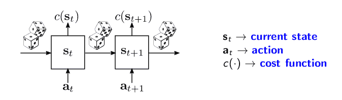
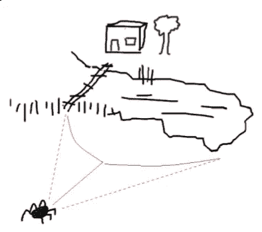
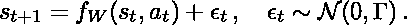
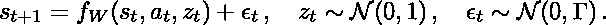
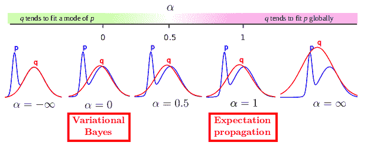
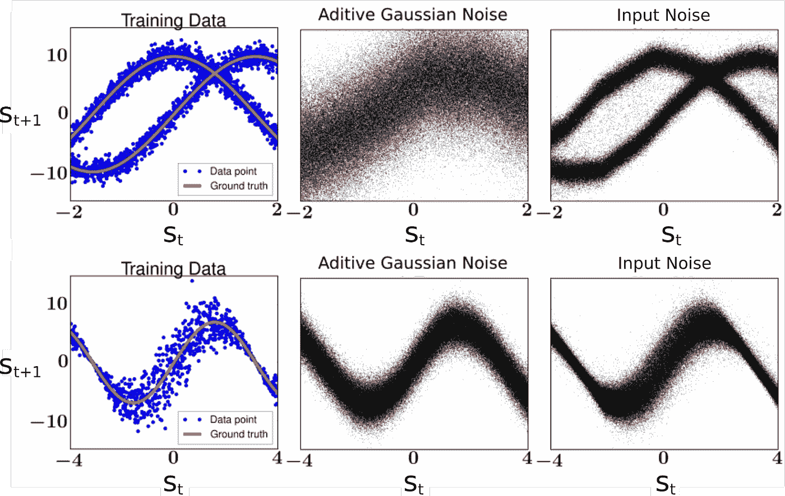
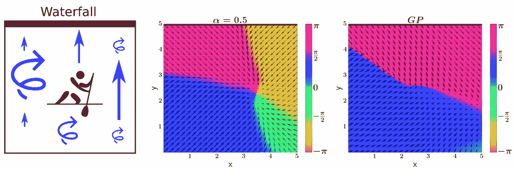
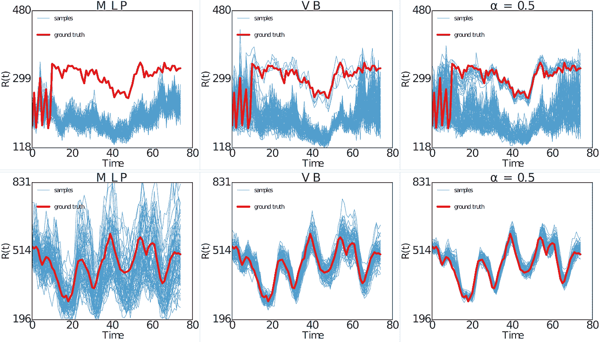

# 基于模型强化学习的随机输入贝叶斯神经网络

> 原文：<https://towardsdatascience.com/bayesian-neural-networks-with-random-inputs-for-model-based-reinforcement-learning-36606a9399b4?source=collection_archive---------3----------------------->

我在这里描述我们最近的 ICLR 论文[1][[code](https://github.com/siemens/policy_search_bb-alpha)][[talk](https://www.youtube.com/watch?v=0H3EkUPENSY))]，它介绍了一种基于模型的强化学习的新方法。这项工作的主要作者是 **Stefan Depeweg** ，他是我共同指导的慕尼黑工业大学的博士生。

关键贡献在于我们的模型:**具有随机输入的贝叶斯神经网络**，其输入层包含输入特征和随机变量，这些变量通过网络向前传播，并在输出层转换为任意噪声信号。

随机输入使我们的模型能够**自动**捕获**复杂的噪声模式**，提高我们基于模型的模拟的质量，并在实践中产生更好的策略。

# **问题描述**

我们处理随机动力系统中的策略搜索问题。例如，要操作燃气轮机等工业系统:

这些系统的抽象如下所示。系统的当前状态表示为 s_t，并且与每个状态 s_t 相关联的是由函数 *c* 给出的成本 *c* (s_t)。在每个时间步，我们施加一个动作 a_t，它将影响下一个时间步 s_t+1 的系统状态。

从 s_t 到 s_t+1 的转变不仅由动作 a_t 决定，还由一些我们无法控制的噪声信号决定。该噪声信号由图中的方块表示。在涡轮机的例子中，噪声的产生是因为我们观察到的状态仅由传感器测量值组成，这些测量值是对系统真实状态的不完整描述。

为了控制系统，我们可以使用一个策略函数 a _ t = 𝜋(s_t；𝜃)将当前状态 s_t 映射到动作 a_t，例如𝜋(；𝜃)可以是具有权重𝜃.的神经网络

我们的目标是找到一种策略(𝜃的一个值),它将在一系列状态轨迹上产生平均**较低的成本函数值。例如，我们的目标是最小化**

注意，上面的表达式是随机的，因为它取决于初始状态 S1 的选择和状态转换中的随机噪声。

# **批量强化学习**

我们考虑**批量强化学习场景**，在学习过程中我们不会与系统交互。这种情况在现实世界的工业设置中很常见，例如涡轮机控制，在这种情况下，探索受到限制，以避免对系统造成可能的损害。

因此，为了找到最佳策略，我们只有从已经运行的系统获得的状态转换形式的一批数据 *D* = {(s_t，a_t，s_t+1)}，并且我们将不能收集任何额外的数据。

首先，我们从 *D* 得知 p(s_t+1|s_t，a_t)的模型，即下一个状态 s_t+1 的预测分布，作为当前状态 s_t 和应用的动作 a_t 的函数。然后我们把这个模型和政策联系起来，得到 p(s_t+1|s_t，a _ t = 𝜋(s_t；𝜃)，它描述了系统在𝜋(政策控制下的演变；𝜃).

先前的分布可用于执行**展开**或状态轨迹的模拟。我们从随机采样的状态 s_1 开始，然后从 p(s_t+1|s_t，a _ t = 𝜋(s_t；𝜃))来获得状态 S1，…，s_T 的轨迹

然后，可以在采样的 s_1，…，s_T 上评估成本函数，以逼近 cost(𝜃).这种近似的梯度可用于执行随机优化，并在产生平均低值 cost(𝜃).的方向上移动

# **最优控制中噪声的影响**

状态转换中存在的噪声会显著影响最优策略。这可以通过**醉酒蜘蛛**的故事来说明，这个故事最初是由 Bert Kappen [2]提出的，我们在这里用它作为一个激励的例子。

一只蜘蛛有两条回家的路:要么过桥，要么绕湖行走。在没有噪声的情况下，桥接选项更受青睐，因为它更短。然而，在大量饮酒后，蜘蛛的动作可能会随机向左或向右偏离。因为桥很窄，而且蜘蛛不喜欢游泳，所以现在更喜欢沿着湖走。

前面的例子显示了**噪声如何显著影响最优控制**。例如，最佳策略可以根据噪声水平是高还是低而改变。因此，我们希望通过以高精度捕获状态转换数据中存在的任何噪声模式，在基于模型的强化学习中获得显著的改进。

# **具有随机输入的贝叶斯神经网络**

在实践中，大多数状态转移数据的建模方法只是假设 s_t+1 中的**加性高斯噪声**，即，

其中 *f_W* 例如是具有权重 *W* 的神经网络。在这种情况下，通过最大可能性学习 *W* 是非常容易的。然而，加性高斯噪声的假设在现实世界中不太可能成立。

通过使用 *f_W* 中的**随机输入**可以获得更灵活的过渡动态噪声模型。特别是，我们可以假设

在该模型下，输入噪声变量 z_t 可以通过 *f_W* 以复杂的方式进行变换，以在 s_t+1 中产生作为 s_t 和 a_t 的函数的任意随机模式。

然而，现在学习 *W* 不再能够通过最大似然法来完成，因为 z_t 是未知的。一个解决方案是遵循**贝叶斯方法**并在 *W* 和 z_t 上使用后验分布。该分布捕捉了我们在看到 *D* 中的数据后对这些变量可能取值的不确定性。

计算精确的后验概率是困难的，但是我们可以学习高斯近似法。这种近似的参数可以通过最小化相对于真实后验概率的偏差来调整。**变分贝叶斯(VB)** 是一种流行的方法，它通过最小化 Kullback-Leibler 散度来工作。

# **α发散最小化**

不使用 VB，我们通过**最小化****α-散度**【3，4】**来学习分解的高斯近似 *q* 。**通过改变该散度中的α值，我们可以在符合真实后验概率 p 中的一个模式或旨在覆盖 *p* 中的多个模式的解之间进行平滑插值，如下图所示:

有趣的是，VB 是α = 0 时α散度最小化的一个特例。另一个众所周知的近似贝叶斯推断方法是期望传播，它是在α = 1 时获得的。在我们的实验中，我们使用 **α = 0.5** ，因为这通常在实践中产生更好的概率预测[4]。

# **玩具示例的结果**

下图显示了我们的贝叶斯神经网络在两个玩具例子中随机输入的结果。每个示例的训练数据显示在最左边的列中。第一行显示了**双模态**预测分布的问题。底部一行显示了**异方差**噪声的问题(噪声幅度取决于输入)。

中间一列显示了用仅假设加性高斯噪声的模型获得的预测。该模型不能捕捉数据中的双模态或异方差。最右边的列显示了我们的贝叶斯神经网络对随机输入的预测，它可以自动识别数据中存在的随机模式的类型。

# **湿鸡问题的结果**

我们现在考虑一个强化学习基准，其中一名划独木舟的人正在二维河流上划桨，如下图中最左侧的图所示。河流中有一个**漂流**将独木舟者推向位于顶部的**瀑布**，漂流右侧较强，左侧较弱。如果划独木舟的人掉进了瀑布，他必须从河底重新开始。

河中还有**湍流**，左边变强，右边变弱。划独木舟的人离瀑布越近，得到的奖励就越高。因此，他会想靠近瀑布，但不要太近，这样他可能会掉下去。这个问题被称为 *wetchicken* 是因为它和游戏*小鸡*有相似之处。

湍流和瀑布将使 wetchicken 成为一个高度随机的基准:从瀑布上落下的可能性导致了状态转换中的双模态，而变化的湍流引入了异方差。

图中间的图可视化了使用我们的贝叶斯神经网络随机输入发现的策略。这是一个近乎最优的策略，在这个策略中，划独木舟的人试图停留在 x ≃ 3.5 度和 y ≃ 2.5 度的位置。

右图显示了使用高斯过程(GP)模型发现的策略，该模型仅假设了加性高斯噪声。由于 GP 不能捕获数据中存在的复杂噪声模式，因此所产生的策略在实践中表现很差。

# **工业基准的结果**

我们还在实验中评估了我们的贝叶斯神经网络在随机输入下的性能，该实验使用了一个称为*“工业基准”*【5】的工业系统模拟器。根据作者的说法:“‘工业基准’旨在现实的意义上，它包括了我们发现在工业应用中至关重要的各种方面。”

下图显示了对于一个固定的动作序列，使用对应于 1)假设加性高斯噪声(MLP)的多层感知器和 2)变分贝叶斯(VB)或 3)α= 0.5 的α-散度最小化训练的贝叶斯神经网络的模型产生的展开。模拟轨迹以蓝色显示，由“工业基准”生成的地面真实轨迹以红色显示。

该图清楚地显示了使用我们的贝叶斯神经网络通过随机输入和α-散度最小化产生的展开如何更接近地面真实轨迹。

# **结论**

我们已经看到，在学习最优策略时，考虑过渡动态中复杂的噪声模式是很重要的。我们的带有随机输入的贝叶斯神经网络是捕捉这种复杂噪声模式的最先进的模型。通过用α = 0.5 最小化α-散度，我们能够在这样的贝叶斯神经网络中执行精确的近似推断。这使我们能够产生现实的基于模型的模拟，可以用来学习更好的政策。

# **延伸阅读**

在[6]中，我们研究了具有随机输入的贝叶斯神经网络预测中不确定性的分解。不确定性来源于 a)由于数据有限(认知不确定性)而缺乏关于网络权重的知识，或者 b)网络的随机输入(随机不确定性)。在[6]中，我们展示了如何将这两种类型的不确定性应用于主动学习和安全强化学习。

我们还推荐[这篇](http://alexgkendall.com/computer_vision/bayesian_deep_learning_for_safe_ai/) 由 Alex Kendall 撰写的关于计算机视觉深度神经网络中前述两种不确定性的优秀博文。

# 参考

[1]德佩韦格 s .、埃尔南德斯-洛巴托 J. M .、多希-维勒兹 f .和乌德卢夫特 S. **贝叶斯神经网络在随机动力系统中的学习和政策搜索**，ICLR，2017。

[2] H.J .卡彭特。**最优控制理论的路径积分和对称破缺。**统计力学杂志:理论与实验，P11011 页，2005 年。

[3]明卡，托马斯·p .**发散度量和信息传递**。技术报告，微软研究院，2005 年。

[4]埃尔南德斯-洛巴托 J. M .，李 y .，罗兰 m .，布伊 T. D .，埃尔南德斯-洛巴托 d .和特纳 R. E. **黑盒阿尔法散度最小化**，ICML，2016

[5]丹尼尔·海因、亚历山大·亨切尔、沃尔克马尔·斯特津、米歇尔·托基奇和斯特芬·乌德勒夫特。**“工业基准”简介**。arXiv 预印本 arXiv:1610.03793，2016 年

[6] Depeweg，Stefan 等.**具有潜在变量的贝叶斯神经网络中的不确定性分解**。 *arXiv 预印本 arXiv:1706.08495* (2017)。