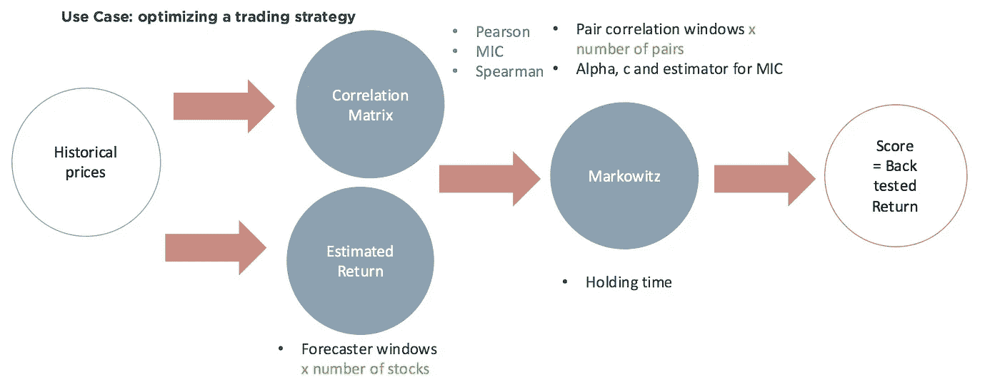
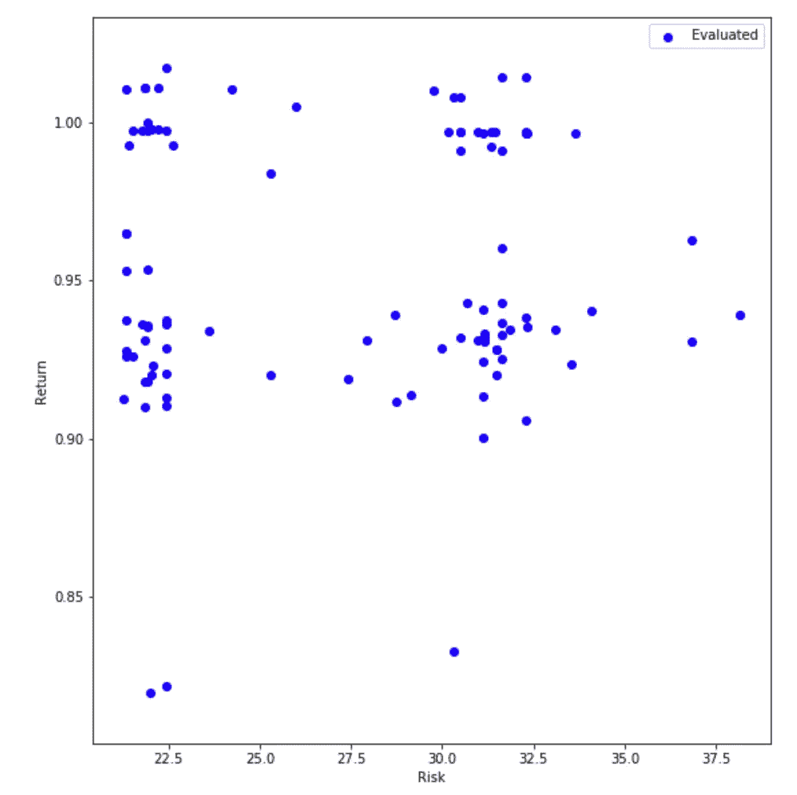

# 定量交易的贝叶斯优化

> 原文：<https://towardsdatascience.com/bayesian-optimization-for-quantitative-trading-20b257497a8?source=collection_archive---------13----------------------->

在本教程中，我们将了解贝叶斯优化如何减少训练稳健的系统交易策略所需的回溯测试总数，该策略包括在一袋股票中分配资本，以最小化给定预期回报的估计风险。

【**更新**:我开了一家法律科技[公司](http://www.legislate.tech)。你可以在这里找到更多

# 交易策略

我们将实施一个标准的 [Markowitz](https://en.wikipedia.org/wiki/Modern_portfolio_theory) 投资组合优化策略(MPT ),它将有许多可调参数。MPT 用两个量进行预测:风险和预期收益。我们以下列方式对一组证券中的每一个估计这两个数量:

***波动率*** 在现代金融中经常被用作风险的代理(想想比特币；高波动性意味着高风险)，这在数学上可以表示为方差。通过在可优化的时间长度(窗口)内对股票进行两两相关，我们可以生成一个协方差矩阵，然后在 Markowitz 算法中用于投资组合分配。

为了估算 ***预期收益*** ，为了透明起见，我们简单地使用一个线性回归器，并假设一只股票在我们持有它的持续时间内将继续向同一个方向移动。

使用我们的协方差矩阵和预期回报向量，我们现在可以使用 MPT 在选择股票时分配我们的资本，同时最小化风险，但保持所需的预期回报。

在这个方法中，有许多可优化的参数。具体来说，我们将优化以下内容:

*   计算协方差矩阵的方法([皮尔逊](https://en.wikipedia.org/wiki/Pearson_correlation_coefficient)、[最大信息量 C](https://en.wikipedia.org/wiki/Maximal_information_coefficient) 系数或[斯皮尔曼](https://en.wikipedia.org/wiki/Spearman%27s_rank_correlation_coefficient)
*   每对股票的成对相关窗口长度
*   MIC 的α、c 和估计参数
*   用于估计每只股票回报的线性回归预测窗口长度
*   卖出前投资组合策略的持有时间

总体策略如下图所示:



我们希望为我们的策略确定最佳的参数配置，使我们在回溯测试中的回报最大化。

我们已经用 Python 编写了策略代码，并将使用 [OPTaaS](http://mindfoundry.ai/optaas) 来执行贝叶斯优化。

**计分功能**

```
**def scoring_function(holding_time, correlater, forecaster_windows):**
    forecaster = LinearForecaster(forecaster_windows, tickers)
    simulator = SingleObjectiveSimulator(correlation_method=make_correlater(correlater, tickers), forecast_method=forecaster, 
                                         holding_time=holding_time, capital=10000)
    simulator.trade(data = prices.iloc[:-50])
    score = simulator.evaluate(prices)
    demo.display_values(locals(), score)
    return score
```

**连接 OPTaaS**

每个用户都有自己的基本 URL 和 API 键来连接 OPTaaS。连接只需要 1 行代码！

```
client = OPTaaSClient(OPTaaS_URL, OPTaaS_API_key)
```

**创建一个 OPTaaS 任务**

然后，您需要定义参数空间(类型、界限、分布)。标签可以匿名，但出于演示的目的，我们保留了它们。然后，我们需要为 OPTaaS 创建一个任务:

```
correlation_windows = GroupParameter("correlation_windows", items=[
    IntParameter(pair_name, minimum=2, maximum=5) for pair_name in ticker_pairs
])parameters = [
    IntParameter('holding_time', minimum=0, maximum=50),
    ChoiceParameter('correlater', choices=[
        GroupParameter('Pearson', items=[correlation_windows]),
        GroupParameter('Spearman', items=[correlation_windows]),
        GroupParameter('MIC', items=[
            correlation_windows,
            FloatParameter('alpha', minimum=SMALLEST_NUMBER_ABOVE_ZERO, maximum=1),
            FloatParameter('c', minimum=SMALLEST_NUMBER_ABOVE_ZERO, maximum=30),
            CategoricalParameter('est', values=["mic_approx", "mic_e"])
        ]),
    ]),
    GroupParameter("forecaster_windows", items=[
        IntParameter(ticker, minimum=2, maximum=5) for ticker in tickers
    ])
]task = client.create_task(
    title='Trading Demo v2',
    parameters=parameters,
    initial_configurations=initial_configurations

)
```

**运行任务**

我们需要做的就是按照用户指定的迭代次数(在本例中为 10 次)运行任务，输出将在下面的视频中捕获。

```
task.run(scoring_function, 10)
```

**结果:**

正如我们所看到的，不到 10 次迭代，OPTaaS 就能够确定一个有利可图的战略。此外，OPTaaS 能够在每次迭代后提高对策略搜索空间的理解，并能够快速了解哪些配置效果最好。

# 将贝叶斯优化应用于定量交易的好处

贝叶斯优化允许您减少为您的策略确定最佳配置所需的回溯测试次数，这允许您通过考虑更大的参数搜索空间，在策略构建过程中更加积极主动。

贝叶斯优化也可用于识别对输入扰动稳定的 ***【鲁棒】*** 配置。这可以在多目标设置中实现，目标是逼近多目标函数的 [Pareto](https://en.wikipedia.org/wiki/Pareto_efficiency) 集合(最大夏普、最小压降、最小周转等)。下图提供了一个示例:



Return vs Risk for various trading strategy parameter configurations

然后，您可以从满足您的风险/回报标准的“稳定”集群中抽取配置样本，构建您的“稳健”策略。

感谢 [Alistair](https://medium.com/u/470d8008e3f7?source=post_page-----20b257497a8--------------------------------) 和 [Constantinos](https://medium.com/u/23538872d43d?source=post_page-----20b257497a8--------------------------------) 在 OPTaaS 内部开发和实施 MPT 战略。

如果你想在自己的算法交易策略上测试 OPTaaS，请不要犹豫[向](http://Charles.brecque@mindfoundry.ai)要一个 API 密匙！

***注来自《走向数据科学》的编辑:*** *虽然我们允许独立作者根据我们的* [*规则和指导方针*](/questions-96667b06af5) *发表文章，但我们不认可每个作者的贡献。你不应该在没有寻求专业建议的情况下依赖一个作者的作品。详见我们的* [*读者术语*](/readers-terms-b5d780a700a4) *。*

**其他资源:**

教程:[https://tutorial . opta as . mind foundry . ai](https://tutorial.optaas.mindfoundry.ai)

API 文档:[https://opta as . mind foundry . ai](https://optaas.mindfoundry.ai)

**研究**[http://www . robots . ox . AC . uk/~ mosb/projects/project/2009/01/01/bayesopt](http://www.robots.ox.ac.uk/~mosb/projects/project/2009/01/01/bayesopt/)