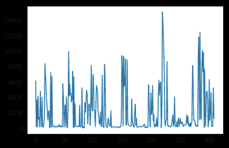
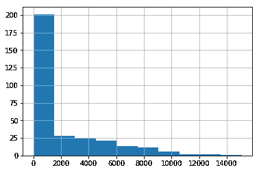
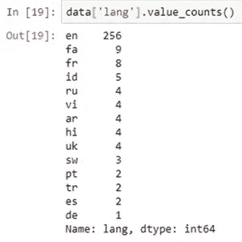
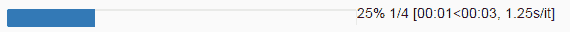
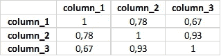
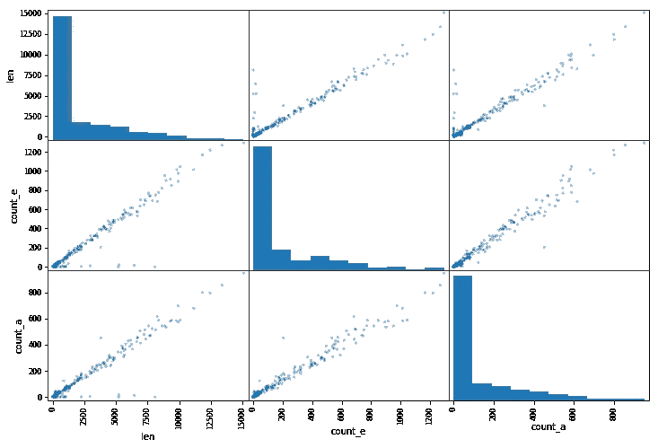

# 做一个更高效的数据科学家，用这个指南掌握熊猫

> 原文：<https://towardsdatascience.com/be-a-more-efficient-data-scientist-today-master-pandas-with-this-guide-ea362d27386?source=collection_archive---------2----------------------->

Python 是开源的。这很棒，但是有开源固有的问题:许多包做(或试图做)同样的事情。如果您是 Python 的新手，很难知道特定任务的最佳包。你需要有经验的人来告诉你。我今天告诉你:有一个包你绝对需要学习数据科学，它叫做**熊猫**。

而熊猫真正有意思的是，里面还藏着很多其他的包裹。Pandas 是一个核心包，具有各种其他包的附加功能。这很好，因为你可以只用熊猫来工作。

pandas 就像 Python 中的 Excel:它使用表格(即**数据帧**)并对数据进行转换。但是它可以做得更多。

*如果你已经熟悉 Python，你可以直接跳到第三段*

让我们开始:

Don’t ask me why “pd” and not “p” or any other, it’s just like that. Deal with it :)

# 熊猫最基本的功能

## 读取数据

sep means separator. If you’re working with French data, csv separator in Excel is “;” so you need to explicit it. Encoding is set to “latin-1” to read French characters. nrows=1000 means reading the first 1000 rows. skiprows=[2,5] means you will remove the 2nd and 5th row when reading the file

最常用的函数:read_csv、read_excel
其他一些很棒的函数:read_clipboard(我经常使用它，从 excel 或 web 上复制数据)、read_sql

## 写入数据

index=None will simply write the data as it is. If you don’t write index=None, you’ll get an additional first column of 1,2,3, … until the last row.

我通常不喜欢其他功能，比如。to_excel，。to_json，。从那以后。to_csv 很好地完成了这项工作。因为 csv 是保存表格最常用的方式。还有。to_clipboard 如果你像我一样是个 Excel 狂热者，想把你的结果从 Python 粘贴到 Excel。

## 检查数据

Gives (#rows, #columns)

Computes basic statistics

## 看到数据

Print the first 3 rows of the data. Similarly to .head(), .tail() will look at the last rows of the data.

Print the 8th row

Print the value of the 8th row on “column_1”

Subset from row 4 to 6 (excluded)

# 熊猫的基本功能

## 逻辑运算

Subset the data thanks to logical operations. To use & (AND), ~ (NOT) and | (OR), you have to add “(“ and “)” before and after the logical operation.

Instead of writing multiple ORs for the same column, use the .isin() function

## 基本绘图

matplotlib 包使这一特性成为可能。正如我们在介绍中所说，它可以直接用于熊猫。

Example of .plot() output

Plots the distribution (histogram)

Example of .hist() output

If you’re working with Jupyter, don’t forget to write this line (only once in the notebook), before plotting

## 更新数据

Replace the value in the 8th row at the ‘column_1’ by ‘english’

Change values of multiple rows in one line

好了，现在你可以做一些在 Excel 中很容易做到的事情了。让我们挖掘一些在 Excel 中做不到的惊人的事情。

# 中级功能

## 计数出现次数

Example of .value_counts() output

## 对整行、整列或所有数据的操作

The len() function is applied to each element of the ‘column_1’

的。map()操作将函数应用于列的每个元素。

A great pandas feature is the [chaining method](https://tomaugspurger.github.io/method-chaining). It helps you do multiple operations (.map() and .plot() here) in one line, for more simplicity and efficiency

。apply()将函数应用于列。使用。应用(，axis=1)在行上执行此操作。

。applymap()将函数应用于表格(DataFrame)中的所有单元格。

## 独一无二的 tqdm

当处理大型数据集时，熊猫可能需要一些时间来运行。map()，。apply()，。applymap()操作。tqdm 是一个非常有用的包，有助于预测这些操作何时完成执行(是的，我撒谎了，我说过我们将只使用 pandas)。

setup of tqdm with pandas

Replace .map() by .progress_map(), same for .apply() and .applymap()

This is the progress bar you get in Jupyter with tqdm and pandas

## 相关矩阵和散布矩阵

.corr() will give you the correlation matrix

Example of scatter matrix. It plots all combinations of two columns in the same chart.

## 处理缺失值

The inplace=True will fill the missing values directly in your dataset. If you don’t write inplace=True, it will temporarily fill the missing values, not permanently.

# 熊猫的高级操作

## SQL 连接

加入熊猫太简单了。

Joining on 3 columns takes just one line

## 分组

一开始并不简单，你需要先掌握语法，你会发现自己一直在使用这个特性。

Group by a column, the select another column on which to operate a function. The .reset_index() reshapes your data as a DataFrame (table)

As explained previously, chain your functions in one line for optimal code

## 遍历行

的。iterrows()一起遍历两个变量:行的索引和行(上面代码中的 **i** 和 **row** )。

# 总的来说，熊猫是 Python 如此伟大的语言的原因之一

我本可以展示许多其他有趣的熊猫特征，但这已经足以理解为什么数据科学家离不开熊猫。

总而言之，熊猫是

*   简单易用，隐藏了所有复杂和抽象的计算
*   (通常)直觉
*   快速，如果不是最快的数据分析包(它在 C 语言中高度优化)

它是帮助数据科学家快速阅读和理解数据并提高工作效率的工具。

我希望这篇文章对你有用，如果有用，考虑至少给 50 次掌声:)