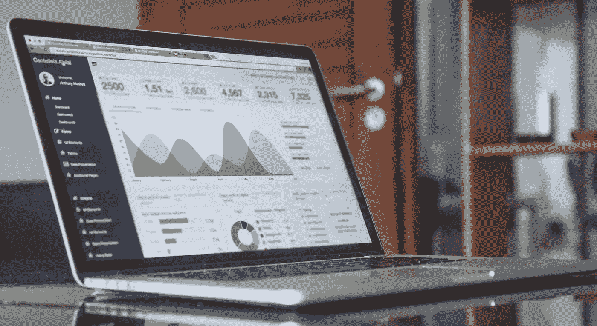
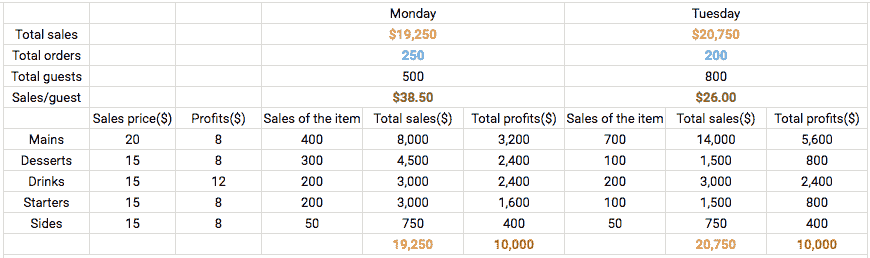
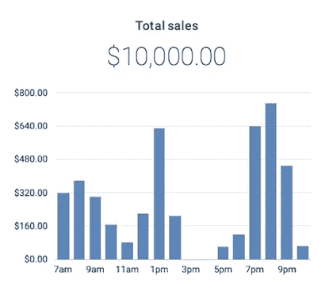
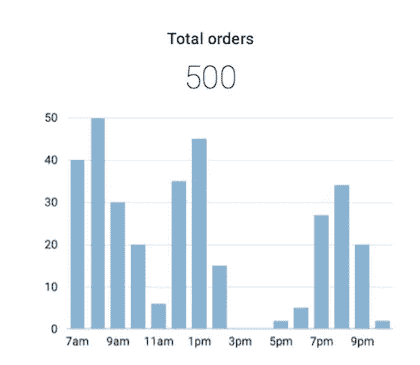
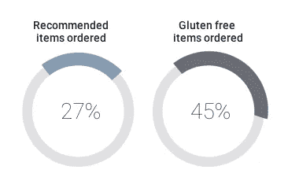
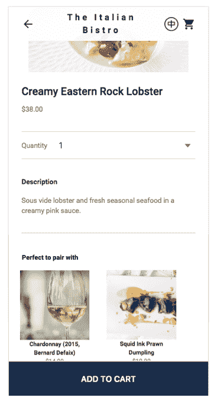
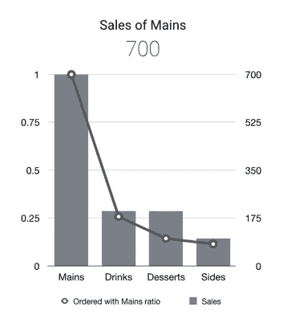
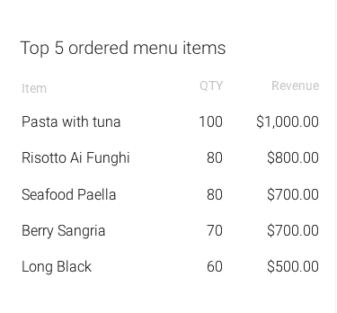

# 通过更智能的销售报告提高利润

> 原文：<https://towardsdatascience.com/be-more-profitable-with-a-smarter-sales-report-7a9c0202e0e6?source=collection_archive---------12----------------------->

现在是星期四晚上 10 点。在餐馆工作了 12 个小时，送走了最后一批顾客后，我，老板，终于有机会坐下来检查每天的销售报告。但是我只有几分钟的时间，因为我有一张明天之前要做的其他事情的清单。

我们很好奇，想知道为什么我们采访的餐馆似乎很少关注每日销售报告。决定一家餐馆是否经营良好的重要成功标准是什么？是否有每周或每月检查一次的更复杂的报告？

# 当今餐馆如何使用销售报告

不同的餐厅从不同的 POS 系统得到不同的销售报告。通过与 50 多名餐馆老板交谈，他们中的大多数人都回顾了当天的总销售额、付款方式和封面数量。总销售额让所有者清楚地了解他们的业务表现如何，他们是否赚了足够的钱来支付成本，如果是，赚了多少。审查这只需要几秒钟，似乎是“足够”的大多数业主。

我们经常被告知，他们“非常了解业务”,花“大约 10 到 50 分钟”检查不同卡系统的[卡支付](https://medium.com/@atumio/are-you-ready-to-be-a-cashless-restaurant-645aaf84762e),包括每天清点钱柜中的现金，会有明显的好处。

> “如果有时间，我还会查看客人的数量。系统里有，但是我没有打印出来。把这个数字和主菜的销售额对比一下，我就知道有多少人来这里吃一顿饭或者喝下午茶。”—玛丽，一个临时餐馆老板。

# 在真实世界中观察 POS 和报告

餐饮企业确实关心有关他们业务的数据和见解，但他们不会去检查。从我们的采访来看，目前的报道似乎需要太长时间来“消化”。许多 POS 系统打印出大量数据，但仍然需要时间来理解。这些数据没有立即反映出明确的行动。我们被告知，从 POS 系统“很容易获得”报告。然而，报告的价值似乎没有超过导出它们的努力。如前所述，经理们似乎每天只对少数几个关键数字感兴趣。

我们看到的每个 POS 系统都有某种版本的销售报告。从接受订单到支付账单，这些系统似乎收集了大量数据。餐馆老板可以选择他们想看的数据。但是，过多的选择和灵活性会不会成为一种负担，而不是一件富有成效的事情。

以下是我们的一些其他重要观察结果:

*   餐馆老板每天只花时间检查直接影响他们日常业务表现的数据。
*   目前还不清楚什么是对餐馆老板最有用的数据
*   获得关于业务的有用见解需要太多时间。他们有生意要做。

# 如何从销售报告中获得更多

> 73%的餐馆经营者同意投资餐馆技术使他们的经营更有利可图。(1)

技术的作用应该是以“正确的方式”帮助一个企业。我们认为“正确的方式”是当一个企业可以看到利益，而不妨碍他们想要如何经营他们的业务。利用餐馆的数据还可以做更多的事情。简单地列出一长串数据点是没有用的，而且需要时间来“消化”。在一天结束前被告知你可能无法完成今天的目标不是更有帮助吗？或许还有一些关于如何行动的建议？

许多餐馆和咖啡馆可以从一份更直接回答关键商业问题的报告中受益。通过将企业数据呈现为更有意义和更方便使用的内容，技术可以帮助所有者腾出更多时间来处理企业事务。

让我们看一个例子(见图 1 ),并从下面选择一些数据点(如总销售额、每位客人的销售额、不同菜肴的销售额等):

Diagram 1\. Example sales data from a POS system

乍一看，我们可以看到周二的总销售额(以橙色表示)比周一要好(分别为 20，750 美元和 19，250 美元)。周一有 250 个订单(蓝色)，周二少了 50 个订单。如果我们只看到总销售额和订单总数，结论可能是“在星期二，餐馆不太忙，但出售价格更高的商品”。但我们不能肯定地说。可能只是星期二的顾客吃了更贵的东西。

那么，如果我们还获得了客人总数，并显示了每位客人每天的销售额(绿色)。在上面的例子中，周一的客人多花了 12.50 美元。

你想知道你的客人周一买了什么，以便你能监控如何影响周二的销售吗？一份更好的销售报告可以告诉你这一点，甚至更多。

现在，让我们看看总利润(红色)，我们会发现餐馆在星期一和星期二都有 10，000 美元的利润。虽然周二实际上更忙，但周一销售了更多有利可图的项目(如甜点、开胃菜)。烹饪主菜比开胃菜和甜点需要更多的时间。因此，总销售额和总订单数并不总是能显示这些有用的信息。

那么，更好的报告能减少思考时间，让所有者更好地控制如何获得更多利润吗？

# 掌握有用的见解

一份“有用”的销售报告应该有助于所有者更好地监控他们的业务，而无需过多的思考。它需要快速和简单，因为所有者和管理者没有时间考虑如何使他们的数据更有用。可视化正确的数据有助于这一点。

1.  不同时间的总销售额和总订单数有助于店主制作花名册，从而降低劳动力成本。如果从中午 12 点到下午 2 点有更多的订单，只在午餐时间雇用一名兼职人员。

Diagram 2\. Total sales and total orders

**2。订购的特殊项目的比率给了企业如何调整菜单上的项目的想法。**

Diagram 3\. Ratio of “Recommended” and “Gluten free” items ordered

突出重点菜式可以[帮助你更好地了解顾客](https://medium.com/@atumio/know-your-customers-and-stay-ahead-of-the-competition-badaf6bec4c4)和他们喜欢什么，例如，推荐的饮料或符合特殊饮食要求的主菜。

3.**点的饮料、甜点、配菜和主菜的比例和组合给出了如何** [**促销其菜单产品的商业思路**](https://medium.com/@atumio/unlock-5-new-opportunities-with-a-digital-menu-b4f246adab4f) 。如果一家餐馆为一种饮料提供特价，能让 10%的顾客点它，餐馆能获得更多利润吗？

Diagram 4\. Ratio of drinks, desserts and sides to mains

在图表 4 中，周一和周二的饮料销售是相同的，但是周一的销售比例(50%)远远多于周二(28.6%)。和饮料类似，周一的甜点、头盘、配菜的比例(75%、50%、12.5%)都比周二(14.2%、14.2%、7%)好。如果餐馆在星期二提供半价饮料(8 美元)，并且 10%的顾客(例如 80 人)点了它，它将带来 640 美元的额外销售额。因此，利润将增加 400 美元。

**4。最上面的有序菜单项帮助厨房决定哪些项目保留在菜单上，哪些项目改变。**

Diagram 5\. The top 5 menu items ordered

# 通过更智能的报告让您的业务数据变得有用

在上面的例子中，通过更快地理解星期二发生的事情，很快就找到了增加利润的方法。想象一下，无论是在会议间隙还是在休息时，您都可以通过手机或平板电脑[随时随地安全地访问这些内容。有了更多有用的数据，企业所有者和管理者可以腾出一些时间来经营企业的其他部分，或者利用这些时间来改善企业。](https://medium.com/@atumio/smartphones-are-changing-restaurants-aac96d48c20d)

如果你能结合从多年经验中获得的知识和业务数据来实现更多的目标，会怎么样？敬请期待:)

> 数据和图表均来自 [Atumio](http://www.atumio.com) 。您想了解其他有用的报告吗？有什么想法可以分享吗？请随时联系 hello@atumio.com。在 [Instagram](https://www.instagram.com/_atumio/) 和[脸书](https://www.facebook.com/atumio/)上有很多有趣的发现。
> 
> [餐厅技术:明天成功的关键](http://www.restaurant.org/Downloads/PDFs/NetworkingGroups/RIS-Restaurant-Technology-Presentation-by-Hudson-R.pdf)
> 
> [Atumio——通过漂亮的社交菜单拉近人们的距离](http://www.atumio.com)