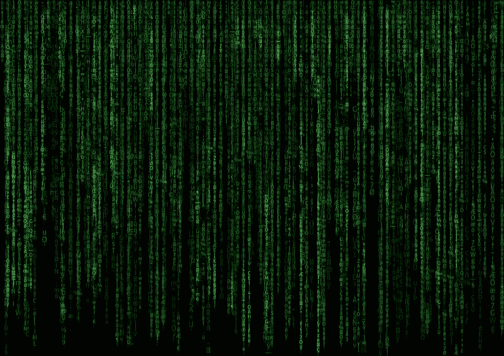
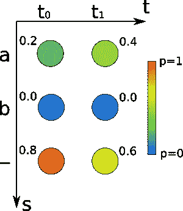
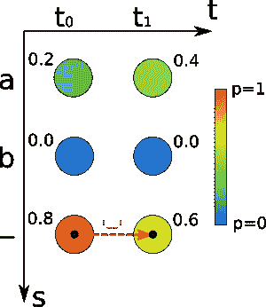
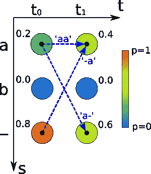
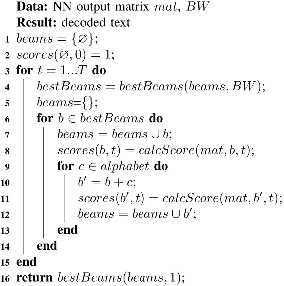
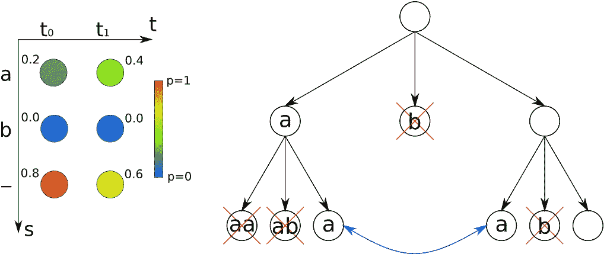
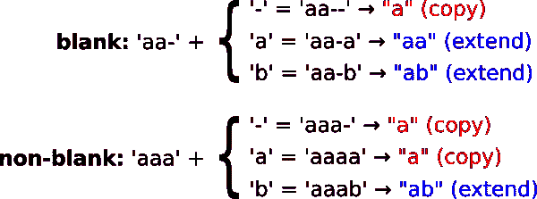
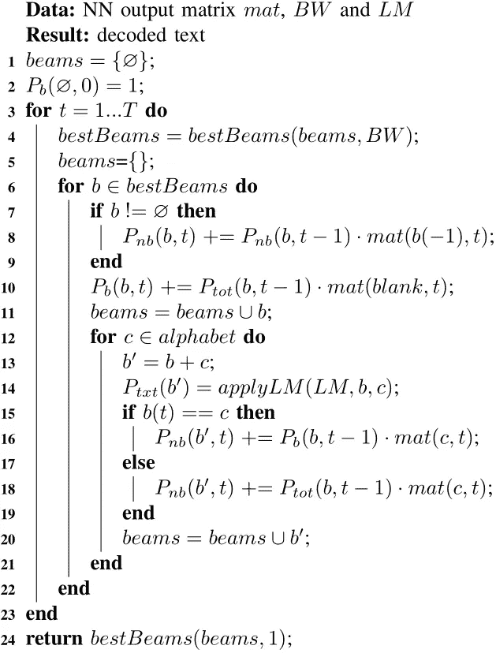

# CTC 训练神经网络中的波束搜索解码

> 原文：<https://towardsdatascience.com/beam-search-decoding-in-ctc-trained-neural-networks-5a889a3d85a7?source=collection_archive---------0----------------------->

## **一种具有集成语言模型的快速且性能良好的算法，用于在文本识别背景下解码神经网络输出**



由卷积神经网络层和递归神经网络层以及最终的连接主义时间分类(CTC)层组成的神经网络(NN)是(手写)文本识别的良好选择。

神经网络的输出是一个矩阵，包含每个时间步长(水平位置)的字符概率，图 1 中显示了一个例子。这个矩阵必须被解码以得到最终的文本。实现这一点的一种算法是波束搜索解码，它可以很容易地集成字符级语言模型。



Fig. 1: Output matrix of NN consisting of two time-steps (t0, t1) and two characters (“a”, “b”) plus the CTC blank (“-”). The numbers indicate the probability of seeing the character at the given time-step.

我们将从回顾 CTC 和最佳路径解码开始我们的讨论。然后我们将讨论 CTC 波束搜索解码算法的构建模块(基本算法、CTC 评分、语言模型)。最后，我将向您介绍一个 Python 实现，您可以使用它来进行自己的测试和实验。

# 简短提醒反恐委员会如何工作

阅读文章[“联结主义时态分类的直观解释”](/3797e43a86c)有助于你理解下面的讨论。在这里，我将给出一个简短的回顾。

CTC 允许用成对的图像和真实文本来训练文本识别系统。文本通过路径在 NN 输出矩阵中编码，每个时间步包含一个字符，例如“ab”或“aa”是图 1 中可能的路径。我将用双引号“文本”显示文本，用单引号“路径”显示路径。

路径以下列方式对文本进行编码:文本中的每个字符都可以重复任意多次。此外，可以在字符之间插入任意数量的 CTC 空格(非字符，不要与空白字符混淆，在本文中用“-”表示)。如果出现重复字符(如“pizza”)，则路径中这些重复字符之间必须至少有一个空格(如“piz-za”)。

以下是带有相应路径的文本示例:

*   "到"→ '-t-o -'，' tttttttt-ooo-'，'到'，…
*   “你好”→‘h-ellll-ll-ooo’，‘hel-lo’，…
*   " a" → 'aa '，' a-'，'-a '，…

如您所见，一个文本对应的路径可能不止一个。当我们对文本的概率感兴趣时，我们必须对所有相应路径的概率求和。单个路径的概率是该路径上的字符概率的乘积，例如，对于图 1 中的路径‘aa ’,它是 0.2±0.4 = 0.08。

# 最佳路径解码

最佳路径解码是解码输出矩阵的最简单方法:

*   每个时间步连接最可能的字符，产生最佳路径。
*   然后，通过首先删除重复字符，然后删除所有空格来撤消编码。这给了我们可识别的文本。

让我们看一个例子:矩阵如图 2 所示。对于时间步长 t0 和 t1，得分最高的字符为空。所以，最佳路径是'-'。然后我们撤销编码，得到文本" "。此外，我们可以通过乘以字符概率来计算路径的概率，在本例中是 0.8±0.6 = 0.48。



Fig. 2: Concatenate most probable characters per time-step to get best path.

最佳路径解码速度很快，我们只需为每个时间步找到分数最高的字符。如果我们有 C 个字符和 T 个时间步，算法的运行时间为 O(T ^ C)。

# 为什么最佳路径解码会失败

最佳路径解码既快速又简单，这当然是很好的特性。但是在某些情况下可能会失败，如图 2 所示。在图 3 中，对应于文本“a”的所有路径被示出:“aa”、“a-”和“-a”。文本“a”的概率是这些提到的路径的所有概率的总和:0.2 0.4+0.2 0.6+0.8 0.4=0.52。所以，“a”比“”的概率更大(0.52>0.48)。我们需要一种比最佳路径解码更好的算法来处理这种情况。



Fig. 3: All paths corresponding to text “a”.

# 波束搜索解码的基本版本

波束搜索解码迭代地创建文本候选(波束)并对它们评分。基本版本的伪代码如图 4 所示。:用空射束(第 1 行)和相应的分数(2)初始化射束列表。然后，该算法在神经网络输出矩阵(3–15)的所有时间步长上迭代。在每个时间步长，仅保留来自前一时间步长的最佳刻划射束(4)。波束宽度(BW)指定要保留的波束数量。对于这些波束中的每一个，计算当前时间步长的分数(8)。此外，每个光束被扩展字母表中所有可能的字符(10)，并且再次计算分数(11)。在最后一个时间步之后，返回最佳波束作为结果(16)。



Fig 4: Basic version of beam search.

让我们用 BW 2 和 alphabet {"a "，" b"}来形象化算法如何解码我们的示例 NN 输出。图 5 示出了待解码的 NN 输出和波束树。该算法从一个空射束“”开始，它对应于树的根节点。然后，光束被复制并被字母表中所有可能的字符扩展。这给了我们光束“a”，“b”和“”。稍后，我们将进一步了解如何计算射束分数。现在，我们使用我们的直觉，看到只有一条路径对应于每个波束:“a”的概率为 0.2，“b”的概率为 0，“a”的概率为 0.8。

在下一次迭代中，我们只保留来自前一时间步的 2 个最佳波束(根据 BW ),即我们丢弃波束“b”。然后，我们再次复制并扩展幸存的梁，得到" aa "，" ab "，" a "，" a "，" b "，" "。如果两个光束相等，如“a”的情况，我们简单地将它们合并:我们将分数相加，只保留其中一个光束。我们再次用我们的直觉来计算分数。每个包含“b”的波束的概率为 0。“aa”的概率也是 0，因为要对具有重复字符的文本进行编码，我们必须在字符之间插入空格(例如“a-a”)，这对于长度为 2 的路径是不可能的。最后剩下的就是光束“a”和“”。我们已经计算了它们的概率:0.52 和 0.48。

我们完成了最后一次迭代，算法的最后一步是返回得分最高的射束，在本例中是“a”。



Fig. 5: NN output and tree of beams with alphabet = {“a”, “b”} and BW = 2.

# 在横梁上划线

我们还没有讨论如何在平衡木上得分。我们将波束得分分成以空白结尾的路径得分(例如“aa-”)和以非空白结尾的路径得分(例如“aaa”)。对于非空白情况，我们用 Pb(b，t)和 Pnb(b，t)表示所有路径以空白结束并对应于时间步长 t 处的波束 b 的概率。波束 b 在时间步长 t 处的概率 Ptot(b，t)就是 Pb 和 Pnb 之和，即 Ptot(b，t)=Pb(b，t)+Pnb(b，t)。

图 6 显示了当我们扩展一个路径时会发生什么。主要有三种情况:通过空格扩展、通过重复最后一个字符扩展和通过其他字符扩展。当我们折叠延伸的路径时，我们要么得到未改变的(复制的)光束(“a”→“a”)，要么得到延伸的光束(“a”→“aa”或“ab”)。我们也可以反过来使用这些信息:如果我们延伸一个光束，我们就知道我们必须考虑哪些路径来计算分数。



Fig. 6: The effect of appending a character to paths ending with blank and non-blank.

让我们看看如何迭代计算 Pb 和 Pnb。请注意，我们总是添加而不是分配计算值(+=而不是=)，这隐式地实现了前面讨论的光束合并。所有 Pb 和 Pnb 值最初设置为 0。

## 复制光束

要复制一个光束，我们可以用一个空格扩展相应的路径，得到以空格结尾的路径:Pb(b，t)+=Ptot(b，t-1) mat(blank，t)。

此外，我们可以通过最后一个字符来扩展以非空白结尾的路径(如果光束非空):Pnb(b，t)+=Pnb(b，t-1) mat(b[-1]，t)，其中-1 表示光束中的最后一个字符。

## 延伸光束

有两种情况。要么我们将光束扩展一个不同于最后一个字符的字符 c，那么就不需要在路径中分隔空格:Pnb(b+c，t)+=Ptot(b，t-1) mat(c，t)。

或者最后一个字符 b[-1]被重复，那么我们必须确保路径以空格结束:Pnb(b+c，t)+=Pb(b，t-1) mat(c，t)。

我们不用关心 Pb(b+c，t)，因为我们增加了一个非空白字符。

# 字符级语言模型

字符级语言模型(LM)对一系列字符进行评分。我们将 LM 限制为对单个字符(unigram LM)和成对字符(bigram LM)进行评分。我们将字符 c 的一元概率表示为 P(c ),将字符 c1，c2 的二元概率表示为 P(c2|c1)。一条短信“hello”的得分是看到单个“h”的概率，看到一对“h”和“e”挨着的概率，以及一对“e”和“l”挨着的概率，…

一个字符序列 c1，c2，c3，…的概率为:P(c1，c2，c3，…)=P(c1) P(c2|c1) P(c3|c2) …

从大量文本中训练这样一个 LM 很容易:我们只需计算一个字符出现的频率，然后除以字符总数，就可以得到单字概率。我们计算一对字符出现的频率，并对其进行归一化，以获得二元模型概率。

# 把所有的放在一起

CTC 波束搜索算法如图 7 所示。它类似于已经展示过的基本版本，但是包含了对梁进行评分的代码:复制的梁(第 7-10 行)和延伸的梁被评分(第 15-19 行)。此外，当将光束 b 延伸字符 c 时，应用 LM(第 14 行)。在单字符梁的情况下，我们应用一元得分 P(c)，而对于更长的梁，我们应用二元得分 P(b[-1]，c)。波束 b 的 LM 分数被放入变量 Ptxt(b)中。当算法寻找最佳得分波束时，它根据 Ptot Ptxt(第 4 行)对它们进行分类，然后取 BW 最佳波束。



Fig. 7: CTC beam search with character-level LM.

运行时间可以从伪代码中推导出来:最外面的循环有 T 次迭代。在每次迭代中，N 个波束被排序，这占 N log(N)。BW 最佳波束被选择，并且它们中的每一个被扩展 C 个字符。因此，我们有 N=BW C 个波束，总运行时间为 O(T BW C log(BW C))。

# 履行

波束搜索解码(以及其他解码算法)的 Python 实现可以在 [CTCDecoder](https://github.com/githubharald/CTCDecoder) 资源库中找到:相关代码位于 src/BeamSearch.py 和 src/LanguageModel.py 中，TensorFlow 提供了 ctc_beam_search_decoder 操作，但是，它不包括 LM。

# 估价

在 IAM 数据集上对 NN 进行解码给出了最佳路径解码的 5.60%的字符错误率，以及波束搜索解码的 5.35%的字符错误率。每个样本的运行时间从 12 毫秒增加到 56 毫秒。

下面是 IAM 数据集的一个示例(见图 8 ),可以更好地了解波束搜索如何改善结果。使用和不使用 LM 的最佳路径解码和波束搜索来完成解码。

```
Ground truth:        "the fake friend of the family, like the"
Best path decoding:  "the fak friend of the fomly hae tC"
Beam search:         "the fak friend of the fomcly hae tC"
Beam search with LM: "the fake friend of the family, lie th"
```


Fig. 8: Sample from IAM dataset.

# 结论

CTC 波束搜索解码是一种简单快速的算法，性能优于最佳路径解码。角色级别的 LM 很容易集成。

# 参考

*   [解码器的 Python 实现(最佳路径、波束搜索……)](https://github.com/githubharald/CTCDecoder)
*   [解码器比较](https://github.com/githubharald/CTCDecoder/blob/master/doc/comparison.pdf)
*   [字束搜索解码](/b051d28f3d2e)
*   [CTC 简介](/3797e43a86c)
*   [Hwang 和 Sung——使用递归神经网络的字符级增量语音识别](https://arxiv.org/abs/1601.06581)
*   [Graves 和 jait ly——利用递归神经网络实现端到端语音识别](http://proceedings.mlr.press/v32/graves14.pdf)