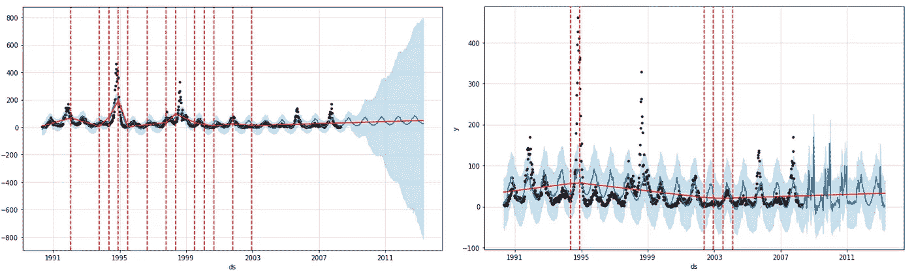
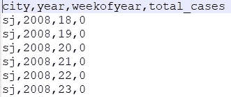
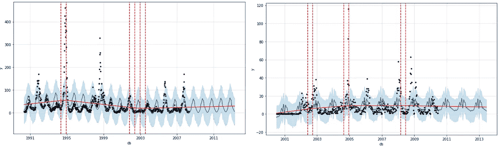
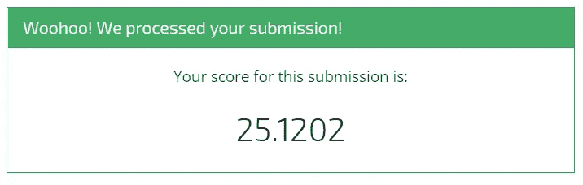

# 在 5 分钟内击败 Datadriven 的邓艾竞赛基准

> 原文：<https://towardsdatascience.com/beating-datadrivens-dengai-competition-benchmark-in-5-minutes-c12e86c4331c?source=collection_archive---------7----------------------->

持续时间最长、最有趣的数据科学和机器学习竞赛之一毫无疑问是邓艾竞赛。参赛者被要求根据环境信息预测两个南美城市的登革热病例数。

在本文中，我们试图通过仅使用**一个特征**和**时间序列预测**来击败竞争对手的[基准分数](http://drivendata.co/blog/dengue-benchmark/)。在**脸书的先知库**，一个 Jupyter 笔记本和总共**二十行代码**的帮助下，我们学会了如何在几分钟内打破基准分数。


# 邓加伊

比赛要求你**利用美国联邦政府各机构收集的环境数据，预测圣胡安(波多黎各)和伊基托斯(秘鲁)每周报告的登革热病例数**。所提供的数据具有诸如每周最高温度、湿度和降雨量**的特征。**

**平均绝对误差** (MAE)用于评分。看看排行榜上的最高分，很明显挑战并不容易:最高分的人只有 13 分多一点，而排名在第 100 位左右的人只有 17 分。如果你知道在 Iquitos 提供的数据中，每周的平均病例数只有 8 例左右，这意味着即使是顶级模型也几乎没有预测能力。

然而，比赛组织者提供了一个基准分数，包括一个完整的笔记本来帮助你开始。在这个例子中，他们只使用了负二项式广义线性模型中的几个特征，结果得分为 25.81。这篇文章的目标是通过使用时间序列预测技术，尽可能快地打破这个记录**。为了帮助我们完成这项任务，我们将使用**脸书的 Python 先知库**。**

# 什么是脸书先知

2017 年初*脸书*开源 *Prophet* 、**Python 和 R. Prophet 中可用的预测工具**特别适合预测季节性强、历史趋势变化和遵循非线性增长曲线的趋势的时间序列。使用 Prophet 的其他好理由是[提供的优秀文档](https://facebook.github.io/prophet/docs/quick_start.html#python-api)和整体易用性。

Prophet for Python 可以像任何其他库一样使用，可以在命令行安装或更新。因为我使用 Python 的 *Anaconda* 发行版，所以我使用了一个简单的 *conda* 安装。

`conda install -c conda-forge fbprophet`

如果你在安装 Prophet 时遇到任何麻烦或错误，看看 Github 的[*问题*](https://github.com/facebook/prophet/issues)*或者在谷歌搜索中抛出你的错误。*

# *准备数据*

*在开始预测之前，我们需要掌握数据。进入[邓艾竞赛页面](https://www.drivendata.org/competitions/44/dengai-predicting-disease-spread/data/)下载列车功能、列车标签和测试功能。然后打开一个 Jupyter 笔记本，导入*熊猫*、 *numpy* 、 *matplotlib* 和 *fbprophet* (全库或者只 *Prophet* 类)。*

```
*import numpy as np
import pandas as pd
import matplotlib.pyplot as plt
from fbprophet import Prophet*
```

*将数据载入你的笔记本。*

```
*train = pd.read_csv('dengue_features_train.csv')
test = pd.read_csv('dengue_features_test.csv')
labels = pd.read_csv('dengue_labels_train.csv')*
```

*由于我们将尝试纯粹基于时间数据进行预测，因此我们可以从数据框架中去掉*城市*、*周 _ 开始 _ 日期*和*总 _ 例数*。注意，我们选择 *week_start_date* 作为时间数据，因为这个特性已经被表示为一个*标准日期时间字符串*，并且不需要任何转换。*

```
*train['total_cases'] = labels['total_cases']prophet_data = train[['city', 'week_start_date', 'total_cases']]*
```

*接下来，拆分伊基托斯和圣胡安的数据，删除*城市*列，因为我们的预测不需要这个。*

```
*prophet_data_sj = prophet_data[prophet_data['city'] == 'sj']\
                .drop('city', axis=1)
prophet_data_iq = prophet_data[prophet_data['city'] == 'iq']\
                .drop('city', axis=1)*
```

*然后，对您的测试数据进行同样的操作，但是只保留 *week_start_date* 列。*

```
*test_sj = test[test['city'] == 'sj']['week_start_date']
test_iq = test[test['city'] == 'iq']['week_start_date']*
```

*为了使 Prophet 库正常运行，必须将时间特性命名为 *ds* 以及预测值为 *y* 。对两个数据帧都这样做。*

```
*prophet_data_sj.columns, prophet_data_iq.columns = 
                                           ['ds', 'y'], ['ds', 'y']*
```

*现在我们的数据已经准备好进行一些先知魔法了！*

# *先知魔法*

*我们可以开始使用 *fbprophet* 库来预测我们测试数据的值。为了方便起见，我们将创建一个函数，将训练数据、测试数据和两个预测参数作为输入。*

*建立先知预测的第一步是创建一个*先知*类的新实例。在初始化该类时，您可以设置一大堆参数(例如*周 _ 季节性*或*日 _ 季节性*)，但我们将只设置*变点 _ 先验 _ 标度(默认为 0.05)* 和*年 _ 季节性(默认为 10)* 。*

*为了理解第一个参数的含义，你需要知道时间序列的趋势经常发生突变。这些变化被称为**变点。** Prophet 将自动检测这些变化点，并允许趋势适当调整。*

*Prophet 通过首先指定大量潜在的变点来检测变点，然后对速率变化的幅度进行稀疏先验。这实质上意味着，Prophet 有大量可能改变速率的地方，但将尽可能少地使用它们。*

*调整稀疏先验的强度将改变模型的灵活性，并且可以使用 *changepoint_prior_scale* 参数进行调整。通过向上调整该参数，将使用更多的变点，因此模型将更好地拟合训练数据。*

*因为这个参数被用来改变模型的灵活性，并对抗过拟合或欠拟合，我们在函数中称这个参数为 *flex* 。*

*第二个参数*yearly _ 季节性*，是使用*部分傅立叶和*估算的。看看[这篇论文](https://peerj.com/preprints/3190/)了解更多关于部分傅里叶和与周期信号的信息。本质上，季节性论点决定了季节性变化的速度。*

*在我们的案例中，我们最有可能更好地应对较低的季节性，因为我们的数据与似乎不会改变的年度天气模式密切相关(看看气候训练和测试数据)。*

*我们函数的下一步是通过调用 *fit()* 函数使我们的训练数据符合我们的 *Prophet* 。然后，我们希望创建一个数据帧，表示我们希望预测的未来日期。这可以通过调用我们的 *Prophet* 上的*make _ future _ data frame()*函数来轻松完成。*

*该函数有两个参数:*周期*和*频率*。在我们的例子中，周期的数量应该正好是我们测试数据的长度，频率应该设置为每周一次(*‘W’*)，因为我们每周都有数据点。*

*然后，终于到了用预测值填充我们未来数据框架的时候了。我们通过调用 *Prophet* 上的 *predict()* 来实现这一点，并将未来数据帧作为输入。我们还在 *Prophet* 上运行 *plot()* 来获得我们预测的可视化。*

```
*def create_forecast(train_data, test_data, flex, seas):

    prophet = Prophet(changepoint_prior_scale=flex, 
                      yearly_seasonality=seas) 

    prophet.fit(train_data)

    future_frame = prophet.make_future_dataframe(
        periods=len(test_data), 
        freq='W')

    forecast = prophet.predict(future_frame)

    prophet.plot(forecast)

    forecast = forecast[['ds', 'yhat']].yhat\
        .apply(lambda x : int(x))return forecast[len(train_data):]*
```

*如果您看一下预测数据帧，您应该看到它有一大堆变量，包括时间戳( *ds* )和预测值( *yhat* )。切掉这两个值，并将预测转换为整数(竞赛只接受整数作为预测)。*

*数据帧还包括来自我们的训练和测试数据的所有数据。我们只需要对测试数据的预测。截取测试数据并返回这个数据帧作为我们函数的输出。现在，我们的功能已经完成，我们可以开始使用它来预测我们的登革热数据。*

*制作两个预测，一个针对伊基托斯，一个针对圣何塞，并将它们存储在一个变量中。这里，我们使用季节性(10)和灵活性(0.05)的默认值。*

```
*forecast_sj = create_forecast(prophet_data_sj, test_sj, 0.05, 10)
forecast_iq = create_forecast(prophet_data_iq, test_iq, 0.05, 10)*
```

*查看预测，我们可以看到我们确实创建了两个熊猫系列，并对我们的测试数据进行了预测。除了这个系列，还应该弹出一个图表，其中原始数据是分散的，预测是连续的线。摆弄一下季节性和灵活性参数，看看它们如何影响**预测**(蓝线)**信心**(浅蓝色)**趋势**(红线)和**转折点**(垂直红色虚线)。*

**

*Predictions for San Juan with respectively high flexibility and high seasonality*

# *提交结果*

*可以说是整个流程中最简单的一步，就是准备好提交的结果并上传到 *DrivenData* 上。要了解提交要求，看一下提交格式([在这里找到](https://www.drivendata.org/competitions/44/dengai-predicting-disease-spread/data/))。*

**

*DengAI submission format*

*总之，比赛需要一个*。csv* 文件，有四列，分别命名为*城市*、*年份*、*星期几*和*总 _ 例数*(我们的预测)。我们再次创建一个函数，将两个城市的预测和一个提交名称作为输入。*

*我们连接预测，将它们与索引列合并，给所有列指定所需的名称，并将结果数据帧保存为*。csv* 文件。确保为您的 csv 提供适当的名称，以便您记住用于预测的参数(例如 *prophetflex05seas10* )。*

```
*def create_submission(forecast_sj, forecast_iq, sub_name):

    test_index = test[['city', 'year', 'weekofyear']]

    output = pd.concat([forecast_sj, forecast_iq])\
        .reset_index().drop(['index'], axis=1)

    output.columns = ['total_cases']

    pd.concat([test_index, output], axis=1)\
        .set_index(['city']).to_csv(sub_name + '.csv')*
```

*现在，用默认的预测参数创建一个新的提交，并给它起一个合适的名字。*

```
*create_submission(forecast_sj, forecast_iq, 'prophetflex05seas10')*
```

*前往竞赛[提交页面](https://www.drivendata.org/competitions/44/dengai-predicting-disease-spread/submissions/)并上传您刚刚创建的 csv 文件以获得分数。您应该得到 26.76 的结果，这不是我们所希望的，比基准测试还要差。请记住，这个分数是我们测试数据集中每个预测日期的平均误差。*

*看看您的代码生成的图表，您会发现两种预测多一点灵活性可能不会有什么坏处(增加灵活性)。此外，伊基托斯的季节性非常多变，我们的预测会更好，季节性趋势会稍微平稳一些(减少季节性)。*

**

*Forecast for San Juan and Iquitos with default Prophet parameters*

*用这些新信息做一个新的预测。例如，将两个城市的弹性设置为 0.10，并将伊基托斯的季节性降低为 5。*

```
*forecast_sj = create_forecast(prophet_data_sj, test_sj, 0.1, 10)
forecast_iq = create_forecast(prophet_data_iq, test_iq, 0.1, 5)create_submission(forecast_sj, forecast_iq, 'prophsjf10s10iqf10s5')*
```

*再次提交结果，并得出结论，我们仅用几行代码和一个特性( *week_start_date* )就击败了竞争基准。请注意，没有使用机器学习来进行预测。*

**

# *下一步是什么？*

*   ***用剩下的数据！**利用环境数据根据天气特征进行预测。将这些结果与我们在这里建立的时间序列预测模型结合起来。*
*   ***调整参数**。尝试通过改变参数来提高模型的得分，不仅是这里讨论的参数，还有这里没有讨论的所有其他参数([参见文档](https://facebook.github.io/prophet/docs/quick_start.html#python-api))。*
*   ***寻找新的数据源**。看看你能否在新闻网站或博客上找到任何关于圣胡安和/或伊基托斯登革热疫情(或没有疫情)的信息。了解年度趋势会给你带来巨大的优势。*

*—请随时在评论中或私信中向我指出任何不一致或错误。—*