# 我们的人工智能如何使用数据科学在梦幻超级联赛中获得前 10 名

> 原文：<https://towardsdatascience.com/beating-the-fantasy-premier-league-game-with-python-and-data-science-cf62961281be?source=collection_archive---------1----------------------->

## (团队编号:2057677)

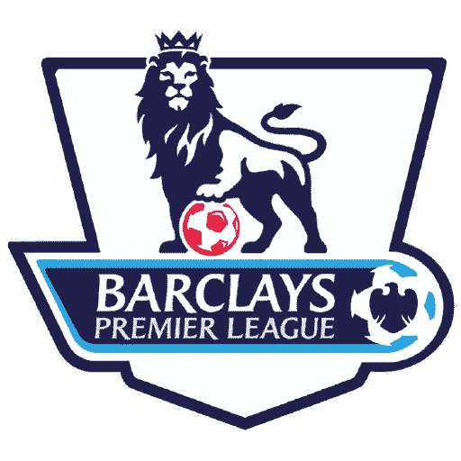

# 我们对 EPL 梦幻联盟的摇钱树方法

> 注意:我们开始了一个新的博客，我将在这里运行更新的算法，并更新我的团队在整个 19-20 赛季的表现:

[https://medium . com/@ pruchka/EPL-fantasy-is-one-week-away-and-our-algorithm-is-ready-to-play-78 afda 309 e 28](https://medium.com/@pruchka/epl-fantasy-is-one-week-away-and-our-algorithm-is-ready-to-play-78afda309e28)

我的朋友( [Andrew Sproul](https://medium.com/u/2700c43d12a7?source=post_page-----cf62961281be--------------------------------) )和我已经玩了很多年的官方梦幻英格兰超级联赛，尽管我们坚信我们了解英格兰足球的一切，但我们倾向于年复一年地“倒霉”，不知何故似乎从来没有选出获胜的球队。因此，我们最终决定将数据科学和“金钱球”方法应用于团队/球员分析，以确定我们是否真的在每个赛季选择了最佳的球员组合。我们的研究始于从梦幻游戏 API 中提取最新的玩家数据，并使用 Python 对所有 EPL 团队和所有个人玩家进行统计分析。我们项目的最终目标是编写一个 Python 算法，它使用来自我们分析的数据进行“智能”挑选，并在我们有限的 100 毫米预算下建立最佳的梦幻联盟阵容。

> **注意**:最理想的幻想小队将会根据每花费一美元的幻想点数返回的总点数=投资回报率来衡量。

## 我们的分析将以以下假设为指导，旨在回答以下关键问题:

1.  **要检验的主要假设:**

*   大多数娱乐性的 EPL 幻想玩家在为他们的幻想队挑选队员时会有个人偏见和偏爱。换句话说，人们通常会根据他们支持的球队以及目前哪些 EPL 球员是“最热门”的来做出决定，而不会将单个球员视为长期投资以及他们每一美元的投资回报率。
*   我们相信，如果我们在选择我们的梦幻阵容时，从决策过程中消除偏见和偏袒，并专注于单个球员的统计数据和整体团队表现，我们可以在赛季结束时比普通人做得更好。

2.**我们的分析旨在回答的关键问题:**

*   个别球员梦幻联赛的统计数据，他们的球队在英超联赛中的总积分，以及该球队相应的积分榜位置之间是否存在相关性？
*   我们能否识别出有很多表现不佳、价格过高的球员的球队，以及那些拥有非常稳固但被低估的阵容的球队，这样我们就可以告诉我们的算法相应地从这些球队中挑选球员？(**注:**“被低估”和“被高估”是根据幻想联盟成本而非现实世界中的实际玩家价值来衡量的。)
*   我们能否将英超官方梦幻游戏视为股票市场的等价物，将单个球员视为金融资产，并根据他们的投资回报率找出所有定价过低和过高的球员，并相应地投资我们的梦幻美元预算？

> 单个玩家投资回报率=玩家幻想点数/玩家幻想成本(换句话说，我们在玩家身上花费的每 1 毫米幻想美元的总点数回报。)

*   我们的理论是，这有助于将我们有限的 1 亿英镑梦幻联盟预算花在球员身上，在整个赛季中，每花 1 美元梦幻就能获得尽可能多的积分。
*   如果这被证明是真的，那么我们是否可以使用 Python 来构建一个算法，通过挑选尽可能多的高 ROI 球员并结合一些昂贵的超级明星来优化预算的使用，以最大化每总预算支出的总积分回报？
*   我们的算法和玩 EPL 幻想游戏的普通人相比怎么样？我们的团队获得了什么样的总体排名，他们是否以显著优势击败了普通玩家？

> **注意:**这个项目是在 2018 年 11 月 14 日，游戏周 10 之后执行的，所以文章中的所有数据和表格都是准确的。

# 我们程序的主要步骤如下:

## 1.查看单个团队的数据

首先，我们首先根据目前的积分榜排名排列所有巴克莱 EPL 球队，并查看所有球员的总积分，以了解这是否与球队的积分榜位置直接相关。

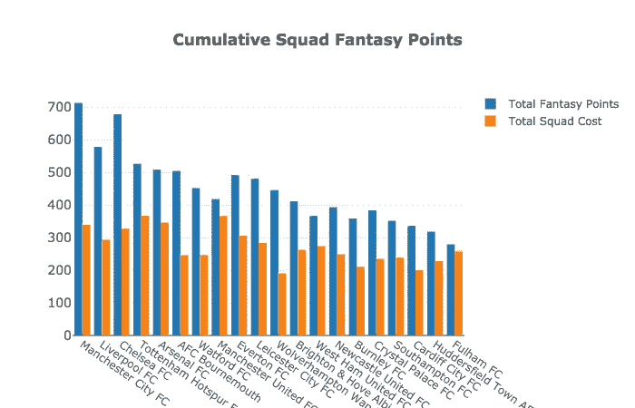

Total Fantasy Squad Cost vs. Total Fantasy Points per team

我们可以清楚地看到，一般来说，一支球队在英超联赛中的表现与其球员的累计梦幻积分之间存在线性相关性。上面的橙色条显示了每支球队的球员在梦幻联盟货币方面的总成本。这有助于我们识别出平均每美元投资(ROI)可产生可观梦幻积分回报的球队，例如— **曼城、利物浦、切尔西、亚足联伯恩茅斯、沃特福德和狼队。**这也暴露了一些被认为是糟糕投资的球队，如**——热刺、阿森纳、曼联、富勒姆、哈德斯菲尔德、西汉姆和南安普顿。**

接下来，我们绘制了每支球队的累积球员投资回报率与教练经常使用的球员数量的关系图(本赛季迄今为止至少打了 360 分钟的球员)。这将有助于我们识别那些拥有太多昂贵且表现不佳的球员的球队，由于他们的教练经常轮换阵容，这些球员很少每场比赛打满 90 分钟，从长远来看，这使他们成为一项糟糕的投资，因为他们不会每场比赛都持续不断地产生梦幻积分。此外，下面的图表将帮助我们确定教练不经常轮换球员的球队，这将导致这些球队拥有更一致的常规球员核心。这将通知我们的算法从这些球队中挑选更多的球员，因为从长远来看，他们的球员预计会产生更高的总 ROI，因为与来自经常轮换球员的球队的球员相比，他们平均会参与更多的游戏活动。

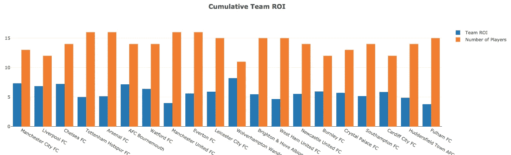

Team ROI vs Number of players that have played more than 360 mins

在上图中，我们在寻找有很高的*蓝条*(累积球员投资回报率)和较短的*橙条*(教练定期使用的球员总数)的球队。这一类别的领导者是**伍尔弗汉普顿，**的 **AVG 投资回报率为 8.21，只有 11 名教练经常使用的球员**(平均每名伍尔弗汉普顿球员身上花费的 1 美元产生 8.21 分的收益)**。这意味着与他们的表现相比，伍尔弗汉普顿的大多数球员都被低估了，教练经常使用同样的 11 名球员，并且只在比赛快结束时或正式队员受伤时使用替补队员。即使像曼城、利物浦和切尔西这样的球队也属于这一类，拥有 13-14 名正式队员，这意味着从上述任何球队中挑选球员从长远来看都是一项不错的投资，因为正式队员比替补队员平均上场时间更长。**

这一类别中最大的输家是曼联、热刺、阿森纳、埃弗顿、西汉姆和富勒姆，他们的投资回报率在 4-5 之间，许多常规球员的回报率高达 15-16。这意味着，通过从这些球队中挑选球员，你正在进行一项“糟糕的投资”，因为教练经常轮换阵容，你的球员可能无法参加每场比赛。此外，统计数据清楚地表明，与他们在梦幻联盟中的表现相比，这些球队的球员被高估了，这是由他们低于平均水平的 ROI 所表明的。

## 2.查看单个玩家的数据

在确定了哪些团队产生了更高的累积投资回报率之后，我们接着放大了单个玩家。在股票市场方面，我们已经确定了所有的高收益市场部门——**团队**——现在我们要开始分析每个部门的所有个股——**玩家**。计划是分离出一个具有最高 ROI 的玩家列表，并编写一个 Python 算法，该算法将使用智能逻辑来挑选最佳的玩家组合，这将为我们 1 亿毫米的有限预算带来最高的投资回报。

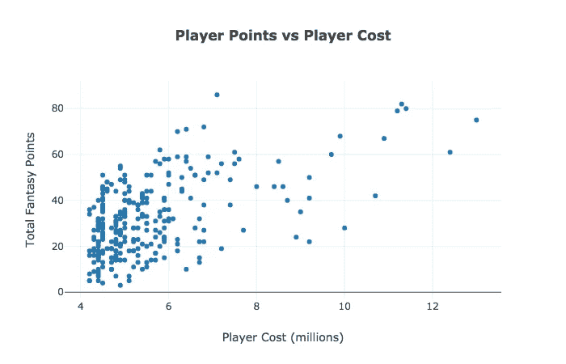

看着上面玩家花费与玩家总幻想点数的散点图，我们希望我们的人工智能选择出现在图上尽可能靠西北的玩家(低花费玩家产生大量幻想点数)。请注意，我们还希望包括一些来自该地块东北角的顶级玩家，因为这些将是一些产生大量积分的明星联盟玩家，尽管他们有点昂贵，但他们最终仍有不错的 ROI。下图描绘了前 20 名投资回报率玩家与后 20 名投资回报率玩家的对比。因此，我们希望我们的最终算法尽可能多地选择这些高产玩家。我们希望远离那些相对于他们的表现(高成本/低幻想点)价格过高的球员，如**哈里·凯恩、阿莱克西斯·桑切斯、罗梅卢·卢卡库、克里斯蒂安·埃里克森、阿尔瓦罗·莫拉塔、保罗·博格巴、德勒·阿里**等等。

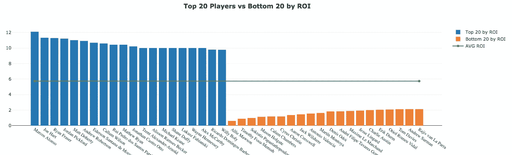

Top 20 and Bottom 20 Players by ROI plotted against AVG League ROI

我们决定绘制上面的统计数据，包括联盟中所有球员的 AVG 投资回报率(**绿线= 5.74** )，以直观地了解“*表现出色”*和“*表现不佳”的球员*是什么样子。例如，**联盟中收益最高的球员马科斯·阿隆索的投资回报率为 12.11** ，是 AVG 5.74 的两倍多，这使他成为我们算法中显而易见的选择。

在下面的饼状图中，我们可以看到球员价值最高的球队和球员价值最低的球队的分布情况。我们期待我们的最终算法能够从拥有许多高产球员的各种球队中挑选球员，例如——**伯恩茅斯、狼队、利物浦切尔西、曼城、沃特福德和埃弗顿。**这种聪明的方法与普通人玩幻想游戏的方法非常不同，后者主要从他/她最喜欢的球队中挑选球员，加上来自 4 或 5 个最受欢迎球队的少数球员——**阿森纳、托特纳姆、曼联、切尔西、利物浦或曼城，**然后用廉价的“填充”球员填充他们幻想球队的剩余部分，这些球员从不在真实比赛中出场，也不会产生任何幻想积分。

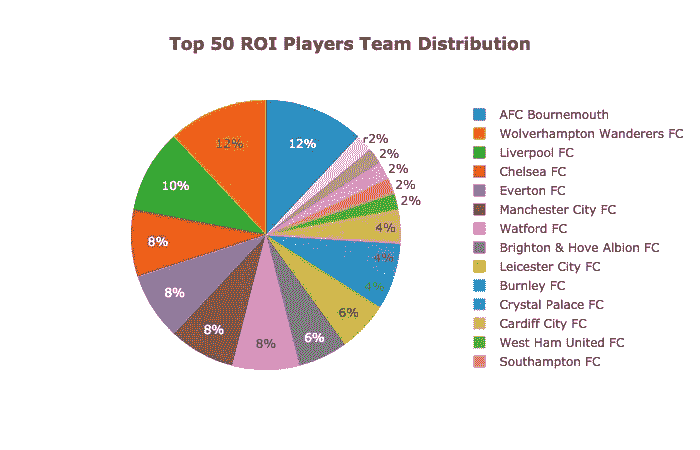

Teams with the most players from the TOP 50 ROI list

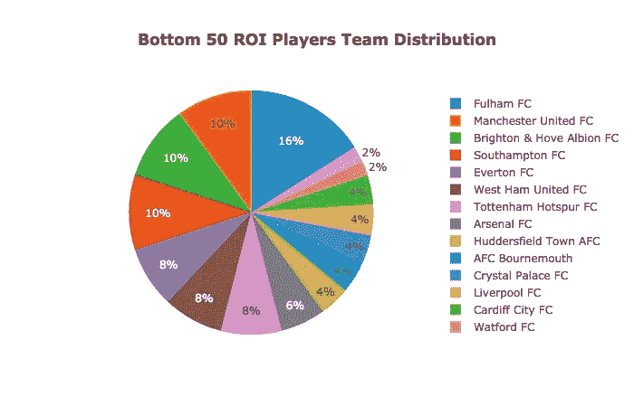

Teams with the most players from the BOTTOM 50 ROI list

## 3.编写挑选最佳幻想团队的 Python 算法

现在是最有趣的部分——编写实际的 Python 算法，并将人工智能选择的结果与普通人可能为他们的幻想团队选择的结果进行比较。

要理解我们算法的逻辑，首先必须理解下面 EPL 幻想游戏的规则和约束:

*   每个幻想玩家的预算都是 100 万英镑，必须购买 15 名足球运动员(11 名主力+ 4 名替补)才能参赛。
*   你需要至少有 2 名守门员，5 名后卫，5 名中场球员和 3 名前锋，以完善你的阵容并有资格参加比赛。
*   同一个足球队不能有 3 名以上的球员。

因此，我们用一个针对这些条件的`if-else`语句开始我们的 python 算法，然后在此基础上添加我们自己的条件和逻辑，这样每次算法遍历我们的玩家列表时，它都可以使用智能逻辑根据下面的条件做出有效的选择:

*   检查一个球员是否受伤，被禁赛或不能比赛，如果是这样，即使他们有很高的投资回报率，也不要选择这个球员加入我们的梦幻队。
*   先挑联盟累计联赛积分最多的前三名明星球员。(*我们将使用不同数量的明星球员来测试这种情况的结果，并选择能够产生最大投资回报的版本，同时仍然允许足够的剩余预算来填充我们的团队，让我们拥有许多投资回报率排名前 50 的球员。*
*   每次我们挑选一名球员并将其加入我们的球队，我们都会从 1 亿美元的预算中减去他们的费用，并将他们的位置和球队名称添加到一个列表中，以确保我们不再为达到限制的位置和球队购买球员。
*   一旦选择了最佳数量的昂贵超级明星球员，该算法就开始浏览投资回报率最高的球员名单，并试图尽可能多地找到顶级球员，直到我们接近耗尽我们的预算并填补所有的球队职位。
*   Algorithm 打印出它在最后挑选的球员名单，并给我们剩余的预算和球队的总幻想点数。

*这里是我们团队挑选算法的一些压缩 Python 代码:*

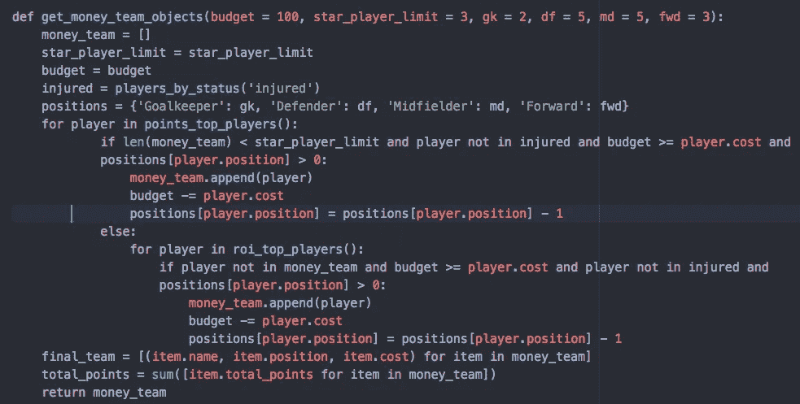

Optimal Fantasy Team Selector

**下面你可以看到我们的算法选出的最终团队的截图:**

> **注:**以下团队仅准确到 2018 年 11 月 14 日。我们的算法旨在每个游戏周之后更新玩家数据，并根据团队/玩家 ROI 数据的波动做出新的选择。

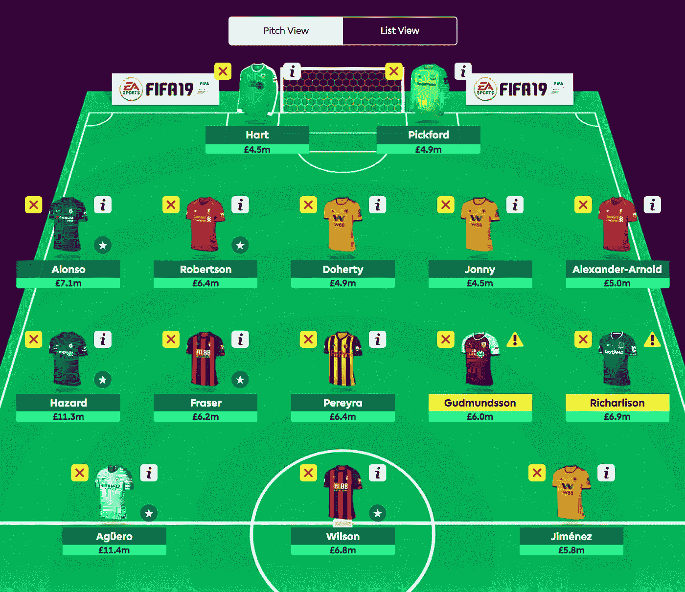

Money Team as of Nov 14th, 2018 (944 Total Fantasy Points, World Ranking: 1st out of 5.8 million people)

> **注:**我们为 AVG·乔团队编写了一个类似的算法，该算法更侧重于将预算花在来自大球队的明星球员身上，这些球员往往定价过高，可能无法在我们 1 亿英镑的有限预算中获得最高的累计投资回报。
> 
> **注意:**我们还要求一位同学选择一个他自己的随机团队，这样我们可以比较他的选择，并验证我们为 AVG·乔算法设计的随机团队选择器函数是准确的。

## 4.比较我们的结果

既然两种算法都已经建立并执行，让我们比较一下“金钱团队”与“AVG·乔的团队”和“随机同学团队”的结果，看看哪一个表现最好，差距有多大。最终结果显示，我们队的总分 **944 分**对 **812 分。**对于 AVG·乔团队(类似于我们同学的团队)，这是一个显著的 **132pt 差异！**下面的柱状图展示了我们的结果:

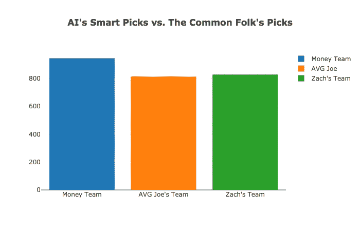

> ***要回答的有趣问题:*** *我们的算法是否返回了最高 ROI 的团队？它是否以显著优势击败了其他公司？我们的算法是否成功地从一些我们最初认为被低估的中游球队中挑选了球员？AVG·乔算法和我们的同学从顶级球队中挑选了更多价格昂贵的球员吗？*

下面我们可以看到，我们的算法从我们在项目开始时确定的大部分高 ROI 团队中挑选了一组球员:

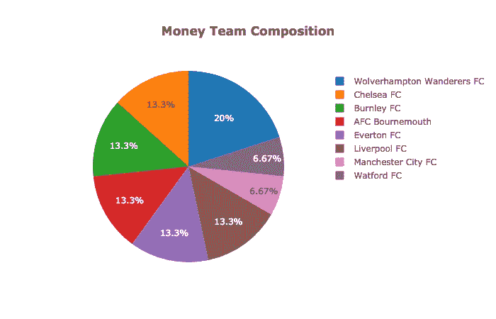

Money Team Player Distribution

这是一个更加平衡和公正的选择方法，而不是 AVG·乔在选择他/她的球员时所用的方法。请注意，下面的饼状图显示了 AVG 乔队选择的 11 名球员的球队名单。由于 AVG·乔将他/她的大部分预算花在挑选 11 名非常昂贵的球员上，他/她不得不将剩余的预算花在最便宜的可用球员上，以填补所有的替补位置，但是这些球员中没有一个可以用于产生幻想积分，因为他们实际上从未参加过真正的 EPL 比赛，并且仅被用作球队填充员。这些是来自布赖顿和卡迪夫的一些替补队员。

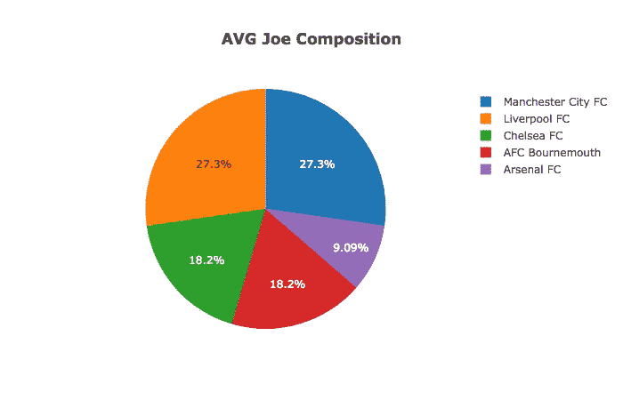

AVG Joe Team Player Distribution

# 结论:

消除团队/玩家的偏见和偏袒，专注于实际的玩家统计数据，让我们的算法得到最大的回报，并以总计 **132 分或整整 16.25%** 的优势击败了一般的 EPL 幻想玩家！最后，事实证明我和我的朋友实际上并不“不幸”,我们的梦幻联盟球队年复一年表现不佳是有原因的。这种对球员数据的深入研究让我们意识到，我们正在允许球队偏袒和购买大量高价球员的倾向，从而损害我们的整体梦幻联盟表现。

## 5.后续步骤

我们计划继续监控这些数据，在赛季中当球员开始受伤，争夺积分奖杯变得更加激烈时，检查球员统计数据中的任何剧烈变化和异常值。我们还想比较算法的团队在赛季结束时与世界上大多数休闲球员相比的表现。此外，我们计划每月更新一次这个博客，为那些对我们的人工智能进展感兴趣的人，所以请在每个月底重新访问这个博客，了解性能更新，并享受 EPL 行动的其余部分！！！

**12 月更新:**新博客开始更新代码，团队准备好第一周的 EPL 行动:[https://medium . com/@ pruchka/EPL-fantasy-is-one-week-away-and-our-algorithm-is-ready-to-play-78 afda 309 e 28](https://medium.com/@pruchka/epl-fantasy-is-one-week-away-and-our-algorithm-is-ready-to-play-78afda309e28)