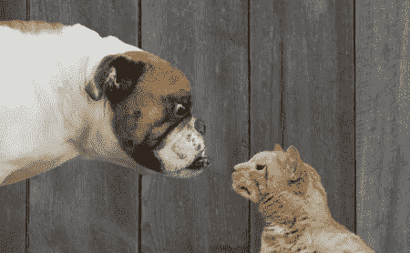
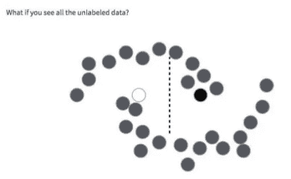

# 数据扩充和伪标记简介

> 原文：<https://towardsdatascience.com/beating-the-state-of-the-art-from-2013-with-5-of-data-without-using-transfer-learning-301faf624fb6?source=collection_archive---------2----------------------->

在本文中，我们将了解两个可以帮助您充分利用培训数据的想法。

为了更好地感受这些技术，我们将应用它们来击败 2013 年以来在区分图像中的猫和狗方面的最先进技术。情节的转折是，我们将只使用 5%的原始训练数据。

我们将与使用 13 000 幅训练图像达到的 82.37%的准确率进行竞争。我们的训练集将由随机选择的 650 幅图像组成。

模型将从零开始构建，我们不会使用迁移学习或预训练。

你可以在 github 上我的[库](https://github.com/radekosmulski/training_a_CNN_with_little_data)中找到我写的代码。

Image from the original [Kaggle competition website](https://www.kaggle.com/c/dogs-vs-cats) from 2013

## 第一个模型

第一个模型必须非常简单——650 张图片是非常小的数据量。

我倾向于 CNN 架构，它通过利用在图像中几乎任何位置都可以找到相似形状的事实来限制权重的数量。

我还跳过了全连接分类器，而是决定采用全卷积网络。希望这能给我们的模型一个更好的推广机会。

最重要的是，我做了很多实验。最终的架构包含跨越 6 个卷积块的 28，952 个可训练参数。通过少量的 l2 正则化，该模型在测试集中的 23，750 幅图像上实现了 74.38%的准确率。

是时候推出第一个大创意了。

## 数据扩充

怎样才能让一个模特表现的更好？用更多的例子训练它，同时确保它有学习能力，通常是正确的方法。

但在实践中，更多的训练数据往往不容易得到。获取或注释额外的示例可能是乏味或昂贵的。

我们可以做的另一件事是利用我们对图像的了解来模仿拥有更多的图像。

如果从更小的距离拍摄，照片看起来会有很大的不同吗？不完全是。我们能效仿吗？绝对的！放大图片并裁剪中心。

让照片看起来像是用稍微偏右的相机拍摄的怎么样？完全没问题。将图像向左移动一点点。

这听起来很简单，但却非常强大。这里唯一要补充的小细节是，我们不会自己变换图像——我们会告诉一个算法允许它做什么样的变换，它会对它们进行一些随机组合。

不幸的是，为了从扩充的数据中学习，我需要构建一个更大的模型。它最终包含了更多的特征地图，将可训练参数数量增加到 1 003 682 个。

这似乎有点不对劲。也许我选择的架构一开始就没有那么好。然而在这一点上，我选择坚持下去，继续实验。

随着数据的增加，该模型在早期结果的基础上提高了 35%，并在测试集上实现了 83.43%的准确率。

第二个伟大想法的时间到了。

## 伪标记

我们能不能用模型本身来模拟拥有更多的数据？

理论上，我们可以获取所有未标记的数据，包括我们的验证集，在其上运行模型，并将我们的模型对其预测最有信心的图像添加到我们的训练集。

我们不是在冒险强化我们的模型已经在犯的错误吗？无论如何，这在某种程度上会发生。

但是如果事情按计划进行，这样做的好处将超过上述效果。

我们所希望的是，通过提供更多的数据，我们的模型将了解所有它可能看到的图像所共享的底层结构。这将有助于它进行预测。

How our perception of what a good model is changes based on seeing unlabeled data. Source: [presentation](https://www.slideshare.net/AlexConway2/convolutional-neural-networks-for-image-classification-cape-town-deep-learning-meetup-20170620) by Alex Conway

为了从伪标签图像中学习，我构建了一个比之前的模型大 1.5 倍的模型。我们现在有 1 566 922 个可训练参数。

我在 24350 个未标记的例子上运行旧模型。我挑选了 1000 张它认为最有把握正确的图片。我使用大约 1 比 4 的比例，在伪标签和原始训练集图像的混合上训练我们的更大模型。

在没有对模型架构进行实验和调整混合比的情况下，新模型在测试集上实现了 85.15%的准确率，非常有信心击败 2013 年的 SOTA。

## 摘要

在完成 [fast.ai](http://www.fast.ai/) 的[程序员实用深度学习](http://course.fast.ai/)课程之前，我写了这篇文章。我现在会用不同的方式来面对这个挑战。我会选择 Densenet 架构，它在处理少量数据时表现得非常好。我也不会调整图像的大小，而是将它们放大并裁剪到较短的一边。这丢失了一些信息，但是它保持了纵横比不变，通常效果更好。

*如果你觉得这篇文章很有趣并且想保持联系，你可以在 Twitter 上找到我* [*这里*](https://twitter.com/radekosmulski) *。*