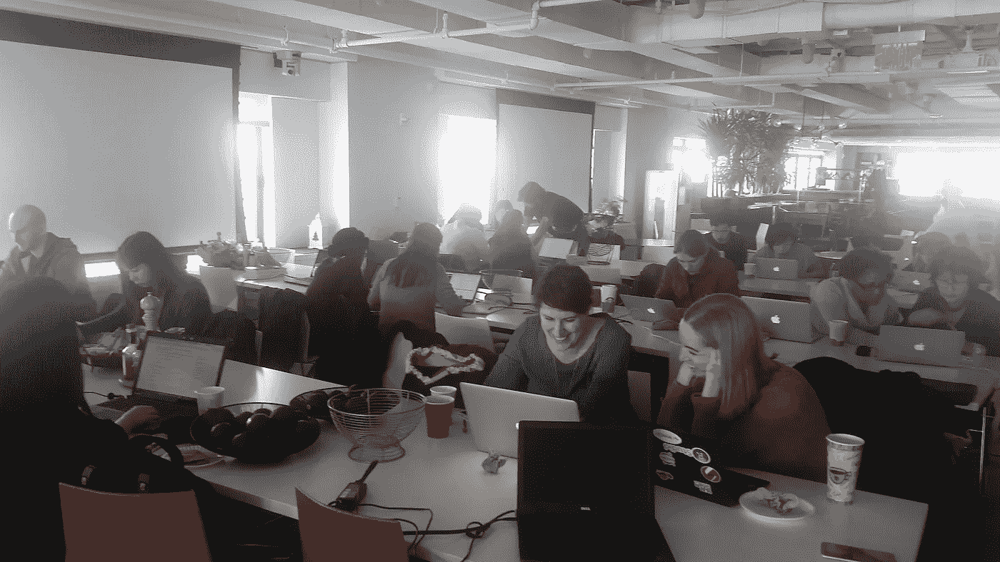

# 为开源做贡献，成为更好的数据科学家

> 原文：<https://towardsdatascience.com/become-a-better-data-scientist-by-contributing-to-open-source-4a95ce0c865b?source=collection_archive---------5----------------------->

## 参加第一次开源冲刺的有用提示

让我们面对现实吧:在一场游戏竞赛中获得高分并不需要遵循 T2 pep 8 T3 或者其他任何软件开发最佳实践。然而，代码是我们的手艺，在你职业生涯的某个时刻，你可能想要或需要学习编写[生产级代码](/how-to-write-a-production-level-code-in-data-science-5d87bd75ced)。为开源做贡献是磨练您的代码技能、学习专业最佳实践以及回馈更广泛的技术社区的一个很好的方式。

很好，你说，但是我从哪里开始呢？参与开源没有[的“正确”方式](https://reshamas.github.io/how-i-unknowingly-contributed-to-open-source/)，在 [你的](https://www.quora.com/How-do-I-start-contributing-in-Open-Source-projects) [自己的](https://opensource.guide/how-to-contribute/)上有大量[的](https://hackernoon.com/how-to-get-started-with-open-source-2b705e726fea) [入门](https://www.firsttimersonly.com) [。但是另一个很好的开始方式是参加短跑。你当地的技术聚会小组或开发者大会](https://blog.udacity.com/2013/10/get-started-with-open-source-projects.html)只是可能举办 sprint 的两个例子。

冲刺的概念来自于[敏捷](https://www.oreilly.com/ideas/a-manifesto-for-agile-data-science)，在敏捷中，不是等待一个产品最终完成，而是价值在它变得可用时就交付给客户。这个想法是迭代地工作，在整个开发过程中结合来自客户的反馈。开源 sprint 采用这种快速开发的思维方式，并将其应用到开源代码开发中。在冲刺阶段:

*   开发人员和项目维护人员共处一地；
*   每个人都在相同的代码库、包或库中工作；
*   您可以处理已知问题(bug)、文档、单元或假设测试、重构或优化现有代码，或者使用代码开发示例/教程；和
*   欢迎所有级别。

我的第一次冲刺，去年的[WiMLDS](http://wimlds.org/chapters/nyc-chapter/)[scikit-learn](https://github.com/scikit-learn/scikit-learn)sprint，是我为开源软件做贡献的开始。上周，我参加了由纽约 Python 和 PyData 联合举办的 sprint[dateutil](https://github.com/dateutil/dateutil)(datetime 计算的主要依赖项[和](https://github.com/pandas-dev/pandas))。在这两个例子中，通过参加 sprint，我能够向现代数据科学的基础库发出[拉请求](http://oss-watch.ac.uk/resources/pullrequest)。

## 短跑和黑客马拉松有什么区别？

虽然两者在功能上有一些相似之处(限时编码，快速解决问题)，但是一个 *sprint* 和一个*黑客马拉松*有着本质的不同。

黑客马拉松通常是一场竞赛，不同的团队有不同的想法，可能会持续一天或几天(比如一个周末)。可能会颁发奖品。通常目标是编码一些全新的东西。黑客马拉松通常(但不总是)是独立的，导致 MVP 并不总是被进一步开发。

然而，在 sprint 中，每个人都在同一个现有的开源代码库、包或库中处理不同的 bug 或问题。短跑可能持续三个小时或半天。没有奖品。目标是改进代码库，同时加强支持开发人员的社区。在 sprint 之外继续开发代码库是可以的，也是鼓励的。

When you are sprinting, don’t forget to take some photos! Photo by author.

# 第一次冲刺应该怎么准备？

## 冲刺前

sprint 的重点是从你的时间表中划出专门的时间来做实质性的工作。本着这种精神，任何准备步骤都可以在冲刺阶段的一开始就做好，只要你带着电脑并能上网。尽管如此，我还是建议在冲刺之前做以下步骤*(按照重要性递减的顺序)，以便充分利用你的冲刺时间。*

首先，你应该提前确保你的电脑上安装了 Python，一个 [IDE](https://en.wikipedia.org/wiki/Integrated_development_environment) 或者首选的文本编辑器，以及 Git。你应该有一个 [Github 账号](https://github.com)。如果现场电源插座很少，也要给电脑的电池充电。虽然在没有工具的情况下，你也有可能在 sprint 中获得良好的体验，但是如果没有工具，你的贡献可能会受到限制。

如果您已经准备好了工具，并且还有一些时间来准备，那么就开始熟悉这个项目吧。看看项目的 Github 回购。有没有 README.md，或者是你想参考的投稿人风格指南？

阅读项目文档。有意义吗？了解代码库的功能。**如果你不确定如何做出贡献也没关系**。计划无论如何都要出现，并计划*结对编程。* [结对编程是学习更好的软件开发实践的关键](https://medium.freecodecamp.org/want-to-be-a-developer-you-should-probably-be-pair-programming-2c6ec12c4866)。

Pair programming is the key to a successful sprint and to becoming a better programmer. Photo by author.

# 冲刺阶段会发生什么

## 选择工作内容

当你第一次到达现场时，仔细观察房间，向听得见的每个人介绍你自己。要友善；询问人们他们计划做什么。如果有些东西听起来不错，问问他们是否愿意在上面配对程序！

对于第一次投稿的人来说，文档是一个很好的起点。如果您阅读了该项目的一些代码文档，但没有意义，请查看代码并尝试找出它的作用。然后写下你对其工作原理的改进解释。

查看该项目的 Github 中的已知问题选项卡。有人可能已经按难度标记了问题。你认为你能在这里解决什么问题吗？

**重要** —不要太有野心。事实上，在你的第一次拉动请求中，你的野心越小越好。更改一个错别字会让你很好地理解与这个代码库交互和更改代码库所需的工作流程，这将为你在 sprint 期间或之后提交更复杂的编辑做好准备。

记住:没有提交给 Github 的工作和根本没有发生的工作是一样的。决定你的冲刺目标是有一个单一的拉请求(如果你做得更多也没关系)。因为你们是结对编程，所以要确保这也是和你一起工作的人的目标。

## 知道如何提交您的更改

版本控制问题可能是混乱的，您将希望等待项目维护者的指示，他们希望您如何对项目进行更改。他们是否有测试代码，您可以在本地运行，以确保项目可以在所有支持的版本上运行？项目是否有一个“声明”问题的系统，以防止两个人同时处理同一个问题？(通常这是通过在问题上留下评论来完成的，尽管一些项目维护者可能更喜欢使用[看板](https://en.wikipedia.org/wiki/Kanban_board)来保持组织性。)

将项目分支到您自己的回购中。 *Git 克隆*到你的桌面本地工作。在做出任何改变之前，你会想要改变你的设置，这样你就可以在你自己的分部工作了(**而不是**大师)。如果你知道如何做到这一点，太好了！如果没有，请随意温习一下 [Git 基础知识](https://git-scm.com/book/en/v2)。或者，随便问问人！sprint 最大的好处是你可以和其他开发人员共处一地。

## 当您准备提交您的更改时

现在，您已经在自己的分支中本地进行了更改，并针对任何内部多版本支持工具测试了更改，您已经准备好发出拉请求了！

根据项目对参与的要求(活跃贡献者和一次性贡献者)，记得在你的 pull 请求中包含一个修改过的 AUTHORS.md 文件，并添加你的名字和 Github 帐户。

# 冲刺之后

## 灾后小贴士

帮忙收拾；这很可能是一次志愿者领导的活动。专业建议:留下来帮忙清理空披萨盒不仅是表达你感激的好方法，也是和活动组织者聊天的最后机会。在科技领域建立关系网的最佳时机是你不需要工作的时候，第二个最佳时机是你需要工作的时候。

确保你为任何冲刺后的社交留出时间和精力，这可能是临时的而不是提前宣布的。不要害怕成为那个建议之后去酒吧的人。即使你不喝酒，这也可以是一个很好的方式来反思你所做的事情，在社交环境中向他人学习，在开源社区中变得更加活跃，结交朋友，当然，还有网络。

您的“拉”请求可能不会立即被接受，您可能需要进行一些更改，以适应项目的风格期望或需求。预计在接下来的几天内会处理好这个问题，因为这可能需要与项目维护人员反复沟通，并且当他们引用代码库的最新版本时，合并您的更改会更容易。

## 保持接触

然后，在接下来的几周或几个月里，写一篇关于你的经历的博文(咳咳)，继续解决更有雄心的问题，因为你对这个代码库越来越熟悉了，并且享受成为现实生活中的开源贡献者的荣耀。

[*劳伦·奥尔德加*](http://laurenoldja.net) *是纽约州布鲁克林的一名数据科学家。*