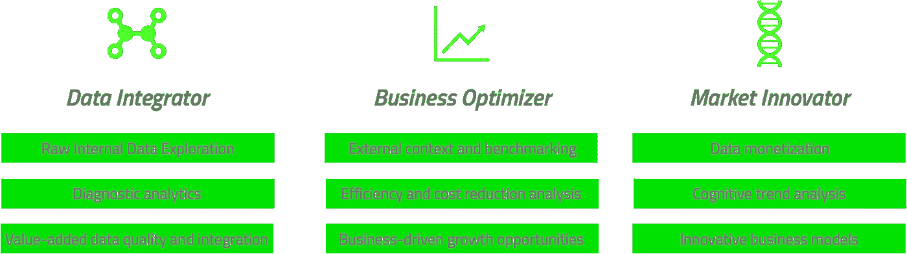

# 成为数据驱动或灭亡:为什么你的公司需要一个数据战略，而不只是更多的数据人

> 原文：<https://towardsdatascience.com/become-data-driven-or-perish-why-your-company-needs-a-data-strategy-and-not-just-more-data-people-aa5d435c2f9?source=collection_archive---------4----------------------->

在过去的 14 年里，我一直以这样或那样的方式处理数据。我最初是一名管理信息系统经理([ABN·阿姆洛](https://www.abnamro.com/en/index.html))，这是一个很棒的头衔，但我基本上是下载 PDF 报告，并手动将它们输入电子表格，以生成每日财务报告，多年来，我做过商业情报经理( [ING 银行](https://www.ing.com/Home.htm)、[荷兰合作银行](https://www.rabobank.com/en/home/index.html)、[德尔塔·劳埃德](http://www.deltalloyd.nl/prive/index.jsp))、数据分析师([微软](https://www.microsoft.com/nl-nl/))、数据科学家([阿德延](https://www.adyen.com/))， De Bijenkorf ，现在是一家荷兰支付技术初创公司( [Dimebox](https://dimebox.com/) )的数据主管。

在我所有的经历中，最让我难忘的是我的工作真正产生影响的时候。当然，当你在一家拥有超过 15，000 名员工的公司工作时，与你在一家 30 人的初创公司相比，你的影响非常小，但知道你所做的工作有助于做出决策，这可能是处理数据的最佳部分之一。

但随着数据，尤其是数据科学和分析成为最新的热门话题，我很惊讶有多少公司急于吸引数据科学家、数据工程师、机器学习工程师、人工智能工程师，但从未停下来思考他们的数据战略。

**数据
).**

时至今日，企业已经认识到数据的价值，尤其是可用于报告或数据分析的交易数据，这有助于做出更好的决策。但是，尽管数据的感知价值在过去二十年中有所增加，但许多公司仍在努力捕获、共享和管理数据，因为他们的行为反映了一种过时的基本观念，即数据只是应用程序的副产品，因此雇佣“数据人”来处理数据。因为为了雇佣而雇佣某人，永远不会解决任何问题，所以我认为，在考虑雇佣任何职位中有数据的人之前，组织需要创建一个符合当今现实的数据策略。

**数据战略** 制定数据战略背后的理念是确保所有数据资源的定位能够方便高效地使用、共享和移动。换句话说，拥有数据策略可以确保数据作为资产来管理和使用，而不仅仅是作为应用程序的副产品。通过建立通用的方法、实践和流程，以可重复的方式在整个公司范围内管理、操作和共享数据，数据战略可确保高效使用数据的目标和目的保持一致。

**数据人
因此，大多数数据分析师并没有将数据转化为洞察力的明确目标，而是访问数据库，并请求运行任何基本分析工具都可以在几秒钟内提供的查询。**

最近，趋势已经从雇用数据分析师转向雇用数据科学家、数据工程师、机器学习/人工智能工程师，不是因为他们是一个实际的战略或目标，而是因为每个人都在这么做。导致公司花费大量的金钱，吸引和留住数据科学家，他们花费大部分时间来提取、清理和建模数据，而不知道它将如何解决实际问题或创造新的商业机会来产生收入或利润。

**该怎么办？** 因此，如果您或您组织中的某人刚刚雇用了一名数据分析师、科学家或工程师，并且您一直在想这是否是正确的做法，我将这四个步骤进行了分解，我认为任何组织，无论是初创公司还是企业，如果想在数据方面取得成功，都应该经历这四个步骤。

**第一步:任命一名数据主管或首席数据官** 在我看来，管理层/创始人必须做出的最重要的决定，就是让某人对数据全面负责。此人的大部分职责是在公司范围内管理和使用作为组织/战略资产的数据。这意味着，与单一部门合作，设计一种获取、存储、管理、共享和使用数据的通用方法，但更重要的是，通过促进对话和分享决策和成功，确保文化采用数据驱动的思维和决策方式。

**第二步:使组织的关键愿望与数据价值链相一致** 每个公司都会经历其生命周期中的不同阶段，当一个组织转变为数据驱动型组织时，数据价值链上的愿望需要与组织的主要需求相一致。被指派的数据主管/首席数据官的首要任务应该是确定公司的目标是什么，这样他们就可以使之与他们的战略保持一致。

比如说； ***数据集成商*** 主要致力于实施现代化的集成内部数据基础设施，而 ***业务优化师*** 主要致力于利用已建立的数据基础，使内部和以客户为中心的业务流程尽可能高效，而 ***市场创新者*** 主要致力于扩展认知能力，成为数字颠覆者。

Aspirations for Data

**第三步:制定符合组织关键目标的战略** 随着公司目标的明确，数据主管/首席数据官需要制定业务驱动的数据和分析战略，并培养数据驱动的文化。这可以从为 ***数据集成商*** 建立公司级、业务驱动的数据和信息治理，到为 ***业务优化者*** 和 ***市场创新者*** 建立“有针对性”的治理。然而，如果商业文化不愿意改变，即使是最好的战略也会动摇。 ***数据集成商*** ，他们依靠基于证据的运营方式茁壮成长，需要建立一种数据驱动的文化，而 ***业务优化者*** 和 ***市场创新者*** ，需要采用一种“快速失败”的敏捷软件开发文化来提高上市速度和创新。

**第四步:吸引实现您的战略所需的人才** 最后，为了实现与已制定的抱负和战略相一致的目标，数据主管/首席数据官需要担任实现目标所需的角色。 ***数据集成商*** 需要更多的技术角色，比如数据架构师、分析师、集成专员，因为内部基础还需要建立。 ***业务优化者*** 取决于他们是专注于扩展生态系统还是专注于数据的分析应用，需要技术角色和数学/业务角色的混合，如数据科学家、数据建模师和业务分析师，以推动优化和创新。最后， ***市场创新者*** 需要数据科学家和数据可视化专家以可理解的可视化方式传达复杂的新概念。

**成为数据驱动型或灭亡** 我坚信，那些不相信自己的数据是一种资产并且不认为数据应该得到相应管理的公司，在未来五年将会遇到很多麻烦。但是，与其专注于雇佣一个“数据人”，我认为应该花时间和精力在你的组织中找到这样一个人，他能够看到更大的图景并制定战略，拥有改变一个组织的人和沟通技巧，并且愿意并且特别有足够的耐心站在第一线，将一个公司从**数据整合者**一直推进到**市场创新者**。

## 感谢阅读；)，如果你喜欢它，请点击下面的掌声按钮，这对我意义重大，也有助于其他人了解这个故事。通过在 Twitter 或 Linkedin 上联系我，让我知道你的想法。

***来源/附加推荐阅读:*** [IBM 商业价值研究所《首席数据官行动手册》](https://www-935.ibm.com/services/us/gbs/thoughtleadership/2016cdostudy/)
[麦肯锡公司《构建数据驱动战略的三个关键》&公司](https://www.mckinsey.com/business-functions/digital-mckinsey/our-insights/three-keys-to-building-a-data-driven-strategy)
[首席数据官:毕马威](https://home.kpmg.com/nl/nl/home/insights/2016/12/the-chief-data-officer-a-welcome-new-c-suite-member-in-data-driven-organisations.html)
[数据驱动型组织中受欢迎的新高管成员 SAS](https://www.sas.com/nl_nl/whitepapers/5-essential-components-of-data-strategy-108109.html)