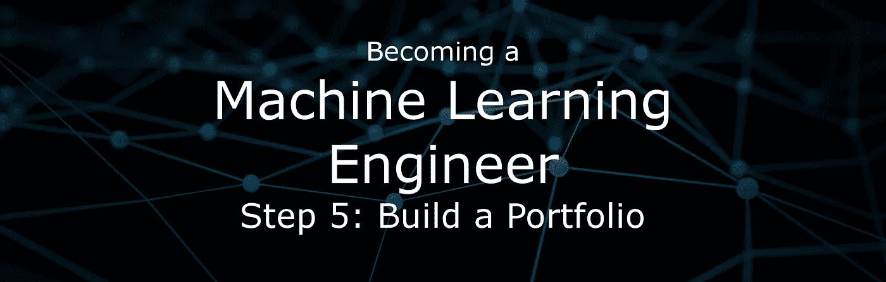

# 成为机器学习工程师|第五步:建立投资组合

> 原文：<https://towardsdatascience.com/becoming-a-machine-learning-engineer-step-5-build-a-portfolio-31d219e40fbc?source=collection_archive---------1----------------------->

本文是“成为机器学习工程师”系列的最后一篇。我开始写作的目标是通过创作来提高我的写作和学习。我最大的恐惧是我写的所有东西都会被忽视。幸运的是，恰恰相反的事情发生了。人们参与、评论、鼓掌、分享、关注我和我的作品。我对这一成功感到谦卑，并决定继续写作，希望能够在新一代机器学习工程师的学习之旅中提供帮助。**谢谢**

成为一名机器学习工程师不是一件小事。从一无所有到建立从数据中学习的系统需要大量的努力和耐心。如果你已经在这个系列中走了这么远，那么恭喜你，你和我几个月前一样，但是如果你和我一样，那么你不太确定如何展示你在几个月的专注练习中积累的技能。

为了展示你的技能，你能做的最有成效的事情就是建立一个作品集。高质量的投资组合可以展示:

*   通讯能力
*   技术能力
*   思考问题的能力
*   采取主动的动机和能力

这些都是雇主在决定雇佣谁时希望看到的。不幸的是，没有多少人把一个投资组合放在一起就能展示这一点。在整理你的第一个机器学习投资组合时，有五件事要记住。这五件事是指导方针，将确保你的投资组合给你最大的回报。

## 保持项目小

在你的投资组合中，规模的确很重要，尽管一个重大项目华而不实，但它也伴随着风险和成本。一个小项目可能不会花超过 20-40 个小时来完成，如果它没有成功，那么你的损失比一些大项目可能会变成的几个月的时间下沉要小得多。

## 完成项目

唯一比没有投资组合更糟糕的事情是有一个装满半成品项目的投资组合。它向世界尖叫，你没有能力完成你开始的事情，应该不惜一切代价避免。

## 独立项目

机器学习可以应用于几乎每个领域，你应该通过完成独立的项目而不是以前工作的扩展来展示这一点。如果你确切地知道你想擅长什么领域，并且想展示你的专长，那就忽略这一点。

## 新颖的项目

我班上的许多学生犯同样的错误。他们学了很多教程，觉得自己应该无所不能。然后他们试图完成我的带回家的项目，但失败了。跟随在线教程不是学好的方法，从头到尾完成新颖的项目才是学好的方法。如果我在简历中看到许多辅导型项目的组合，我会想出整个简历。
*需要新颖的项目创意？查看我之前的文章* [***成为机器学习工程师|第四步:练习，练习，练习***](https://medium.com/towards-data-science/best-method-to-learn-essential-machine-learning-skills-fast-533e30f3023d)

## 容易接近

将你的作品集放到网上，让所有人都能看到。越多的人发现、阅读和评论你的作品越好。这不仅是未来雇主找到你的一个载体，而且你也可能从你的项目中获得很好的反馈。要做到这一点，最简单的方法就是将所有内容放在一个 git 存储库中，并提供一个完整的 ReadMe。

**如果你像我一样，从例子中学习效果最好，那么看看这个数据科学** [**作品集**](https://github.com/sajal2692/data-science-portfolio) **。**

## 减去

拥有自己的作品组合正迅速成为招聘新的机器学习工程师的重要组成部分。这已经成为软件工程师招聘过程的一部分有一段时间了。现在就开始，挖掘旧的项目或建立新的项目，把它们放在一起，写几份关于你从项目中学到了什么的报告。

# 感谢阅读:)如果你喜欢它，点击下面的按钮，跟我来！这对我意义重大，鼓励我写更多这样的故事

*咱们也连线上* [*推特*](https://twitter.com/cdossman)*[*LinkedIn*](https://www.linkedin.com/in/christopherdossman/)*，或者* [*邮箱*](http://cdossman91@gmail.com)*