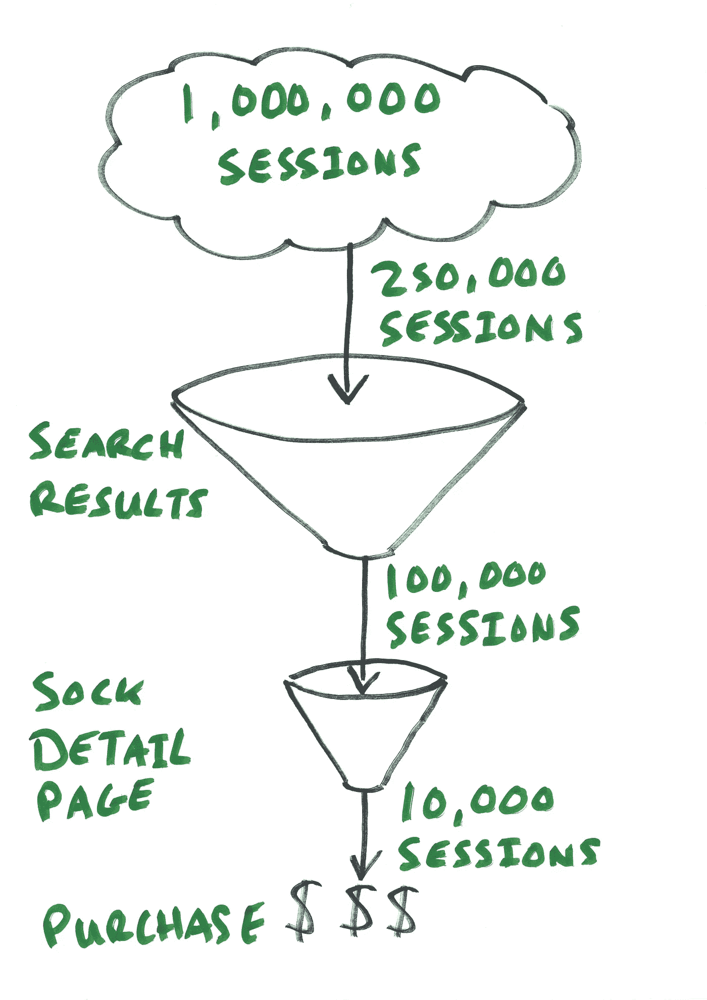
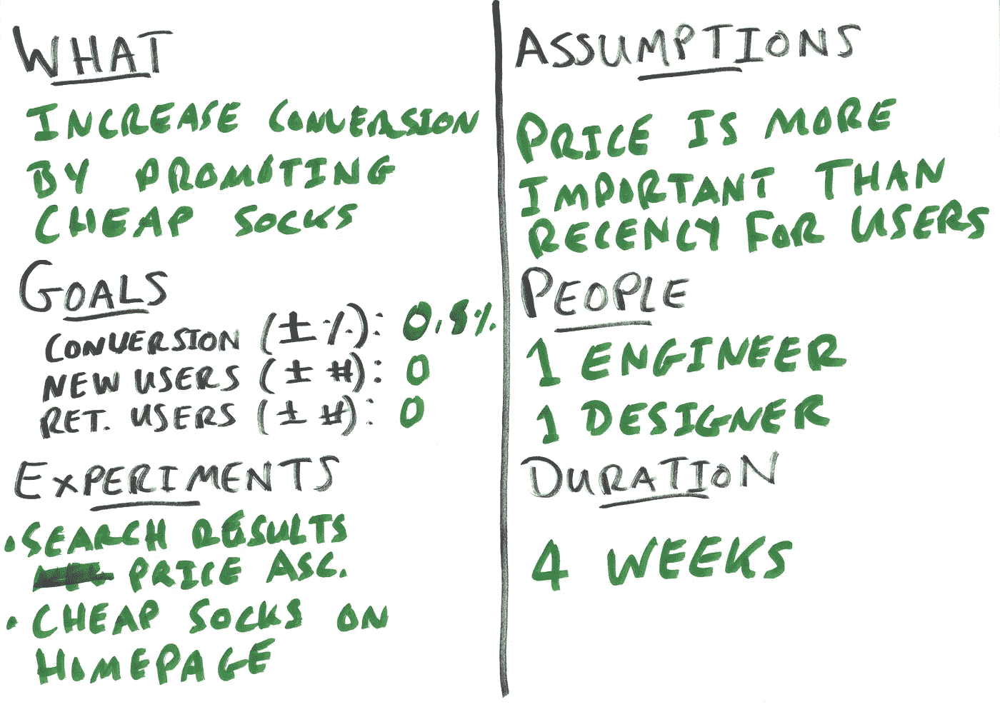

# 成为数据驱动的第三级:使用数据做出令人敬畏的决策

> 原文：<https://towardsdatascience.com/becoming-data-driven-level-3-using-data-to-make-awesome-decisions-522179766043?source=collection_archive---------1----------------------->

在[系列](https://medium.com/@moowahaha/becoming-data-driven-624515a5fb9d#.gc5d32m3j)的[第二篇文章](https://medium.com/towards-data-science/becoming-data-driven-level-2-using-data-to-avoid-shitty-decisions-6756b778f1#.zc9reufhw)中，我们谈到了你可以发现你计划对你的在线产品做的事情是否是个坏主意的方法。这一次，我们将更有前瞻性地思考，并讨论工作的预测和优先顺序。再一次，我带着一个令人兴奋的标题去了，却对这个话题的真实性感到失望。生活充满了这样令人失望的狗屎，习惯吧。

# 它始于一个假设([我从没想过事情会发展到这一步](https://www.youtube.com/watch?v=L3pf7o-9OOk)

假设你有一个销售袜子的网站，你注意到你卖的便宜袜子比高档袜子多。基于此，你有一个假设:如果你提高廉价袜子的突出程度，人们会购买更多。你只需要弄清楚如何检验这个假设，然后变得富有。*袜富*。你和你的团队讨论并提出以下实验:

*   在主页上展示便宜的袜子，而不是由你的内部袜子专家挑选的最酷的袜子。
*   将搜索结果改为按价格升序排序(最便宜的先排序)，而不是最新的先排序。

# 已知的已知和已知的未知

让我们关注上面列出的第二个实验:按价格升序排列搜索结果。您可能会在两种情况下考虑这种影响:

*   你以前在搜索结果或漏斗的其他部分做过类似的事情，所以对这种变化的潜在影响有一些想法。理想情况下，你已经将此作为实验运行，并且对结果有很高的信心。
*   你从来没有这样做过，不知道会发生什么。

**在**之前做过类似工作的情况下，设定一个目标要容易一些:你可以把以前的一些经验作为基线，并运用一些判断。如果你做出的最无效的积极改变在转化率上引起了 0.25 [个百分点](https://en.wikipedia.org/wiki/Percentage_point)(称为“pp”)的改善，而最有效的是 2pp 的改善，那么你就有了一定的范围。然后，您可以应用其他因素来细化该范围，例如漏斗中的相对突出度，但您正在接近一个现实的目标。这很容易被忽视，但实验中最重要的人工产物之一是对未来变化的预期影响。你做的实验越多，理解的结果越多，你就越了解你的产品，你的用户和可能发生的事情。如果你把以前实验的结果储存在某个地方，那么你会得到一颗额外的金星。干得好。

**如果您以前从未对您的袜子网站做过这样的改变，并且不知道会发生什么**，转化率变化的范围可能是零个百分点以上或以下。这就是漏斗分析有所帮助的地方(参见[成为数据驱动型第 1 级:拥有您信任的用户数据](https://medium.com/towards-data-science/becoming-data-driven-level-1-having-user-data-you-trust-9d1c485b8db9#.ig1a71b3q))。现在闭上眼睛，想象你正在做那个分析……很好的一个。以下是您的发现:

*   您每个月总共有 1，000，000 次课程和 20，000 次销售。这是 2%的转化率。
*   在这 1，000，000 个会话中，有 250，000 个会话包含搜索(25%)。
*   250，000 个会话中的 100，000 个(包括搜索),请查看 sock 详细信息页面。其中 10，000 次课程会导致购买(转换)。
*   因此，搜索的转化率为 4% (10，000 是 250，000 的 4%)
*   搜索占所有转换的 50%(总销售额为 20，000，其中销售额为 10，000)。

Search result funnel

让我们提出一个假设，将搜索结果的顺序更改为价格上升将使详细页面的浏览量增加 50%(从 100，000 增加到 150，000):

*   搜索的转化率上升了 2 个百分点，从 4%上升到 6%。
*   总转化率从 2%上升 0.5 个百分点至 2.5%。
*   你每月多卖 5000 双袜子。

为了简单起见，我假设转化率呈线性增长，其中 50%以上的详细页面视图转化为 50%以上的销售额。这是一个很大的延伸，因为您可能会因为展示更多相关产品而导致更随意的浏览，所以请考虑这是一个绝对最大的好处。通过运行一个实验，你会看到这有多接近。

现在你有了一个经过深思熟虑的假设，有了一个合理的目标(即使你开始时没有任何想法),并且知道要测试什么来达到这个目标。通过计算假设的潜在收益，我们有了测试工作优先级的基线。你可以开始写任务，人们可以开始设计和编码。厉害！

…然而，在预测搜索结果顺序变化的影响时，有一个巨大的“但是”:但是谁会关心搜索结果中袜子的顺序呢？我一遍又一遍看到的最大错误是团队和公司庆祝*发布*而不是*冲击*。如果你根据合同有义务交付某些东西以换取金钱，这没问题，但如果你的工作是改进你自己的产品，这就不好了。如果改变搜索结果的顺序不能增加袜子的销量，没人会在意。去尝试别的事情，直到你达到那个目标。明确一点:在计划中，你寻找的是努力和可衡量的目标。如果你没有达到那个目标，那就学习并尝试不同的东西。

# 比较苹果和苹果

对于制造产品的公司来说，一个重大的挑战是从无数的想法中知道该做什么。你下一步应该做什么可能偶尔会很明显。然而，很可能你的想法比你能执行的要多。为了弄清楚你应该首先做什么，许多公司和团队执行一些预定的计划，这可能每年发生一次，但也可能每周都发生。在这个计划中，来自多个来源的想法被提出，优先考虑和批准…或者被拒绝和忽略。正如第一段所确立的:生活是艰难的。从这些练习中，有四点很重要，但是经常缺少。

**一致影响测量。**如前所述，除非你有合同义务，否则执行项目时最重要的是影响，而不是交付。尽管通常很有可能制定出一个目标(见上文)，但经常听到没有目标的项目提案。这不必是一篇很长的散文，就像“转化率增加 0.5 个百分点”，这是一种解释你计划如何达到这个数字以及你所做的假设的能力。

当涉及到多个团队提出一个项目时，康威定律经常适用，你可能会对同一件事有不同的表达。例如，您可能会听到“转化率增加 0.5 个百分点”表述为“额外售出 305 只袜子”、“每天额外售出 10 只袜子”、“搜索结果转化率增加 50%”、“每月额外收入 6982 美元”、“找到便宜袜子提高了用户满意度”等等。所有这些都可能是在陈述同样的事情，但却很难理解和比较。因此，为您的团队提供少量的度量标准和他们应该使用的单位是有益的。对于我们的袜子网站，这可能是:

*   转换率的百分点变化(导致销售的会话)。
*   新用户的数量(以前没有记录会话的用户)。
*   返回用户的数量(以前记录过会话的用户)。

我们 sock 项目的很大一部分应该能够影响这三个指标中的一个。你的产品可能不是一个袜子网站，但关键是使用简单的指标，可以理解和表达整个组织一致。

**向后工作。以上观点的延伸是:从一个目标开始。就我个人而言，我喜欢设定一个目标，并被赋予实现目标的自由。以“我们计划将转化率提高 0.5 个百分点”开始，然后“我们将试图通过改变搜索结果的顺序来实现这一目标，因为我们假设大多数人对廉价袜子感兴趣”。通过这样做，你强调了什么是重要的:转化率增加 0.5 个百分点。你也表达了你可能如何到达那里，但你不应该害怕改变你的计划。**

**T 恤尺寸是本地化的标准。**这是千真万确的:t 恤尺寸反映了当地市场上人们的体型。谁知道呢？在衡量工作的复杂性或努力程度时，这也是一个比喻。两个团队可能对“小”、“中”和“大”的含义有非常不同的理解。因此，当比较来自多个团队的提议时，尽量坚持你将投入多少时间以及谁将从事这项工作。我的思维模式是“如果一个团队被锁在一个房间里做这件事，谁会在那个房间里呆多久？”。你可以表达当你进行一项实验时存在一些不确定性，实验结果可能会影响你以后的决策，或者其他一些不可预知的事情。所有这些都是有缺陷的，但是你正在寻找一种合理地比较工作的方法，以便对其进行优先排序，天、周和月是很好理解的时间单位。

你的假设可能是错的。但那很酷。围绕这个信念优化你的执行风格。如果你刚刚了解到一些关于用户如何与你的产品互动的新知识，那么错了也没关系。事实上这很重要。花费不必要的精力来完成这种学习就不那么酷了。当弄清楚如何测试你的假设时，把注意力放在尽可能少的努力和为用户伪造体验的方法上，而不是构建整个过程。

# 进一步阅读

*   [这篇文章](https://hackernoon.com/keep-features-off-your-roadmap-b14543340881#.idng0qb0k)是关于定义可交付成果的松散性。
*   [关于假设驱动开发的古老而相关的文章](https://barryoreilly.com/2013/10/21/how-to-implement-hypothesis-driven-development/)。
*   [什么叫一个百分点](https://en.wikipedia.org/wiki/Percentage_point)。

# 包裹

在 [ImmobilienScout24](https://www.immobilienscout24.de/) ，我们一直在使用计划卡来帮助多个团队一致地构建我们的项目，以便我们可以进行比较、优先排序和计划。下面是一个版本，你可以用在你的袜子网站上:

A planning card and an illustration of why my parents bought me a computer

由于这可能很难阅读，上面的卡片包括:

*   我们计划做什么(“通过推广廉价袜子来提高转化率”)。
*   我们的三个目标和预测影响(转化率增加 0.5 个百分点，误写成 0.5%，对新用户或回头客数量没有预期影响)。
*   我们计划进行的实验(“搜索结果上升”和“主页上的廉价袜子”)。
*   我们所做的假设(“对用户来说，价格比近期更重要”)。
*   我们需要的人员，这有助于我们规划容量。
*   我们认为建立、运行和分析我们的实验需要多长时间。如上所述，时间单位有助于跨多个团队标准化。这并不酷，但很实用。如果你喜欢，可以叫实习工具。

这篇文章的关键信息概括在这张计划卡中:有一个假设，一些要测量的东西和一个起点(在这个例子中是实验)；最终的可交付成果没有目标重要。

[下一篇文章](https://medium.com/towards-data-science/becoming-data-driven-level-4-using-data-to-shape-your-organisation-aa90cc637a9b?source=linkShare-8b5d780c2f07-1497939645)是关于“用数据塑造你的组织”，在这里你可以开始应用这里概述的东西来设计团队结构和流程。

*虽然我听说它有自己的月亮。