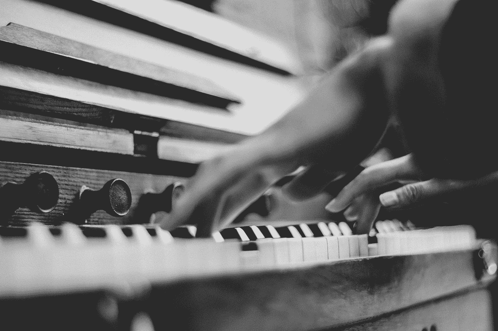
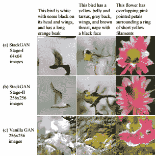

# 贝多芬、毕加索和人工智能

> 原文：<https://towardsdatascience.com/beethoven-picasso-and-artificial-intelligence-caf644fc72f9?source=collection_archive---------7----------------------->

“A low-angle black-and-white shot of a person playing the piano” by [Guang Yang](https://unsplash.com/@seamus?utm_source=medium&utm_medium=referral) on [Unsplash](https://unsplash.com?utm_source=medium&utm_medium=referral)

## 介绍

当人们想到有史以来最伟大的艺术家时，他们可能会想到贝多芬或毕加索这样的名字。没有人会认为电脑是伟大的艺术家。但如果有一天，事实确实如此。计算机能学会画出像蒙娜丽莎这样不可思议的画吗？也许有一天，一个机器人将能够创作下一部伟大的交响乐。一些专家认为是这样的。事实上，人工智能领域一些最伟大的头脑正在努力开发能够独立于人类创作绘画和音乐的程序。人工智能在艺术领域的应用甚至被谷歌等科技巨头所采用。

本文中包含的项目可能会对我们的日常生活产生重大影响。它们还可能改变我们看待艺术的方式。它们还展示了人工智能领域取得的令人难以置信的进步。图像识别并不像研究那样深入。以我们过去伟大艺术家的风格创作音乐的能力也是如此。虽然会涉及到这些主题，但我们将重点关注几个更高级的成就，如文本描述被转化为图像，以及生成完全原创的艺术和音乐。这些项目中的每一个都带来了新的和创新的东西，并向我们展示了艺术空间是如何成为进一步探索人工智能应用的绝佳场所。我们将讨论这些项目中遇到的问题以及如何克服这些问题。人工智能的未来看起来很光明。让我们看看未来会怎样。通过这样做，我们可能能够更好地理解人工智能在一个由人类创造力驱动的领域中可能产生的影响。

## GAN 及其演化形式

机器必须接受教育。他们从指导中学习。我们如何引导机器不去模仿已经存在的东西，并让它们创造新的技术？“没有一个有创造力的艺术家会在今天创造出试图模仿巴洛克风格、印象派风格或任何其他传统风格的艺术，除非他们试图讽刺地这样做”[4]。这个问题也不仅限于绘画。音乐在某些方面非常有条理，但也是一种需要大量创造力的艺术形式。那么我们如何着手解决这样一个问题呢？我们要讨论的第一个概念叫做 GAN(生成对抗网络)。GANs 虽然相当复杂，但正在成为一种过时的模型。如果艺术领域的人工智能要进步，研究人员和开发人员将不得不努力寻找更好的方法，让机器产生艺术和音乐。其中两种方法以[草图的形式呈现——RNN](https://magenta.tensorflow.org/sketch-rnn-demo)和[残(创意对抗网络)](https://arxiv.org/abs/1706.07068)。这些方法都有其优于 GANs 的优点。

首先，让我们探讨一下 GAN 到底是什么。下面是一小段摘录，解释了 GAN 的工作原理:

生成对抗网络有两个子网络，一个生成器和一个鉴别器。鉴别器可以访问一组图像(训练图像)。鉴别器试图区分“真实”图像(来自训练集)和生成器生成的“虚假”图像。生成器试图在看不到图像的情况下生成与训练集相似的图像[4]。

生成器创建的图像越多，就越接近训练集中的图像。这个想法是，在生成一定数量的图像后，GAN 将创建与我们认为的艺术非常相似的图像。至少可以说，这是一个非常令人印象深刻的成就。但是如果我们更进一步呢？

许多与 GAN 相关的问题只是限制了它的功能。GAN 是强大的，但是不能做我们想要的那么多。例如，上述模型中的生成器将继续创建越来越接近提供给鉴别器的图像的图像，它不会生成原创艺术。GAN 可以被训练为与用户一起绘制吗？不太可能。该模型也无法将基于文本的图像描述转化为实际的图片。尽管 GAN 可能令人印象深刻，但我们都同意它可以改进。提到的每一个缺点实际上已经被处理，并且在一定程度上被解决。让我们看看这是如何做到的。

[Sketch-RNN](https://magenta.tensorflow.org/sketch-rnn-demo) 是 Google 开发的递归神经网络模型。素描 RNN 的目标是帮助机器学习以类似人类学习的方式创造艺术。它已经被用于谷歌人工智能实验，能够与用户一起绘制草图。在这样做的同时，它可以为用户提供建议，甚至在用户决定休息一下时完成用户的草图。Sketch-RNN 接触到了大量的草图，这些草图是通过一组矢量图提供的，这些矢量图是通过另一个谷歌应用程序获得的，我们将在后面讨论。每一个草图都有标签，让程序知道草图中的物体是什么。数据集将草图表示为一组笔画。这使得素描 RNN 然后了解某个物体的每个素描有什么共同点。如果用户开始画一只猫，素描 RNN 就可以向用户展示这只猫的其他共同特征。这个模型可以有许多新的创造性应用。“在各种课程上训练的纯解码器模型可以通过建议完成草图的许多可能的方法来帮助艺术家的创作过程”[3]。Sketch-RNN 团队甚至认为，给定一个更复杂的数据集，这些应用程序可以在教育意义上用于教用户如何绘画。单独使用 GAN 无法轻松实现草图 RNN 的这些应用。

另一种用于改进 GAN 的方法是创造性的对抗网络。在他们关于对抗性网络产生艺术的论文中，一些研究人员讨论了一种通过易拉罐产生艺术的新方法。这个想法是，CAN 有两个对手网络。一个是生成器，它无法接触到任何艺术。在生成图像时，它没有任何基础。另一个网络，鉴别器，被训练来将生成的图像分类为艺术或非艺术。生成图像时，鉴别器向生成器提供两条信息。第一个问题是，它是否认为生成的图像与它接受训练的艺术作品来自同一个发行商，另一个问题是，鉴别器如何将生成的图像归入它所学习的艺术类别之一。这种技术是神奇的，因为它帮助生成器创建图像，这些图像既可以模仿过去的艺术作品，因为它学习了这些图像的优点，又具有创造性，因为它被教导产生新的不同的艺术概念。这与甘模仿训练图像的艺术创作有很大的不同。最终，CAN 将学会如何只生产新的和创新的艺术品。

香草甘的最后一个未来是堆栈甘。StackGAN 是一个从文本到照片的逼真图像合成器，它使用堆叠式生成对抗网络。给定文本描述，StackGAN 能够创建与给定文本非常相关的图像。这对于正常的 GAN 模型来说是不可行的，因为即使使用最先进的训练数据库，从文本描述中生成照片级的图像也是非常困难的。这就是 StackGAN 的用武之地。它把问题分成两部分。“低分辨率图像由我们的第一阶段 GAN 生成。在第一阶段 GAN 的顶部，我们堆叠了第二阶段 GAN，以根据第一阶段结果和文本描述生成逼真的高分辨率图像”[7]。正是通过对第一阶段结果和文本描述的调节，第二阶段 GAN 可以发现第一阶段 GAN 可能遗漏的细节，并创建更高分辨率的图像。通过将问题分解成更小的子问题，StackGAN 可以解决常规 GAN 无法解决的问题。下一页的图片展示了常规 GAN 和 StackGAN 每一步的区别。

This image came from the StackGAN paper [7].

正是通过近年来取得的这些进步，我们可以继续推动人工智能的发展。我们刚刚看到了改进一个已经相当复杂和创新的概念的三种方法。这些进步中的每一项都有实际的、日常的用途。随着我们不断改进人工智能技术，我们将能够做越来越多的事情，不仅仅是艺术和音乐，而是各种各样的任务来改善我们的生活。

## DeepBach、Magenta 和 NSynth

然而，图像并不是人工智能能够影响的唯一艺术类型。正如我们所说，它对音乐的影响正在被探索。我们现在将探讨一些具体案例及其对音乐和人工智能的影响。在这样做的时候，我们应该能够看到艺术如何为人工智能做同样多的事情。这两个领域都从我们在这里探索的项目类型中受益匪浅。

机器能够创作出像约翰·塞巴斯蒂安·巴赫这样的音乐吗？在一个名为[德普巴赫](https://github.com/Ghadjeres/DeepBach)的项目中，几名研究人员试图创作类似巴赫合唱曲的作品。DeepBach 的美妙之处在于它“能够生成连贯的音乐短语，并提供，例如，旋律的各种重新和声，而不会抄袭”[6]。这意味着什么，DeepBach 可以创造结构正确的音乐，是原创的。这正是巴赫的风格。这不仅仅是他作品的混搭。DeepBach 正在创造新的内容。DeepBach 的开发者继续测试他们的产品是否真的能愚弄听众。

作为实验的一部分，超过 1250 人被要求投票决定展示给他们的作品是否确实是巴赫创作的。受试者有不同程度的音乐专长。结果显示，随着 DeepBach 复杂性模型的增加，受试者在区分巴赫的合唱曲和 DeepBach 的合唱曲时会遇到越来越多的困难。这个实验向我们表明，通过使用人工智能和机器学习，完全有可能以伟人的形象再造原创作品。但这是人工智能在艺术和音乐领域的极限吗？

DeepBach 取得了一些在不久前闻所未闻的成就，但这肯定不是人工智能在音乐领域所能做的最大贡献。如果我们想创造新的和创新的音乐呢？也许人工智能可以一起改变音乐创作的方式。肯定有项目做得更多来突破极限。事实上，这正是 Magenta 背后的团队所要做的。

Magenta 是谷歌大脑团队正在进行的一个项目，由 Douglas Eck 领导。埃克自 2010 年以来一直在谷歌工作，但这并不是他对音乐兴趣的开始。埃克帮助建立了大脑音乐和声音，一个大脑、音乐和声音研究的国际实验室。他还参与了麦吉尔音乐媒体和技术跨学科研究中心的工作，并且是蒙特利尔大学计算机科学的副教授。

Magenta 的目标是成为“一个研究项目，推进音乐和艺术生成的机器智能的艺术状态”[2]。它是一个使用 TensorFlow 的开源项目。Magenta 的目标是学习如何以一种真正可生成的方式生成艺术和音乐。它必须超越仅仅模仿现有的音乐。这与 DeepBach 的项目截然不同，DeepBach 试图以一种不抄袭现有音乐的方式模仿现有音乐。Eck 和他的公司意识到，艺术就是捕捉惊喜的元素，并吸引人们对某些方面的注意。“这带来了或许是最大的挑战:将世代、关注和惊喜结合起来，讲述一个引人入胜的故事。如此多的机器生成的音乐和艺术在小块中是好的，但缺乏任何种类的长期叙事弧”[2]。这种观点赋予了电脑生成的音乐更多的内容，并帮助它变得不那么噱头。

magenta 团队开发的项目之一叫做 [NSynth](https://nsynthsuper.withgoogle.com/) 。NSynth 背后的想法是能够创造前所未有的新声音，但除此之外，重新想象音乐合成是如何完成的。与普通合成器专注于“振荡器的特定排列或样本回放的算法，如 FM 合成或粒度合成”[5]不同，NSynth 在个体层面上生成声音。为此，它使用深度神经网络。谷歌甚至推出了一项实验，让用户真正看到 NSynth 可以做什么，让他们将现有乐器的声音融合在一起，创造出前所未有的新混合声音。例如，用户可以使用两种乐器，如班卓琴和大号，并提取它们声音的一部分来创建一种全新的乐器。该实验还允许用户决定每种仪器的使用比例。

像 Magenta 这样的项目向我们展示了人工智能在创作音乐方面的全部能力。他们探索人工智能的新应用，可以独立于人类产生新的想法。这是我们最接近机器创造力的阶段。虽然机器还不能真正思考和表达创造力，但它们可能很快就能产生新的独特的艺术和音乐供我们欣赏。不过不要担心。Eck 不打算用 AI 取代艺人。相反，他希望为艺术家提供以全新方式创作音乐的工具。

## 深梦且快，画！

当我们展望人工智能在艺术领域被用来实现新的和创新的想法的更多方式时，我们看着像[这样的项目快速，绘制！](https://quickdraw.withgoogle.com/)和[深梦](https://deepdreamgenerator.com/)。这些项目展示了该领域的惊人进展，同时指出了人工智能研究人员在未来几年必须解决的一些问题。

[快，画！](https://quickdraw.withgoogle.com/)是来自谷歌创意实验室的一个应用程序，被训练来识别快速绘图，就像人们在猜字谜游戏中看到的一样。该程序可以根据之前给它的许多图片的共同点来识别简单的物体，如猫和苹果。虽然程序不会每次使用时都得到正确的图片，但它会继续从绘制的图片和之前的数百张图片中学习相似之处。

快，画背后的科学！“使用了一些帮助谷歌翻译识别你的笔迹的技术。要理解笔迹或图画，你不能只看这个人画了什么。你看看他们实际上是怎么画出来的”[1]。它以游戏的形式呈现，用户画出应用程序选择的对象的图片。然后程序有 20 秒的时间来识别图像。在每个会话中，用户总共有 6 个对象。这些图像然后被存储到用于训练应用的数据库中。这恰好是我们之前在草图-RNN 应用程序中看到的同一个数据库。这种图像识别是人工智能在艺术和音乐领域的一个非常实际的应用。它可以在日常生活中给我们带来很多好处。但这仅仅开始触及人工智能在该领域所能做的事情的表面。尽管这非常令人印象深刻，但我们可能会指出，该应用程序并没有真正理解正在绘制的内容。它只是发现了一些模式。事实上，这种区别是简单的 AI 技术和真正的人工通用智能之间的差距的一部分。真正理解图像中的物体是什么的机器似乎不会在不久的将来出现。

艺术领域另一个有趣的项目是[谷歌的 Deep Dream](https://deepdreamgenerator.com/) 项目，该项目使用 AI 来创建新的独特的图像。不幸的是，深度梦生成器团队不会对技术本身进行太多的细节描述(主要是担心对于一封电子邮件来说太长了)[8]。然而，他们解释了卷积神经网络是在著名的 ImageNet 数据集上训练的。这些神经网络然后被用来创建艺术般的图像。本质上，深度梦采用一个图像的样式，并用它来修改另一个图像。结果可以是任何东西，从愚蠢的融合到艺术杰作。当程序识别用户提供的图像的独特样式并将这些样式强加到用户提供的另一个图像上时，就会发生这种情况。通过使用 Deep Dream 可以很容易地观察到，计算机还没有能力真正理解它们在艺术方面做了什么。它们可以被输入复杂的算法来生成图像，但并不从根本上理解它们正在生成什么。例如，计算机可能看到一把刀正在切一个洋葱，并假设刀和洋葱是一个物体。缺乏真正理解图像内容的能力是研究人员尚未解决的一个难题。

也许随着我们在人工智能方面的不断进步，我们将能够拥有真正理解图像中的对象以及它们的音乐所唤起的情感的机器。实现这一目标的唯一途径是达到真正的人工智能(AGI)。与此同时，深度梦团队相信，生成模型将能够创造出一些真正有趣的艺术作品和数字内容。

## 我们将何去何从？

在这一部分，我们将考虑人工智能在艺术领域的发展方向。我们将看看人工智能是如何影响这个领域的，以及它能以何种方式继续这样做。我们也将关注艺术和音乐在未来几年继续影响人工智能的方式。

虽然我不认为我们已经完全掌握了模仿过去伟大艺术家的能力，但这个问题的解决只是时间问题。真正需要解决的任务是在艺术和音乐上创造新的创新。我们需要朝着没有模仿的创造方向努力。很明显，我们正通过 CAN 和 Magenta 等项目朝着这个方向前进。人工通用智能(AGI)并不是完成这项任务的唯一途径。事实上，即使那些质疑 AGI 的可能性的人也很难质疑由一台机器创造出独特的艺术作品。

通过人工智能进一步提高艺术和音乐的一条途径是创建更先进的数据集，用于训练复杂的网络，如素描 RNN 和深度梦。人工智能需要经过训练才能达到预期的性能。这种训练对我们获得的结果有着巨大的影响。难道我们不应该尽可能以最有益的方式训练我们的机器吗？即使开发像 Sketch-RNN 这样的软件来使用《深度梦境》中使用的 ImageNet 数据集，也可能会在教育艺术家绘制复杂、逼真图像的技术方面发挥巨大作用。复杂的数据集很可能是我们更有效训练的答案。在我们的机器能够像我们一样思考和学习之前，我们需要非常小心使用什么数据来训练它们。

艺术和音乐可以帮助影响人工智能的方式之一是提供另一种图灵测试机器的方法。对于那些梦想创造 AGI 的人来说，有什么更好的方法来测试机器的能力，以创造出测试人类创造力的东西呢？艺术是人类创造力最真实的表现。事实上，这就是它的本质。尽管艺术可能不是人工智能的终极目标，但它可能是测试机器能力极限的最佳方式之一。有一天，计算机可以创作原创音乐作品，并根据用户的描述创建图像，这很可能就是我们无法区分人和机器的那一天。

## 结论

在音乐领域使用人工智能有很多好处。其中一些已经在我们目前讨论的项目中出现过。我们已经看到了人工智能如何用于图像识别，以及它们将我们的话语转化为精彩图像的能力。我们也看到了人工智能如何被用来合成从未听过的新声音。我们知道，人工智能可以用来与我们一起创作艺术，也可以独立于我们之外。它可以被训练来模仿过去的音乐，并且可以创造新的想法。所有这些成就都是推动人工智能研究走向未来的一部分。谁知道呢？也许有一天，我们将实现人工智能，机器将能够理解它所获得的图像中的真实内容。也许我们的计算机能够理解他们的艺术带给我们的感受。有一条清晰的道路告诉我们从这里去哪里。我坚信，无论是在艺术领域还是在我们的日常生活中，我们都应该继续这项研究，并测试人工智能的极限。

## 参考

1.  开发者，谷歌。(2016 年 11 月 15 日)。人工智能实验:快，画！美利坚合众国。
2.  Eck，D. (2016 年 6 月 1 日)。欢迎来到 Magenta！从品红色检索:【https://magenta.tensorflow.org/welcome-to-magenta 
3.  埃克博士和哈博士(2017 年)。*素描的神经表征。* eprint arXiv:1704.03477。
4.  埃尔加马尔，a .，刘，b .，埃尔霍塞尼，m .，&马佐尼，M. (2017)。CAN:通过学习风格和偏离风格规范来产生“艺术”的创造性对立网络。
5.  恩格尔、雷斯尼克、罗伯茨、迪耶曼、埃克、西蒙扬和诺鲁齐(2017)。*用 WaveNet 自动编码器对音符进行神经音频合成。eprint arXiv:1704.01279。*
6.  Hadjeres，g .，Pachet，f .，和 Neilsen，F. (2016 年)。 *DeepBach:巴赫合唱曲生成的可控模型。* eprint arXiv:1612.01010。
7.  黄，陈，李，黄，，王，徐，张，张，张(2016)。 *StackGAN:利用堆叠式生成性序列网络进行文本到照片级的图像合成。* eprint arXiv:1612.03242。
8.  团队，D. D. (2017 年 9 月 22 日至 25 日)。电子邮件。(c .卡拉希基，采访者)