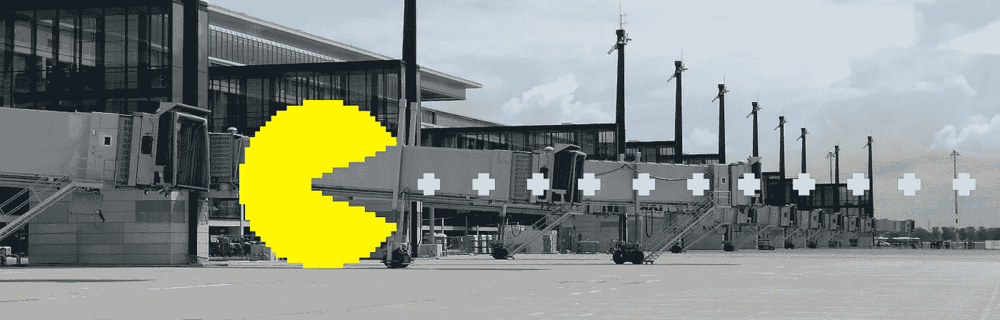
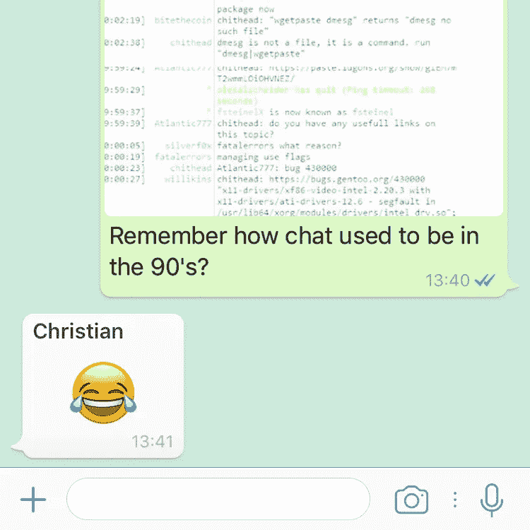
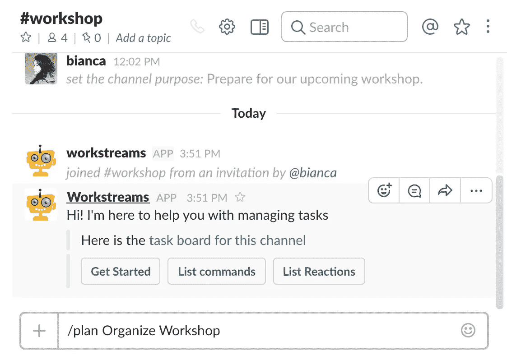
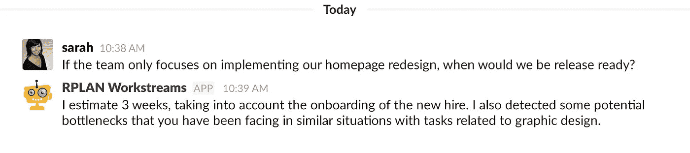
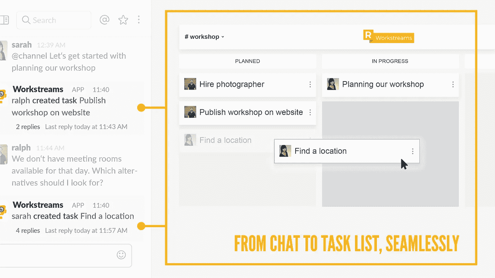

# 在人工智能接管我们的工作之前，它会组织我们的工作。

> 原文：<https://towardsdatascience.com/before-artificial-intelligence-takes-over-our-jobs-it-will-organize-our-work-7de8f2bac24d?source=collection_archive---------1----------------------->

## 用不了多久，人工智能就能比人类更好地预测项目的成功。

2012 年 5 月，离正式日期还有 4 周，柏林新国际机场的启用被宣布将再推迟几周。几周变成了几个月，几个月变成了几年。对其实际开放的最新预测是 2018 年底。

## 项目的计划进度和实际进度之间存在巨大的不匹配。

当一个项目像柏林机场一样被戏剧性地延迟时，这显然是一个以上问题的结果。然而，这个大型项目分享了许多项目延迟或失败的大多数常见原因:沟通不畅、不切实际的时间估计和政治游戏，这些甚至可能超过最精心的规划和过程。

## 新技术为重新思考项目管理奠定了基础。

几年前在科技公司开始的事情现在正在冲击主流业务:聊天取代电子邮件。WhatsApp、微信和 Messenger 向普通公民介绍了即时通讯的优势。它们为 Slack 等面向商业的聊天解决方案铺平了道路，Slack 结合了 IRC 等老派聊天应用的强大功能和现代移动通讯应用的易用性。Slack 正在被初创公司广泛采用，微软现在正在将其等效的 Teams 应用程序推向更保守的市场。

这个新时代的到来也为项目管理软件开辟了新的可能性:加上目前在机器学习方面取得的进步，新的聊天技术为项目管理人工智能的发展奠定了基础。

## 这一切都始于范式的转变。

在这场定义新标准的竞赛中，候选人之一是一款名为[工作流](https://www.workstreams.ai/?ref=mediumai)的 Slack 应用。这是第一款完全基于 Slack 聊天基础设施的项目管理软件。传统的项目管理软件被设计成所有计划和沟通的中心，而工作流团队采取了不同的方法:他们将公司现有的沟通渠道视为工作协调的真正中心。流程和工具必须包含这些渠道，因此要嵌入其中。Workstreams 的产品经理 Christian Bick 指出了这种范式转变如此重要的原因:

> 为了做出准确的预测并给出有意义的见解，软件必须成为我们交流渠道的积极参与者。这样，it 可以了解团队成员和项目合作伙伴之间的信息流动。

## AI 会首先改善我们的沟通，然后纠正我们的乐观主义倾向。

这是有道理的:没有人能够跟踪一个项目中交换的所有信息。然而，计算机是监控通信的大师，在未来，这正是他们要做的。机器还没有必要达到人类的理解水平；重要的是知道谁在什么时候分享信息，分享什么主题的信息。这些知识已经足以在合作者之间的沟通不畅发展成昂贵的问题之前识别出它。人工智能不仅会检测这类问题，还会提出解决问题的措施。

人工智能将负责对项目进度做出更准确的估计。对项目信息流进行建模可用于项目的特征描述和分类。为了做出精确的预测，人工智能需要从成千上万的参考项目中学习。这些项目中的沟通结构将在人工智能的训练中发挥主导作用。

## 房间里有一头大象！就在那里！

即使人工智能与我们的数字对话相结合，它仍然会错过我们作为人类的主要交流方式。如果不是大部分的话，很多重要的信息交流是在离线的面对面的会议中进行的。工作流团队提出了一个简单的策略来解决这个问题:

> 人工智能不需要亲自出席会议来了解已经交换的信息。它真正需要知道的是会议召开了，谁参加了会议。随着数字日历已经成为标准，这是微不足道的。

关于会议时间和参与者的信息已经在网上发布了。如果会议的议程和结果没有以数字方式发布，那么人工智能无论如何都会引起注意，因为它负责确保信息共享。无论如何，由于最近在录音和识别方面的创新，计算机已经开始被整合到物理会议中。

## 欢迎你的新团队成员——这不完全是约翰·克立斯

那么，当这一愿景成为现实时，经理们会担心自己的工作吗？尽管计算机在生成预测和见解方面将比人类更好，但有一样东西是人工智能在很长一段时间内都不会具备的:理解人类关系独特性的能力。评估人工智能的发现，并把这些建议放到一个更大的背景下，仍然是团队和经理的责任。工作流团队考虑的是劳动力的分配:

> 我们的目标是为今天的团队增加一名有价值的成员——一名在沟通和评估方面具有独特技能的成员。不过，不要指望你的新伴侣会过于有创造力和风趣。那是人类的工作。也是最重要的一个。

How things might soon look.

目前，所有这一切都只是一个愿景。工作流团队仍然忙于做好基础工作。今天看起来很奇特的任务管理应用程序可能很快会变成项目管理的一场革命。

Workstreams current Slack integration and web interface

## 柏林机场还有希望。

智能软件已经存在，并将越来越多地出现在日常生活中。自动驾驶汽车已经在我们家门口了。迟早，同样的技术会集成到我们的数字协作工具集中，并增强我们的工具集。这些进步绝对值得关注。尤其是当你计划去柏林旅行的时候。