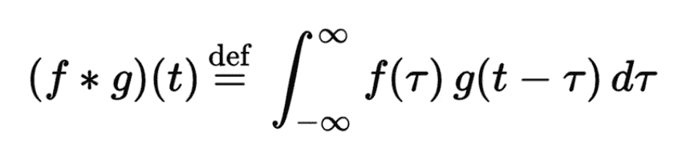
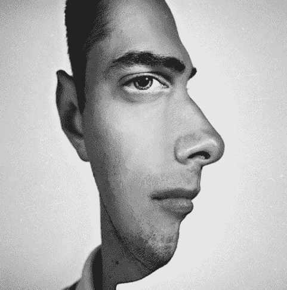
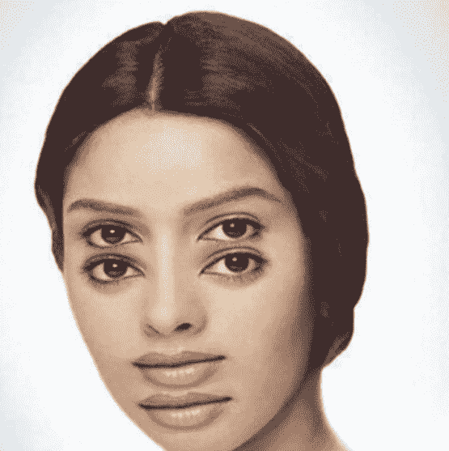
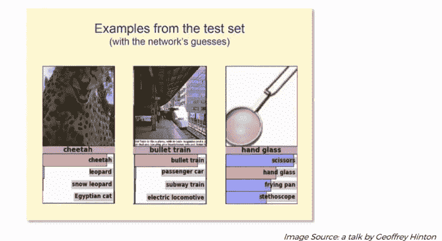
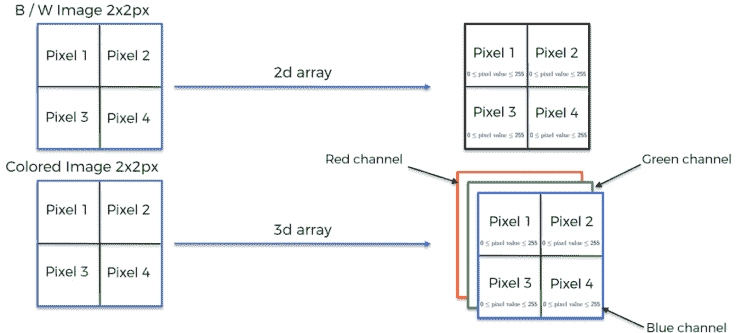

# 卷积神经网络初学者指南

> 原文：<https://towardsdatascience.com/beginners-guide-for-convolutional-neural-network-cnn-convnets-5a5e725ea581?source=collection_archive---------16----------------------->

到现在为止，你可能知道机器学习，这是计算机科学的一个分支，研究可以学习的算法的设计。深度学习是机器学习的一个子领域，它受到人工神经网络的启发，而人工神经网络又受到生物神经网络的启发。卷积神经网络非常类似于具有可学习权重和偏差的普通神经网络。在神经网络中，卷积神经网络主要应用于图像识别、图像分类、物体检测、人脸识别等。

# 卷积是什么意思？

卷积来自拉丁语 convolvere，“to convolve”的意思是卷在一起。卷积是对两个函数(f 和 g)进行数学运算，以构造第三个函数，该函数表示一个函数的形状如何被另一个函数修改。它是计算两个函数重叠程度的积分。假设卷积是通过将两个函数相乘来组合它们的一种方式。

*"绿色曲线显示蓝色和红色曲线的卷积，作为 t 的函数，垂直绿线表示位置。灰色区域表示作为 t 的函数的如下所示的乘积，因此它作为 t 的函数的面积正好是卷积。”*

如果用 CNN 的话，对输入图像进行的操作是特征检测器/内核/过滤器和特征映射。

# 我们的大脑是如何对一幅图像进行分类的！

每当我们看到一幅图像，我们的大脑就会寻找图像中的特征来对图像进行分类。我们通过识别特征来对事物进行分类。为了证明这一点，这里有两个图像，我们将分类:

A two-faced man!

在上面的图像中，如果我们看向图像的右侧，我们会看到一个人朝右侧看，而如果我们看向中间，我们会感觉到那个人正朝我们看。

我们的大脑在识别这些不同的场景时会不会很挣扎，会不会对这个人是向右看还是朝我们看感到困惑？
发生这种情况是因为我们的大脑研究图像中的特征，然后假设应该采取什么。

考虑另一个图像:

A young girl or an old lady?

上图描绘了一个小女孩看着别处，一个老太太头上戴着围巾向下看。迷茫？图像是为了迷惑你而创建的！

# 如果特征不清晰，像这样呢？

Dazzling face!

我们是不是有点眼花缭乱？你的大脑能够决定什么是正确的吗？
不！这是因为描述的特征不足以帮助大脑对它们进行分类。

所有上述图像都是为了理解我们的大脑根据它所看到的图像的特征来运作，然后对其进行相应的分类。

神经网络以类似的方式工作。我们可以在下图中看到，神经网络已经成功地将猎豹和子弹列车分类，但在预测手玻璃方面却不成功。这是因为图像中的特征不清楚。

简而言之，神经网络的工作方式与人类思维完全一样。

# 计算机是如何看到图像的？

How computer sees an image!

众所周知，图像是像素的矩阵。如果有一个黑白图像，那么我们将得到一个 2D 阵列。然而，如果我们传递一个彩色图像，那么我们将得到一个 3D 数组，这意味着它有一个额外的深度参数，即 RGB 通道，如下所示。像素值介于 0 和 255 之间，图像以字节(0 到 255)存储。

How images are converted in arrays!

# 总结:

我们已经讨论了什么是 CNN，以及如何根据图像中的特征对图像进行解释和分类。细胞神经网络在图像和视频识别、推荐系统和自然语言处理中有着广泛的应用。

在下一篇博客中，你会发现关于卷积运算和 ReLU 层的概念。在那之前，继续学习。

如果您有任何疑问或建议，可以在下面留言:)

# 参考资料:

1.  [https://skymind.ai/wiki/convolutional-network#tensors](https://skymind.ai/wiki/convolutional-network#tensors)
2.  http://mathworld.wolfram.com/Convolution.html
3.  [https://medium . com/@ RaghavPrabhu/understanding-of-convolutionary-neural-network-CNN-deep-learning-99760835 f148](https://medium.com/@RaghavPrabhu/understanding-of-convolutional-neural-network-cnn-deep-learning-99760835f148)
4.  [https://medium . com/technology made easy/the-best-explain-of-convolutionary-neural-networks-on-the-internet-fbb 8 B1 ad 5d F8](https://medium.com/technologymadeeasy/the-best-explanation-of-convolutional-neural-networks-on-the-internet-fbb8b1ad5df8)