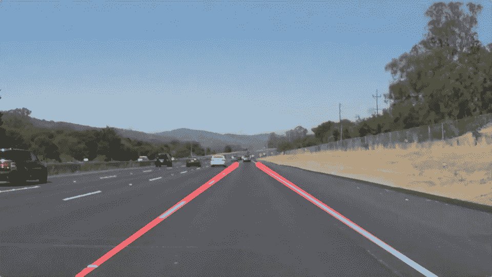
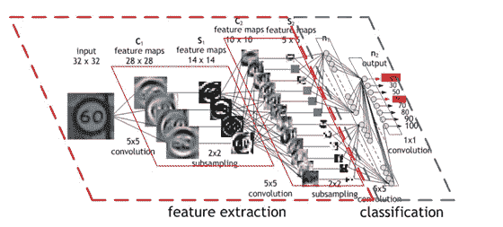
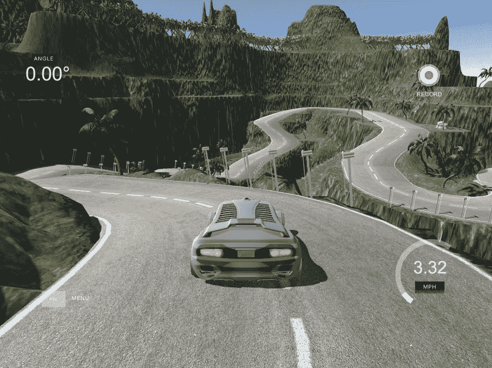
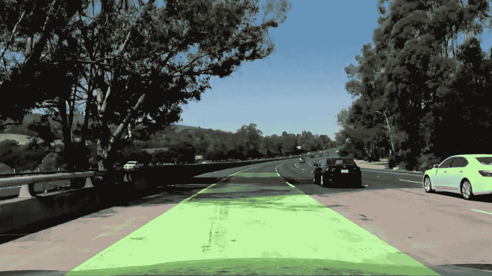
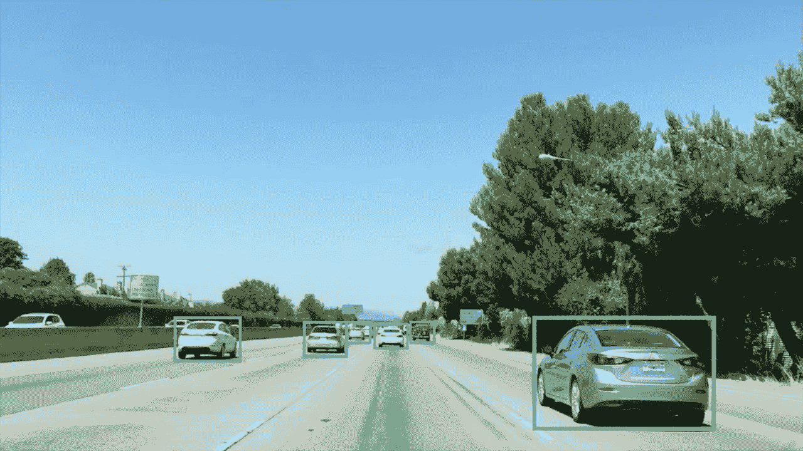

# 从自动驾驶汽车开始我的旅程

> 原文：<https://towardsdatascience.com/beginning-my-journey-in-self-driving-car-udacity-nano-degree-a39d898658a2?source=collection_archive---------0----------------------->

在开始我的 SDC 纳米学位之旅之前，给你一点我自己的背景，我是 SDC 纳米学位的学生(2016 年 12 月队列)。我在机器学习、深度学习和 web 应用程序开发方面有大约 5 年以上的经验。我总是对技术充满热情，对其积极的进步充满好奇。随着交通行业经历一场革命(从化石燃料转向电动和自动驾驶)，人工智能正在发挥重要作用，我真的很有兴趣成为这场革命的一部分。而我的旅程是从 Udacity 的自动驾驶汽车纳米学位课程开始的。

那么，我为什么选择这门课呢？正如我之前提到的，我已经在从事机器学习和深度学习，但是我没有对端到端系统(即硬件、软件和环境)有一个整体的想法。然后我就把这个课程的内容过了一遍，真的是在履行我的要求。

让我们从我的项目经历开始吧。

**项目-1 车道检测**

Lane detection using opencv

**经历:**

这是 SDC 纳米学位的第一个项目。在这里，我们将让汽车学习在道路上向何处行驶。我们必须找到道路上的车道线，使汽车安全行驶。这个项目是用 python 和 opencv 实现的。

在车道线检测期间，我在这个项目中面临的挑战如下:

1.  不同道路的车道线颜色不同
2.  线路并不总是完全连接的
3.  线条的曲率在不同的条件下也不同
4.  在许多情况下，道路的照明条件也会发生变化

**外卖:**

1.  使用 opencv 学习并实现了不同的计算机视觉技术
2.  对图像应用不同的颜色变换
3.  应用 canny 边缘检测算法寻找边缘
4.  利用霍夫变换从 Canny 边缘检测直线

**项目-2 使用深度学习的交通标志分类**

Deep Convolutional Neural Network Architecture for Traffic sign Classification

**体验:**

这个是第一学期的第一个深度学习项目。因为我已经进入了深度学习，所以对深入研究这个项目感到非常兴奋。我的网络由两个卷积层和两个全连接层组成。深度神经网络需要大量的训练数据和大量的参数调整。因此，训练一个深度神经网络更像是艺术而不是科学/工程。经过几次实验，我终于冻结了我的网络。

我对这个项目的观察和收获如下:

1.  首先，我尝试了一个深度神经网络(没有卷积)，它在一定程度上起作用，但不是实时场景。
2.  当汽车在非常复杂的环境中行驶在道路上时，所有的交通标志都不是清晰可见的。有时它们被遮挡或者能见度不清等等..
3.  在这种情况下，为了处理遮挡、平移变化和部分可见性，简单的深度神经网络不够健壮。
4.  卷积层来了。卷积层相对于其他层的优势是参数共享。当滤波器在图像上卷积时，它试图捕捉图像的所有可能的特征。这有助于通过每层中不同的过滤器组来学习图像的所有不同特征。这带来了特征学习和分类的鲁棒性。
5.  学习速率和正则化对学习也有重要作用。学习速率的衰减和对正确层的权重的调整提高了模型的性能。同样，这是一门艺术，在可视化每一层的输出后，微调你的学习率和正规化。

**项目-3 使用深度学习的行为克隆**

**经历:**

这是深度学习的第二个也是最后一个项目，目标是在赛道上安全驾驶汽车(预测转向角)。我真的很享受在这个项目中度过的时光。从很多方面来说，这都是一次很棒的理论和实践学习经历。分享详情如下:

1.  数据收集是任何深度学习任务中最重要的任务之一。使用模拟器收集数据很有趣。然而，这是一项耗时的任务，因为深度神经网络是贪吃的。Udacity 通过发布这个项目的 dataset 成为了救世主。
2.  学习 keras 让我的生活变得轻松，因为它去掉了锅炉板代码。Keras 是在 Theano 和 Tensoflow 之上的高级深度学习框架。在 keras 中开发一个深度神经网络真的很容易，因为它简单而抽象。
3.  数据扩充在为模型带来变化以及模型性能的稳健性方面具有重要作用。我学到了许多不同的数据增强技术及其在训练模型中的重要性。很少经常使用的是剪切，裁剪，翻转和改变亮度。
4.  迁移学习确实推动了人工智能的快速发展。我更愿意强调迁移学习是培训的第一阶段，在实际培训开始之前，我们将已经学到的特性引入到我们的模型中。
5.  我的网络灵感来自英伟达论文[http://images . NVIDIA . com/content/tegra/automotive/images/2016/solutions/pdf/end-to-end-dl-using-px . pdf](http://images.nvidia.com/content/tegra/automotive/images/2016/solutions/pdf/end-to-end-dl-using-px.pdf)
6.  选择正确的激活函数对于训练神经网络至关重要。在这里，我选择了 ELU，而不是雷鲁。ELU 激活提供了与 RELU 相同的对消失梯度的保护，此外，ELU 具有负值，这允许它们将平均激活推向更接近零，从而提高梯度下降的效率。
7.  辍学。不要小看这个。我在这里的直觉是，辍学可能并不适合回归问题中的每一层。在分类问题中，我们只关心相对于另一个类的软最大概率，所以即使丢失影响了最终值，也没有关系，因为我们只关心相对于其他类的值。对于回归，我们关心最终值，所以退出可能会有负面影响。为了避免这种困境，我在全连接层中选择了 l2 正则化。

我的行为克隆体验真的很令人满意。

**项目-4 超前车道检测**

Lane detection using opencv

**经历:**

这是第一学期的第四个项目。这里我们使用 opencv 来寻找车道。在这个项目中，有机会学习许多使用 opencv 的计算机视觉技术。

1.  失真校正对于在图像中找到正确形状和外观的对象具有重要作用。
2.  正在实施摄像机标定和畸变校正，以使物体的几何形状一致。
3.  透视变换为我们提供了一种自上而下查看所有曲率的方法。
4.  其他技术，如梯度大小和梯度方向的梯度阈值也是这个项目的一个收获。
5.  不同的颜色空间和颜色阈值具有梯度，具有在图像中找到对象的作用。
6.  滑动窗口搜索来找到图像中的对象是我的另一个收获。

然而，我对这个项目的体验并不那么令人满意。我未来的工作范围将涉及使用深度学习来实现相同的项目。

**项目-5 车辆检测与跟踪**

vehicle detection using svm and opencv

**体验:**

这是第一学期的最后一个项目。这个项目的目标是使用 HOG 和支持向量机结合滑动窗口搜索来检测车辆。虽然我已经用上面的方法实现了这一点，但我对实现的健壮性并不满意。

我肯定会选择车辆检测的深度学习方法。许多先进的架构，如 fast-rcnn、YOLO、SSD，在各个方面都优于其他传统的对象检测方法。

**致谢:**

我要感谢 udacity 的所有相关人员。我还要感谢 [Shreyas Gite](https://medium.com/u/47216364aba9?source=post_page-----a39d898658a2--------------------------------) (导师) [Vivek Yadav](https://medium.com/u/b783495cc56b?source=post_page-----a39d898658a2--------------------------------) ， [Dhruv Parthasarathy](https://medium.com/u/aee4aaf6b79a?source=post_page-----a39d898658a2--------------------------------) ， [Oliver Cameron](https://medium.com/u/fd8bc37755d8?source=post_page-----a39d898658a2--------------------------------) ， [David Silver](https://medium.com/u/8190c86ea791?source=post_page-----a39d898658a2--------------------------------) 以及其他许多人的真知灼见，帮助我完成了 SDC 大学第一学期的课程。

***保持饥饿，保持愚蠢..***

史蒂夫·乔布斯

对于代码库和其他查询，请通过下面的链接联系我。

 [## ashispapu (Ashis Samal)

### ashispapu 有 288 个存储库。在 GitHub 上关注他们的代码。

github.com](https://github.com/ashispapu/)  [## Ashis Samal | LinkedIn

### 用人工智能构建下一代产品

www.linkedin.com](https://www.linkedin.com/in/ashissamal/)  [## Ashis Samal (@ashis_samal) |推特

### Ashis Samal 的最新推文(@ashis_samal)。想象，通过…为社会的积极变化而努力

twitter.com](https://twitter.com/ashis_samal) 

为第二学期做好准备:)