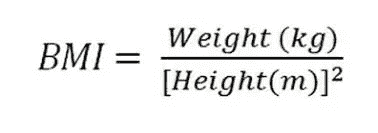

# 开始走数据科学之路(上) :熊猫系列

> 原文：<https://towardsdatascience.com/beginning-to-walk-the-data-science-road-part-1-pandas-series-920e2237c336?source=collection_archive---------10----------------------->


Photo by [Jordan Rowland](https://unsplash.com/@yakimadesign?utm_source=medium&utm_medium=referral) on [Unsplash](https://unsplash.com?utm_source=medium&utm_medium=referral)

既然我们已经迈出了数据科学的第一步，

[](/first-step-in-data-science-with-python-numpy-5e99d6821953) [## Python 数据科学的第一步— NumPy

### 我读到过学习的最好方法是写博客。因为我学习数据科学已经有一段时间了…

towardsdatascience.com](/first-step-in-data-science-with-python-numpy-5e99d6821953) 

让我们继续沿着这条路走下去，探索周围的世界。在本帖中，我们将寻求解决更多的问题，这次使用的是**熊猫**。这将是一个两部分的系列，有趣的是，第一部分是关于**系列**。

# 熊猫？


Photo by [Damian Patkowski](https://unsplash.com/@damianpatkowski?utm_source=medium&utm_medium=referral) on [Unsplash](https://unsplash.com?utm_source=medium&utm_medium=referral)

不，不是动物。虽然刚开始学的时候真的以为是以动物命名的。这并不奇怪，因为这种语言本身就是以一种蛇命名的。也许 Python 生态系统只是对动物有一种爱。后来我才知道，这种语言实际上是以[巨蟒剧团的](http://effbot.org/pyfaq/why-is-it-called-python.htm)命名的，熊猫与功夫熊猫没有任何关系。尽管一旦你掌握了熊猫，你就可以在数据科学方面下功夫。

当我知道熊猫实际上是“盘”的意思时，我明白了很多。因为这就是我们在熊猫身上遇到的一切。我们有一些以表格结构排列的数据，我们使用不同的方法和属性来分析这些数据。如果你熟悉结构化查询语言(SQL)，你会发现数据的组织方式有很多相似之处。如果没有，也不用担心。只是按行和列排列的数据。

根据[文档](http://pandas.pydata.org/pandas-docs/stable/)，pandas 是一个 Python 包，它提供了快速、灵活和富有表现力的数据结构，旨在使处理“关系”或“标签”数据变得既简单又直观。Pandas 有两个主要的数据结构——一维的**系列**和二维的**数据帧**。在这一部分中，我们将查看系列，然后在下一部分中以此为基础来理解数据框架。

## 让我们编码

你可以在下面的链接中找到这篇文章的完整代码。

[](https://github.com/bajracharya-kshitij/pandas) [## bajracharya-kshi tij/熊猫

### GitHub 是人们构建软件的地方。超过 2800 万人使用 GitHub 来发现、分享和贡献超过…

github.com](https://github.com/bajracharya-kshitij/pandas) 

代码使用 Python3 和安装了 [anaconda](https://anaconda.org/) 的熊猫。见[此处](http://pandas.pydata.org/pandas-docs/stable/install.html)如何安装熊猫。

像往常一样，第一步是导入我们将要使用的包。所以，还是进口熊猫吧。

```
import pandas as pd
```

这里 **pd** 是 pandas 的别名，今后将用于访问 pandas 包中的方法和属性。

## 问题出在哪里？

随着 pandas 的安装和导入，我们已经准备好正式定义我们要在这里解决的问题。

# 问题

给你 5 个人的身高(英寸)和体重(磅)，如下表所示:

```
+--------+--------------+-------------+
| Person | Height(inch) | Weight(lbs) |
+--------+--------------+-------------+
| A      |           72 |         186 |
| B      |           69 |         205 |
| C      |           70 |         201 |
| D      |           62 |         125 |
| E      |           57 |          89 |
+--------+--------------+-------------+
```

后来发现，该表实际上遗漏了人 F 和 G 的条目，他们的身高分别是 65 英寸和 60 英寸，F 的体重是 121 磅，但是遗漏了 G 的体重数据。此外，发现所有高度的值都比它应有的值小 5 英寸，而所有重量的值都比它应有的值大 5 磅。如果可能的话，为每个人找到正确的体重指数(身体质量指数)。

# 解决办法

首先，我们从上表中创建一个身高的字典。字典的关键字是人名，值是相应的身高条目。

```
height_dictionary = {'A': 72, 'B': 69, 'C': 70, 'D': 62, 'E': 57}
```

现在，我们可以使用这个字典生成一个熊猫系列。

```
height_series = pd.Series(height_dictionary)
```

如果您现在打印`height_series`，您将看到以下内容。

```
A    72
B    69
C    70
D    62
E    57
dtype: int64
```

该系列只是采用字典，并将键设置为索引，将值设置为相应的数据点。它与 NumPy 非常相似，因为我们可以使用整数索引来访问数据点。例如，如果我们打印`height_series[1]`，它将打印出`69`。但是 pandas 带来的好处是，现在我们也可以使用我们的自定义索引来访问数据点。所以，使用`height['B']`也会生成相同的数字`69`。

熊猫和 NumPy 关系密切，当我们和熊猫一起工作时，我们会经常看到 NumPy 的用法。接下来，让我们使用 NumPy 数组为权重创建一个熊猫系列。在此之前，我们需要导入 NumPy。

```
import numpy as np
```

当使用字典创建一个序列时，我们可以只传递一个参数，因为索引和数据点都是可用的。但是，为了使用 NumPy 数组创建序列，我们需要两个单独的数组——一个用于索引，另一个用于数据点。让我们创建这些数组。

```
weight_data = np.array([186, 205, 201, 125, 89])
weight_label = np.array(['A','B','C','D','E'])
```

接下来，我们提供这两个数组作为创建熊猫系列的参数。

```
weight_series = pd.Series(data=weight_data, index=weight_label)
```

`weight_series`现在看起来如下:

```
A    186
B    205
C    201
D    125
E     89
dtype: int64
```

身高体重系列准备好了。但是现在我们发现表中缺少了一些数据。因此，我们为这些缺失的数据创建另一个系列。首先，我们将为缺失的高度创建一个系列。

```
missing_height = pd.Series([65,60],['F','G'])
```

这里，我们省略了数据和索引的显式定义，因为我们以默认顺序提供参数。此外，我们传递一个简单的 Python 列表，而不是 NumPy 数组，它也工作得很好。

`missing_height`现在看起来如下:

```
F    65
G    60
dtype: int64
```

现在，我们对丢失的重量做同样的处理。这一次我们将改变索引和数据的顺序。为此，我们需要在参数中显式定义索引和数据，否则`F`将被视为数据而`121`将被视为索引。

```
missing_weight = pd.Series(index=['F'],data=[121])
```

这导致`missing_weight`等于

```
F    121 
dtype: int64
```

在这一点上，我们有四个系列，但这不是我们想要的。我们创造后两个系列只是因为我们之前错过了。我们真正想要的只是两个系列——一个是身高系列，一个是体重系列。所以，让我们继续把丢失的值添加到原始序列中。

```
updated_height_series = height_series.append(missing_height)
updated_weight_series = weight_series.append(missing_weight)
```

现在，我们有了`updated_height_series`的完整数据:

```
A    72
B    69
C    70
D    62
E    57
F    65
G    60
dtype: int64
```

并且`updated_weight_series`为:

```
A    186
B    205
C    201
D    125
E     89
F    121
dtype: int64
```

最后，我们只需要两个系列。但是现在我们发现这个系列的数据仍然是不正确的。这些人的身高被发现比正常情况下少了 5 磅，体重被发现比正常情况下多了 5 磅。让我们用`correction_series`来纠正这一点。在这里，我们为 7 个人创建了一个包含 7 个条目的序列，其中每个条目都是 5。我们将使用 NumPy 的`ones`方法来完成这项工作。

```
correction_series = pd.Series(5*np.ones(7),index=['A','B','C','D','E','F','G'])
```

你本来也可以做`5+np.zeros(7)`。无论如何，我们现在有了一个如下所示的修正系列:

```
A    5.0
B    5.0
C    5.0
D    5.0
E    5.0
F    5.0
G    5.0
dtype: float64
```

最后，我们可以用这个修正系列来修正这两个系列。

```
corrected_height_series = updated_height_series + correction_series
corrected_weight_series = updated_weight_series - correction_series
```

我们现在有了`corrected_height_series`作为:

```
A    77.0
B    74.0
C    75.0
D    67.0
E    62.0
F    70.0
G    65.0
dtype: float64
```

而`corrected_weight_series`为:

```
A    181.0
B    200.0
C    196.0
D    120.0
E     84.0
F    116.0
G      NaN
dtype: float64
```

注意，添加`correction_series`后，系列的数据类型从`int64`变为`float64`，因为`correction_series`创建了一个类型为`float64`的系列。还要注意，对于`corrected_weight_series`，`G`的值不是数字`NaN`。这是因为原始的`updated_weight_series`不包含`G`的条目。因此，当我们试图从一个不存在的值中减去 5 时，我们得到了一个`NaN`。

由于 G 的重量是不可得的，我们不能计算 G 的身体质量指数。因此，让我们从`corrected_height_series`和`corrected_weight_series`中删除 G 的条目。

要从`corrected_height_series`中移除 G 的条目，我们可以使用索引来删除该条目。

```
corrected_height_series.drop(['G'])
```

我们可以传递一个索引列表作为参数来删除想要的条目。但是，如果我们现在检查`corrected_height_series`，我们将会看到什么都没有改变。

```
A    77.0
B    74.0
C    75.0
D    67.0
E    62.0
F    70.0
G    65.0
dtype: float64
```

pandas 这样做是为了避免数据意外丢失。为了使放置永久化，我们需要在`drop`方法中指定另一个参数。这个参数叫做`inplace`，必须设置为`True`。在熊猫身上,`inplace`的说法被用在许多方法中。让我们继续下去，使下降永久化。

```
corrected_height_series.drop(['G'],inplace=True)
```

现在，当我们检查原始序列`corrected_height_series`时，G 的条目将被删除。

```
A    77.0
B    74.0
C    75.0
D    67.0
E    62.0
F    70.0
dtype: float64
```

对于重量的情况，G 的重量是不可得的。为了删除 G 的条目，我们可以简单地使用`dropna`方法。使用上述`drop`方法删除所选的指数及其数值。`dropna`删除数据点不可用的所有指数。同样，我们需要指定`inplace=True`，否则 drop 不会反映在原系列中。

```
corrected_weight_series.dropna(inplace=True)
```

现在我们有了`corrected_weight_series`作为:

```
A    181.0
B    200.0
C    196.0
D    120.0
E     84.0
F    116.0
dtype: float64
```

最后，我们在两个系列中都有了想要的值。现在，是时候计算体重指数了。计算身体质量指数的公式如下:



我们看到我们需要以千克为单位的重量和以米为单位的高度。但是我们上面的数据是以磅为单位的重量和以英寸为单位的高度。因此，在应用公式之前，我们必须首先进行必要的转换。

我们知道，1 磅= 0.453592 千克，1 英寸= 0.0254 米，我们先用变量来定义这些。

```
lbs_to_kg_ratio = 0.453592
inch_to_meter_ratio = 0.0254
```

现在，我们可以使用 NumPy 的`multiply`方法进行必要的转换。

```
weights_in_kg = np.multiply(corrected_weight_series,lbs_to_kg_ratio)
```

那么，`weights_in_kg`就是:

```
A    82.100152
B    90.718400
C    88.904032
D    54.431040
E    38.101728
F    52.616672
dtype: float64
```

同样的，

```
heights_in_m = np.multiply(corrected_height_series,inch_to_meter_ratio)
```

导致`heights_in_m`为:

```
A    1.9558
B    1.8796
C    1.9050
D    1.7018
E    1.5748
F    1.7780
dtype: float64
```

最后，我们可以用上面的公式来计算身体质量指数。

```
BMI = np.divide(weights_in_kg,np.square(heights_in_m))
```

这样我们得到的`BMI`系列为:

```
A    21.463230
B    25.678196
C    24.498049
D    18.794449
E    15.363631
F    16.644083
dtype: float64
```

你觉得你已经会功夫了吗？等着看另一个熊猫对象——data frame。在第 2 部分中，我们将看看如何使用 DataFrame 解决同样的问题以及其他一些问题。

[](/beginning-to-walk-the-data-science-road-part-2-pandas-dataframe-c3e898499d90) [## 开始走数据科学之路(下) :熊猫数据框架

### 在第 1 部分中，我们开始走这条路，一路上，我们遇到了系列。

towardsdatascience.com](/beginning-to-walk-the-data-science-road-part-2-pandas-dataframe-c3e898499d90)