# 开始走数据科学之路(下) :熊猫数据框架

> 原文：<https://towardsdatascience.com/beginning-to-walk-the-data-science-road-part-2-pandas-dataframe-c3e898499d90?source=collection_archive---------6----------------------->


Photo by [Jason Leung](https://unsplash.com/@ninjason?utm_source=medium&utm_medium=referral) on [Unsplash](https://unsplash.com?utm_source=medium&utm_medium=referral)

在第 1 部分中，我们开始走这条路，一路上，我们遇到了系列。

[](/beginning-to-walk-the-data-science-road-part-1-pandas-series-920e2237c336) [## 开始走数据科学之路(上) :熊猫系列

### 既然我们已经迈出了数据科学的第一步，

towardsdatascience.com](/beginning-to-walk-the-data-science-road-part-1-pandas-series-920e2237c336) 

但是我们的探索还没有结束。在这一部分，我们将看看另一个熊猫对象——data frame。我们将首先解决我们在系列中看到的相同的体重指数问题，然后进入一个稍微复杂一点的问题。

DataFrame 可能是熊猫中最重要也是最常用的对象。数据帧基本上是共享公共索引的一系列数据的集合，这就是我们首先看到系列的原因。数据帧在表格结构中以行和列的形式排列数据。

万一你忘了，让我们重新定义身体质量指数的问题。如果你确实记得，向前跳到解决方案。

# 问题 1

给你 5 个人的身高(英寸)和体重(磅)，如下表所示:

```
+--------+--------------+-------------+
| Person | Height(inch) | Weight(lbs) |
+--------+--------------+-------------+
| A      |           72 |         186 |
| B      |           69 |         205 |
| C      |           70 |         201 |
| D      |           62 |         125 |
| E      |           57 |          89 |
+--------+--------------+-------------+
```

后来发现，该表实际上遗漏了人 F 和 G 的条目，他们的身高分别是 65 英寸和 60 英寸，F 的体重是 121 磅，但是遗漏了 G 的体重数据。此外，发现所有高度的值都比它应有的值小 5 英寸，而所有重量的值都比它应有的值大 5 磅。如果可能的话，为每个人找到正确的体重指数(身体质量指数)。

# 解决方案 1

我们已经看到了使用级数的解决方案。现在，让我们尝试使用 DataFrame 解决相同的问题。同样，您可以在下面的链接中找到完整的代码。

[](https://github.com/bajracharya-kshitij/pandas) [## bajracharya-kshi tij/熊猫

### GitHub 是人们构建软件的地方。超过 2800 万人使用 GitHub 来发现、分享和贡献超过…

github.com](https://github.com/bajracharya-kshitij/pandas) 

首先，我们将使用 DataFrames 来表示给定的表。条目(也称为数据点)作为列表传递给数据参数，列名作为字符串列表传递给列参数。我们创建了两个数据框——一个是身高数据框，另一个是体重数据框。

```
height_df = pd.DataFrame(data=[['A',72],['B',69],['C',70],['D',62],['E',57]], columns=['Person','Height'])
weight_df = pd.DataFrame(data=[['A',186],['B',205],['C',201],['D',125],['E',89]], columns=['Person','Weight'])
```

接下来，我们检查数据帧的`head`。Head 通过返回参数中定义的第一个`n`行数，为我们提供了一个表格示例。在这种情况下，我们将定义`n = 3`。

```
height_df.head(n=3)
```

它返回

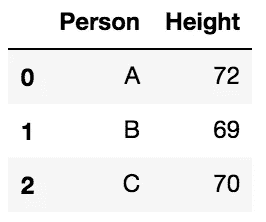

如果没有将`n`指定为 head 方法的参数，则返回前 5 行。

```
weight_df.head()
```

返回

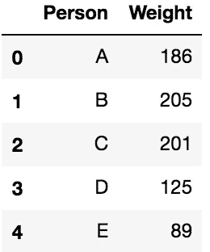

现在，我们有两个数据帧，但实际上我们只是想要一个来表示给定的表。因此，我们将使用`merge`方法连接两个数据帧。由于两个数据帧都有公共列 **Person** ，我们将使用它将它们合并成一个数据帧。

```
height_weight_df = pd.merge(height_df,weight_df,on='Person')
```

所以现在我们有`height_weight_df`作为:

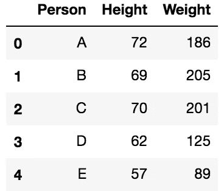

我们可以在这个数据框架上使用`describe`方法来获得关于平均值、标准差、四分位数和其他的统计信息。

```
height_weight_df.describe()
```

返回

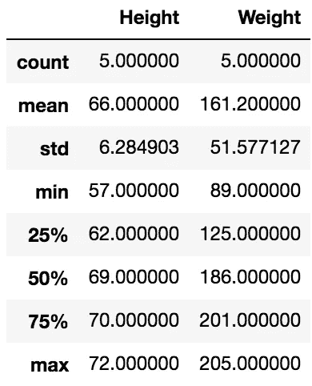

我们还可以使用`info`方法来获得每一列中条目数量及其数据类型的更多细节。

```
height_weight_df.info()
```

`info`方法的结果看起来是这样的:

```
<class 'pandas.core.frame.DataFrame'>
Int64Index: 5 entries, 0 to 4
Data columns (total 3 columns):
Person    5 non-null object
Height    5 non-null int64
Weight    5 non-null int64
dtypes: int64(2), object(1)
memory usage: 160.0+ bytes
```

`describe`方法只显示身高和体重列的细节，而不显示人员列的细节。这是因为 Person 列中的条目属于`object`类型；它们只是名字，不可能对名字进行统计操作，如均值、标准差和四分位数。这也可以通过`info`方法来说明，该方法显示身高和体重属于`int64`类型，而人属于`object`类型。

实际的计算只针对身高和体重。person 列只使用一个公共索引将一对值绑定在一起。因此，让我们使用`set_index`方法将 Person 列设置为这个数据帧的索引。`set_index`接受一个列数组作为参数。

```
height_weight_df.set_index(['Person'])
```

但这不会改变原始数据帧中的任何内容。回想一下系列，熊猫不希望你不小心丢失信息。当我们在数据帧上设置新的索引时，我们会丢失现有的索引。当然，此刻索引只是默认的整数。尽管如此，为了使索引永久化，您必须声明您希望这个改变发生在`inplace`。

```
height_weight_df.set_index(['Person'],inplace=True)
```

现在，如果我们检查`height_weight_df`，我们会看到

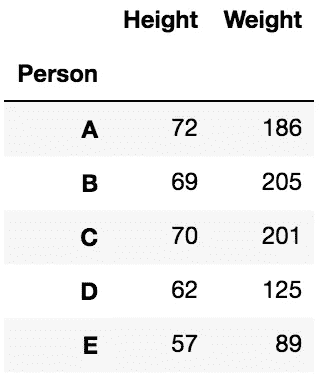

`info`方法现在只显示身高和体重列。

```
<class 'pandas.core.frame.DataFrame'>
Index: 5 entries, A to E
Data columns (total 2 columns):
Height    5 non-null int64
Weight    5 non-null int64
dtypes: int64(2)
memory usage: 120.0+ bytes
```

## 我们已经用级数解决了。再解决这个问题有什么意义？

这里的要点是证明 DataFrame 只不过是由公共索引绑定在一起的一组序列。如果你打印出`height_weight_df[‘Height’]`，它返回

```
Person
A    72
B    69
C    70
D    62
E    57
Name: Height, dtype: int64
```

这显然是一个系列。如果你打印出`height_weight_df[‘Weight’]`，同样的事情也会发生。这表明身高和体重都是具有共同索引 A 到 e 的序列，这是列所关心的。现在，让我们看看行。如果使用`height_weight_df.loc['A']`打印出 A 的行，我们得到

```
Height     72
Weight    186
Name: A, dtype: int64
```

也是一个系列。所以，A 到 E 也是拥有共同指数身高和体重的系列。我们可以使用`type(height_weight_df[‘Height’])`和`type(height_weight_df.loc[‘A’])`来查看这两者的类型。这两个人都回到了`pandas.core.series.Series`。

现在我们清楚了数据帧是由系列组成的，让我们回到我们的问题。我们现在意识到 F 和 G 的身高和体重从表格中消失了。因此，我们为丢失的值创建另一个数据帧。

```
missing_df = pd.DataFrame(data=[[65,121],[60]],index=['F','G'],columns=['Height','Weight'])
```

`missing_df`现在看起来是这样的

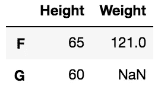

这里我们看到 G 的权重丢失了，所以取而代之的是一个`NaN`值。接下来，为了获得单个数据帧，我们将这个`missing_df`附加到原始的`height_weight_df`中，

```
updated_df = height_weight_df.append(missing_df)
```

这样`updated_df`就变成了

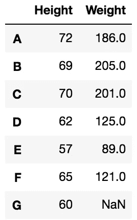

同样，我们发现每个人的身高减少了 5，体重增加了 5。所以，让我们修改一下。

```
updated_df['Height'] += 5
updated_df['Weight'] -= 5
```

这就把我们的`updated_df`改成了

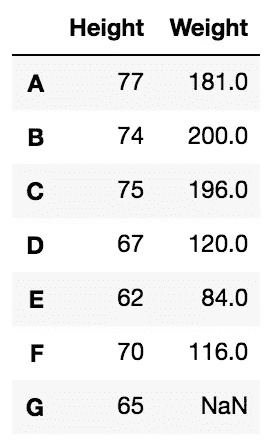

所有人的身高和体重已被正确更新，并可进一步用于计算身体质量指数。但是由于 G 的重量丢失，不可能计算出 G 的身体质量指数，所以我们把 G 的条目一起去掉。同样，我们需要指定`inplace=True`来使其永久化。

```
updated_df.dropna(inplace=True)
```

然后移除 G 的条目。

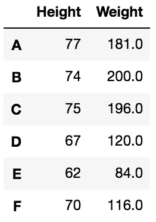

既然我们已经正确地得到了所有的值，那么是时候找到身体质量指数了。我们已经知道，计算身体质量指数的公式如下:


要应用上述公式，首先必须将体重从磅转换为千克，将身高从英寸转换为米。我们知道，1 磅= 0.453592 千克，1 英寸= 0.0254 米，我们用变量来定义这些。

```
lbs_to_kg_ratio = 0.453592
inch_to_meter_ratio = 0.0254
```

使用上述比率，我们将数据框更新为所需的单位。

```
updated_df['Height'] *= inch_to_meter_ratio
updated_df['Weight'] *= lbs_to_kg_ratio
```

我们现在有`updated_df`作为

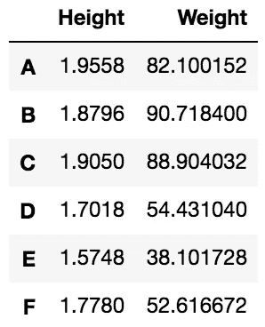

现在我们已经有了正确单位的所有数据，我们可以使用上面的公式来计算身体质量指数。我们将一个新列`BMI`添加到现有的数据帧中

```
updated_df['BMI'] = updated_df['Weight']/(updated_df['Height']**2)
```

所以`updated_df`现在看起来像

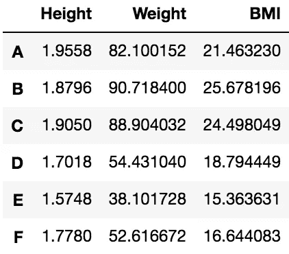

最后，通过将索引标签设置为`Person`，我们将这个数据帧导出到一个名为`BMI.csv`的 csv 文件中。csv 文件保存在保存程序源代码的同一目录中。

```
updated_df.to_csv('BMI.csv',index_label='Person')
```

如果我们比较这两种方法，使用 DataFrame 方法会产生一个更简洁的问题解决方案；部分原因是我们可以用一个数据框架同时处理两个系列。

## 熊猫能做的就这些吗？

目前我们看到的只是对熊猫的简单利用。然而，当我们处理复杂的问题时，熊猫的真正力量变得显而易见。所以，现在让我们来看一个稍微复杂一点的问题，看看熊猫到底能做什么。这次我们将使用一个真实的数据集。

## 什么是数据集？

数据集只是在感兴趣的特定领域中收集的数据的集合。例如，可以有一个世界各国的数据集。该数据集可以包含特定年份世界各国的人口、按性别、年龄组划分的人口、各国的 GDP、预期寿命、识字率、婴儿死亡率以及各种其他数据。这些只是一堆毫无意义的数字。但是有了像熊猫这样的分析工具，我们可以从这个数据集产生有价值的见解，比如，一个国家的 GDP 和它的识字率之间有关系吗？或者婴儿死亡率和女性预期寿命的关系？这些是熊猫帮助我们解决的问题类型。 [UCI 机器学习库](https://archive.ics.uci.edu/ml/datasets.html)包含许多有趣的数据集。一旦您熟悉了 DataFrame，您就可以尝试使用其中的一些数据集。在这篇文章中，我将使用一个相对简单的数据集，我们将在下一个问题中讨论。

# 问题 2

我们有一个数据集，其中包含司机在一段时间内的出行数据。数据集的描述如下:

*一名司机每天开车上下班时使用一款应用程序追踪 GPS 坐标。该应用程序收集位置和海拔数据。该数据集中总结了大约 200 次旅行的数据。*

使用数据集，查找
a)第一个、最后一个和第十个条目的详细信息，
b)每天的详细信息，
c)当一天的总行驶距离大于 90 但小于 100 时的条目，
d)c)单行的距离和燃油经济性，
e)当平均移动速度大于 90 时的星期五的条目，
f)当最大速度大于 135 或燃油经济性小于 8 时的条目，以及
g)

# 解决方案 2

我们从这个[链接](https://openmv.net/info/travel-times)下载数据集，并将其保存在一个名为`travel-times.csv`的文件中。现在，我们需要从 csv 文件中获取数据。`read_csv`方法接受文件名作为参数，并返回一个 DataFrame。

```
travel_df = pd.read_csv('travel-times.csv')
```

此时此刻，我们并不真正知道数据集中有什么样的数据。在我们开始解决问题之前熟悉数据通常是一个好习惯。为了查看数据集中可用的数据类型，我们使用了返回 DataFrame 的前 5 行的`head`方法。

```
travel_df.head()
```

返回以下内容

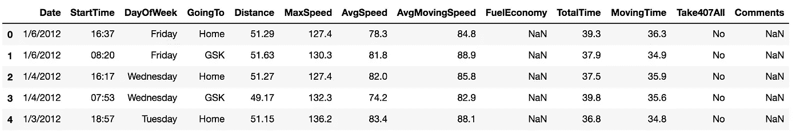

`head`方法让我们熟悉了数据集中可用的列，并提供了一个数据样本。让我们通过使用`describe`方法来了解更多的数据。

```
travel_df.describe()
```

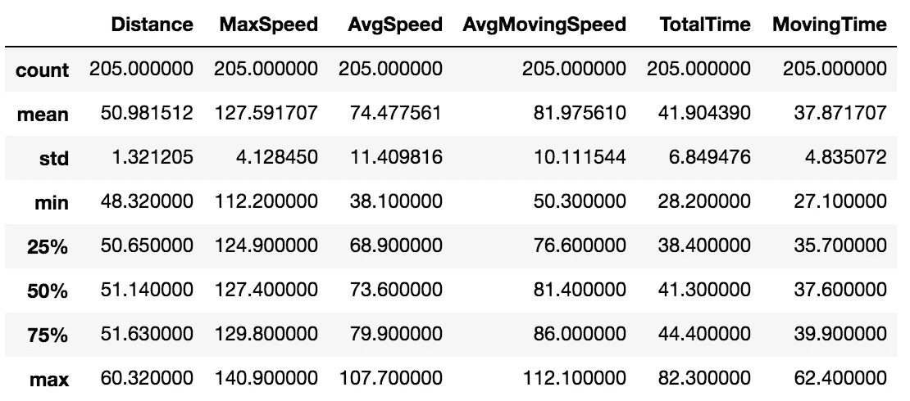

`describe`方法只列出原始数据帧中的 6 列。这是因为只有这 6 个是数字类型，因此它们的平均值、标准差、四分位数等也是数字类型。可以被计算出来。让我们用`info`方法进一步验证这一点。

```
travel_df.info()
```

返回

```
<class 'pandas.core.frame.DataFrame'>
RangeIndex: 205 entries, 0 to 204
Data columns (total 13 columns):
Date              205 non-null object
StartTime         205 non-null object
DayOfWeek         205 non-null object
GoingTo           205 non-null object
Distance          205 non-null float64
MaxSpeed          205 non-null float64
AvgSpeed          205 non-null float64
AvgMovingSpeed    205 non-null float64
FuelEconomy       188 non-null object
TotalTime         205 non-null float64
MovingTime        205 non-null float64
Take407All        205 non-null object
Comments          24 non-null object
dtypes: float64(6), object(7)
memory usage: 20.9+ KB
```

实际上只有 6 列是类型`float64`。然而，我们从`info`方法中发现了一些有趣的信息。总共有 13 列，其中 11 列有 205 个条目，但是`FuelEconomy`只有 188 个，而`Comments`字段只有 24 个。相对而言，这是非常少的数据，不能为我们提供太多信息。此外，我们的问题没有定义任何关于评论的东西。因为我们对评论不感兴趣，所以我们将放弃这个专栏。记住，我们需要声明`inplace=True`来永久删除该列。

```
travel_df.drop(labels=['Comments'],axis=1,inplace=True)
```

如果没有定义 axis，它将被设置为 0，这意味着删除索引。为了删除一列，我们显式定义了`axis=1`。同样，我们检查 head 和 info 方法。

```
travel_df.head()
```

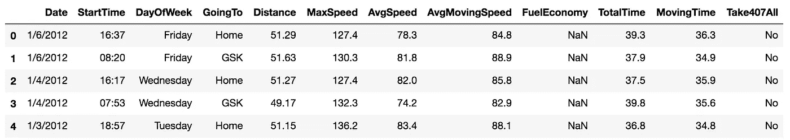

```
travel_df.info()
```

它返回

```
<class 'pandas.core.frame.DataFrame'>
RangeIndex: 205 entries, 0 to 204
Data columns (total 12 columns):
Date              205 non-null object
StartTime         205 non-null object
DayOfWeek         205 non-null object
GoingTo           205 non-null object
Distance          205 non-null float64
MaxSpeed          205 non-null float64
AvgSpeed          205 non-null float64
AvgMovingSpeed    205 non-null float64
FuelEconomy       188 non-null object
TotalTime         205 non-null float64
MovingTime        205 non-null float64
Take407All        205 non-null object
dtypes: float64(6), object(6)
memory usage: 19.3+ KB
```

现在，我们只剩下 12 列了。我们仍然在`FuelEconomy`列中缺少我们感兴趣的数据。让我们看一个更大的样本，这样我们就可以看到 FuelEconomy 不是 NaN 的行。

```
travel_df.head(n=10)
```

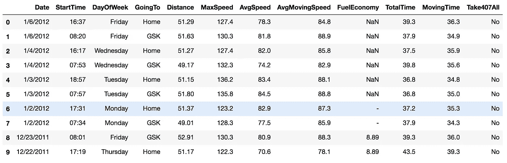

我们看到`FuelEconomy`列包含数字，但是`info`方法将`FuelEconomy`列的数据类型显示为`object`。让我们用`dtype`属性进一步验证这一点。

```
travel_df['FuelEconomy'].dtype
```

它返回`dtype(‘O’)`。“O”表示它属于类型`object`。通过查看上面的头部，我们可以看到它不仅包含`NaN` s，还包含虚线(-)条目，类型为`object`。在执行任何操作之前，我们需要将`FuelEconomy`列转换为数字类型。为此，我们使用`to_numeric`方法。

```
travel_df['FuelEconomy'] = pd.to_numeric(travel_df['FuelEconomy'],errors='coerce')
```

方法试图将一个字符串解析成一个数字。`errors=’coerce’`将无法解析为数字的条目设置为`NaN`。如果没有显式定义 errors，默认结果将是抛出一个异常，因为虚线(-)条目无法解析为数字。

现在，让我们再次看看 info 和 head 方法。`travel_df.info()`现在退货

```
<class 'pandas.core.frame.DataFrame'>
RangeIndex: 205 entries, 0 to 204
Data columns (total 12 columns):
Date              205 non-null object
StartTime         205 non-null object
DayOfWeek         205 non-null object
GoingTo           205 non-null object
Distance          205 non-null float64
MaxSpeed          205 non-null float64
AvgSpeed          205 non-null float64
AvgMovingSpeed    205 non-null float64
FuelEconomy       186 non-null float64
TotalTime         205 non-null float64
MovingTime        205 non-null float64
Take407All        205 non-null object
dtypes: float64(7), object(5)
memory usage: 19.3+ KB
```

而`travel_df.head(n=10)`现在显示


`FuelEconomy`的数据类型现在已经更改为`float64`，现在有 186 个非空条目，因为虚线条目已经设置为`NaN`。

为了执行进一步的计算，最好将所有数值都填满。移除`NaN`值的一个常用方法是用列中可用值的平均值填充这些条目。为此，我们将`fillna`方法与`inplace=True`结合使用。

```
travel_df['FuelEconomy'].fillna(travel_df['FuelEconomy'].mean(),inplace=True)
```

`head`现在显示

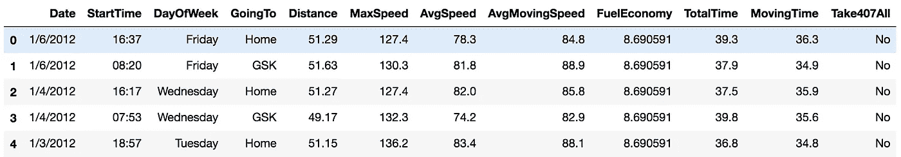

并且`info`给出

```
<class 'pandas.core.frame.DataFrame'>
RangeIndex: 205 entries, 0 to 204
Data columns (total 12 columns):
Date              205 non-null object
StartTime         205 non-null object
DayOfWeek         205 non-null object
GoingTo           205 non-null object
Distance          205 non-null float64
MaxSpeed          205 non-null float64
AvgSpeed          205 non-null float64
AvgMovingSpeed    205 non-null float64
FuelEconomy       205 non-null float64
TotalTime         205 non-null float64
MovingTime        205 non-null float64
Take407All        205 non-null object
dtypes: float64(7), object(5)
memory usage: 19.3+ KB
```

现在，我们在`FuelEconomy`列中的所有 205 个值都用平均值填充了数据缺失的地方。

现在我们准备开始解决上面给出的问题。对于第一个问题，我们使用`iloc`属性来查找数据帧中的第一个、最后一个和第 10 个条目。

`travel_df.iloc[0]`给了我们第一排

```
Date              1/6/2012
StartTime            16:37
DayOfWeek           Friday
GoingTo               Home
Distance             51.29
MaxSpeed             127.4
AvgSpeed              78.3
AvgMovingSpeed        84.8
FuelEconomy        8.69059
TotalTime             39.3
MovingTime            36.3
Take407All              No
Name: 0, dtype: object
```

我们可以看到这是一个系列。

类似地，我们可以使用`travel_df.iloc[-1]`查找最后一行，使用`travel_df.iloc[9]`查找第 10 个元素。

接下来，我们看到一个日期有多个条目。因此，让我们将数据分组，以便每个日期只有一个条目。我们尝试按照`Date`列对数据帧进行分组。

```
travel_df_by_date = travel_df.groupby(['Date'])
```

如果我们通过使用`type(travel_df_by_date)`来查看`travel_df_by_date`的类型，我们将看到它返回`pandas.core.groupby.DataFrameGroupBy`。所以`travel_df_by_date`是一个`DataFrameGroupBy`实例。为了组合具有相同日期的多行，我们在`DataFrameGroupBy`实例上使用了`sum`方法。

```
travel_df_by_date_combined = travel_df_by_date.sum()
```

该数据帧的`head`返回

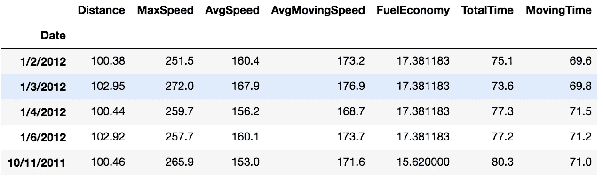

看我们的问题，也需要`DayOfWeek`栏。但是使用`sum`方法只能保留数字字段。因此，为了获得`DayOfWeek`列，我们通过`Date`和`DayOfWeek`列以及结果`DataFrameGroupBy`实例上的`sum`进行分组。

```
travel_df_by_date = travel_df.groupby(['Date','DayOfWeek'])
travel_df_by_date_combined = travel_df_by_date.sum()
```

`travel_df_by_date_combined`的`head`显示

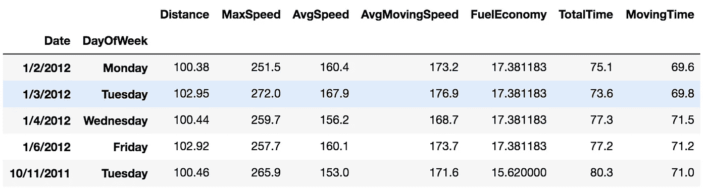

但是我们现在可以看到 DataFrame 现在有一些不正确的数据。按日期分组时，`Distance`、`TotalTime`和`MovingTime`列的总和是正确的。但是通过使用`sum`方法，我们还添加了`MaxSpeed`、`AvgSpeed`、`AvgMovingSpeed`和`FuelEconomy`列，这是不正确的。`MaxSpeed`应包含特定日期各行的最大值，其他列应包含各行的平均值。所以，让我们修改一下。

```
travel_df_by_date_combined['MaxSpeed'] = travel_df_by_date['MaxSpeed'].max() travel_df_by_date_combined['AvgSpeed'] = travel_df_by_date['AvgSpeed'].mean() travel_df_by_date_combined['AvgMovingSpeed'] = travel_df_by_date['AvgMovingSpeed'].mean() travel_df_by_date_combined['FuelEconomy'] = travel_df_by_date['FuelEconomy'].mean()
```

现在，如果我们检查一下`travel_df_by_date_combined`的`head`，我们会看到

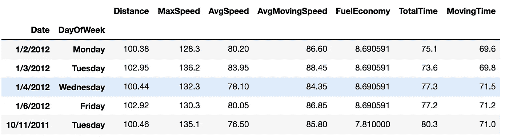

太好了。我们现在有了所有所需列的正确数据。现在让我们检查数据框`travel_df_by_date_combined`上的`info`。

```
<class 'pandas.core.frame.DataFrame'>
MultiIndex: 111 entries, (1/2/2012, Monday) to (9/8/2011, Thursday)
Data columns (total 7 columns):
Distance          111 non-null float64
MaxSpeed          111 non-null float64
AvgSpeed          111 non-null float64
AvgMovingSpeed    111 non-null float64
FuelEconomy       111 non-null float64
TotalTime         111 non-null float64
MovingTime        111 non-null float64
dtypes: float64(7)
memory usage: 7.4+ KB
```

通过`Date`和`DayOfWeek`列进行分组产生了一个多索引数据帧，如 head 和 info 方法所示。但是我们希望`DayOfWeek`是一个常规列，而不是索引。因此，我们首先重置索引，使数据帧的索引变成普通整数。在下一步中，我们将`Date`列设置回索引。

```
travel_df_by_date_combined.reset_index(inplace=True)
```

这一次我们使用`tail`方法查看最后 5 行，并且看到`Date`和`DayOfWeek`都被设置为常规列。

```
travel_df_by_date_combined.tail()
```

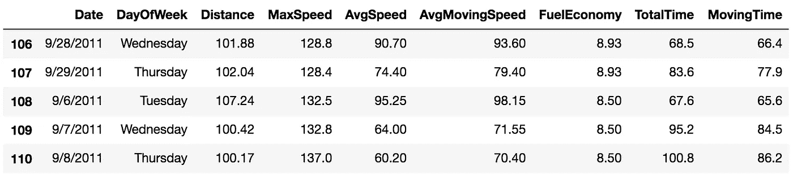

接下来，我们将`Date`列设置为索引。

```
travel_df_by_date_combined.set_index(['Date'],inplace=True)
```

`travel_df_by_date_combined`中的`head`现在显示

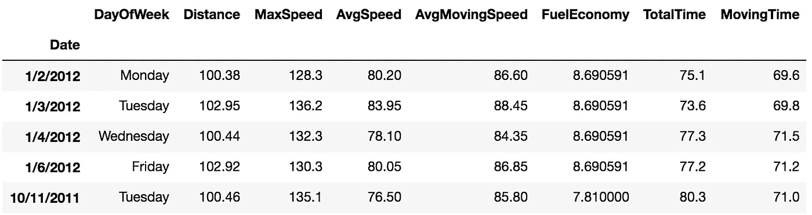

完美。我们将`Date`作为索引，我们还保留了`DayOfWeek`列和所有其他数字列。每个日期都有一个条目。这是上面问题 b 的答案。

## 这么多工作只为了一个简单的答案。

是的。那是一个相当大的过程。但是不用担心。到目前为止，我们一直在准备数据，以便能够回答上述所有问题。从这里开始，事情就非常简单了。我们已经做了所有的艰苦工作。现在是收获我们所播种的东西的时候了。

现在，让我们找出距离大于 90 但小于 100 的条目。为此，我们使用条件选择。

```
distance_above_ninety = travel_df_by_date_combined['Distance']>90
```

这将导致`distance_above_ninety`包含一系列布尔值。它的作用是，获取`travel_df_by_date_combined[‘Distance’]`数据帧的每个条目，并检查它是否大于 90。如果是，它为结果序列中的相应条目设置`True`；否则设置`False`。请注意，该系列的索引将是`Date`列。

同样，我们可以发现

```
distance_below_hundred = travel_df_by_date_combined['Distance']<100
```

现在我们可以把这两个数列结合起来，找出距离大于 90 小于 100 的`Distance`。但是我们不能像在 Python 中那样使用`*and*`操作符来组合`distance_above_ninety`和`distance_below_hundred`。这是因为`*and*`操作符只作用于两个布尔值，但是这里我们处理的是两个布尔值序列。使用`*and*`操作符会导致**值错误:一个序列的真值是不明确的**。为了找到一系列组合的真值，我们需要使用`*&*`操作符。也就是我们用`distance_above_ninety & distance_below_hundred`。

结合条件选择，

```
ninety_to_hundred_df = travel_df_by_date_combined[distance_above_ninety & distance_below_hundred]
```

我们得到一个数据帧，其中只有满足这两个条件的条目

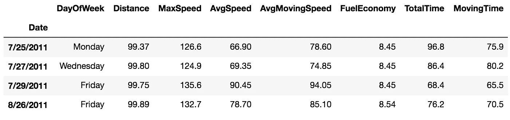

我们可以看到所有的距离都在 90 到 100 之间。这解决了我们的问题 c。我们可以使用这个数据帧来解决问题 d。在问题 d 中，我们需要做的就是从上面的数据帧中提取任意行的详细信息。让我们用`loc`得到最后一个日期的`Distance`和`FuelEconomy`。

```
ninety_to_hundred_df.loc[['8/26/2011'],['Distance','FuelEconomy']]
```


对于问题 e，我们再次使用组合条件选择来查找星期五平均移动速度高于 90 的条目。

```
over_ninety_on_friday = travel_df_by_date_combined[(travel_df_by_date_combined['AvgMovingSpeed']>90) & (travel_df_by_date_combined['DayOfWeek']=='Friday')]
```

和上面的条件选择一样。我们现在已经简单地在一行中写了所有的内容。

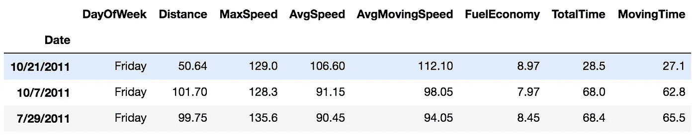

所有条目都是星期五的，每行的平均移动速度超过 90。

我们用同样的方法来解决问题 f。这里，我们需要最大速度大于 135 或者燃油经济性小于 8 的条目。就像在`*and*`操作符的情况下，出于同样的原因，我们不能使用`*or*`操作符。相反，我们使用管道(|)运算符。

```
max_speed_over_one_thirty_five_or_fuel_economy_below_eight = travel_df_by_date_combined[(travel_df_by_date_combined['MaxSpeed']>135) | (travel_df_by_date_combined['FuelEconomy']<8)]
```

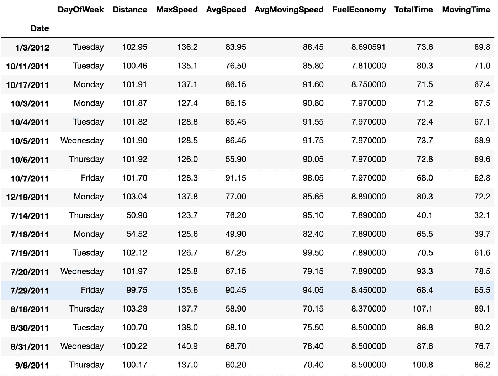

这次我们有更多的行，因为只需要满足两个条件中的一个。有些条目的`MaxSpeed`高于 135，有些条目的`FuelEconomy`低于 8，有些条目两者都有。这就解决了问题 f。

最后，我们来看看一周中每一天的一些统计信息。DataFrameGroupBy 实例上应用的`sum`方法提供了每一天中每一列的总和。

```
travel_df.groupby(['DayOfWeek']).sum()
```

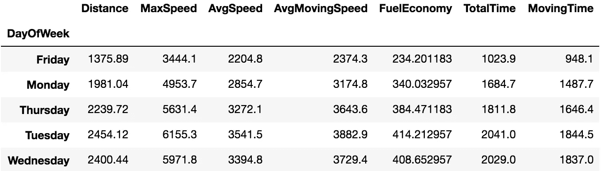

请注意，这些列再次包含不正确的`MaxSpeed`、`AvgSpeed`、`AvgMovingSpeed`和`FuelEconomy`值。但是这里我们只是在演示`sum`方法的作用。

同样，我们可以沿着各个日行找到每一列的`max`值。`max`方法也适用于非数字列。

```
travel_df.groupby(['DayOfWeek']).max()
```

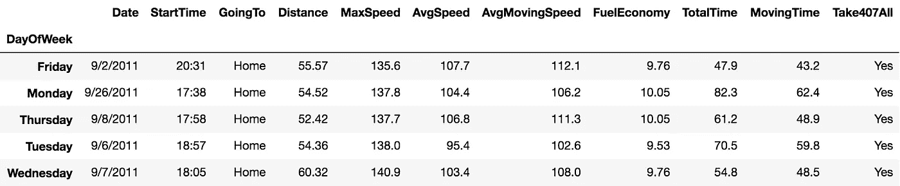

也可以使用 describe 方法获得所有细节，如平均值、标准差、四分位数等。立刻。下面我们对其中一列`AvgMovingSpeed`使用 describe 方法。

```
travel_df.groupby(['DayOfWeek'])['AvgMovingSpeed'].describe()
```

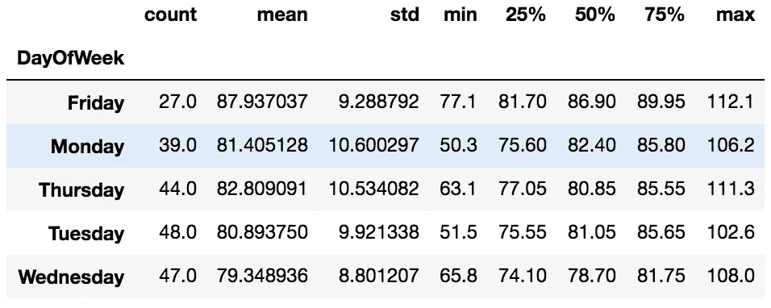

这解决了我们的最后一个问题。

## 我头疼。

我知道这很难接受。但是 DataFrame 是一个非常重要的主题，一旦你熟悉了它，你就可以选择你感兴趣的任何数据集，然后找到对数据的所需见解。同样，这篇文章没有涵盖 DataFrame 的所有方法和属性。这篇文章中所采取的一系列步骤可能不是解决问题的唯一途径。也许你可以找到另一种方法。更有效的方法。你需要的只是练习。只要像阿宝一样坚持下去，你也能成为功夫熊猫。

在下一篇文章中，我们将利用我们目前所学的知识，以一种更紧凑、更具视觉吸引力的方式将结果可视化。我们将使用 Matplotlib 包，特别是 pyplot 模块，最终用图形和图表来表示文本、数字和表格。

[](/sprinting-into-the-visualization-track-part-1-matplotlib-6c069ac91e40) [## 冲刺可视化轨道(第 1 部分):Matplotlib

### 我们已经用 DataFrame 走了很久，

towardsdatascience.com](/sprinting-into-the-visualization-track-part-1-matplotlib-6c069ac91e40)